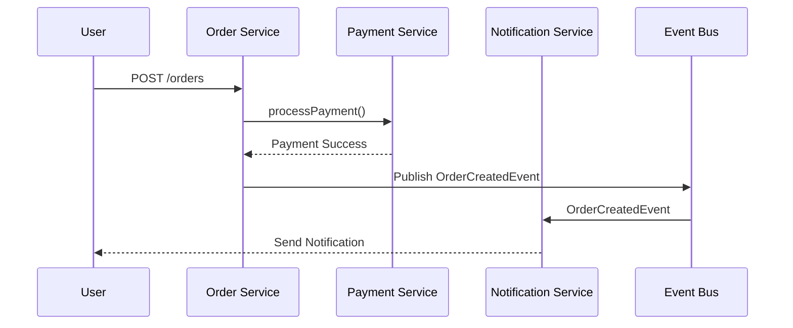

## 2.6. Pseudocode Conventions

In the realm of microservices architecture, pseudocode serves as a powerful tool to abstract complex interactions and system designs. It allows us to focus on the logic and structure of our systems without getting bogged down by the syntax of specific programming languages. In this section, we will explore the conventions for writing pseudocode, specifically tailored for microservices design patterns. We will cover syntax rules, representation of microservices, and provide illustrative examples to solidify your understanding.

### Syntax Rules for Pseudocode

Pseudocode is a high-level description of an algorithm or system design that uses the structural conventions of programming languages but is intended for human reading rather than machine reading. Here are some syntax rules and standards we will adhere to in this guide:

#### 1. **Clarity and Simplicity**

- **Use Plain Language:** Write in a way that is easy to understand, avoiding complex language or unnecessary jargon.
- **Logical Flow:** Ensure that the pseudocode follows a logical sequence, making it easy to follow the thought process.

#### 2. **Structure and Formatting**

- **Indentation:** Use consistent indentation to represent blocks of code, such as loops or conditional statements.
- **Capitalization:** Use uppercase for keywords like IF, ELSE, WHILE, and FOR to distinguish them from other text.
- **Comments:** Include comments to explain non-obvious parts of the pseudocode. Use `//` for single-line comments.

#### 3. **Variables and Data Structures**

- **Descriptive Names:** Use meaningful names for variables and data structures to convey their purpose.
- **Data Types:** Although pseudocode is not language-specific, indicate data types when necessary for clarity.

#### 4. **Control Structures**

- **Conditional Statements:** Use IF, ELSE IF, and ELSE for decision-making processes.
- **Loops:** Use FOR, WHILE, and REPEAT UNTIL for iterative processes.

#### 5. **Functions and Procedures**

- **Function Definition:** Clearly define functions with a name and parameters.
- **Return Values:** Indicate return values explicitly.

#### 6. **Error Handling**

- **Exceptions:** Use TRY and CATCH blocks to represent error handling mechanisms.

### Representing Microservices in Pseudocode

When modeling microservices, it's crucial to represent services, APIs, and interactions accurately. Here are some guidelines for representing microservices in pseudocode:

#### 1. **Service Definition**

- **Service Name:** Clearly define each service with a descriptive name.
- **Endpoints:** List the endpoints exposed by the service, including HTTP methods and paths.

#### 2. **API Interactions**

- **Request and Response:** Represent API requests and responses with clear structures.
- **Data Formats:** Indicate data formats (e.g., JSON, XML) when necessary.

#### 3. **Inter-Service Communication**

- **Synchronous Communication:** Use HTTP or RPC calls to represent synchronous interactions.
- **Asynchronous Communication:** Use message queues or event buses for asynchronous interactions.

#### 4. **State Management**

- **Data Storage:** Represent data storage mechanisms, such as databases or in-memory caches.
- **State Changes:** Indicate how state changes are handled within and across services.

#### 5. **Security and Authentication**

- **Authentication Mechanisms:** Represent authentication processes, such as token validation.
- **Authorization Checks:** Indicate authorization checks for accessing resources.

### Examples Following the Style Guide

Let's explore some examples that illustrate the pseudocode conventions for microservices design patterns.

#### Example 1: Service Definition and API Interaction

```pseudocode
// Define the User Service
SERVICE UserService

  // Endpoint to retrieve user details
  ENDPOINT GET /users/{userId}
    INPUT: userId (String)
    OUTPUT: UserDetails (JSON)

    FUNCTION getUserDetails(userId)
      // Retrieve user details from the database
      userDetails = DATABASE.query("SELECT * FROM users WHERE id = ?", userId)
      RETURN userDetails
    END FUNCTION

END SERVICE
```

**Explanation:** In this example, we define a `UserService` with an endpoint to retrieve user details. The pseudocode clearly outlines the input and output of the endpoint, as well as the function to retrieve user details from the database.

#### Example 2: Synchronous Inter-Service Communication

```pseudocode
// Define the Order Service
SERVICE OrderService

  // Endpoint to create a new order
  ENDPOINT POST /orders
    INPUT: OrderData (JSON)
    OUTPUT: OrderConfirmation (JSON)

    FUNCTION createOrder(orderData)
      // Validate order data
      IF validateOrder(orderData) THEN
        // Call the Payment Service to process payment
        paymentResponse = CALL PaymentService.processPayment(orderData.paymentInfo)
        
        IF paymentResponse.status == "Success" THEN
          // Save order to the database
          orderId = DATABASE.insert("INSERT INTO orders ...", orderData)
          RETURN { "orderId": orderId, "status": "Confirmed" }
        ELSE
          RETURN { "status": "Payment Failed" }
        END IF
      ELSE
        RETURN { "status": "Invalid Order Data" }
      END IF
    END FUNCTION

END SERVICE
```

**Explanation:** This example demonstrates synchronous communication between the `OrderService` and `PaymentService`. The pseudocode outlines the process of creating an order, validating the data, and interacting with the `PaymentService` to process the payment.

#### Example 3: Asynchronous Communication with Event Bus

```pseudocode
// Define the Notification Service
SERVICE NotificationService

  // Listen for order events
  EVENT LISTENER OrderCreatedEvent
    INPUT: OrderDetails (JSON)

    FUNCTION handleOrderCreatedEvent(orderDetails)
      // Send notification to the user
      notificationStatus = NOTIFICATION_SYSTEM.send("Order Created", orderDetails.userId)
      RETURN notificationStatus
    END FUNCTION

END SERVICE

// Define the Order Service
SERVICE OrderService

  // Endpoint to create a new order
  ENDPOINT POST /orders
    INPUT: OrderData (JSON)
    OUTPUT: OrderConfirmation (JSON)

    FUNCTION createOrder(orderData)
      // Save order to the database
      orderId = DATABASE.insert("INSERT INTO orders ...", orderData)
      
      // Publish OrderCreatedEvent to the event bus
      EVENT_BUS.publish("OrderCreatedEvent", { "orderId": orderId, "userId": orderData.userId })
      
      RETURN { "orderId": orderId, "status": "Confirmed" }
    END FUNCTION

END SERVICE
```

**Explanation:** In this example, we illustrate asynchronous communication using an event bus. The `OrderService` publishes an `OrderCreatedEvent`, which the `NotificationService` listens for and handles by sending a notification to the user.

### Try It Yourself

To deepen your understanding, try modifying the examples above:

1. **Add Error Handling:** Introduce error handling mechanisms in the `OrderService` example to manage potential failures in the `PaymentService` interaction.
2. **Extend the Notification Service:** Add a new event listener to the `NotificationService` for handling order cancellation events.
3. **Implement Security Checks:** Incorporate authentication and authorization checks in the `UserService` example to restrict access to user details.

### Visualizing Microservices Interactions

To better understand the interactions between microservices, let's visualize the communication flow using a sequence diagram.



**Diagram Description:** This sequence diagram illustrates the flow of creating an order, processing payment, and sending a notification. It highlights the synchronous call to the `PaymentService` and the asynchronous event-driven communication with the `NotificationService`.

### References and Links

For further reading on microservices and pseudocode conventions, consider the following resources:

- [Martin Fowler's Microservices Guide](https://martinfowler.com/microservices/)
- [The Twelve-Factor App](https://12factor.net/)
- [Event-Driven Architecture](https://www.redhat.com/en/topics/integration/what-is-event-driven-architecture)

### Knowledge Check

Let's reinforce your understanding with some questions:

1. What are the key syntax rules for writing pseudocode?
2. How do you represent synchronous and asynchronous communication in pseudocode?
3. What is the purpose of using an event bus in microservices architecture?

### Embrace the Journey

Remember, mastering pseudocode conventions is just the beginning of your journey in microservices architecture. As you progress, you'll be able to design more complex and efficient systems. Keep experimenting, stay curious, and enjoy the journey!

### Quiz Time!



### What is the primary purpose of pseudocode in microservices design?

- [x] To abstract complex interactions and system designs
- [ ] To execute code in a specific programming language
- [ ] To replace detailed technical documentation
- [ ] To serve as a user interface design tool

> **Explanation:** Pseudocode is used to abstract complex interactions and system designs, focusing on logic and structure without language-specific syntax.

### Which of the following is a key syntax rule for pseudocode?

- [x] Use consistent indentation for code blocks
- [ ] Use lowercase for all keywords
- [ ] Avoid using comments
- [ ] Use complex language and jargon

> **Explanation:** Consistent indentation is crucial for representing code blocks clearly in pseudocode.

### How should variables be named in pseudocode?

- [x] Use descriptive names to convey their purpose
- [ ] Use single-letter names for simplicity
- [ ] Use random names without context
- [ ] Use names from a specific programming language

> **Explanation:** Descriptive names help convey the purpose of variables, making pseudocode easier to understand.

### What is the role of an event bus in microservices architecture?

- [x] To facilitate asynchronous communication between services
- [ ] To handle synchronous API requests
- [ ] To store data persistently
- [ ] To manage user authentication

> **Explanation:** An event bus facilitates asynchronous communication by allowing services to publish and subscribe to events.

### In the provided pseudocode examples, what is the purpose of the `NotificationService`?

- [x] To send notifications to users based on events
- [ ] To process payments for orders
- [ ] To manage user authentication
- [ ] To store order data in a database

> **Explanation:** The `NotificationService` listens for events and sends notifications to users.

### How is error handling represented in pseudocode?

- [x] Using TRY and CATCH blocks
- [ ] Using IF and ELSE statements
- [ ] Using FOR loops
- [ ] Using PRINT statements

> **Explanation:** TRY and CATCH blocks are used to represent error handling mechanisms in pseudocode.

### What is a key benefit of using pseudocode for microservices design?

- [x] It allows focusing on logic and structure without language-specific syntax
- [ ] It provides a detailed implementation of the system
- [ ] It replaces the need for testing
- [ ] It serves as a final product for deployment

> **Explanation:** Pseudocode allows focusing on logic and structure, abstracting away language-specific syntax.

### How can you represent synchronous communication in pseudocode?

- [x] Using HTTP or RPC calls
- [ ] Using message queues
- [ ] Using event buses
- [ ] Using database queries

> **Explanation:** Synchronous communication is represented using HTTP or RPC calls in pseudocode.

### What is the significance of using uppercase for keywords in pseudocode?

- [x] To distinguish them from other text
- [ ] To make the pseudocode more complex
- [ ] To follow programming language syntax
- [ ] To reduce readability

> **Explanation:** Uppercase keywords help distinguish them from other text, enhancing readability.

### True or False: Pseudocode is intended for machine reading.

- [ ] True
- [x] False

> **Explanation:** Pseudocode is intended for human reading, not for machine execution.



By following these pseudocode conventions, you can effectively model microservices design patterns, making your architectural designs clear and comprehensible. Keep practicing and applying these principles to enhance your microservices architecture skills!
