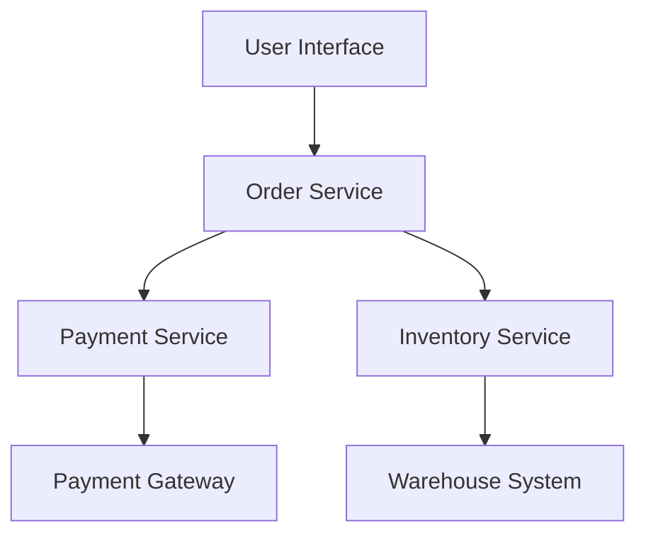

## 3.1. Single Responsibility Principle in Microservices

The Single Responsibility Principle (SRP) is a fundamental concept in software design, advocating that a class or module should have one, and only one, reason to change. When applied to microservices, this principle ensures that each service is focused on a specific business capability or function. This focus not only enhances maintainability and scalability but also aligns with the core tenets of microservices architecture.

### Designing Focused Services

#### Understanding the Single Responsibility Principle

The Single Responsibility Principle is one of the five SOLID principles of object-oriented design, introduced by Robert C. Martin. In the context of microservices, SRP emphasizes that each service should encapsulate a distinct piece of functionality, corresponding to a specific business domain or capability. This approach reduces the complexity of each service, making it easier to develop, test, and deploy.

**Key Concepts:**

- **Focused Functionality:** Each microservice should perform a specific task or set of related tasks, minimizing the overlap with other services.
- **Clear Boundaries:** Define clear boundaries for each service to prevent functionality creep and ensure that services remain manageable.
- **Independent Deployment:** Services designed with SRP in mind can be deployed independently, reducing the risk of cascading failures and simplifying updates.

#### Advantages of Applying SRP in Microservices

1. **Enhanced Maintainability:** By limiting the scope of each service, developers can more easily understand and modify the code, leading to faster bug fixes and feature enhancements.
2. **Improved Scalability:** Focused services can be scaled independently based on demand, optimizing resource utilization and performance.
3. **Reduced Complexity:** Smaller, well-defined services are easier to manage and less prone to errors, contributing to overall system stability.
4. **Facilitated Testing:** With a narrow focus, services can be tested more thoroughly, ensuring higher quality and reliability.

#### Challenges of Applying SRP in Microservices

1. **Granularity Balance:** Determining the right level of granularity for services can be challenging. Too fine-grained services may lead to excessive inter-service communication, while too coarse-grained services may become monolithic.
2. **Increased Overhead:** Managing a large number of services can introduce operational overhead, requiring robust orchestration and monitoring tools.
3. **Data Consistency:** Ensuring data consistency across services can be complex, especially when services are highly decoupled.

### Implementing SRP in Microservices

#### Identifying Service Boundaries

To effectively apply SRP, it's crucial to identify appropriate service boundaries. This involves understanding the business domain and decomposing it into distinct capabilities. Techniques such as Domain-Driven Design (DDD) can be instrumental in this process.

**Steps to Identify Service Boundaries:**

1. **Analyze Business Processes:** Break down business processes into discrete steps and identify the core responsibilities of each step.
2. **Define Bounded Contexts:** Use DDD to define bounded contexts, ensuring that each service operates within a specific domain.
3. **Map Capabilities to Services:** Align services with business capabilities, ensuring that each service has a clear and focused responsibility.

#### Pseudocode Example: Designing a Focused Service

Let's consider a simple e-commerce application. We'll design a `PaymentService` that adheres to the SRP by focusing solely on payment processing.

```pseudocode
// PaymentService handles all payment-related operations
class PaymentService {
    // Process a payment for an order
    function processPayment(orderId, paymentDetails) {
        // Validate payment details
        if (!validatePaymentDetails(paymentDetails)) {
            throw new Error("Invalid payment details");
        }

        // Charge the payment method
        paymentResult = chargePaymentMethod(paymentDetails);

        // Update order status based on payment result
        if (paymentResult.success) {
            updateOrderStatus(orderId, "Paid");
        } else {
            updateOrderStatus(orderId, "Payment Failed");
        }

        return paymentResult;
    }

    // Validate payment details
    function validatePaymentDetails(paymentDetails) {
        // Check for required fields and valid formats
        return paymentDetails.cardNumber && paymentDetails.expiryDate;
    }

    // Charge the payment method
    function chargePaymentMethod(paymentDetails) {
        // Simulate charging the payment method
        return { success: true, transactionId: "12345" };
    }

    // Update order status in the order service
    function updateOrderStatus(orderId, status) {
        // Call to OrderService to update the order status
        OrderService.updateStatus(orderId, status);
    }
}
```

**Key Points:**

- The `PaymentService` is solely responsible for processing payments, adhering to SRP.
- Each function within the service has a specific role, contributing to the overall responsibility of payment processing.

#### Visualizing Service Boundaries

To better understand how SRP influences service design, let's visualize the service boundaries using a diagram.



**Diagram Description:**

- The diagram illustrates the interaction between different services in an e-commerce application.
- The `Payment Service` is isolated, focusing solely on interactions with the `Payment Gateway`.
- Other services, such as `Order Service` and `Inventory Service`, have their own distinct responsibilities.

### Balancing Granularity and Complexity

#### Finding the Right Level of Granularity

Achieving the right level of granularity is crucial for effective microservices design. Services should be small enough to be manageable but large enough to encapsulate meaningful functionality.

**Considerations for Granularity:**

- **Business Alignment:** Ensure that services align with business capabilities and processes.
- **Communication Overhead:** Minimize inter-service communication to reduce latency and complexity.
- **Team Structure:** Align service boundaries with team responsibilities to facilitate ownership and collaboration.

#### Strategies for Managing Complexity

1. **Service Orchestration:** Use orchestration tools to manage interactions between services, ensuring smooth workflows and reducing manual intervention.
2. **Monitoring and Logging:** Implement comprehensive monitoring and logging to gain insights into service performance and identify potential issues.
3. **Automated Testing:** Leverage automated testing frameworks to ensure that services function correctly and meet quality standards.

### Try It Yourself

To deepen your understanding of SRP in microservices, try modifying the `PaymentService` pseudocode example:

- **Add a Refund Function:** Implement a `refundPayment` function that processes refunds for completed transactions.
- **Integrate with a Notification Service:** Modify the `PaymentService` to send notifications upon successful payment processing.

### Knowledge Check

- **What is the primary goal of the Single Responsibility Principle in microservices?**
- **How can Domain-Driven Design assist in identifying service boundaries?**
- **What are the potential challenges of applying SRP in microservices?**

### Conclusion

The Single Responsibility Principle is a cornerstone of effective microservices design, promoting focused, maintainable, and scalable services. By adhering to SRP, we can create systems that are easier to understand, modify, and deploy, ultimately leading to more robust and resilient applications.

Remember, this is just the beginning. As you progress, you'll build more complex and interactive microservices architectures. Keep experimenting, stay curious, and enjoy the journey!

## Quiz Time!



### What is the primary goal of the Single Responsibility Principle in microservices?

- [x] To ensure each service has a clear and focused responsibility
- [ ] To increase the number of services in the architecture
- [ ] To reduce the need for testing
- [ ] To eliminate all dependencies between services

> **Explanation:** The primary goal of the Single Responsibility Principle is to ensure that each service has a clear and focused responsibility, which enhances maintainability and scalability.

### How can Domain-Driven Design assist in identifying service boundaries?

- [x] By defining bounded contexts and aligning services with business domains
- [ ] By increasing the number of services
- [ ] By reducing the complexity of each service
- [ ] By eliminating the need for orchestration tools

> **Explanation:** Domain-Driven Design helps identify service boundaries by defining bounded contexts and aligning services with specific business domains, ensuring clear responsibilities.

### What is a potential challenge of applying SRP in microservices?

- [x] Balancing granularity and complexity
- [ ] Reducing the number of services
- [ ] Eliminating the need for testing
- [ ] Increasing the number of dependencies

> **Explanation:** A potential challenge of applying SRP is balancing granularity and complexity, as overly fine-grained services can lead to excessive inter-service communication.

### Which of the following is an advantage of applying SRP in microservices?

- [x] Enhanced maintainability
- [ ] Increased number of services
- [ ] Reduced need for testing
- [ ] Elimination of all dependencies

> **Explanation:** Enhanced maintainability is an advantage of applying SRP, as focused services are easier to understand and modify.

### What is a key consideration when determining service granularity?

- [x] Business alignment
- [ ] Reducing the number of services
- [ ] Eliminating the need for orchestration
- [ ] Increasing the number of dependencies

> **Explanation:** Business alignment is a key consideration when determining service granularity, ensuring that services align with business capabilities and processes.

### What is a strategy for managing complexity in microservices?

- [x] Service orchestration
- [ ] Increasing the number of services
- [ ] Reducing the need for testing
- [ ] Eliminating all dependencies

> **Explanation:** Service orchestration is a strategy for managing complexity, ensuring smooth workflows and reducing manual intervention.

### How can automated testing benefit microservices?

- [x] By ensuring services function correctly and meet quality standards
- [ ] By increasing the number of services
- [ ] By reducing the need for orchestration
- [ ] By eliminating all dependencies

> **Explanation:** Automated testing benefits microservices by ensuring that services function correctly and meet quality standards, contributing to overall system stability.

### What is a potential drawback of having too fine-grained services?

- [x] Excessive inter-service communication
- [ ] Reduced number of services
- [ ] Increased need for testing
- [ ] Elimination of all dependencies

> **Explanation:** A potential drawback of having too fine-grained services is excessive inter-service communication, which can lead to increased latency and complexity.

### What role does monitoring and logging play in microservices?

- [x] They provide insights into service performance and identify potential issues
- [ ] They increase the number of services
- [ ] They reduce the need for testing
- [ ] They eliminate all dependencies

> **Explanation:** Monitoring and logging provide insights into service performance and identify potential issues, contributing to overall system stability.

### True or False: The Single Responsibility Principle eliminates all dependencies between services.

- [ ] True
- [x] False

> **Explanation:** False. The Single Responsibility Principle does not eliminate dependencies but ensures that each service has a clear and focused responsibility, reducing unnecessary complexity.


