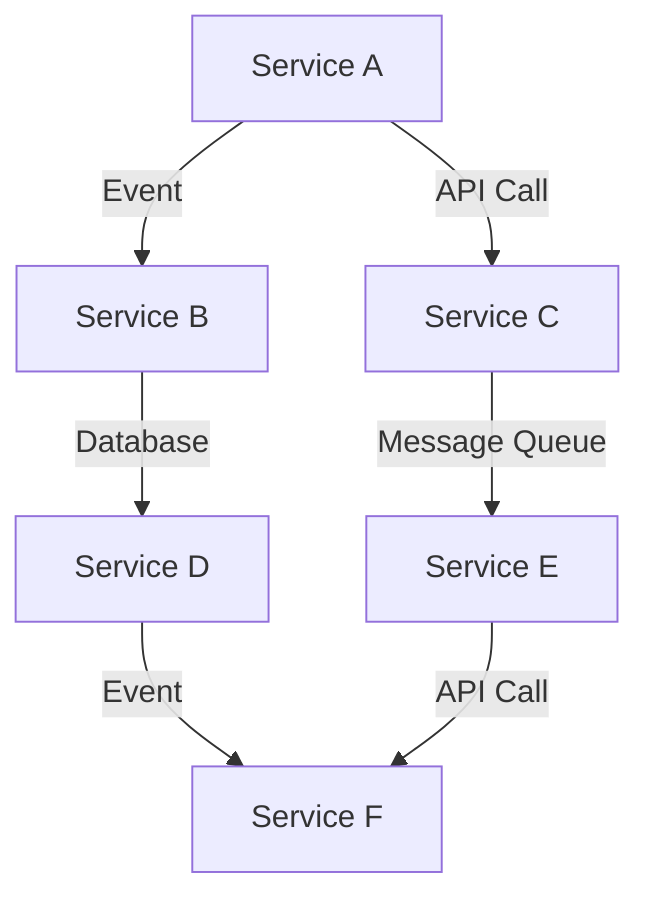

## 3.2. Loose Coupling and High Cohesion

In the realm of microservices architecture, the principles of loose coupling and high cohesion are pivotal to creating systems that are scalable, maintainable, and resilient. These principles guide the design of services that are independent yet cohesive, enabling them to evolve and scale without causing disruptions across the system. In this section, we will delve into these concepts, explore strategies to achieve them, and illustrate their application with pseudocode examples.

### Understanding Loose Coupling

**Loose coupling** refers to the design of systems where components have minimal dependencies on each other. This allows for changes in one component to have little or no impact on others, facilitating easier maintenance and scalability.

#### Key Characteristics of Loose Coupling

- **Independence**: Services operate independently, reducing the risk of cascading failures.
- **Flexibility**: Changes in one service do not necessitate changes in others.
- **Scalability**: Services can be scaled independently based on demand.

#### Strategies for Achieving Loose Coupling

1. **Interface-Based Design**: Define clear interfaces for services to interact with each other. This encapsulation hides the internal workings of a service, exposing only what is necessary.

   ```pseudocode
   // Define an interface for a payment service
   interface PaymentService {
       function processPayment(amount, currency): PaymentResponse
   }
   
   // Implement the interface in a concrete service
   class CreditCardPaymentService implements PaymentService {
       function processPayment(amount, currency): PaymentResponse {
           // Process credit card payment
           return new PaymentResponse(success: true, transactionId: "12345")
       }
   }
   ```

2. **Event-Driven Architecture**: Use events to communicate between services asynchronously. This decouples the sender and receiver, allowing them to evolve independently.

   ```pseudocode
   // Event publisher service
   class OrderService {
       function placeOrder(orderDetails) {
           // Logic to place order
           publishEvent("OrderPlaced", orderDetails)
       }
   }
   
   // Event subscriber service
   class InventoryService {
       function onOrderPlaced(event) {
           // Update inventory based on order details
       }
   }
   ```

3. **API Gateway Pattern**: Implement an API Gateway to act as a single entry point for client requests. This abstracts the underlying services and reduces direct dependencies.

   ```pseudocode
   // API Gateway handling requests
   class ApiGateway {
       function handleRequest(request) {
           if (request.type == "payment") {
               forwardToService("PaymentService", request)
           } else if (request.type == "order") {
               forwardToService("OrderService", request)
           }
       }
   }
   ```

4. **Service Mesh**: Use a service mesh to manage service-to-service communication, providing features like load balancing, retries, and circuit breaking without changing the service code.

   ```mermaid
   graph TD;
       A[Service A] -->|HTTP| B[Service B];
       A -->|gRPC| C[Service C];
       B -->|HTTP| C;
       C -->|gRPC| D[Service D];
   ```

### Benefits of Loose Coupling

- **Enhanced Scalability**: Services can be scaled independently, allowing for efficient resource utilization.
- **Improved Maintainability**: Changes in one service do not affect others, simplifying updates and bug fixes.
- **Increased Resilience**: Failures are contained within a service, preventing system-wide outages.

### Understanding High Cohesion

**High cohesion** refers to the degree to which the elements within a service belong together. A highly cohesive service performs a specific set of related tasks, making it easier to understand, maintain, and evolve.

#### Key Characteristics of High Cohesion

- **Focused Functionality**: Services are designed around specific business capabilities or domains.
- **Clear Responsibilities**: Each service has a well-defined purpose and scope.
- **Ease of Understanding**: Cohesive services are easier to comprehend and manage.

#### Strategies for Achieving High Cohesion

1. **Domain-Driven Design (DDD)**: Use DDD principles to define service boundaries based on business domains and subdomains.

   ```pseudocode
   // Define a bounded context for the Order domain
   class OrderContext {
       function createOrder(customerId, productId, quantity) {
           // Logic to create order
       }
       
       function cancelOrder(orderId) {
           // Logic to cancel order
       }
   }
   ```

2. **Single Responsibility Principle (SRP)**: Ensure each service has a single responsibility, focusing on one aspect of the business logic.

   ```pseudocode
   // Service responsible for user authentication
   class AuthenticationService {
       function login(username, password) {
           // Logic to authenticate user
       }
       
       function logout(userId) {
           // Logic to log out user
       }
   }
   ```

3. **Microservices Decomposition**: Decompose services based on business capabilities or subdomains, ensuring each service aligns with a specific business function.

   ```pseudocode
   // Decompose services based on business capabilities
   class CustomerService {
       function addCustomer(details) {
           // Logic to add customer
       }
   }
   
   class ProductService {
       function addProduct(details) {
           // Logic to add product
       }
   }
   ```

4. **Cohesive Data Management**: Ensure that each service manages its own data, aligning with its responsibilities and reducing cross-service dependencies.

   ```pseudocode
   // Service managing its own data
   class InventoryService {
       private inventoryDatabase;
       
       function updateStock(productId, quantity) {
           // Logic to update stock in inventoryDatabase
       }
   }
   ```

### Benefits of High Cohesion

- **Improved Understandability**: Cohesive services are easier to understand and reason about.
- **Simplified Maintenance**: Changes are localized within a service, reducing the risk of unintended side effects.
- **Enhanced Reusability**: Services with clear responsibilities can be reused across different contexts.

### Visualizing Loose Coupling and High Cohesion

To better understand the relationship between loose coupling and high cohesion, let's visualize these concepts using a diagram.



**Diagram Description**: This diagram illustrates a microservices architecture where services communicate through events, API calls, and message queues. Each service manages its own database, ensuring high cohesion, while communication is handled through loosely coupled mechanisms.

### Design Considerations

- **Balance**: Strive for a balance between loose coupling and high cohesion. Overemphasizing one can lead to challenges in the other.
- **Granularity**: Determine the right level of granularity for services. Too fine-grained services can lead to excessive communication overhead, while too coarse-grained services may become monolithic.
- **Evolution**: Continuously evolve service boundaries as business needs change, ensuring they remain cohesive and loosely coupled.

### Try It Yourself

To deepen your understanding, try modifying the pseudocode examples provided. Experiment with different communication patterns, such as switching from synchronous to asynchronous communication, or decomposing services based on different criteria. Observe how these changes impact the coupling and cohesion of your services.

### Knowledge Check

- **Question**: What are the key characteristics of loose coupling in microservices?
- **Question**: How does high cohesion contribute to the maintainability of a service?
- **Question**: What strategies can be used to achieve loose coupling in a microservices architecture?

### Summary

In this section, we've explored the principles of loose coupling and high cohesion in microservices architecture. By minimizing dependencies and ensuring services are cohesive, we can create systems that are scalable, maintainable, and resilient. Remember, achieving the right balance between these principles is key to successful microservices design.

## Quiz Time!



### What is loose coupling in microservices?

- [x] Minimizing dependencies between services
- [ ] Ensuring services have a single responsibility
- [ ] Using a shared database for all services
- [ ] Implementing synchronous communication

> **Explanation:** Loose coupling refers to minimizing dependencies between services, allowing them to evolve independently.

### Which of the following is a benefit of high cohesion?

- [x] Improved understandability
- [ ] Increased inter-service communication
- [ ] Shared data management
- [ ] Tightly coupled services

> **Explanation:** High cohesion improves understandability by ensuring services have focused responsibilities.

### What is a strategy for achieving loose coupling?

- [x] Event-driven architecture
- [ ] Shared database pattern
- [ ] Monolithic design
- [ ] Tight integration

> **Explanation:** Event-driven architecture allows services to communicate asynchronously, reducing dependencies.

### How does high cohesion affect service maintenance?

- [x] Simplifies maintenance by localizing changes
- [ ] Increases maintenance complexity
- [ ] Requires frequent service updates
- [ ] Leads to tightly coupled services

> **Explanation:** High cohesion simplifies maintenance by ensuring changes are localized within a service.

### What is the role of an API Gateway in loose coupling?

- [x] Acts as a single entry point for client requests
- [ ] Manages service databases
- [ ] Implements business logic
- [ ] Directly connects services

> **Explanation:** An API Gateway acts as a single entry point, abstracting underlying services and reducing direct dependencies.

### Which principle aligns with high cohesion?

- [x] Single Responsibility Principle
- [ ] Shared Responsibility Principle
- [ ] Loose Coupling Principle
- [ ] Tight Coupling Principle

> **Explanation:** The Single Responsibility Principle aligns with high cohesion by ensuring services have focused responsibilities.

### What is a characteristic of a loosely coupled system?

- [x] Services operate independently
- [ ] Services share a common database
- [ ] Services are tightly integrated
- [ ] Services require synchronous communication

> **Explanation:** In a loosely coupled system, services operate independently, minimizing dependencies.

### How can domain-driven design contribute to high cohesion?

- [x] By defining service boundaries based on business domains
- [ ] By sharing data across services
- [ ] By using a monolithic architecture
- [ ] By implementing synchronous communication

> **Explanation:** Domain-driven design contributes to high cohesion by defining service boundaries based on business domains.

### What is the impact of loose coupling on scalability?

- [x] Enhances scalability by allowing independent scaling
- [ ] Reduces scalability by increasing dependencies
- [ ] Has no impact on scalability
- [ ] Requires synchronous scaling

> **Explanation:** Loose coupling enhances scalability by allowing services to be scaled independently.

### True or False: High cohesion and loose coupling are mutually exclusive.

- [ ] True
- [x] False

> **Explanation:** High cohesion and loose coupling are not mutually exclusive; they complement each other in microservices design.



Remember, this is just the beginning. As you progress, you'll build more complex and interactive microservices architectures. Keep experimenting, stay curious, and enjoy the journey!
