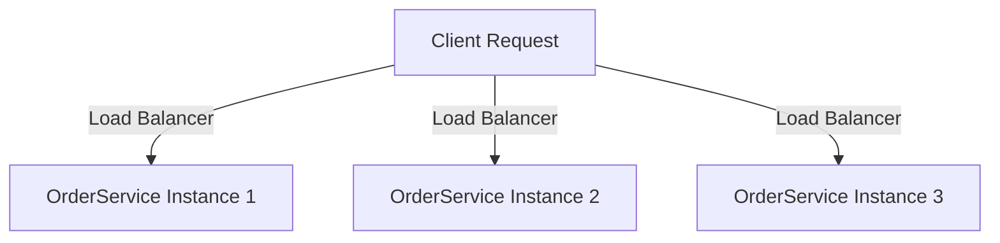
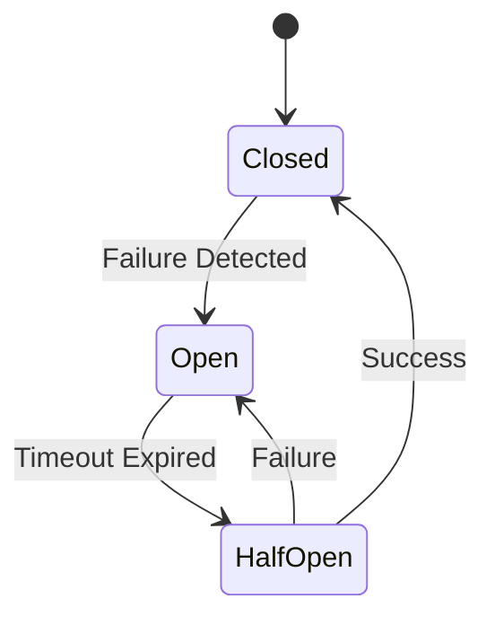
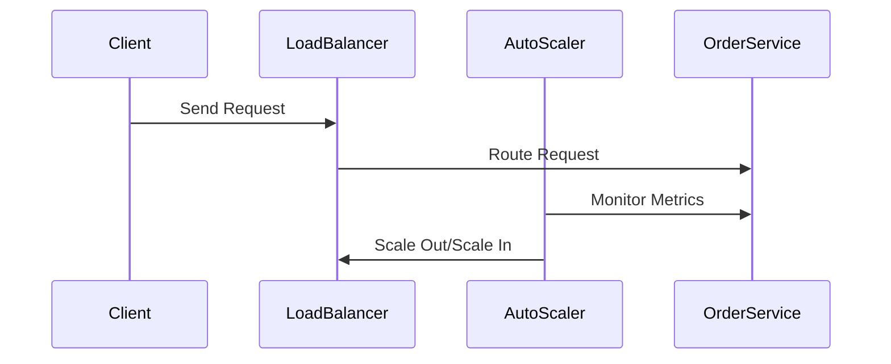

## 3.3. Scalability and Resilience

In the realm of microservices architecture, scalability and resilience are two pivotal principles that ensure systems can handle increasing loads and recover from failures gracefully. As we delve into these concepts, we'll explore how horizontal scaling, fault isolation, and auto-scaling strategies contribute to building robust and efficient microservices.

### Horizontal Scaling

Horizontal scaling, also known as scaling out, involves adding more instances of a service to handle increased load. This approach contrasts with vertical scaling, where resources are added to a single instance. Horizontal scaling is particularly suited to microservices due to their distributed nature.

#### Key Concepts of Horizontal Scaling

1. **Statelessness**: Ensure services are stateless to facilitate easy replication. Stateless services do not retain any client-specific data between requests, allowing any instance to handle any request.

2. **Load Balancing**: Distribute incoming requests across multiple instances using load balancers. This ensures even distribution of traffic and prevents any single instance from becoming a bottleneck.

3. **Service Discovery**: Implement service discovery mechanisms to dynamically locate available instances. This is crucial for maintaining an updated list of instances as they scale in and out.

#### Pseudocode Example: Implementing Horizontal Scaling

```pseudocode
// Define a service with stateless behavior
service OrderService {
    function processOrder(orderId) {
        // Fetch order details from database
        orderDetails = database.getOrder(orderId)
        
        // Process order
        processedOrder = process(orderDetails)
        
        // Return processed order
        return processedOrder
    }
}

// Load balancer distributes requests to available instances
loadBalancer = new LoadBalancer()
loadBalancer.addInstance(new OrderService())
loadBalancer.addInstance(new OrderService())

// Client request
clientRequest = new ClientRequest(orderId)
response = loadBalancer.routeRequest(clientRequest)
```

In this pseudocode, the `OrderService` is designed to be stateless, allowing multiple instances to be added to the load balancer. The load balancer routes client requests to available instances, demonstrating horizontal scaling.

#### Visualizing Horizontal Scaling



*Figure 1: Horizontal Scaling with Load Balancer Distributing Requests*

### Fault Isolation

Fault isolation is the practice of containing failures within a specific service or component to prevent cascading failures across the system. This principle is crucial for maintaining system stability and ensuring that failures do not propagate.

#### Key Concepts of Fault Isolation

1. **Service Independence**: Design services to operate independently, minimizing dependencies on other services. This reduces the risk of a failure in one service affecting others.

2. **Circuit Breaker Pattern**: Implement circuit breakers to detect failures and prevent requests from being sent to failing services. This helps in avoiding further strain on the system.

3. **Bulkhead Pattern**: Use bulkheads to partition resources and limit the impact of failures. This ensures that a failure in one part of the system does not deplete resources for other parts.

#### Pseudocode Example: Implementing Fault Isolation with Circuit Breaker

```pseudocode
// Define a circuit breaker for the OrderService
circuitBreaker = new CircuitBreaker(OrderService)

// Function to process order with fault isolation
function processOrderWithIsolation(orderId) {
    if circuitBreaker.isClosed() {
        try {
            // Attempt to process order
            response = OrderService.processOrder(orderId)
            circuitBreaker.recordSuccess()
            return response
        } catch (Exception e) {
            circuitBreaker.recordFailure()
            throw e
        }
    } else {
        // Circuit breaker is open, return fallback response
        return "Service temporarily unavailable"
    }
}
```

In this pseudocode, a circuit breaker is used to monitor the `OrderService`. If the service fails, the circuit breaker opens, preventing further requests and providing a fallback response.

#### Visualizing Fault Isolation with Circuit Breaker



*Figure 2: Circuit Breaker State Transitions*

### Auto-Scaling Strategies

Auto-scaling involves dynamically adjusting the number of service instances based on current demand. This ensures optimal resource utilization and cost efficiency.

#### Key Concepts of Auto-Scaling

1. **Metrics Monitoring**: Continuously monitor metrics such as CPU usage, memory consumption, and request latency to determine scaling needs.

2. **Scaling Policies**: Define policies that dictate when to scale in or out. These policies are based on thresholds for monitored metrics.

3. **Elastic Infrastructure**: Utilize cloud platforms that support elastic scaling, allowing resources to be provisioned and de-provisioned automatically.

#### Pseudocode Example: Implementing Auto-Scaling

```pseudocode
// Define scaling policy based on CPU usage
scalingPolicy = new ScalingPolicy()
scalingPolicy.setThreshold(cpuUsage, 70) // Scale out if CPU usage exceeds 70%
scalingPolicy.setThreshold(cpuUsage, 30) // Scale in if CPU usage falls below 30%

// Auto-scaler monitors metrics and adjusts instances
autoScaler = new AutoScaler(OrderService, scalingPolicy)
autoScaler.startMonitoring()

// Function to simulate CPU usage
function simulateCpuUsage() {
    while (true) {
        currentCpuUsage = monitor.getCpuUsage()
        if currentCpuUsage > scalingPolicy.getThreshold(cpuUsage, "scaleOut") {
            autoScaler.scaleOut()
        } else if currentCpuUsage < scalingPolicy.getThreshold(cpuUsage, "scaleIn") {
            autoScaler.scaleIn()
        }
        sleep(60) // Check every minute
    }
}
```

In this pseudocode, an auto-scaler monitors CPU usage and adjusts the number of `OrderService` instances based on defined scaling policies.

#### Visualizing Auto-Scaling



*Figure 3: Auto-Scaling Sequence Diagram*

### Try It Yourself

To deepen your understanding, try modifying the pseudocode examples:

- **Horizontal Scaling**: Add more instances to the load balancer and observe how requests are distributed.
- **Fault Isolation**: Implement a fallback mechanism for the circuit breaker to handle failures more gracefully.
- **Auto-Scaling**: Adjust the scaling thresholds and observe how the system responds to different loads.

### Knowledge Check

- Explain the difference between horizontal and vertical scaling.
- Describe how the circuit breaker pattern helps in fault isolation.
- Discuss the importance of metrics monitoring in auto-scaling.

### Summary

Scalability and resilience are foundational principles in microservices architecture. By leveraging horizontal scaling, fault isolation, and auto-scaling strategies, we can build systems that are both robust and efficient. Remember, this is just the beginning. As you progress, you'll build more complex and resilient microservices. Keep experimenting, stay curious, and enjoy the journey!

## Quiz Time!



### What is horizontal scaling in microservices?

- [x] Adding more instances of a service to handle increased load
- [ ] Adding more resources to a single instance
- [ ] Reducing the number of service instances
- [ ] Removing unused services

> **Explanation:** Horizontal scaling involves adding more instances of a service to handle increased load, as opposed to vertical scaling, which adds resources to a single instance.

### Which pattern helps in preventing cascading failures in microservices?

- [ ] Load Balancer
- [x] Circuit Breaker
- [ ] Service Discovery
- [ ] Auto-Scaler

> **Explanation:** The Circuit Breaker pattern helps in preventing cascading failures by detecting failures and preventing requests from being sent to failing services.

### What is the primary benefit of stateless services in horizontal scaling?

- [x] Easy replication and load distribution
- [ ] Increased security
- [ ] Reduced memory usage
- [ ] Simplified codebase

> **Explanation:** Stateless services can be easily replicated and distributed across multiple instances, facilitating horizontal scaling.

### What role does a load balancer play in horizontal scaling?

- [x] Distributes incoming requests across multiple instances
- [ ] Monitors CPU usage
- [ ] Detects service failures
- [ ] Manages service discovery

> **Explanation:** A load balancer distributes incoming requests across multiple instances to ensure even distribution of traffic and prevent bottlenecks.

### How does the Bulkhead pattern contribute to fault isolation?

- [x] Partitions resources to limit the impact of failures
- [ ] Detects and prevents failures
- [ ] Monitors service metrics
- [ ] Distributes requests evenly

> **Explanation:** The Bulkhead pattern partitions resources to limit the impact of failures, ensuring that a failure in one part of the system does not affect others.

### What is the purpose of auto-scaling in microservices?

- [x] Dynamically adjust the number of service instances based on demand
- [ ] Monitor service health
- [ ] Distribute requests evenly
- [ ] Detect service failures

> **Explanation:** Auto-scaling dynamically adjusts the number of service instances based on current demand to ensure optimal resource utilization and cost efficiency.

### Which metric is commonly monitored for auto-scaling decisions?

- [x] CPU usage
- [ ] Disk space
- [ ] Network latency
- [ ] Error rate

> **Explanation:** CPU usage is a common metric monitored for auto-scaling decisions, as it indicates the load on a service.

### What is a key characteristic of a service that facilitates horizontal scaling?

- [x] Statelessness
- [ ] High memory usage
- [ ] Complex dependencies
- [ ] Tight coupling

> **Explanation:** Statelessness is a key characteristic that facilitates horizontal scaling, as it allows any instance to handle any request.

### How does service discovery aid in horizontal scaling?

- [x] Dynamically locates available service instances
- [ ] Monitors service health
- [ ] Distributes requests evenly
- [ ] Detects service failures

> **Explanation:** Service discovery dynamically locates available service instances, maintaining an updated list as instances scale in and out.

### True or False: Auto-scaling can only scale out, not scale in.

- [ ] True
- [x] False

> **Explanation:** Auto-scaling can both scale out (add instances) and scale in (remove instances) based on demand.


