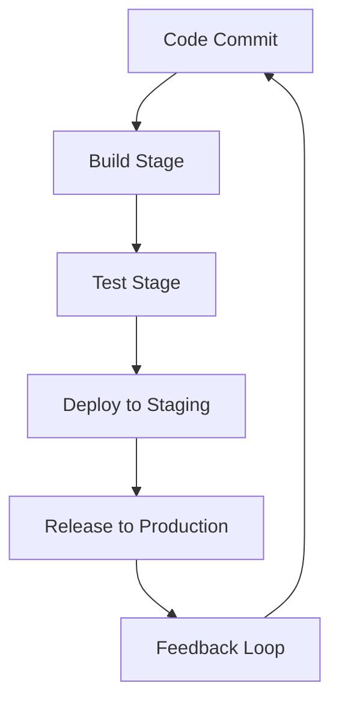

## 3.4. Continuous Delivery and DevOps Culture

In the rapidly evolving landscape of software development, Continuous Delivery (CD) and DevOps culture have emerged as pivotal components in the successful implementation of microservices architecture. This section delves into the principles and practices that underpin these concepts, offering insights into how they can be effectively integrated into microservices environments.

### Automating Deployment Pipelines

Automating deployment pipelines is a cornerstone of Continuous Delivery, enabling teams to deliver software changes quickly, safely, and sustainably. Let's explore how this is achieved in a microservices context.

#### Key Concepts of Deployment Pipelines

A deployment pipeline is a set of automated processes that enable code changes to be built, tested, and deployed to production environments. It consists of several stages, each designed to ensure the quality and reliability of the software.

1. **Build Stage**: Compile the code and run unit tests to ensure that the application is functioning as expected.
2. **Test Stage**: Execute integration and acceptance tests to verify the interaction between different services.
3. **Deploy Stage**: Automatically deploy the application to a staging environment for further testing.
4. **Release Stage**: Deploy the application to production, often with mechanisms for rollback in case of failure.

#### Implementing Deployment Pipelines

To implement a deployment pipeline, we need to integrate various tools and technologies that facilitate automation. Here's a pseudocode example illustrating a simple deployment pipeline:

```pseudocode
pipeline {
    agent any
    stages {
        stage('Build') {
            steps {
                // Compile the code
                sh 'mvn clean install'
            }
        }
        stage('Test') {
            steps {
                // Run unit tests
                sh 'mvn test'
            }
        }
        stage('Deploy to Staging') {
            steps {
                // Deploy to staging environment
                sh 'kubectl apply -f staging-deployment.yaml'
            }
        }
        stage('Release to Production') {
            steps {
                // Deploy to production environment
                sh 'kubectl apply -f production-deployment.yaml'
            }
        }
    }
}
```

In this example, we use a pipeline to automate the build, test, and deployment processes. Each stage is executed sequentially, ensuring that only code that passes all tests is deployed to production.

#### Benefits of Automated Deployment Pipelines

- **Speed**: Automation reduces the time required to deliver changes to production.
- **Consistency**: Automated processes ensure that deployments are performed in a consistent manner.
- **Reliability**: Automated testing and deployment reduce the risk of human error.
- **Feedback**: Continuous feedback loops enable teams to identify and address issues quickly.

### Infrastructure as Code

Infrastructure as Code (IaC) is a practice that involves managing and provisioning computing infrastructure through machine-readable configuration files. This approach is essential in microservices environments, where infrastructure needs to be scalable, repeatable, and consistent.

#### Key Concepts of Infrastructure as Code

1. **Declarative Configuration**: Define the desired state of the infrastructure using a high-level language.
2. **Version Control**: Store configuration files in a version control system to track changes and enable collaboration.
3. **Automation**: Use tools to automatically provision and manage infrastructure based on the configuration files.

#### Implementing Infrastructure as Code

To implement IaC, we use tools like Terraform or Ansible to define and manage infrastructure. Here's a pseudocode example using Terraform:

```pseudocode
provider "aws" {
    region = "us-west-2"
}

resource "aws_instance" "web" {
    ami           = "ami-0c55b159cbfafe1f0"
    instance_type = "t2.micro"

    tags = {
        Name = "WebServer"
    }
}
```

In this example, we define an AWS EC2 instance using Terraform. The configuration specifies the region, AMI, and instance type, allowing us to provision the infrastructure automatically.

#### Benefits of Infrastructure as Code

- **Scalability**: Easily scale infrastructure up or down based on demand.
- **Consistency**: Ensure that environments are identical, reducing configuration drift.
- **Reproducibility**: Quickly recreate environments for testing or disaster recovery.
- **Collaboration**: Enable teams to collaborate on infrastructure changes using version control.

### Cross-Functional Teams

DevOps culture emphasizes the importance of cross-functional teams, where developers, operations, and other stakeholders collaborate closely to deliver software. This approach breaks down silos and fosters a culture of shared responsibility.

#### Key Concepts of Cross-Functional Teams

1. **Collaboration**: Encourage open communication and collaboration between team members.
2. **Shared Responsibility**: Foster a sense of shared ownership for the software and its operation.
3. **Continuous Improvement**: Promote a culture of learning and continuous improvement.

#### Implementing Cross-Functional Teams

To implement cross-functional teams, organizations need to adopt practices that encourage collaboration and communication. Here are some strategies:

- **Daily Standups**: Hold regular standup meetings to discuss progress and address any blockers.
- **Retrospectives**: Conduct retrospectives to reflect on past work and identify areas for improvement.
- **Pair Programming**: Encourage pair programming to facilitate knowledge sharing and collaboration.

#### Benefits of Cross-Functional Teams

- **Improved Communication**: Break down barriers between teams and improve communication.
- **Faster Delivery**: Enable faster delivery of software by reducing handoffs and delays.
- **Increased Innovation**: Foster a culture of innovation by encouraging diverse perspectives.
- **Enhanced Quality**: Improve software quality through shared responsibility and collaboration.

### Visualizing Continuous Delivery and DevOps Culture

To better understand the integration of Continuous Delivery and DevOps culture in microservices, let's visualize the process using a flowchart.



**Figure 1: Continuous Delivery Pipeline Flowchart**

This flowchart illustrates the stages of a continuous delivery pipeline, highlighting the feedback loop that enables continuous improvement.

### Try It Yourself

To deepen your understanding of Continuous Delivery and DevOps culture, try modifying the pseudocode examples provided. Experiment with different configurations and tools to see how they affect the deployment process. Consider implementing a simple deployment pipeline using a tool like Jenkins or GitLab CI/CD, and explore the benefits of Infrastructure as Code by provisioning infrastructure using Terraform or Ansible.

### Knowledge Check

- What are the key stages of a deployment pipeline?
- How does Infrastructure as Code improve scalability and consistency?
- What are the benefits of cross-functional teams in a DevOps culture?

### Embrace the Journey

Remember, this is just the beginning. As you progress, you'll build more complex and resilient microservices architectures. Keep experimenting, stay curious, and enjoy the journey!

### References and Links

- [Continuous Delivery: Reliable Software Releases through Build, Test, and Deployment Automation](https://www.amazon.com/Continuous-Delivery-Deployment-Automation-Addison-Wesley/dp/0321601912)
- [Terraform Documentation](https://www.terraform.io/docs/index.html)
- [Ansible Documentation](https://docs.ansible.com/ansible/latest/index.html)

## Quiz Time!



### What is the primary goal of automating deployment pipelines?

- [x] To deliver software changes quickly, safely, and sustainably
- [ ] To increase manual intervention in the deployment process
- [ ] To reduce the number of software releases
- [ ] To eliminate the need for testing

> **Explanation:** Automating deployment pipelines aims to deliver software changes quickly, safely, and sustainably by reducing manual intervention and ensuring consistent processes.

### Which tool is commonly used for Infrastructure as Code?

- [x] Terraform
- [ ] Jenkins
- [ ] Docker
- [ ] Git

> **Explanation:** Terraform is a popular tool for Infrastructure as Code, allowing users to define and manage infrastructure through configuration files.

### What is a key benefit of cross-functional teams in a DevOps culture?

- [x] Improved communication and collaboration
- [ ] Increased silos between teams
- [ ] Slower software delivery
- [ ] Reduced innovation

> **Explanation:** Cross-functional teams improve communication and collaboration by breaking down silos and fostering a culture of shared responsibility.

### What is the purpose of the feedback loop in a continuous delivery pipeline?

- [x] To enable continuous improvement by providing feedback on software changes
- [ ] To delay the deployment process
- [ ] To increase the complexity of the pipeline
- [ ] To eliminate the need for testing

> **Explanation:** The feedback loop in a continuous delivery pipeline provides feedback on software changes, enabling continuous improvement and quick identification of issues.

### How does Infrastructure as Code contribute to reproducibility?

- [x] By allowing environments to be quickly recreated using configuration files
- [ ] By requiring manual configuration of environments
- [ ] By increasing configuration drift
- [ ] By reducing the need for version control

> **Explanation:** Infrastructure as Code contributes to reproducibility by allowing environments to be quickly recreated using configuration files, ensuring consistency and reducing configuration drift.

### What is a common practice to encourage collaboration in cross-functional teams?

- [x] Daily standups
- [ ] Working in isolation
- [ ] Avoiding communication
- [ ] Increasing handoffs

> **Explanation:** Daily standups are a common practice to encourage collaboration and communication in cross-functional teams, helping to address blockers and align team members.

### What is the role of version control in Infrastructure as Code?

- [x] To track changes and enable collaboration on configuration files
- [ ] To increase configuration drift
- [ ] To eliminate the need for automation
- [ ] To reduce the scalability of infrastructure

> **Explanation:** Version control plays a crucial role in Infrastructure as Code by tracking changes and enabling collaboration on configuration files, ensuring consistency and accountability.

### What is the benefit of using declarative configuration in Infrastructure as Code?

- [x] It defines the desired state of the infrastructure using a high-level language
- [ ] It requires manual configuration of infrastructure
- [ ] It increases the complexity of infrastructure management
- [ ] It eliminates the need for automation

> **Explanation:** Declarative configuration in Infrastructure as Code defines the desired state of the infrastructure using a high-level language, simplifying management and ensuring consistency.

### What is a key advantage of automated deployment pipelines?

- [x] Reduced risk of human error
- [ ] Increased manual intervention
- [ ] Slower software delivery
- [ ] Reduced consistency

> **Explanation:** Automated deployment pipelines reduce the risk of human error by ensuring consistent and reliable processes, leading to faster and safer software delivery.

### True or False: Cross-functional teams in a DevOps culture lead to increased silos between teams.

- [ ] True
- [x] False

> **Explanation:** Cross-functional teams in a DevOps culture aim to break down silos between teams, fostering collaboration and shared responsibility for software delivery.



---
