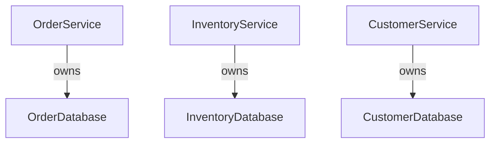
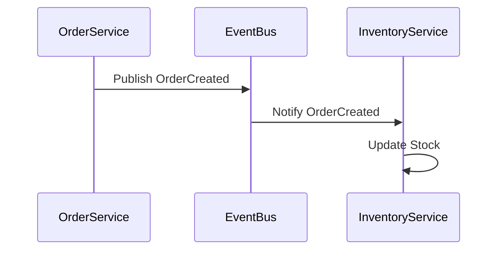
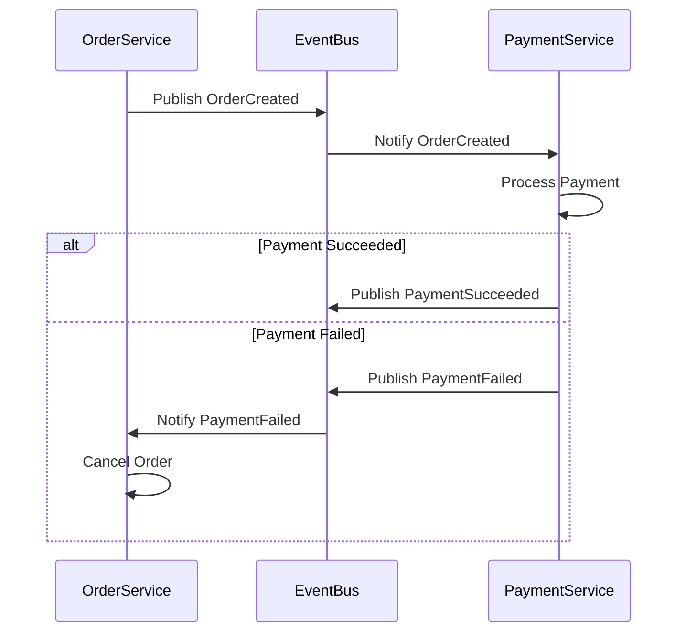

## 3.5. Decentralized Data Management

In the realm of microservices architecture, decentralized data management is a pivotal concept that ensures each service can operate independently, thereby enhancing scalability and resilience. This section delves into the core principles of decentralized data management, including data ownership by service, eventual consistency, and distributed transactions. We will explore these concepts with detailed explanations, pseudocode examples, and visual diagrams to solidify your understanding.

### Data Ownership by Service

**Data Ownership by Service** is a fundamental principle in microservices architecture, where each service is responsible for its own data. This approach promotes loose coupling and high cohesion, allowing services to evolve independently without affecting others.

#### Key Concepts

- **Service Autonomy**: Each service has full control over its data schema and storage technology, enabling it to optimize for its specific needs.
- **Encapsulation**: Services encapsulate their data, exposing only necessary information through well-defined APIs.
- **Independent Scaling**: Services can scale independently based on their data processing requirements.

#### Pseudocode Example

Let's illustrate data ownership with a simple pseudocode example. Consider an e-commerce application with separate services for `Order`, `Inventory`, and `Customer`.

```pseudocode
// Order Service
class OrderService {
    database: OrderDatabase

    function createOrder(customerId, productId, quantity) {
        if InventoryService.checkAvailability(productId, quantity) {
            orderId = database.saveOrder(customerId, productId, quantity)
            InventoryService.reserveProduct(productId, quantity)
            return orderId
        } else {
            throw new Error("Product not available")
        }
    }
}

// Inventory Service
class InventoryService {
    database: InventoryDatabase

    function checkAvailability(productId, quantity) {
        product = database.getProduct(productId)
        return product.stock >= quantity
    }

    function reserveProduct(productId, quantity) {
        database.updateStock(productId, -quantity)
    }
}

// Customer Service
class CustomerService {
    database: CustomerDatabase

    function getCustomerDetails(customerId) {
        return database.getCustomer(customerId)
    }
}
```

In this example, each service manages its own database, ensuring that changes in one service do not directly impact others.

#### Visualizing Service Data Ownership



**Diagram Description**: This diagram illustrates the relationship between services and their respective databases, emphasizing the concept of data ownership.

### Eventual Consistency

**Eventual Consistency** is a consistency model used in distributed systems to achieve high availability. In microservices, it allows services to remain available and responsive by accepting temporary inconsistencies that will be resolved over time.

#### Key Concepts

- **Asynchronous Updates**: Changes are propagated asynchronously, allowing services to continue processing requests without waiting for immediate consistency.
- **Conflict Resolution**: Mechanisms are in place to resolve conflicts that arise from concurrent updates.
- **Trade-offs**: While eventual consistency improves availability, it may lead to temporary data discrepancies.

#### Pseudocode Example

Consider a scenario where the `OrderService` and `InventoryService` need to maintain consistency in product stock levels.

```pseudocode
// Order Service
class OrderService {
    eventBus: EventBus

    function createOrder(customerId, productId, quantity) {
        if InventoryService.checkAvailability(productId, quantity) {
            orderId = database.saveOrder(customerId, productId, quantity)
            eventBus.publish("OrderCreated", { orderId, productId, quantity })
            return orderId
        } else {
            throw new Error("Product not available")
        }
    }
}

// Inventory Service
class InventoryService {
    eventBus: EventBus

    function onOrderCreated(event) {
        productId = event.productId
        quantity = event.quantity
        database.updateStock(productId, -quantity)
    }
}

// Event Bus
class EventBus {
    subscribers: List

    function publish(eventType, eventData) {
        for subscriber in subscribers[eventType] {
            subscriber.handleEvent(eventData)
        }
    }

    function subscribe(eventType, handler) {
        subscribers[eventType].add(handler)
    }
}
```

In this example, the `OrderService` publishes an `OrderCreated` event, which the `InventoryService` listens to and processes asynchronously.

#### Visualizing Eventual Consistency



**Diagram Description**: This sequence diagram illustrates the asynchronous communication between services to achieve eventual consistency.

### Distributed Transactions

**Distributed Transactions** ensure data integrity across multiple services. In microservices, traditional ACID transactions are often replaced with patterns like Sagas to manage distributed transactions.

#### Key Concepts

- **Saga Pattern**: A sequence of local transactions where each step is followed by a compensating action in case of failure.
- **Choreography vs. Orchestration**: Two approaches to managing sagas, where choreography relies on event-driven communication and orchestration uses a central controller.
- **Failure Handling**: Mechanisms to handle partial failures and ensure data consistency.

#### Pseudocode Example

Let's implement a simple saga for an order process involving `OrderService` and `PaymentService`.

```pseudocode
// Order Service
class OrderService {
    eventBus: EventBus

    function createOrder(customerId, productId, quantity) {
        orderId = database.saveOrder(customerId, productId, quantity)
        eventBus.publish("OrderCreated", { orderId, customerId, productId, quantity })
        return orderId
    }

    function onPaymentFailed(event) {
        orderId = event.orderId
        database.cancelOrder(orderId)
    }
}

// Payment Service
class PaymentService {
    eventBus: EventBus

    function onOrderCreated(event) {
        success = processPayment(event.customerId, event.orderId)
        if success {
            eventBus.publish("PaymentSucceeded", { orderId: event.orderId })
        } else {
            eventBus.publish("PaymentFailed", { orderId: event.orderId })
        }
    }
}

// Event Bus
class EventBus {
    subscribers: List

    function publish(eventType, eventData) {
        for subscriber in subscribers[eventType] {
            subscriber.handleEvent(eventData)
        }
    }

    function subscribe(eventType, handler) {
        subscribers[eventType].add(handler)
    }
}
```

In this example, the `OrderService` and `PaymentService` coordinate through events to manage the order process. If payment fails, the `OrderService` compensates by canceling the order.

#### Visualizing Distributed Transactions



**Diagram Description**: This sequence diagram shows the flow of a distributed transaction using the Saga pattern, highlighting the compensating action on payment failure.

### Design Considerations

When implementing decentralized data management, consider the following:

- **Consistency vs. Availability**: Decide on the appropriate balance between consistency and availability based on your application's requirements.
- **Data Partitioning**: Ensure data is partitioned effectively to support service autonomy and scalability.
- **Monitoring and Logging**: Implement robust monitoring and logging to track data flows and detect inconsistencies.

### Programming Language Specifics

While the pseudocode examples provide a language-agnostic view, consider the following when implementing in specific programming languages:

- **Java**: Use frameworks like Spring Cloud for event-driven communication and transaction management.
- **Python**: Leverage libraries like Celery for asynchronous task processing and event handling.
- **JavaScript/Node.js**: Utilize tools like Kafka or RabbitMQ for message brokering and event streaming.

### Differences and Similarities

Decentralized data management shares similarities with traditional distributed systems but differs in its emphasis on service autonomy and eventual consistency. Unlike monolithic architectures, microservices require careful consideration of data consistency and transaction management across services.

### Try It Yourself

Experiment with the pseudocode examples by:

- Modifying the `OrderService` to handle additional events, such as `OrderShipped`.
- Implementing a new service, `ShippingService`, that listens for `OrderShipped` events and updates shipping status.
- Testing the impact of network latency on eventual consistency by introducing delays in event processing.

### Knowledge Check

To reinforce your understanding, consider the following questions:

1. How does data ownership by service promote loose coupling in microservices?
2. What are the trade-offs of using eventual consistency in a distributed system?
3. How does the Saga pattern help manage distributed transactions?

### Embrace the Journey

Remember, decentralized data management is a journey that requires careful planning and execution. As you implement these principles, you'll gain insights into the complexities and benefits of microservices architecture. Keep experimenting, stay curious, and enjoy the journey!

## Quiz Time!



### What is a key benefit of data ownership by service in microservices?

- [x] It allows services to evolve independently.
- [ ] It centralizes data management.
- [ ] It simplifies database administration.
- [ ] It reduces the need for APIs.

> **Explanation:** Data ownership by service allows each service to manage its own data, enabling independent evolution and reducing dependencies.

### How does eventual consistency improve system availability?

- [x] By allowing services to process requests without waiting for immediate consistency.
- [ ] By ensuring all services are always consistent.
- [ ] By centralizing data updates.
- [ ] By eliminating the need for conflict resolution.

> **Explanation:** Eventual consistency allows services to remain available by accepting temporary inconsistencies, which are resolved over time.

### What is the Saga pattern used for in microservices?

- [x] Managing distributed transactions.
- [ ] Centralizing data storage.
- [ ] Simplifying API design.
- [ ] Enhancing data security.

> **Explanation:** The Saga pattern is used to manage distributed transactions by coordinating a sequence of local transactions with compensating actions.

### Which approach relies on event-driven communication in the Saga pattern?

- [x] Choreography
- [ ] Orchestration
- [ ] Centralization
- [ ] Synchronization

> **Explanation:** Choreography in the Saga pattern relies on event-driven communication, where services react to events without a central controller.

### What is a potential drawback of eventual consistency?

- [x] Temporary data discrepancies.
- [ ] Increased system availability.
- [ ] Simplified conflict resolution.
- [ ] Reduced network latency.

> **Explanation:** Eventual consistency can lead to temporary data discrepancies as updates are propagated asynchronously.

### How can services achieve independent scaling in microservices?

- [x] By managing their own databases.
- [ ] By sharing a central database.
- [ ] By using a single API gateway.
- [ ] By synchronizing all data updates.

> **Explanation:** Services achieve independent scaling by managing their own databases, allowing them to scale based on their specific data processing needs.

### What is a compensating action in the Saga pattern?

- [x] An action that reverses a previous transaction step in case of failure.
- [ ] A step that initiates a new transaction.
- [ ] A mechanism to centralize data updates.
- [ ] A method to enhance data security.

> **Explanation:** A compensating action in the Saga pattern is used to reverse a previous transaction step if a failure occurs, ensuring data consistency.

### How does the Event Bus facilitate communication between services?

- [x] By publishing and subscribing to events.
- [ ] By centralizing data storage.
- [ ] By synchronizing all service requests.
- [ ] By eliminating the need for APIs.

> **Explanation:** The Event Bus facilitates communication by allowing services to publish and subscribe to events, enabling asynchronous updates.

### What is a key consideration when implementing decentralized data management?

- [x] Balancing consistency and availability.
- [ ] Centralizing database administration.
- [ ] Eliminating all data conflicts.
- [ ] Using a single programming language.

> **Explanation:** A key consideration is balancing consistency and availability, as decentralized data management often involves trade-offs between these aspects.

### True or False: In microservices, each service should have its own database to ensure loose coupling.

- [x] True
- [ ] False

> **Explanation:** True. Each service having its own database ensures loose coupling by allowing services to manage their own data independently.


