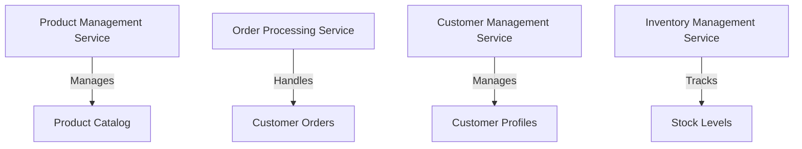

## 4.1. Decomposition by Business Capability

In the realm of microservices architecture, one of the most effective strategies for decomposing a system is by aligning services with business capabilities. This approach not only ensures that each service has a clear and focused purpose but also aligns the technical architecture with the organizational structure and business goals. In this section, we will delve into the concept of decomposition by business capability, explore its advantages, and provide pseudocode examples to illustrate how to model business-capable services.

### Identifying Business Functions

To effectively decompose a system by business capability, it is crucial to first identify the core business functions that drive the organization. Business capabilities represent what a business does to achieve its objectives and deliver value to its customers. These capabilities are typically stable over time, even as the underlying processes and technologies evolve.

#### Steps to Identify Business Functions

1. **Understand the Business Domain**: Begin by gaining a deep understanding of the business domain. This involves studying the organization's goals, strategies, and the value it provides to its customers.

2. **Engage with Stakeholders**: Collaborate with business stakeholders to identify key capabilities. This includes talking to business analysts, product owners, and domain experts who can provide insights into the core functions of the business.

3. **Map Capabilities to Organizational Structure**: Align the identified capabilities with the organizational structure. This helps in understanding how different departments and teams contribute to the overall business goals.

4. **Prioritize Capabilities**: Not all capabilities are equally important. Prioritize them based on their impact on business outcomes and customer satisfaction.

5. **Define Service Boundaries**: Once capabilities are identified and prioritized, define the boundaries of each service. Each service should encapsulate a specific business capability, ensuring that it is responsible for a distinct aspect of the business.

#### Example: E-commerce Platform

Consider an e-commerce platform. The core business capabilities might include:

- **Product Management**: Managing product catalogs, descriptions, and pricing.
- **Order Processing**: Handling customer orders, payments, and shipping.
- **Customer Management**: Managing customer profiles, preferences, and support.
- **Inventory Management**: Tracking stock levels, suppliers, and restocking.

Each of these capabilities can be represented as a separate microservice, with clear boundaries and responsibilities.

### Advantages of Decomposition by Business Capability

Decomposing microservices by business capability offers several advantages:

- **Alignment with Business Goals**: By aligning services with business capabilities, the architecture directly supports the organization's strategic objectives. This ensures that technical efforts are focused on delivering business value.

- **Improved Agility**: Services that are aligned with business capabilities can be developed, deployed, and scaled independently. This enables faster response to changing business needs and market conditions.

- **Enhanced Collaboration**: When services map to business capabilities, cross-functional teams can be organized around these capabilities. This fosters collaboration between developers, business analysts, and other stakeholders.

- **Clear Ownership and Accountability**: Each service has a clear owner responsible for its development, maintenance, and performance. This enhances accountability and ensures that services are continuously improved.

- **Scalability and Resilience**: Services can be scaled independently based on demand. This improves the overall scalability and resilience of the system.

### Pseudocode Examples: Modeling Business-Capable Services

To illustrate how to model services based on business capabilities, let's consider the e-commerce platform example. We'll provide pseudocode examples for two key services: Product Management and Order Processing.

#### Product Management Service

The Product Management service is responsible for managing the product catalog. It includes functionalities such as adding new products, updating product details, and retrieving product information.

```pseudocode
class ProductManagementService:
    def __init__(self):
        self.productCatalog = {}

    def addProduct(self, productId, productName, price, description):
        # Add a new product to the catalog
        self.productCatalog[productId] = {
            "name": productName,
            "price": price,
            "description": description
        }

    def updateProduct(self, productId, productName=None, price=None, description=None):
        # Update product details
        if productId in self.productCatalog:
            if productName:
                self.productCatalog[productId]["name"] = productName
            if price:
                self.productCatalog[productId]["price"] = price
            if description:
                self.productCatalog[productId]["description"] = description

    def getProduct(self, productId):
        # Retrieve product information
        return self.productCatalog.get(productId, "Product not found")
```

#### Order Processing Service

The Order Processing service handles customer orders, including order creation, payment processing, and shipping.

```pseudocode
class OrderProcessingService:
    def __init__(self):
        self.orders = {}
        self.orderIdCounter = 1

    def createOrder(self, customerId, productList, paymentDetails):
        # Create a new order
        orderId = self.orderIdCounter
        self.orders[orderId] = {
            "customerId": customerId,
            "productList": productList,
            "paymentDetails": paymentDetails,
            "status": "Pending"
        }
        self.orderIdCounter += 1
        return orderId

    def processPayment(self, orderId):
        # Process payment for the order
        if orderId in self.orders:
            self.orders[orderId]["status"] = "Payment Processed"
            return "Payment successful"
        return "Order not found"

    def shipOrder(self, orderId):
        # Ship the order
        if orderId in self.orders and self.orders[orderId]["status"] == "Payment Processed":
            self.orders[orderId]["status"] = "Shipped"
            return "Order shipped"
        return "Order cannot be shipped"
```

### Visualizing Service Decomposition

To better understand how services are decomposed by business capability, let's visualize the architecture using a Mermaid.js diagram.



**Diagram Description**: This diagram illustrates the decomposition of an e-commerce platform into microservices based on business capabilities. Each service is responsible for a specific aspect of the business, such as managing products, processing orders, managing customers, and tracking inventory.

### Design Considerations

When decomposing microservices by business capability, consider the following:

- **Service Granularity**: Ensure that services are neither too coarse-grained nor too fine-grained. Each service should encapsulate a distinct business capability without becoming overly complex.

- **Data Ownership**: Each service should own its data and manage its own database. This ensures loose coupling and allows services to evolve independently.

- **Inter-Service Communication**: Define clear communication protocols between services. Use synchronous or asynchronous communication based on the nature of interactions.

- **Security and Compliance**: Ensure that each service adheres to security and compliance requirements. Implement authentication and authorization mechanisms to protect sensitive data.

- **Monitoring and Observability**: Implement monitoring and observability practices to track the performance and health of each service. Use logging, metrics, and tracing to gain insights into service operations.

### Try It Yourself

To deepen your understanding, try modifying the pseudocode examples provided:

- **Extend the Product Management Service**: Add functionality to delete a product from the catalog. Consider how this impacts other services that might rely on product information.

- **Enhance the Order Processing Service**: Implement a feature to cancel an order. Think about the conditions under which an order can be canceled and how this affects the order status.

- **Create a New Service**: Design a new service for managing customer reviews. Define the service's responsibilities and interactions with other services.

### Knowledge Check

To reinforce your learning, consider the following questions:

- What are the key steps in identifying business functions for service decomposition?
- How does decomposing by business capability align technical architecture with business goals?
- What are the advantages of organizing services around business capabilities?
- How can pseudocode be used to model business-capable services?

### Embrace the Journey

Remember, decomposing microservices by business capability is a powerful strategy for aligning technical architecture with business objectives. As you continue your journey, keep experimenting, stay curious, and enjoy the process of designing robust and scalable microservices architectures.

## Quiz Time!



### What is the primary goal of decomposing microservices by business capability?

- [x] Aligning services with business goals
- [ ] Reducing the number of services
- [ ] Increasing the complexity of the architecture
- [ ] Centralizing data storage

> **Explanation:** The primary goal of decomposing microservices by business capability is to align services with business goals, ensuring that each service supports a specific business function.

### Which of the following is a key advantage of decomposing by business capability?

- [x] Improved agility
- [ ] Increased data redundancy
- [ ] Centralized governance
- [ ] Reduced service granularity

> **Explanation:** Decomposing by business capability improves agility by allowing services to be developed, deployed, and scaled independently.

### What is the first step in identifying business functions for service decomposition?

- [x] Understand the business domain
- [ ] Define service boundaries
- [ ] Prioritize capabilities
- [ ] Engage with stakeholders

> **Explanation:** The first step is to understand the business domain, which involves studying the organization's goals and the value it provides to customers.

### In the provided pseudocode example, what is the role of the `ProductManagementService`?

- [x] Managing the product catalog
- [ ] Processing customer orders
- [ ] Tracking inventory levels
- [ ] Managing customer profiles

> **Explanation:** The `ProductManagementService` is responsible for managing the product catalog, including adding, updating, and retrieving product information.

### Which diagramming tool is used to visualize service decomposition in this guide?

- [x] Mermaid.js
- [ ] UML
- [ ] Visio
- [ ] Lucidchart

> **Explanation:** Mermaid.js is used to create diagrams that visualize service decomposition in this guide.

### What should each service own to ensure loose coupling?

- [x] Its own data and database
- [ ] A shared database
- [ ] A centralized data repository
- [ ] A common data model

> **Explanation:** Each service should own its own data and manage its own database to ensure loose coupling and independent evolution.

### What type of communication should be defined between services?

- [x] Clear communication protocols
- [ ] Implicit communication channels
- [ ] Centralized communication hubs
- [ ] Ad-hoc communication methods

> **Explanation:** Clear communication protocols should be defined between services to ensure effective interactions.

### What is a potential modification to the `OrderProcessingService` pseudocode example?

- [x] Implementing a feature to cancel an order
- [ ] Adding a new product to the catalog
- [ ] Managing customer profiles
- [ ] Tracking inventory levels

> **Explanation:** A potential modification is to implement a feature to cancel an order, considering the conditions and status changes involved.

### True or False: Decomposing by business capability can enhance collaboration between developers and business stakeholders.

- [x] True
- [ ] False

> **Explanation:** True. Decomposing by business capability enhances collaboration by organizing cross-functional teams around specific business capabilities.

### Which of the following is NOT a design consideration when decomposing by business capability?

- [ ] Service granularity
- [ ] Data ownership
- [ ] Inter-service communication
- [x] Centralized data storage

> **Explanation:** Centralized data storage is not a design consideration when decomposing by business capability, as each service should own its data.


