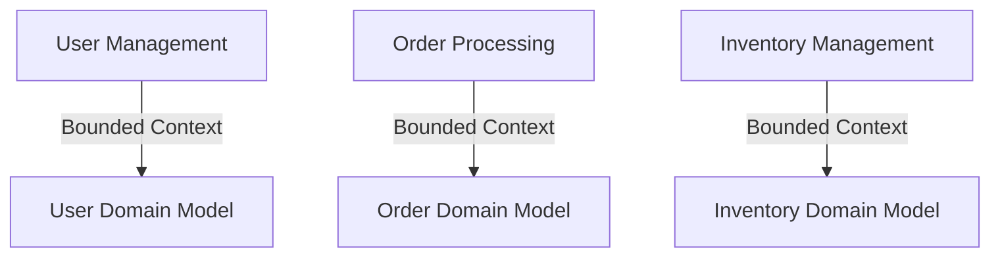

## 4.2. Decomposition by Subdomain (DDD)

In the realm of microservices architecture, Domain-Driven Design (DDD) offers a robust framework for decomposing complex systems into manageable, cohesive subdomains. This approach not only aligns technical architecture with business needs but also enhances communication between developers and domain experts. Let's delve into the core concepts of DDD, including bounded contexts, ubiquitous language, and the implementation of aggregates and entities, all illustrated with pseudocode examples.

### Domain-Driven Design Concepts

#### Bounded Contexts

A bounded context is a central pattern in DDD that defines the boundaries within which a particular model is applicable. It encapsulates a specific domain model and its associated logic, ensuring that the terms and concepts used are consistent within that boundary. This separation helps prevent ambiguity and confusion when similar terms have different meanings in different parts of the system.

**Visualizing Bounded Contexts**



*Description:* This diagram illustrates three distinct bounded contexts: User Management, Order Processing, and Inventory Management, each with its own domain model.

#### Ubiquitous Language

Ubiquitous language is a shared language between developers and domain experts that is used consistently within a bounded context. It ensures that everyone involved in the project has a common understanding of the domain, reducing miscommunication and errors.

**Implementing Ubiquitous Language**

To implement ubiquitous language, engage in regular discussions with domain experts to refine the terminology used in the codebase. Document these terms and ensure they are reflected in the code, documentation, and communication.

### Implementing DDD in Microservices

#### Defining Aggregates and Entities

**Aggregates** are clusters of domain objects that can be treated as a single unit. Each aggregate has a root entity, known as the aggregate root, which is responsible for maintaining the integrity of the aggregate. **Entities** are objects that have a distinct identity that runs through time and different states.

**Example of Aggregates and Entities**

Consider an e-commerce system where an `Order` is an aggregate. The `Order` aggregate might consist of entities like `OrderItem` and `Payment`.

```pseudocode
// Aggregate Root: Order
class Order {
    id: OrderID
    items: List<OrderItem>
    payment: Payment

    function addItem(item: OrderItem) {
        // Logic to add item
    }

    function processPayment(payment: Payment) {
        // Logic to process payment
    }
}

// Entity: OrderItem
class OrderItem {
    id: ItemID
    product: Product
    quantity: Integer
    price: Money
}

// Entity: Payment
class Payment {
    id: PaymentID
    amount: Money
    method: PaymentMethod
}
```

*Explanation:* The `Order` class is the aggregate root, managing the lifecycle of `OrderItem` and `Payment` entities.

### Pseudocode Implementation

#### Representing Domains in Code

When representing domains in code, ensure that each bounded context is encapsulated within its own module or service. This separation allows for independent development and deployment, aligning with microservices principles.

**Example of Domain Representation**

```pseudocode
// Bounded Context: User Management
module UserManagement {
    class User {
        id: UserID
        name: String
        email: String

        function changeEmail(newEmail: String) {
            // Logic to change email
        }
    }

    class UserService {
        function registerUser(user: User) {
            // Logic to register user
        }

        function getUserById(userId: UserID): User {
            // Logic to retrieve user
        }
    }
}
```

*Explanation:* The `UserManagement` module encapsulates the `User` entity and `UserService`, ensuring that user-related logic is contained within this bounded context.

### Try It Yourself

To deepen your understanding, try modifying the pseudocode examples to include additional entities or services. For instance, add a `Shipping` entity to the `Order` aggregate or implement a `NotificationService` within the `UserManagement` module.

### Design Considerations

When decomposing by subdomain using DDD, consider the following:

- **Consistency vs. Autonomy:** Ensure that each bounded context maintains its own consistency while allowing for autonomy in development and deployment.
- **Communication:** Establish clear communication channels between teams working on different bounded contexts to ensure alignment and avoid integration issues.
- **Scalability:** Design aggregates to be scalable, ensuring that they can handle increased load without compromising performance.

### Differences and Similarities

DDD is often compared to other architectural patterns like Service-Oriented Architecture (SOA). While both emphasize modularity, DDD focuses more on aligning the architecture with business domains, whereas SOA emphasizes service reuse and integration.

### Knowledge Check

- Explain the role of bounded contexts in DDD.
- Describe how ubiquitous language improves communication in a project.
- Identify the components of an aggregate in DDD.

### Embrace the Journey

Remember, mastering DDD and microservices decomposition is a journey. As you continue to explore these concepts, you'll gain deeper insights into how to design systems that are both robust and aligned with business needs. Keep experimenting, stay curious, and enjoy the process!

## Quiz Time!



### What is a bounded context in DDD?

- [x] A boundary within which a particular domain model is applicable.
- [ ] A shared database for all microservices.
- [ ] A centralized service for managing all domain logic.
- [ ] A method for scaling microservices.

> **Explanation:** A bounded context defines the boundaries within which a specific domain model is applicable, ensuring consistency and clarity within that boundary.

### What is the purpose of ubiquitous language in DDD?

- [x] To create a shared language between developers and domain experts.
- [ ] To enforce strict coding standards.
- [ ] To define database schemas.
- [ ] To manage service orchestration.

> **Explanation:** Ubiquitous language is used to create a shared understanding between developers and domain experts, reducing miscommunication and errors.

### What is an aggregate in DDD?

- [x] A cluster of domain objects treated as a single unit.
- [ ] A collection of microservices.
- [ ] A database schema.
- [ ] A network protocol.

> **Explanation:** An aggregate is a cluster of domain objects that can be treated as a single unit, with an aggregate root managing its lifecycle.

### Which of the following is an example of an entity in DDD?

- [x] OrderItem
- [ ] UserService
- [ ] PaymentMethod
- [ ] DatabaseConnection

> **Explanation:** `OrderItem` is an example of an entity, as it has a distinct identity and is part of an aggregate.

### How does DDD align with microservices architecture?

- [x] By decomposing systems into bounded contexts that align with business domains.
- [ ] By enforcing a single database for all services.
- [ ] By centralizing all business logic in one service.
- [ ] By using a monolithic architecture.

> **Explanation:** DDD aligns with microservices by decomposing systems into bounded contexts that reflect business domains, allowing for modular and scalable architectures.

### What is the role of an aggregate root in DDD?

- [x] To manage the lifecycle of an aggregate.
- [ ] To serve as a database connection.
- [ ] To handle network requests.
- [ ] To define user interfaces.

> **Explanation:** The aggregate root is responsible for managing the lifecycle of an aggregate, ensuring its integrity and consistency.

### What is a key benefit of using bounded contexts?

- [x] They prevent ambiguity and confusion by defining clear boundaries for domain models.
- [ ] They allow for unlimited scalability.
- [ ] They eliminate the need for testing.
- [ ] They centralize all business logic.

> **Explanation:** Bounded contexts prevent ambiguity by defining clear boundaries for domain models, ensuring consistency within those boundaries.

### How can you implement ubiquitous language in a project?

- [x] By engaging in regular discussions with domain experts and reflecting the language in the code.
- [ ] By enforcing strict coding standards.
- [ ] By centralizing all documentation.
- [ ] By using a single programming language.

> **Explanation:** Implementing ubiquitous language involves engaging with domain experts to refine terminology and ensuring it is reflected in the code and documentation.

### What is a common challenge when using DDD in microservices?

- [x] Ensuring consistency while allowing for autonomy in development and deployment.
- [ ] Managing a single database for all services.
- [ ] Centralizing all business logic.
- [ ] Eliminating the need for testing.

> **Explanation:** A common challenge in DDD is balancing consistency within bounded contexts while allowing for autonomy in development and deployment.

### True or False: DDD is only applicable to large-scale systems.

- [x] False
- [ ] True

> **Explanation:** DDD can be applied to systems of various sizes, not just large-scale systems. It is a methodology that helps align technical architecture with business domains, regardless of the system's size.



As you continue your journey in mastering microservices and DDD, remember that practice and experimentation are key. Keep exploring, stay curious, and enjoy the process of building robust, scalable systems!
