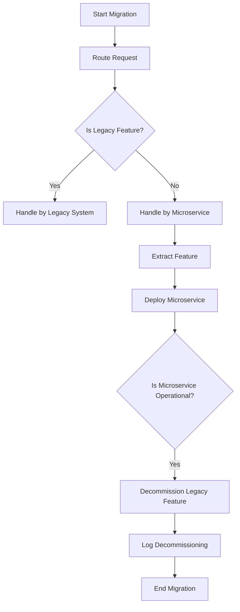

## 4.3. Strangler Fig Pattern

The Strangler Fig Pattern is a powerful and strategic approach for incrementally migrating from monolithic systems to microservices architecture. This pattern is inspired by the strangler fig tree, which grows around an existing tree and eventually replaces it. Similarly, the Strangler Fig Pattern allows new microservices to gradually replace parts of a legacy system until the old system can be completely decommissioned. This approach minimizes risk and disruption, making it an attractive option for organizations looking to modernize their software architecture.

### Incremental Migration Strategy

The Strangler Fig Pattern is an incremental migration strategy that involves gradually replacing legacy systems with microservices. This approach allows organizations to transition to a modern architecture without the need for a complete system overhaul. By incrementally migrating functionality, teams can manage risk, reduce downtime, and ensure a smoother transition.

#### Key Concepts

- **Incremental Replacement**: Replace parts of the legacy system with microservices one at a time.
- **Parallel Operation**: Run the legacy system and new microservices in parallel during the transition.
- **Feature Parity**: Ensure new microservices replicate the functionality of the legacy system before decommissioning.

### Implementation Steps

Implementing the Strangler Fig Pattern involves several key steps, each of which plays a crucial role in the successful migration from a monolithic system to microservices. Let's explore these steps in detail:

#### 1. Routing

The first step in implementing the Strangler Fig Pattern is to establish a routing mechanism that directs requests to either the legacy system or the new microservices. This routing layer acts as a gateway, determining which part of the system should handle incoming requests based on predefined rules.

**Pseudocode Example: Routing Layer**

```pseudocode
function routeRequest(request):
    if isLegacyFeature(request):
        return legacySystem.handle(request)
    else:
        return microservice.handle(request)
```

- **Explanation**: The `routeRequest` function checks whether the requested feature is part of the legacy system or has been migrated to a microservice. It then routes the request to the appropriate handler.

#### 2. Feature Extraction

Once the routing mechanism is in place, the next step is to extract features from the legacy system and implement them as independent microservices. This involves identifying discrete functionalities within the monolith and designing microservices that replicate these functionalities.

**Pseudocode Example: Feature Extraction**

```pseudocode
function extractFeature(featureName):
    featureCode = legacySystem.getFeatureCode(featureName)
    microservice = createMicroservice(featureCode)
    deployMicroservice(microservice)
```

- **Explanation**: The `extractFeature` function retrieves the code for a specific feature from the legacy system, creates a new microservice with this code, and deploys it.

#### 3. Decommissioning

After successfully migrating and deploying microservices for all necessary features, the final step is to decommission the legacy system. This involves gradually shutting down parts of the monolith as their corresponding microservices become fully operational.

**Pseudocode Example: Decommissioning**

```pseudocode
function decommissionLegacyFeature(featureName):
    if microservice.isOperational(featureName):
        legacySystem.disableFeature(featureName)
        log("Feature " + featureName + " decommissioned.")
```

- **Explanation**: The `decommissionLegacyFeature` function checks if the microservice for a specific feature is operational. If so, it disables the feature in the legacy system and logs the decommissioning.

### Pseudocode Examples

Let's explore a comprehensive pseudocode example that demonstrates the transition from a monolithic system to microservices using the Strangler Fig Pattern.

**Pseudocode Example: Transitioning from Monolith to Microservices**

```pseudocode
// Define the routing layer
function routeRequest(request):
    if isLegacyFeature(request):
        return legacySystem.handle(request)
    else:
        return microservice.handle(request)

// Extract features from the legacy system
function extractFeature(featureName):
    featureCode = legacySystem.getFeatureCode(featureName)
    microservice = createMicroservice(featureCode)
    deployMicroservice(microservice)

// Decommission legacy features
function decommissionLegacyFeature(featureName):
    if microservice.isOperational(featureName):
        legacySystem.disableFeature(featureName)
        log("Feature " + featureName + " decommissioned.")

// Main migration process
function migrateToMicroservices(features):
    for feature in features:
        extractFeature(feature)
        routeRequest(feature)

    for feature in features:
        decommissionLegacyFeature(feature)

// Example usage
featuresToMigrate = ["UserManagement", "OrderProcessing", "Inventory"]
migrateToMicroservices(featuresToMigrate)
```

- **Explanation**: This pseudocode outlines the entire migration process using the Strangler Fig Pattern. It defines the routing layer, extracts features from the legacy system, and decommissions them once their corresponding microservices are operational.

### Visualizing the Strangler Fig Pattern

To better understand the Strangler Fig Pattern, let's visualize the process using a flowchart. This diagram illustrates the key steps involved in the migration from a monolithic system to microservices.



- **Description**: This flowchart represents the migration process using the Strangler Fig Pattern. It shows how requests are routed, features are extracted and deployed as microservices, and legacy features are decommissioned.

### Key Participants

The Strangler Fig Pattern involves several key participants, each playing a crucial role in the migration process:

- **Legacy System**: The existing monolithic system that is being incrementally replaced by microservices.
- **Microservices**: The new, independent services that replicate the functionality of the legacy system.
- **Routing Layer**: The gateway that directs requests to either the legacy system or the microservices.
- **Development Team**: The team responsible for extracting features, developing microservices, and managing the migration process.

### Applicability

The Strangler Fig Pattern is applicable in various scenarios, particularly when organizations need to modernize their software architecture without disrupting existing operations. It is especially useful when:

- The legacy system is large and complex, making a complete rewrite impractical.
- There is a need to minimize downtime and risk during the migration process.
- The organization wants to gradually adopt microservices while maintaining existing functionality.

### Design Considerations

When implementing the Strangler Fig Pattern, consider the following design considerations:

- **Feature Identification**: Carefully identify and prioritize features for migration based on business needs and technical feasibility.
- **Parallel Operation**: Ensure the legacy system and microservices can operate in parallel without conflicts.
- **Testing and Validation**: Thoroughly test new microservices to ensure they replicate the functionality of the legacy system.
- **Monitoring and Logging**: Implement monitoring and logging to track the performance and reliability of both the legacy system and microservices.

### Differences and Similarities

The Strangler Fig Pattern is often compared to other migration strategies, such as the Big Bang approach. Here are some key differences and similarities:

- **Incremental vs. Complete Migration**: The Strangler Fig Pattern focuses on incremental migration, while the Big Bang approach involves a complete system overhaul.
- **Risk Management**: The Strangler Fig Pattern minimizes risk by allowing parallel operation, whereas the Big Bang approach carries a higher risk of disruption.
- **Complexity**: The Strangler Fig Pattern can be more complex to implement due to the need for routing and parallel operation, but it offers greater flexibility and control.

### Try It Yourself

To gain a deeper understanding of the Strangler Fig Pattern, try experimenting with the pseudocode examples provided. Here are some suggestions for modifications:

- **Add New Features**: Extend the pseudocode to include additional features for migration.
- **Enhance Routing Logic**: Modify the routing logic to handle more complex scenarios.
- **Implement Monitoring**: Add monitoring and logging capabilities to track the performance of microservices.

### Conclusion

The Strangler Fig Pattern is a valuable strategy for organizations looking to modernize their software architecture by incrementally migrating from monolithic systems to microservices. By following the implementation steps outlined in this guide and experimenting with the provided pseudocode examples, you can successfully transition to a modern, scalable, and flexible architecture.

Remember, this is just the beginning. As you progress, you'll build more complex and interactive systems. Keep experimenting, stay curious, and enjoy the journey!

## Quiz Time!



### What is the primary goal of the Strangler Fig Pattern?

- [x] Incrementally migrate from a monolithic system to microservices
- [ ] Completely rewrite the legacy system in one go
- [ ] Maintain the legacy system indefinitely
- [ ] Merge multiple microservices into a monolithic system

> **Explanation:** The Strangler Fig Pattern aims to incrementally migrate from a monolithic system to microservices, allowing for a gradual transition.

### Which of the following is a key step in implementing the Strangler Fig Pattern?

- [x] Routing
- [ ] Complete system rewrite
- [ ] Feature deprecation
- [ ] Monolithic expansion

> **Explanation:** Routing is a key step in the Strangler Fig Pattern, as it directs requests to either the legacy system or the new microservices.

### What role does the routing layer play in the Strangler Fig Pattern?

- [x] Directs requests to the appropriate system (legacy or microservices)
- [ ] Handles all data storage operations
- [ ] Manages user authentication
- [ ] Performs data analysis

> **Explanation:** The routing layer directs requests to the appropriate system, ensuring that features are handled by either the legacy system or the new microservices.

### How does the Strangler Fig Pattern minimize risk during migration?

- [x] By allowing parallel operation of the legacy system and microservices
- [ ] By completely shutting down the legacy system
- [ ] By merging all features into a single microservice
- [ ] By ignoring legacy system functionality

> **Explanation:** The Strangler Fig Pattern minimizes risk by allowing the legacy system and microservices to operate in parallel during the migration process.

### What is a potential challenge when implementing the Strangler Fig Pattern?

- [x] Ensuring feature parity between the legacy system and microservices
- [ ] Completely rewriting the legacy system
- [ ] Maintaining a monolithic architecture
- [ ] Ignoring user feedback

> **Explanation:** Ensuring feature parity between the legacy system and microservices is a potential challenge, as it requires careful planning and testing.

### Which of the following is NOT a benefit of the Strangler Fig Pattern?

- [ ] Incremental migration
- [x] Immediate cost savings
- [ ] Reduced risk of disruption
- [ ] Flexibility in feature migration

> **Explanation:** Immediate cost savings are not a guaranteed benefit of the Strangler Fig Pattern, as the focus is on incremental migration and risk reduction.

### What is the inspiration behind the name "Strangler Fig Pattern"?

- [x] The strangler fig tree, which grows around and eventually replaces another tree
- [ ] A type of software bug that strangles system performance
- [ ] A programming language feature that restricts code execution
- [ ] A network protocol for secure communication

> **Explanation:** The Strangler Fig Pattern is inspired by the strangler fig tree, which grows around and eventually replaces another tree, similar to how microservices replace a legacy system.

### In the Strangler Fig Pattern, what happens after a microservice becomes fully operational?

- [x] The corresponding legacy feature is decommissioned
- [ ] The microservice is merged back into the monolith
- [ ] The legacy system is expanded
- [ ] The microservice is shut down

> **Explanation:** Once a microservice becomes fully operational, the corresponding legacy feature is decommissioned, completing the migration for that feature.

### What is a key advantage of using the Strangler Fig Pattern over a Big Bang approach?

- [x] Reduced risk and disruption
- [ ] Faster migration process
- [ ] Complete system overhaul
- [ ] Simplified architecture

> **Explanation:** The Strangler Fig Pattern offers reduced risk and disruption compared to a Big Bang approach, as it allows for incremental migration.

### True or False: The Strangler Fig Pattern requires the legacy system to be completely shut down before any microservices can be deployed.

- [ ] True
- [x] False

> **Explanation:** False. The Strangler Fig Pattern allows for parallel operation of the legacy system and microservices, enabling incremental migration without complete shutdown.


