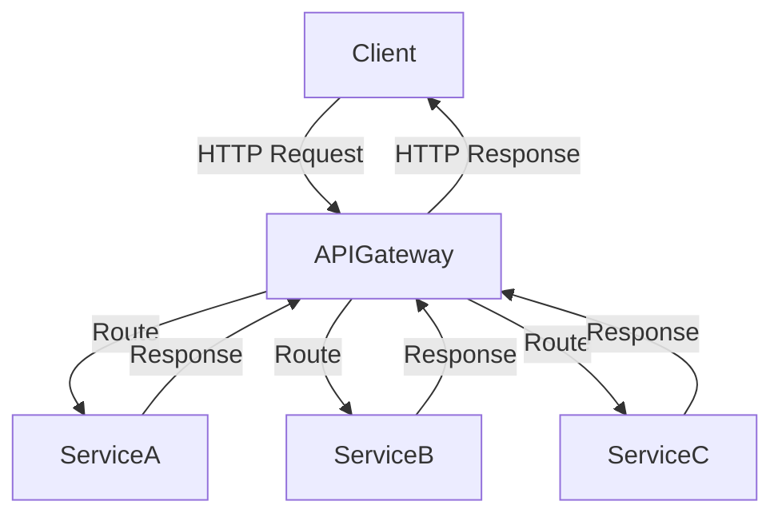

## 5.1. API Gateway Pattern

In the realm of microservices architecture, the API Gateway Pattern emerges as a pivotal design pattern that serves as a centralized entry point for managing client interactions. This pattern is instrumental in routing requests, handling authentication, and translating protocols, thereby simplifying the complexities associated with direct client-to-service communications. In this section, we will delve into the intricacies of the API Gateway Pattern, exploring its functions, implementation, and the benefits it brings to a microservices ecosystem.

### Centralized Entry Point

The API Gateway acts as a single entry point for all client requests, effectively decoupling the client interface from the backend microservices. This centralization offers several advantages:

- **Simplified Client Interactions**: Clients interact with a single endpoint rather than multiple services, reducing complexity.
- **Unified Security**: Security measures such as authentication and authorization can be centralized, ensuring consistent enforcement across all services.
- **Protocol Translation**: The gateway can translate between different protocols, allowing clients to use a uniform protocol regardless of the backend service implementations.

#### Visualizing the API Gateway Architecture

To better understand the role of an API Gateway, let's visualize its position within a microservices architecture:



**Figure 1: API Gateway as a Centralized Entry Point**

In this diagram, the API Gateway serves as the intermediary between clients and services, managing the flow of requests and responses.

### Functions of an API Gateway

The API Gateway Pattern encompasses several critical functions that enhance the efficiency and security of microservices architectures:

#### Routing

The API Gateway is responsible for routing incoming requests to the appropriate backend services. This involves:

- **Path-Based Routing**: Directing requests based on URL paths.
- **Load Balancing**: Distributing requests across multiple instances of a service to ensure high availability and performance.

#### Authentication and Authorization

Security is paramount in microservices, and the API Gateway plays a crucial role in enforcing it:

- **Authentication**: Verifying the identity of clients using mechanisms such as OAuth2 or JWT (JSON Web Tokens).
- **Authorization**: Ensuring clients have the necessary permissions to access specific resources.

#### Protocol Translation

Microservices may use different communication protocols. The API Gateway can translate these protocols, allowing clients to interact with services seamlessly:

- **HTTP to gRPC**: Converting HTTP requests to gRPC calls for services that use gRPC.
- **REST to SOAP**: Translating RESTful requests to SOAP for legacy services.

#### Request Aggregation

In some cases, a single client request may require data from multiple services. The API Gateway can aggregate these requests, reducing the number of client-server interactions:

- **Batch Requests**: Combining multiple requests into a single call.
- **Response Composition**: Merging responses from different services into a unified response.

### Pseudocode Implementation

To illustrate the implementation of an API Gateway, let's consider a pseudocode example that demonstrates its core functionalities:

```pseudocode
class APIGateway:
    def __init__(self):
        self.routes = {}
        self.auth_service = AuthenticationService()
        self.protocol_translator = ProtocolTranslator()

    def register_route(self, path, service):
        self.routes[path] = service

    def handle_request(self, request):
        # Authenticate the request
        if not self.auth_service.authenticate(request):
            return "401 Unauthorized"

        # Route the request to the appropriate service
        service = self.routes.get(request.path)
        if not service:
            return "404 Not Found"

        # Translate protocol if necessary
        translated_request = self.protocol_translator.translate(request)

        # Forward the request to the service
        response = service.handle_request(translated_request)

        # Aggregate responses if needed
        aggregated_response = self.aggregate_responses(response)

        return aggregated_response

    def aggregate_responses(self, response):
        # Logic to combine multiple service responses
        return response
```

**Explanation of Pseudocode:**

- **Initialization**: The `APIGateway` class initializes with a set of routes, an authentication service, and a protocol translator.
- **Route Registration**: The `register_route` method maps URL paths to backend services.
- **Request Handling**: The `handle_request` method authenticates requests, routes them to the appropriate service, translates protocols, and aggregates responses if necessary.

### Design Considerations

When implementing an API Gateway, several design considerations must be taken into account:

- **Scalability**: Ensure the gateway can handle a high volume of requests without becoming a bottleneck.
- **Security**: Implement robust security measures to protect against threats such as DDoS attacks.
- **Fault Tolerance**: Design the gateway to gracefully handle failures and ensure service continuity.
- **Performance**: Optimize the gateway for low latency and high throughput.

### Programming Language Specifics

While the pseudocode provides a language-agnostic overview, specific programming languages offer libraries and frameworks to facilitate API Gateway implementation:

- **Java**: Use Spring Cloud Gateway for building API gateways with features like routing, filtering, and load balancing.
- **Node.js**: Leverage Express.js or Fastify to create lightweight API gateways with middleware support.
- **Python**: Utilize Flask or FastAPI to build API gateways with asynchronous capabilities.

### Differences and Similarities

The API Gateway Pattern is often compared to the **Service Mesh Pattern**, which also manages service-to-service communication. However, there are key differences:

- **API Gateway**: Focuses on client-to-service interactions, handling routing, authentication, and protocol translation.
- **Service Mesh**: Manages service-to-service communication, providing features like load balancing, encryption, and observability.

### Try It Yourself

To deepen your understanding, try modifying the pseudocode example:

- **Add New Routes**: Extend the `register_route` method to support dynamic route registration.
- **Implement Caching**: Introduce a caching mechanism to store frequently accessed responses.
- **Enhance Security**: Integrate additional security features such as rate limiting or IP whitelisting.

### Knowledge Check

Let's reinforce your understanding with a few questions:

- What are the primary functions of an API Gateway?
- How does the API Gateway enhance security in a microservices architecture?
- What are the differences between the API Gateway Pattern and the Service Mesh Pattern?

### Embrace the Journey

Remember, mastering the API Gateway Pattern is a journey. As you continue to explore microservices architecture, you'll discover new ways to optimize and secure your systems. Stay curious, keep experimenting, and enjoy the process!

## Quiz Time!



### What is the primary role of an API Gateway in microservices architecture?

- [x] Centralized entry point for managing client interactions
- [ ] Direct communication between services
- [ ] Database management
- [ ] User interface rendering

> **Explanation:** The API Gateway acts as a centralized entry point, managing client interactions, routing requests, and handling authentication.

### Which of the following is NOT a function of an API Gateway?

- [ ] Routing
- [ ] Authentication
- [ ] Protocol Translation
- [x] Data Storage

> **Explanation:** Data storage is not a function of an API Gateway. It focuses on routing, authentication, and protocol translation.

### How does an API Gateway enhance security?

- [x] Centralizes authentication and authorization
- [ ] Directly connects clients to databases
- [ ] Manages service-to-service encryption
- [ ] Provides user interface components

> **Explanation:** The API Gateway centralizes authentication and authorization, ensuring consistent security measures across services.

### What is the benefit of protocol translation in an API Gateway?

- [x] Allows clients to use a uniform protocol
- [ ] Increases data storage capacity
- [ ] Enhances user interface design
- [ ] Reduces server load

> **Explanation:** Protocol translation allows clients to use a uniform protocol, regardless of the backend service implementations.

### Which pattern is often compared to the API Gateway Pattern?

- [ ] Singleton Pattern
- [ ] Observer Pattern
- [x] Service Mesh Pattern
- [ ] Factory Pattern

> **Explanation:** The Service Mesh Pattern is often compared to the API Gateway Pattern, as both manage communication in microservices.

### What is a key difference between an API Gateway and a Service Mesh?

- [x] API Gateway focuses on client-to-service interactions
- [ ] Service Mesh handles user interface rendering
- [ ] API Gateway manages database connections
- [ ] Service Mesh centralizes authentication

> **Explanation:** The API Gateway focuses on client-to-service interactions, while the Service Mesh manages service-to-service communication.

### How can an API Gateway improve performance?

- [x] By implementing caching mechanisms
- [ ] By increasing database size
- [ ] By adding more user interface components
- [ ] By reducing security measures

> **Explanation:** Implementing caching mechanisms in an API Gateway can improve performance by storing frequently accessed responses.

### What is a potential challenge when implementing an API Gateway?

- [x] Scalability
- [ ] User interface design
- [ ] Database schema management
- [ ] Client-side scripting

> **Explanation:** Scalability is a potential challenge, as the gateway must handle a high volume of requests without becoming a bottleneck.

### True or False: An API Gateway can aggregate responses from multiple services.

- [x] True
- [ ] False

> **Explanation:** True. An API Gateway can aggregate responses from multiple services, reducing the number of client-server interactions.

### What is a common security feature implemented in an API Gateway?

- [x] Rate limiting
- [ ] User interface customization
- [ ] Database replication
- [ ] Client-side rendering

> **Explanation:** Rate limiting is a common security feature in an API Gateway, helping to prevent abuse and ensure fair usage.


