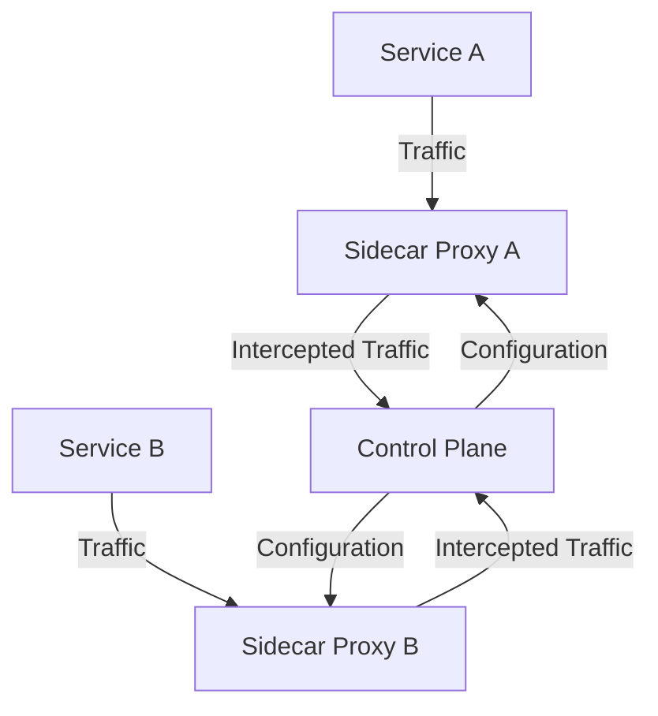

## 5.2. Service Mesh Pattern

In the realm of microservices architecture, managing the communication between services is a critical aspect that can significantly impact the system's performance, security, and reliability. The Service Mesh Pattern emerges as a sophisticated solution to address these challenges, providing a dedicated infrastructure layer for handling service-to-service communication. This section delves into the intricacies of the Service Mesh Pattern, exploring its features, implementation, and benefits through detailed explanations and pseudocode examples.

### Managing Service-to-Service Communication

A service mesh is a dedicated infrastructure layer that facilitates service-to-service communication within a microservices architecture. It abstracts the complexity of managing communication, allowing developers to focus on business logic rather than the intricacies of network management. The service mesh typically consists of a data plane and a control plane:

- **Data Plane**: Manages the communication between services, often implemented using sidecar proxies that intercept and manage traffic.
- **Control Plane**: Provides configuration and management capabilities, allowing operators to define policies and monitor the system.

#### Using Sidecar Proxies

The sidecar proxy is a fundamental component of the service mesh architecture. It is deployed alongside each service instance, intercepting all incoming and outgoing network traffic. This approach offers several advantages:

- **Decoupling**: By separating the communication logic from the application code, sidecar proxies enable independent evolution and scaling of services.
- **Consistency**: Ensures uniform application of policies across all services, enhancing security and reliability.
- **Observability**: Provides detailed insights into service interactions, facilitating monitoring and troubleshooting.

Let's explore a pseudocode example to illustrate how sidecar proxies manage service-to-service communication:

```pseudocode
// Define a service mesh configuration
ServiceMeshConfig {
    services: List<Service>
    policies: List<Policy>
}

// Define a service with a sidecar proxy
Service {
    name: String
    sidecarProxy: SidecarProxy
}

// Define a sidecar proxy
SidecarProxy {
    interceptTraffic(service: Service) {
        // Intercept incoming and outgoing traffic
        logTraffic(service)
        applyPolicies(service)
        forwardTraffic(service)
    }
}

// Define a policy
Policy {
    name: String
    apply(service: Service) {
        // Apply security and routing policies
        enforceSecurity(service)
        routeTraffic(service)
    }
}

// Example usage
meshConfig = ServiceMeshConfig()
serviceA = Service(name="ServiceA", sidecarProxy=SidecarProxy())
serviceB = Service(name="ServiceB", sidecarProxy=SidecarProxy())

meshConfig.services.add(serviceA)
meshConfig.services.add(serviceB)

serviceA.sidecarProxy.interceptTraffic(serviceA)
serviceB.sidecarProxy.interceptTraffic(serviceB)
```

### Features of Service Mesh

The Service Mesh Pattern offers a rich set of features that enhance the communication capabilities of microservices architectures. Key features include load balancing, encryption, and observability.

#### Load Balancing

Load balancing is crucial for distributing incoming traffic across multiple service instances, ensuring optimal resource utilization and high availability. The service mesh can dynamically adjust load balancing strategies based on real-time metrics, such as response times and error rates.

```pseudocode
// Define a load balancer
LoadBalancer {
    balanceTraffic(service: Service) {
        // Distribute traffic across instances
        instances = getAvailableInstances(service)
        selectedInstance = selectInstance(instances)
        forwardRequest(selectedInstance)
    }
}

// Example usage
loadBalancer = LoadBalancer()
loadBalancer.balanceTraffic(serviceA)
```

#### Encryption

Security is a paramount concern in microservices architectures. The service mesh provides built-in encryption capabilities, ensuring that all communication between services is secure. This is typically achieved through mutual TLS (mTLS), which authenticates both the client and server, encrypting the data in transit.

```pseudocode
// Define an encryption policy
EncryptionPolicy {
    apply(service: Service) {
        // Enable mutual TLS
        enableMTLS(service)
    }
}

// Example usage
encryptionPolicy = EncryptionPolicy()
encryptionPolicy.apply(serviceA)
encryptionPolicy.apply(serviceB)
```

#### Observability

Observability is essential for understanding the behavior of microservices and diagnosing issues. The service mesh provides comprehensive observability features, including metrics collection, distributed tracing, and logging. These capabilities enable operators to gain insights into service performance and identify bottlenecks.

```pseudocode
// Define an observability configuration
ObservabilityConfig {
    enableMetrics(service: Service) {
        // Collect performance metrics
        collectMetrics(service)
    }
    enableTracing(service: Service) {
        // Enable distributed tracing
        traceRequests(service)
    }
    enableLogging(service: Service) {
        // Log service interactions
        logInteractions(service)
    }
}

// Example usage
observabilityConfig = ObservabilityConfig()
observabilityConfig.enableMetrics(serviceA)
observabilityConfig.enableTracing(serviceA)
observabilityConfig.enableLogging(serviceA)
```

### Configuring Service Mesh Interactions

Configuring a service mesh involves defining the policies and settings that govern service interactions. This includes specifying routing rules, security policies, and observability settings. The control plane provides a centralized interface for managing these configurations, ensuring consistency across the system.

#### Pseudocode Example: Configuring a Service Mesh

```pseudocode
// Define a service mesh configuration
ServiceMeshConfig {
    services: List<Service>
    policies: List<Policy>
    observability: ObservabilityConfig
}

// Configure routing policies
RoutingPolicy {
    apply(service: Service) {
        // Define routing rules
        setRoutingRules(service)
    }
}

// Configure security policies
SecurityPolicy {
    apply(service: Service) {
        // Define security rules
        setSecurityRules(service)
    }
}

// Example usage
meshConfig = ServiceMeshConfig()
routingPolicy = RoutingPolicy()
securityPolicy = SecurityPolicy()

routingPolicy.apply(serviceA)
securityPolicy.apply(serviceA)

meshConfig.policies.add(routingPolicy)
meshConfig.policies.add(securityPolicy)
```

### Visualizing Service Mesh Architecture

To better understand the service mesh architecture, let's visualize the components and their interactions using a Mermaid.js diagram.



**Diagram Description**: This diagram illustrates the service mesh architecture, where each service (Service A and Service B) is paired with a sidecar proxy (Sidecar Proxy A and Sidecar Proxy B). The control plane manages the configuration and policies applied by the sidecar proxies.

### Key Participants

In a service mesh architecture, several key participants play crucial roles:

- **Services**: The microservices that require communication management.
- **Sidecar Proxies**: Deployed alongside each service, intercepting and managing traffic.
- **Control Plane**: Provides configuration and management capabilities for the service mesh.
- **Policies**: Define the rules and settings for routing, security, and observability.

### Applicability

The Service Mesh Pattern is particularly beneficial in scenarios where:

- **Complex Communication**: The system involves complex service-to-service communication that requires advanced management.
- **Security Requirements**: There is a need for robust security measures, such as encryption and authentication.
- **Observability Needs**: Detailed insights into service interactions and performance are required for monitoring and troubleshooting.

### Design Considerations

When implementing a service mesh, consider the following:

- **Performance Overhead**: The introduction of sidecar proxies can introduce latency and resource overhead. It's important to monitor and optimize performance.
- **Complexity**: The service mesh adds an additional layer of complexity to the architecture. Ensure that the benefits outweigh the complexity introduced.
- **Compatibility**: Ensure that the service mesh is compatible with the existing infrastructure and technologies used in the system.

### Programming Language Specifics

While the service mesh pattern is language-agnostic, certain programming languages may offer specific libraries or frameworks that facilitate integration with service mesh solutions. For example, Java applications might leverage Spring Cloud for seamless integration with service meshes like Istio.

### Differences and Similarities

The Service Mesh Pattern is often compared to the API Gateway Pattern. While both patterns manage communication, they serve different purposes:

- **Service Mesh**: Focuses on service-to-service communication, providing features like load balancing, encryption, and observability.
- **API Gateway**: Manages client-to-service communication, handling tasks like authentication, routing, and protocol translation.

### Try It Yourself

To deepen your understanding of the Service Mesh Pattern, try experimenting with the pseudocode examples provided. Consider modifying the policies or adding new services to observe how the service mesh manages communication. This hands-on approach will reinforce the concepts discussed and provide practical insights into the pattern's implementation.

### References and Links

For further reading on service mesh architecture and implementation, consider exploring the following resources:

- [Istio Documentation](https://istio.io/docs/)
- [Linkerd Documentation](https://linkerd.io/2.11/getting-started/)
- [Envoy Proxy](https://www.envoyproxy.io/)

### Knowledge Check

To reinforce your understanding of the Service Mesh Pattern, consider the following questions:

- What are the key components of a service mesh architecture?
- How do sidecar proxies enhance service-to-service communication?
- What are the benefits of using a service mesh in a microservices architecture?

### Embrace the Journey

Remember, mastering the Service Mesh Pattern is a journey. As you explore and experiment with the concepts discussed, you'll gain valuable insights into managing communication in microservices architectures. Keep experimenting, stay curious, and enjoy the journey!

## Quiz Time!



### What is the primary role of a sidecar proxy in a service mesh?

- [x] Intercept and manage service-to-service communication
- [ ] Provide client-to-service communication
- [ ] Store service data
- [ ] Manage service deployment

> **Explanation:** The sidecar proxy intercepts and manages service-to-service communication, providing features like load balancing and encryption.

### Which component of the service mesh provides configuration and management capabilities?

- [x] Control Plane
- [ ] Data Plane
- [ ] Sidecar Proxy
- [ ] Service

> **Explanation:** The control plane provides configuration and management capabilities, allowing operators to define policies and monitor the system.

### What is a key benefit of using a service mesh in microservices architecture?

- [x] Enhanced security through encryption
- [ ] Simplified client-to-service communication
- [ ] Reduced need for service monitoring
- [ ] Increased service data storage

> **Explanation:** A service mesh enhances security by providing built-in encryption capabilities, such as mutual TLS.

### How does a service mesh improve observability?

- [x] By providing metrics collection, distributed tracing, and logging
- [ ] By storing service logs
- [ ] By reducing service interactions
- [ ] By simplifying service deployment

> **Explanation:** A service mesh improves observability by offering features like metrics collection, distributed tracing, and logging.

### What is the primary difference between a service mesh and an API gateway?

- [x] A service mesh manages service-to-service communication, while an API gateway manages client-to-service communication.
- [ ] A service mesh stores service data, while an API gateway stores client data.
- [ ] A service mesh simplifies service deployment, while an API gateway simplifies client deployment.
- [ ] A service mesh reduces service interactions, while an API gateway reduces client interactions.

> **Explanation:** A service mesh focuses on managing service-to-service communication, while an API gateway handles client-to-service communication.

### Which feature of a service mesh helps in distributing incoming traffic across multiple service instances?

- [x] Load Balancing
- [ ] Encryption
- [ ] Observability
- [ ] Data Storage

> **Explanation:** Load balancing is a feature of a service mesh that helps distribute incoming traffic across multiple service instances.

### What is the role of the data plane in a service mesh?

- [x] Manages the communication between services
- [ ] Provides configuration and management capabilities
- [ ] Stores service data
- [ ] Manages service deployment

> **Explanation:** The data plane manages the communication between services, often implemented using sidecar proxies.

### How does a service mesh enhance security in microservices architecture?

- [x] By providing built-in encryption capabilities
- [ ] By storing service data securely
- [ ] By reducing service interactions
- [ ] By simplifying service deployment

> **Explanation:** A service mesh enhances security by providing built-in encryption capabilities, such as mutual TLS.

### What is a potential drawback of implementing a service mesh?

- [x] Performance overhead due to sidecar proxies
- [ ] Reduced security
- [ ] Simplified service interactions
- [ ] Increased service data storage

> **Explanation:** The introduction of sidecar proxies can introduce latency and resource overhead, which is a potential drawback of implementing a service mesh.

### True or False: A service mesh is primarily used for managing client-to-service communication.

- [ ] True
- [x] False

> **Explanation:** False. A service mesh is primarily used for managing service-to-service communication, not client-to-service communication.




