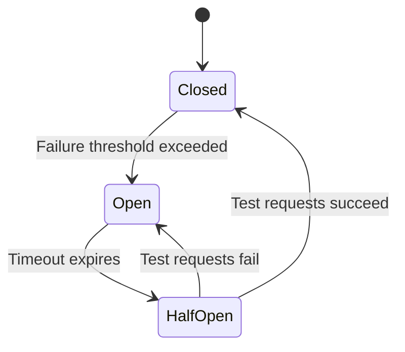
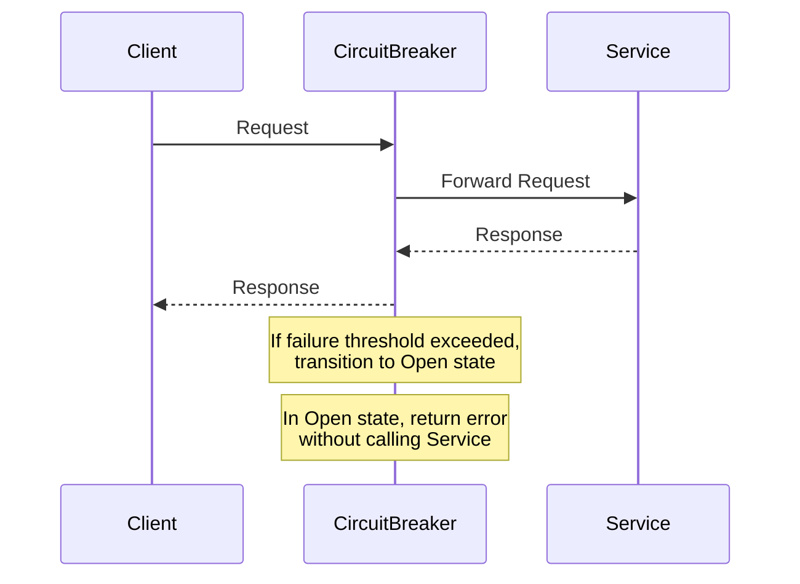

## 5.3. Circuit Breaker Pattern

In the world of microservices, where applications are composed of numerous interconnected services, ensuring resilience and fault tolerance is paramount. The Circuit Breaker Pattern is a critical design pattern that helps protect services from cascading failures, thereby maintaining the stability and reliability of the entire system. In this section, we will delve into the Circuit Breaker Pattern, exploring its purpose, states, transitions, and implementation through pseudocode examples.

### Protecting Services from Failure

Microservices architecture inherently involves multiple services communicating over a network. This distributed nature introduces the risk of failures, such as network latency, service unavailability, or unexpected errors. Without proper handling, these failures can propagate through the system, leading to cascading failures that degrade the overall performance and reliability of the application.

The Circuit Breaker Pattern acts as a protective mechanism, preventing such failures from spreading. It monitors the interactions between services and, upon detecting a failure, interrupts the communication to avoid further damage. By doing so, it ensures that the system remains responsive and can recover gracefully.

### States and Transitions

The Circuit Breaker Pattern operates through three primary states: Closed, Open, and Half-Open. Understanding these states and their transitions is crucial for implementing an effective circuit breaker.

#### Closed State

In the Closed state, the circuit breaker allows requests to pass through to the service. It monitors the success and failure rates of these requests. If the failure rate exceeds a predefined threshold within a specified time window, the circuit breaker transitions to the Open state.

#### Open State

When the circuit breaker is in the Open state, it blocks all requests to the service, immediately returning an error response. This state acts as a timeout period, allowing the service to recover from its failure. After a predefined timeout, the circuit breaker transitions to the Half-Open state to test if the service has recovered.

#### Half-Open State

In the Half-Open state, the circuit breaker allows a limited number of test requests to pass through to the service. If these requests succeed, the circuit breaker transitions back to the Closed state, indicating that the service has recovered. If the requests fail, the circuit breaker returns to the Open state.

#### State Transition Diagram

To visualize the state transitions of a circuit breaker, consider the following Mermaid.js diagram:



This diagram illustrates the flow between the different states of a circuit breaker, highlighting the conditions that trigger each transition.

### Pseudocode Implementation

Let's explore a pseudocode implementation of the Circuit Breaker Pattern. This example will demonstrate how to model the circuit breaker logic, including state transitions and request handling.

```pseudocode
class CircuitBreaker:
    def __init__(self, failure_threshold, recovery_timeout):
        self.failure_threshold = failure_threshold
        self.recovery_timeout = recovery_timeout
        self.state = "Closed"
        self.failure_count = 0
        self.last_failure_time = None

    def call_service(self, service_request):
        if self.state == "Open":
            if self._is_timeout_expired():
                self.state = "HalfOpen"
            else:
                return "Service Unavailable"

        response = self._execute_request(service_request)

        if response == "Success":
            self._reset()
            return response
        else:
            self._record_failure()
            if self.state == "HalfOpen":
                self.state = "Open"
            elif self.failure_count >= self.failure_threshold:
                self.state = "Open"
                self.last_failure_time = current_time()
            return "Service Unavailable"

    def _execute_request(self, service_request):
        # Simulate service request execution
        # Return "Success" or "Failure"
        pass

    def _record_failure(self):
        self.failure_count += 1

    def _reset(self):
        self.state = "Closed"
        self.failure_count = 0

    def _is_timeout_expired(self):
        return (current_time() - self.last_failure_time) >= self.recovery_timeout
```

#### Key Points in the Pseudocode

- **Initialization**: The circuit breaker is initialized with a failure threshold and a recovery timeout. These parameters determine when the circuit breaker transitions between states.
- **State Handling**: The `call_service` method handles requests based on the current state of the circuit breaker. It checks if the circuit breaker is in the Open state and whether the timeout has expired.
- **Failure Recording**: The `_record_failure` method increments the failure count each time a request fails. If the failure count exceeds the threshold, the circuit breaker transitions to the Open state.
- **Timeout Check**: The `_is_timeout_expired` method checks if the recovery timeout has expired, allowing the circuit breaker to transition from Open to Half-Open.

### Design Considerations

When implementing the Circuit Breaker Pattern, consider the following design considerations:

- **Threshold and Timeout Configuration**: Carefully configure the failure threshold and recovery timeout based on the specific requirements and behavior of your services. These parameters should balance between allowing sufficient recovery time and minimizing downtime.
- **Fallback Mechanisms**: Implement fallback mechanisms to handle requests when the circuit breaker is in the Open state. This could involve returning cached data, default responses, or redirecting requests to alternative services.
- **Monitoring and Alerts**: Integrate monitoring and alerting mechanisms to track the state of the circuit breaker and notify relevant teams in case of persistent failures.

### Try It Yourself

To gain a deeper understanding of the Circuit Breaker Pattern, try modifying the pseudocode example to experiment with different failure thresholds and recovery timeouts. Observe how these changes affect the behavior of the circuit breaker and its ability to handle failures.

### Visualizing Circuit Breaker Logic

To further illustrate the Circuit Breaker Pattern, consider the following sequence diagram, which depicts the interaction between a client, circuit breaker, and service:



This diagram provides a visual representation of how the circuit breaker mediates the interaction between a client and a service, ensuring resilience in the face of failures.

### References and Links

For further reading on the Circuit Breaker Pattern and its implementation in various programming languages, consider the following resources:

- [Martin Fowler's Circuit Breaker](https://martinfowler.com/bliki/CircuitBreaker.html)
- [Netflix Hystrix](https://github.com/Netflix/Hystrix)
- [Resilience4j](https://resilience4j.readme.io/docs/circuitbreaker)

### Knowledge Check

To reinforce your understanding of the Circuit Breaker Pattern, consider the following questions:

- What are the primary states of a circuit breaker, and what triggers transitions between them?
- How does the Circuit Breaker Pattern prevent cascading failures in a microservices architecture?
- What design considerations should be taken into account when implementing a circuit breaker?

### Embrace the Journey

Remember, mastering the Circuit Breaker Pattern is just one step in building resilient microservices. As you continue your journey, explore other patterns and techniques that contribute to the robustness and reliability of your applications. Keep experimenting, stay curious, and enjoy the process of learning and growing as a developer.

## Quiz Time!



### What is the primary purpose of the Circuit Breaker Pattern in microservices?

- [x] To prevent cascading failures
- [ ] To enhance data consistency
- [ ] To improve service discovery
- [ ] To optimize load balancing

> **Explanation:** The Circuit Breaker Pattern is designed to prevent cascading failures by interrupting communication between services when a failure is detected.

### Which state does the circuit breaker transition to when the failure threshold is exceeded?

- [ ] Closed
- [x] Open
- [ ] Half-Open
- [ ] Reset

> **Explanation:** When the failure threshold is exceeded, the circuit breaker transitions to the Open state, blocking further requests to the service.

### In which state does the circuit breaker allow a limited number of test requests?

- [ ] Closed
- [ ] Open
- [x] Half-Open
- [ ] Reset

> **Explanation:** In the Half-Open state, the circuit breaker allows a limited number of test requests to determine if the service has recovered.

### What happens when a circuit breaker is in the Open state?

- [x] Requests are blocked and an error is returned
- [ ] Requests are forwarded to the service
- [ ] Requests are cached for later processing
- [ ] Requests are redirected to a backup service

> **Explanation:** In the Open state, the circuit breaker blocks requests and returns an error, allowing the service time to recover.

### What should be considered when configuring a circuit breaker?

- [x] Failure threshold
- [x] Recovery timeout
- [ ] Service discovery mechanism
- [ ] Load balancing strategy

> **Explanation:** Configuring a circuit breaker involves setting the failure threshold and recovery timeout to balance recovery time and downtime.

### Which of the following is a benefit of using the Circuit Breaker Pattern?

- [x] Improved system resilience
- [ ] Enhanced data consistency
- [ ] Faster service discovery
- [ ] Reduced network latency

> **Explanation:** The Circuit Breaker Pattern improves system resilience by preventing cascading failures and allowing services to recover.

### What is a common fallback mechanism when a circuit breaker is in the Open state?

- [x] Returning cached data
- [ ] Forwarding requests to the service
- [x] Providing default responses
- [ ] Enhancing data consistency

> **Explanation:** Common fallback mechanisms include returning cached data or providing default responses when the circuit breaker is Open.

### How does the Circuit Breaker Pattern contribute to fault tolerance?

- [x] By interrupting communication during failures
- [ ] By enhancing data consistency
- [ ] By optimizing load balancing
- [ ] By improving service discovery

> **Explanation:** The Circuit Breaker Pattern contributes to fault tolerance by interrupting communication between services during failures.

### What is the role of monitoring and alerts in the Circuit Breaker Pattern?

- [x] To track the state of the circuit breaker
- [ ] To enhance data consistency
- [ ] To optimize load balancing
- [ ] To improve service discovery

> **Explanation:** Monitoring and alerts help track the state of the circuit breaker and notify teams of persistent failures.

### True or False: The Circuit Breaker Pattern can help improve the reliability of a microservices architecture.

- [x] True
- [ ] False

> **Explanation:** True. The Circuit Breaker Pattern improves reliability by preventing cascading failures and allowing services to recover.


