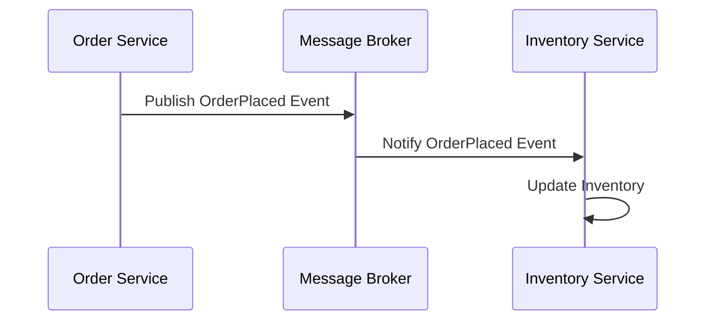

## 5.4. Event-Driven Communication

In the world of microservices, **event-driven communication** plays a pivotal role in enabling services to interact asynchronously. This pattern allows services to remain decoupled, enhancing scalability and flexibility. Let's delve into the core concepts, patterns, and practical implementations of event-driven communication in microservices.

### Asynchronous Messaging

**Asynchronous messaging** is a communication method where the sender and receiver do not need to interact with each other simultaneously. This decoupling allows services to operate independently, improving system resilience and scalability.

#### Key Concepts

- **Decoupling Services**: By using events, services can communicate without direct dependencies, allowing them to evolve independently.
- **Scalability**: Asynchronous messaging enables systems to handle varying loads by distributing messages across multiple consumers.
- **Resilience**: Systems can recover from failures more gracefully, as messages can be retried or redirected.

#### Example Scenario

Consider an e-commerce platform where an order service needs to notify an inventory service when a new order is placed. Instead of directly calling the inventory service, the order service can publish an "OrderPlaced" event. The inventory service, in turn, subscribes to this event and updates the stock accordingly.

### Messaging Patterns

Event-driven communication can be implemented using various messaging patterns. Two of the most common are **publish-subscribe** and **message queues**.

#### Publish-Subscribe Pattern

In the **publish-subscribe** pattern, messages are broadcast to multiple subscribers. This pattern is ideal for scenarios where multiple services need to react to the same event.

- **Publisher**: The service that emits events.
- **Subscriber**: The service that listens for and processes events.

##### Pseudocode Example

```pseudocode
// Publisher Service
function publishOrderPlacedEvent(orderId, customerId) {
    event = createEvent("OrderPlaced", { orderId: orderId, customerId: customerId })
    messageBroker.publish(event)
}

// Subscriber Service
function onOrderPlacedEvent(event) {
    orderId = event.data.orderId
    updateInventory(orderId)
}

// Message Broker
class MessageBroker {
    subscribers = []

    function subscribe(eventType, callback) {
        subscribers[eventType].append(callback)
    }

    function publish(event) {
        for callback in subscribers[event.type] {
            callback(event)
        }
    }
}
```

In this example, the `publishOrderPlacedEvent` function creates an event and sends it to a message broker. The broker then notifies all subscribers of the "OrderPlaced" event.

#### Message Queues

**Message queues** provide a mechanism for services to communicate by placing messages in a queue. This pattern is useful for load balancing and ensuring that messages are processed even if the consumer is temporarily unavailable.

- **Producer**: The service that sends messages to the queue.
- **Consumer**: The service that retrieves and processes messages from the queue.

##### Pseudocode Example

```pseudocode
// Producer Service
function sendOrderToQueue(order) {
    queue = getQueue("OrderQueue")
    queue.send(order)
}

// Consumer Service
function processOrderFromQueue() {
    queue = getQueue("OrderQueue")
    while (true) {
        order = queue.receive()
        processOrder(order)
    }
}

// Queue Implementation
class Queue {
    messages = []

    function send(message) {
        messages.append(message)
    }

    function receive() {
        if messages.isEmpty() {
            waitForMessage()
        }
        return messages.removeFirst()
    }
}
```

Here, the producer service sends orders to a queue, and the consumer service continuously processes orders from the queue.

### Implementing Event Producers and Consumers

To effectively implement event-driven communication, it's crucial to design robust event producers and consumers.

#### Event Producers

Event producers are responsible for generating and publishing events. They should:

- **Ensure Event Integrity**: Events should be well-structured and contain all necessary information.
- **Handle Failures Gracefully**: Implement retry mechanisms for failed event publications.

##### Pseudocode Example

```pseudocode
// Event Producer
function createAndPublishEvent(eventType, data) {
    event = createEvent(eventType, data)
    try {
        messageBroker.publish(event)
    } catch (error) {
        logError("Failed to publish event", error)
        retryPublish(event)
    }
}

function retryPublish(event) {
    maxRetries = 3
    for attempt in range(1, maxRetries) {
        try {
            messageBroker.publish(event)
            return
        } catch (error) {
            logError("Retry attempt failed", error)
        }
    }
    logError("Max retries reached, event not published")
}
```

#### Event Consumers

Event consumers listen for and process events. They should:

- **Ensure Idempotency**: Processing the same event multiple times should not lead to inconsistent states.
- **Acknowledge Events**: Confirm successful processing to prevent re-delivery.

##### Pseudocode Example

```pseudocode
// Event Consumer
function onEventReceived(event) {
    if isDuplicate(event) {
        logInfo("Duplicate event received, ignoring")
        return
    }
    processEvent(event)
    acknowledgeEvent(event)
}

function processEvent(event) {
    // Business logic to handle the event
}

function acknowledgeEvent(event) {
    messageBroker.acknowledge(event)
}

function isDuplicate(event) {
    // Check if the event has already been processed
    return false
}
```

### Visualizing Event-Driven Communication

To better understand the flow of events in a microservices architecture, let's visualize the process using a sequence diagram.



**Figure 1**: Sequence diagram illustrating the flow of an "OrderPlaced" event from the order service to the inventory service via a message broker.

### Design Considerations

When implementing event-driven communication, consider the following:

- **Event Schema Evolution**: Plan for changes in event structure over time.
- **Error Handling**: Implement robust error handling and retry mechanisms.
- **Security**: Ensure that events are securely transmitted and authenticated.
- **Monitoring and Logging**: Track event flows and processing for troubleshooting and optimization.

### Try It Yourself

To deepen your understanding, try modifying the pseudocode examples:

- **Add a New Subscriber**: Implement a new service that subscribes to the "OrderPlaced" event and performs additional actions.
- **Implement a Dead Letter Queue**: Modify the message queue to handle messages that cannot be processed after several attempts.
- **Enhance Event Schema**: Add more fields to the event data and update the consumer logic accordingly.

### References and Links

For further reading on event-driven communication, consider the following resources:

- [Event-Driven Architecture on Wikipedia](https://en.wikipedia.org/wiki/Event-driven_architecture)
- [Apache Kafka Documentation](https://kafka.apache.org/documentation/)
- [RabbitMQ Tutorials](https://www.rabbitmq.com/getstarted.html)

### Knowledge Check

Before moving on, reflect on the following questions:

- How does asynchronous messaging improve system resilience?
- What are the key differences between publish-subscribe and message queues?
- How can you ensure idempotency in event consumers?

### Embrace the Journey

Remember, mastering event-driven communication is a journey. As you experiment with these patterns, you'll gain insights into building scalable and resilient microservices. Keep exploring, stay curious, and enjoy the process!

## Quiz Time!



### What is the primary benefit of asynchronous messaging in microservices?

- [x] Decoupling services
- [ ] Reducing latency
- [ ] Simplifying code
- [ ] Increasing complexity

> **Explanation:** Asynchronous messaging decouples services, allowing them to operate independently and improving scalability and resilience.

### In the publish-subscribe pattern, what role does the message broker play?

- [x] Distributing events to subscribers
- [ ] Generating events
- [ ] Processing events
- [ ] Storing events

> **Explanation:** The message broker distributes events from publishers to subscribers, ensuring that all interested parties receive the events.

### How can event consumers ensure idempotency?

- [x] By checking if an event has already been processed
- [ ] By ignoring duplicate events
- [ ] By processing events multiple times
- [ ] By storing events

> **Explanation:** Event consumers can ensure idempotency by checking if an event has already been processed before acting on it.

### What is a dead letter queue used for?

- [x] Handling unprocessable messages
- [ ] Storing processed messages
- [ ] Distributing messages
- [ ] Generating messages

> **Explanation:** A dead letter queue is used to handle messages that cannot be processed after several attempts, preventing them from being lost.

### Which pattern is ideal for scenarios where multiple services need to react to the same event?

- [x] Publish-subscribe
- [ ] Message queues
- [ ] Point-to-point
- [ ] Direct messaging

> **Explanation:** The publish-subscribe pattern is ideal for broadcasting events to multiple subscribers, allowing them to react independently.

### What is the role of a producer in a message queue?

- [x] Sending messages to the queue
- [ ] Receiving messages from the queue
- [ ] Processing messages
- [ ] Storing messages

> **Explanation:** The producer sends messages to the queue, where they are stored until consumed by a consumer.

### How can event producers handle failures gracefully?

- [x] By implementing retry mechanisms
- [ ] By ignoring errors
- [ ] By storing events
- [ ] By processing events multiple times

> **Explanation:** Event producers can handle failures gracefully by implementing retry mechanisms to attempt publishing events again.

### What is the main advantage of using message queues?

- [x] Load balancing and ensuring message processing
- [ ] Simplifying code
- [ ] Reducing latency
- [ ] Increasing complexity

> **Explanation:** Message queues provide load balancing and ensure that messages are processed even if the consumer is temporarily unavailable.

### How does the sequence diagram help in understanding event-driven communication?

- [x] By visualizing the flow of events between services
- [ ] By simplifying code
- [ ] By reducing complexity
- [ ] By storing events

> **Explanation:** Sequence diagrams help visualize the flow of events between services, making it easier to understand the interactions in an event-driven architecture.

### True or False: Event-driven communication requires synchronous interaction between services.

- [ ] True
- [x] False

> **Explanation:** Event-driven communication is asynchronous, meaning services do not need to interact with each other simultaneously.


