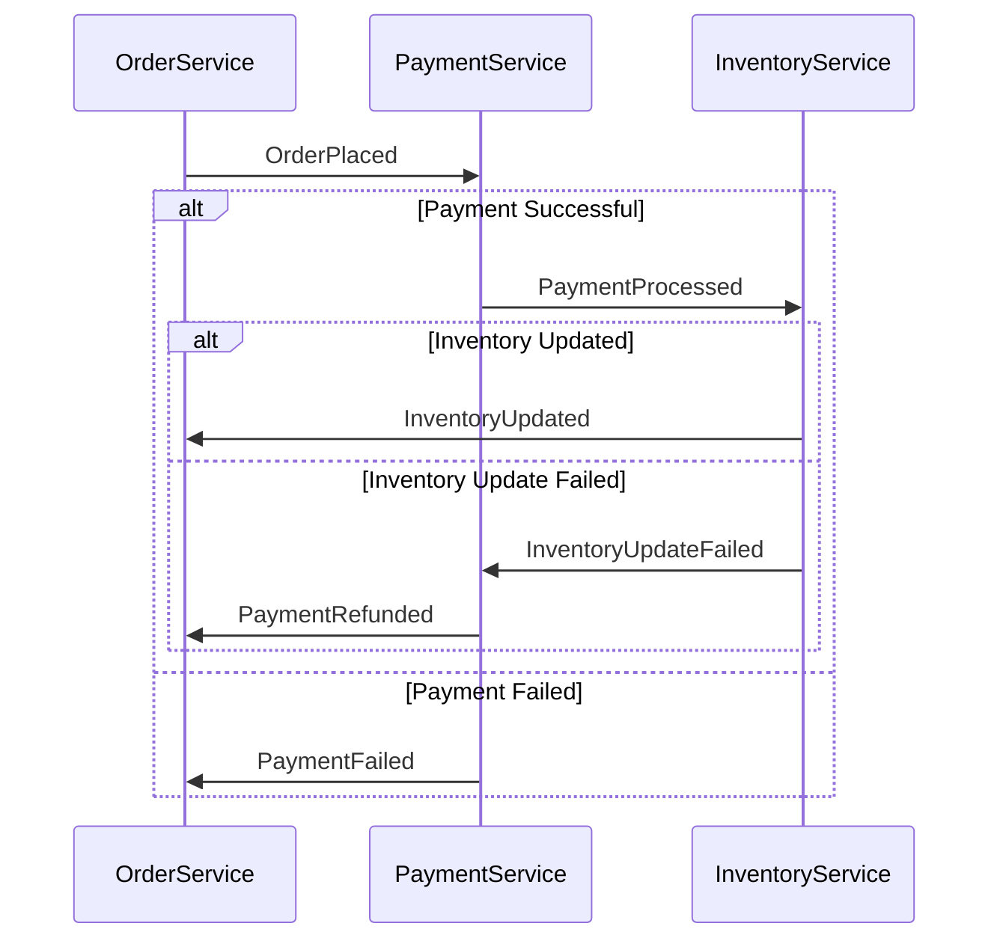
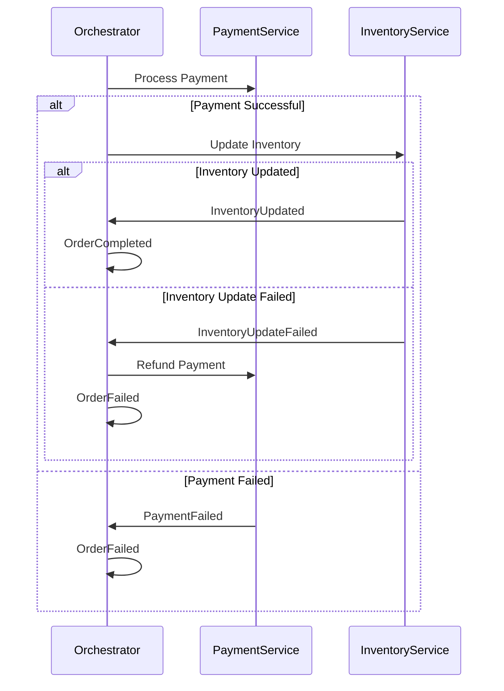

## 5.5. Saga Pattern

In the realm of microservices, managing distributed transactions is a complex yet crucial task. The Saga Pattern emerges as a powerful solution to coordinate business processes across multiple services, ensuring data consistency and reliability. In this section, we will delve into the intricacies of the Saga Pattern, explore the differences between choreography and orchestration, and provide pseudocode examples to illustrate its implementation.

### Managing Distributed Transactions

Distributed transactions in microservices involve multiple services working together to complete a business process. Unlike traditional monolithic systems, where a single transaction can be easily managed, microservices require a more sophisticated approach due to their decentralized nature. The Saga Pattern addresses this challenge by breaking down a transaction into a series of smaller, manageable steps, each executed by a different service.

#### Key Concepts

- **Saga**: A saga is a sequence of transactions that updates each service and publishes events. If a step fails, the saga executes compensating transactions to undo the work completed by previous steps.
- **Compensating Transactions**: These are actions taken to revert the state of a service to its previous state in case of a failure.
- **Eventual Consistency**: The system achieves consistency over time, rather than immediately, allowing for temporary inconsistencies.

### Choreography vs. Orchestration

The Saga Pattern can be implemented using two primary coordination mechanisms: choreography and orchestration. Each approach has its own advantages and trade-offs.

#### Choreography

In a choreography-based saga, each service involved in the transaction listens for events and reacts accordingly. This approach is decentralized, with no single point of control. Services communicate through events, making the system more resilient to failures.

**Advantages of Choreography:**

- **Decentralization**: Each service operates independently, reducing the risk of a single point of failure.
- **Scalability**: Services can be scaled independently, as they do not rely on a central orchestrator.
- **Flexibility**: New services can be added without modifying existing ones.

**Challenges of Choreography:**

- **Complexity**: Managing the flow of events can become complex as the number of services increases.
- **Debugging**: Tracing the flow of a transaction across multiple services can be challenging.

#### Orchestration

In an orchestration-based saga, a central orchestrator manages the sequence of transactions. The orchestrator sends commands to each service and handles compensations in case of failures.

**Advantages of Orchestration:**

- **Centralized Control**: The orchestrator manages the entire transaction, making it easier to monitor and debug.
- **Simplified Logic**: Business logic is centralized, reducing the complexity of individual services.

**Challenges of Orchestration:**

- **Single Point of Failure**: The orchestrator becomes a critical component, and its failure can disrupt the entire transaction.
- **Scalability**: The orchestrator can become a bottleneck as the number of transactions increases.

### Pseudocode Implementation

Let's explore how to implement the Saga Pattern using both choreography and orchestration through pseudocode examples.

#### Choreography Example

In this example, we will simulate a simple order processing system where an order is placed, payment is processed, and inventory is updated. Each service listens for events and performs its task.

```pseudocode
// Order Service
function placeOrder(orderDetails):
    publishEvent("OrderPlaced", orderDetails)

// Payment Service
onEvent("OrderPlaced", orderDetails):
    if processPayment(orderDetails):
        publishEvent("PaymentProcessed", orderDetails)
    else:
        publishEvent("PaymentFailed", orderDetails)

// Inventory Service
onEvent("PaymentProcessed", orderDetails):
    if updateInventory(orderDetails):
        publishEvent("InventoryUpdated", orderDetails)
    else:
        publishEvent("InventoryUpdateFailed", orderDetails)

// Compensation Logic
onEvent("PaymentFailed", orderDetails):
    // Compensate by canceling the order
    publishEvent("OrderCanceled", orderDetails)

onEvent("InventoryUpdateFailed", orderDetails):
    // Compensate by refunding the payment
    publishEvent("PaymentRefunded", orderDetails)
```

In this choreography example, each service reacts to events and performs its task. If a failure occurs, compensating transactions are triggered to maintain consistency.

#### Orchestration Example

In this orchestration example, we will use a central orchestrator to manage the order processing workflow.

```pseudocode
// Orchestrator Service
function processOrder(orderDetails):
    if callService("PaymentService", orderDetails):
        if callService("InventoryService", orderDetails):
            publishEvent("OrderCompleted", orderDetails)
        else:
            callService("PaymentService", "Refund", orderDetails)
            publishEvent("OrderFailed", orderDetails)
    else:
        publishEvent("OrderFailed", orderDetails)

// Payment Service
function processPayment(orderDetails):
    // Process payment logic
    return true or false

function refundPayment(orderDetails):
    // Refund payment logic
    return true or false

// Inventory Service
function updateInventory(orderDetails):
    // Update inventory logic
    return true or false
```

In this orchestration example, the orchestrator controls the flow of the transaction, calling each service in sequence and handling compensations if necessary.

### Visualizing the Saga Pattern

To better understand the flow of a saga, let's visualize the process using Mermaid.js diagrams.

#### Choreography Diagram



#### Orchestration Diagram



### Design Considerations

When implementing the Saga Pattern, consider the following:

- **Idempotency**: Ensure that each service can handle repeated requests without adverse effects, as retries may occur.
- **Compensation Complexity**: Design compensating transactions to effectively revert changes without causing further issues.
- **Monitoring and Logging**: Implement robust monitoring and logging to trace the flow of transactions and diagnose issues.

### Differences and Similarities

The Saga Pattern is often compared to the Two-Phase Commit (2PC) protocol. While both aim to ensure consistency across distributed systems, they differ significantly:

- **2PC**: A blocking protocol that locks resources until a transaction is complete, which can lead to performance bottlenecks.
- **Saga Pattern**: A non-blocking approach that allows for eventual consistency, making it more suitable for microservices.

### Try It Yourself

To deepen your understanding of the Saga Pattern, try modifying the pseudocode examples:

- **Add a new service**: Introduce a new service, such as a notification service, that sends alerts when an order is completed or fails.
- **Implement additional compensations**: Design more complex compensating transactions for different failure scenarios.
- **Experiment with different coordination mechanisms**: Switch between choreography and orchestration to see how each affects the system's behavior.

### Conclusion

The Saga Pattern is a powerful tool for managing distributed transactions in microservices. By breaking down complex processes into smaller, manageable steps and using either choreography or orchestration, we can achieve eventual consistency and maintain system reliability. As you continue to explore microservices architecture, remember to weigh the benefits and challenges of each approach and tailor your implementation to your specific needs.

## Quiz Time!



### What is a saga in the context of microservices?

- [x] A sequence of transactions that updates each service and publishes events
- [ ] A single transaction that updates all services simultaneously
- [ ] A method for locking resources during transactions
- [ ] A protocol for immediate consistency

> **Explanation:** A saga is a sequence of transactions that updates each service and publishes events, allowing for eventual consistency.

### What is the primary advantage of using choreography in the Saga Pattern?

- [x] Decentralization and reduced risk of a single point of failure
- [ ] Centralized control and simplified logic
- [ ] Immediate consistency across services
- [ ] Reduced complexity in event management

> **Explanation:** Choreography offers decentralization, allowing each service to operate independently, reducing the risk of a single point of failure.

### In an orchestration-based saga, what role does the orchestrator play?

- [x] Manages the sequence of transactions and handles compensations
- [ ] Listens for events and reacts accordingly
- [ ] Processes payments and updates inventory
- [ ] Publishes events to other services

> **Explanation:** The orchestrator manages the sequence of transactions and handles compensations in case of failures.

### Which of the following is a challenge of using choreography in the Saga Pattern?

- [x] Complexity in managing the flow of events
- [ ] Centralized control and monitoring
- [ ] Single point of failure
- [ ] Simplified business logic

> **Explanation:** Choreography can become complex as the number of services and events increases, making it challenging to manage the flow.

### What is the purpose of compensating transactions in a saga?

- [x] To revert the state of a service to its previous state in case of a failure
- [ ] To lock resources during a transaction
- [ ] To ensure immediate consistency
- [ ] To centralize business logic

> **Explanation:** Compensating transactions are used to revert the state of a service to its previous state in case of a failure, maintaining consistency.

### How does the Saga Pattern differ from the Two-Phase Commit protocol?

- [x] The Saga Pattern is non-blocking and allows for eventual consistency
- [ ] The Saga Pattern locks resources until a transaction is complete
- [ ] The Saga Pattern ensures immediate consistency
- [ ] The Saga Pattern is a blocking protocol

> **Explanation:** The Saga Pattern is non-blocking and allows for eventual consistency, making it more suitable for microservices than the Two-Phase Commit protocol.

### What is a key consideration when implementing the Saga Pattern?

- [x] Ensuring idempotency of each service
- [ ] Locking resources during transactions
- [ ] Centralizing all business logic
- [ ] Achieving immediate consistency

> **Explanation:** Ensuring idempotency of each service is crucial, as retries may occur, and services must handle repeated requests without adverse effects.

### What is the main benefit of using orchestration in the Saga Pattern?

- [x] Centralized control and easier monitoring
- [ ] Decentralization and reduced complexity
- [ ] Immediate consistency across services
- [ ] Reduced risk of a single point of failure

> **Explanation:** Orchestration provides centralized control, making it easier to monitor and debug transactions.

### Which coordination mechanism in the Saga Pattern is more resilient to failures?

- [x] Choreography
- [ ] Orchestration
- [ ] Two-Phase Commit
- [ ] Immediate Consistency

> **Explanation:** Choreography is more resilient to failures as it is decentralized, reducing the risk of a single point of failure.

### True or False: The Saga Pattern is suitable for achieving immediate consistency in microservices.

- [ ] True
- [x] False

> **Explanation:** False. The Saga Pattern is designed for eventual consistency, not immediate consistency, making it suitable for microservices.


