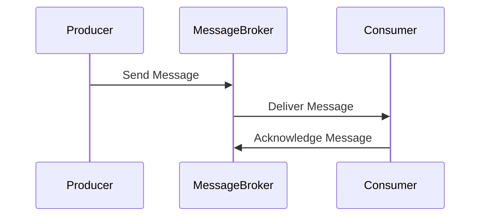

## 5.6. Message Broker Pattern

In the realm of microservices architecture, communication between services is a critical aspect that can significantly impact the system's scalability, reliability, and performance. The Message Broker Pattern is a powerful design pattern that facilitates asynchronous communication between microservices, enabling them to exchange information without being tightly coupled. This section delves into the intricacies of the Message Broker Pattern, exploring its benefits, considerations, and implementation through detailed pseudocode examples.

### Facilitating Asynchronous Communication

Asynchronous communication is a cornerstone of modern distributed systems, allowing services to interact without waiting for each other to complete processing. This approach enhances system responsiveness and resilience, as services can continue their operations independently. Message brokers like Apache Kafka and RabbitMQ are pivotal in implementing this pattern, acting as intermediaries that manage message exchange between services.

#### Key Concepts

- **Message Broker**: A software component that facilitates the exchange of messages between services, ensuring that messages are delivered reliably and efficiently.
- **Producer**: A service that sends messages to the message broker.
- **Consumer**: A service that receives messages from the message broker.
- **Topic/Queue**: A logical channel through which messages are sent and received. In Kafka, this is referred to as a "topic," while in RabbitMQ, it is known as a "queue."
- **Asynchronous Communication**: A communication method where the sender and receiver do not need to interact with each other simultaneously.

### Benefits and Considerations

Implementing the Message Broker Pattern offers several advantages, but it also introduces certain complexities that need to be managed effectively.

#### Benefits

1. **Scalability**: Message brokers can handle a large volume of messages, allowing services to scale independently. This decoupling enables each service to be scaled based on its specific load and performance requirements.

2. **Resilience**: By decoupling services, the Message Broker Pattern enhances system resilience. If a consumer service fails, the message broker can retain messages until the service is back online, ensuring no data loss.

3. **Flexibility**: Services can be developed, deployed, and updated independently, as they communicate through a common interface provided by the message broker.

4. **Load Balancing**: Message brokers can distribute messages across multiple consumers, balancing the load and improving system performance.

#### Considerations

1. **Complexity**: Introducing a message broker adds complexity to the system architecture. It requires careful configuration and management to ensure optimal performance and reliability.

2. **Latency**: While asynchronous communication improves responsiveness, it can introduce latency in message delivery. This trade-off needs to be considered when designing time-sensitive applications.

3. **Data Consistency**: Ensuring data consistency across services can be challenging in an asynchronous environment. Strategies like eventual consistency and idempotency need to be employed.

4. **Operational Overhead**: Managing and monitoring a message broker requires additional operational effort, including setting up monitoring tools and handling failures.

### Pseudocode Examples

Let's explore how to interact with message brokers using pseudocode. We'll illustrate the basic operations of producing and consuming messages, using Kafka and RabbitMQ as examples.

#### Kafka Example

**Producing Messages to Kafka**

```pseudocode
function produceMessageToKafka(topic, message):
    # Create a Kafka producer
    producer = KafkaProducer(bootstrap_servers='localhost:9092')
    
    # Send the message to the specified topic
    producer.send(topic, value=message)
    
    # Flush the producer to ensure all messages are sent
    producer.flush()
    
    # Close the producer
    producer.close()

produceMessageToKafka('order-topic', 'OrderID: 12345, Status: Created')
```

**Consuming Messages from Kafka**

```pseudocode
function consumeMessagesFromKafka(topic):
    # Create a Kafka consumer
    consumer = KafkaConsumer(topic, bootstrap_servers='localhost:9092', auto_offset_reset='earliest')
    
    # Continuously listen for messages
    for message in consumer:
        # Process the message
        print('Received message:', message.value)
        
        # Commit the message offset
        consumer.commit()

consumeMessagesFromKafka('order-topic')
```

#### RabbitMQ Example

**Producing Messages to RabbitMQ**

```pseudocode
function produceMessageToRabbitMQ(queue, message):
    # Create a connection to RabbitMQ
    connection = RabbitMQConnection(host='localhost')
    channel = connection.create_channel()
    
    # Declare a queue
    channel.queue_declare(queue=queue)
    
    # Publish the message to the queue
    channel.basic_publish(exchange='', routing_key=queue, body=message)
    
    # Close the connection
    connection.close()

produceMessageToRabbitMQ('order-queue', 'OrderID: 12345, Status: Created')
```

**Consuming Messages from RabbitMQ**

```pseudocode
function consumeMessagesFromRabbitMQ(queue):
    # Create a connection to RabbitMQ
    connection = RabbitMQConnection(host='localhost')
    channel = connection.create_channel()
    
    # Declare a queue
    channel.queue_declare(queue=queue)
    
    # Define a callback function to process messages
    function callback(ch, method, properties, body):
        print('Received message:', body)
        # Acknowledge the message
        ch.basic_ack(delivery_tag=method.delivery_tag)
    
    # Set up a consumer
    channel.basic_consume(queue=queue, on_message_callback=callback)
    
    # Start consuming messages
    channel.start_consuming()

consumeMessagesFromRabbitMQ('order-queue')
```

### Visualizing the Message Broker Pattern

To better understand the flow of messages in the Message Broker Pattern, let's visualize the interaction between producers, consumers, and the message broker using a sequence diagram.



**Diagram Description**: This sequence diagram illustrates the interaction between a producer, a message broker, and a consumer. The producer sends a message to the message broker, which then delivers it to the consumer. The consumer processes the message and sends an acknowledgment back to the broker.

### Design Considerations

When implementing the Message Broker Pattern, consider the following design aspects:

- **Message Durability**: Ensure that messages are persisted to prevent data loss in case of broker failures. Both Kafka and RabbitMQ offer mechanisms for message durability.
- **Idempotency**: Design consumers to handle duplicate messages gracefully, as network issues can lead to message redelivery.
- **Security**: Implement authentication and authorization to secure message exchanges. Both Kafka and RabbitMQ support SSL/TLS encryption and access control mechanisms.
- **Monitoring and Alerting**: Set up monitoring tools to track message broker performance and detect issues promptly. Tools like Prometheus and Grafana can be integrated for this purpose.

### Programming Language Specifics

While the pseudocode examples provide a language-agnostic view, it's essential to understand the specifics of the programming language you are using. For instance, in Java, you might use the Kafka Java client library, while in Python, you could use the `kafka-python` library. Similarly, for RabbitMQ, you might use the `pika` library in Python or the `amqp` library in Node.js.

### Differences and Similarities

The Message Broker Pattern is often compared with other communication patterns like the API Gateway Pattern and the Service Mesh Pattern. While the API Gateway Pattern focuses on managing client-to-service communication, the Message Broker Pattern is concerned with service-to-service communication. The Service Mesh Pattern, on the other hand, provides advanced features like load balancing and service discovery, which can complement the Message Broker Pattern.

### Try It Yourself

To deepen your understanding, try modifying the pseudocode examples to:

- Implement a retry mechanism for message delivery.
- Add logging to track message processing.
- Experiment with different message formats, such as JSON or XML.

### Knowledge Check

Before moving on, let's summarize the key takeaways:

- The Message Broker Pattern facilitates asynchronous communication between microservices.
- It enhances scalability, resilience, and flexibility but introduces complexity and latency.
- Kafka and RabbitMQ are popular message brokers that support this pattern.
- Design considerations include message durability, idempotency, security, and monitoring.

Remember, mastering the Message Broker Pattern is a journey. As you experiment and apply these concepts, you'll gain a deeper understanding of how to build robust and scalable microservices architectures.

## Quiz Time!



### What is the primary role of a message broker in microservices?

- [x] Facilitating asynchronous communication between services
- [ ] Managing client-to-service communication
- [ ] Providing service discovery
- [ ] Handling database transactions

> **Explanation:** A message broker facilitates asynchronous communication between services, allowing them to exchange messages without being tightly coupled.

### Which of the following is a benefit of using the Message Broker Pattern?

- [x] Scalability
- [ ] Increased complexity
- [ ] Synchronous communication
- [ ] Tight coupling

> **Explanation:** The Message Broker Pattern enhances scalability by allowing services to scale independently and handle large volumes of messages.

### What is a common challenge when implementing the Message Broker Pattern?

- [ ] Improved resilience
- [x] Data consistency
- [ ] Simplified architecture
- [ ] Reduced latency

> **Explanation:** Ensuring data consistency across services can be challenging in an asynchronous environment, requiring strategies like eventual consistency.

### In Kafka, what is the term used for a logical channel through which messages are sent and received?

- [x] Topic
- [ ] Queue
- [ ] Exchange
- [ ] Stream

> **Explanation:** In Kafka, a "topic" is a logical channel through which messages are sent and received.

### What is the purpose of the `basic_ack` method in RabbitMQ?

- [x] Acknowledging message receipt
- [ ] Sending a message
- [ ] Declaring a queue
- [ ] Closing a connection

> **Explanation:** The `basic_ack` method is used to acknowledge the receipt of a message, indicating that it has been processed successfully.

### Which tool can be used to monitor message broker performance?

- [x] Prometheus
- [ ] Kafka
- [ ] RabbitMQ
- [ ] Docker

> **Explanation:** Prometheus is a monitoring tool that can be integrated to track message broker performance and detect issues.

### What is a key consideration when designing consumers in the Message Broker Pattern?

- [ ] Ensuring synchronous communication
- [x] Handling duplicate messages
- [ ] Implementing client-side load balancing
- [ ] Using a shared database

> **Explanation:** Consumers should be designed to handle duplicate messages gracefully, as network issues can lead to message redelivery.

### Which of the following is a popular message broker used in microservices?

- [x] RabbitMQ
- [ ] MySQL
- [ ] Redis
- [ ] Nginx

> **Explanation:** RabbitMQ is a popular message broker used in microservices to facilitate asynchronous communication.

### What is the primary difference between the Message Broker Pattern and the API Gateway Pattern?

- [x] The Message Broker Pattern focuses on service-to-service communication, while the API Gateway Pattern manages client-to-service communication.
- [ ] The Message Broker Pattern provides service discovery, while the API Gateway Pattern handles message exchange.
- [ ] The Message Broker Pattern is used for synchronous communication, while the API Gateway Pattern is for asynchronous communication.
- [ ] The Message Broker Pattern is simpler to implement than the API Gateway Pattern.

> **Explanation:** The Message Broker Pattern focuses on service-to-service communication, while the API Gateway Pattern manages client-to-service communication.

### True or False: The Message Broker Pattern can introduce latency in message delivery.

- [x] True
- [ ] False

> **Explanation:** While asynchronous communication improves responsiveness, it can introduce latency in message delivery, which needs to be considered in time-sensitive applications.


