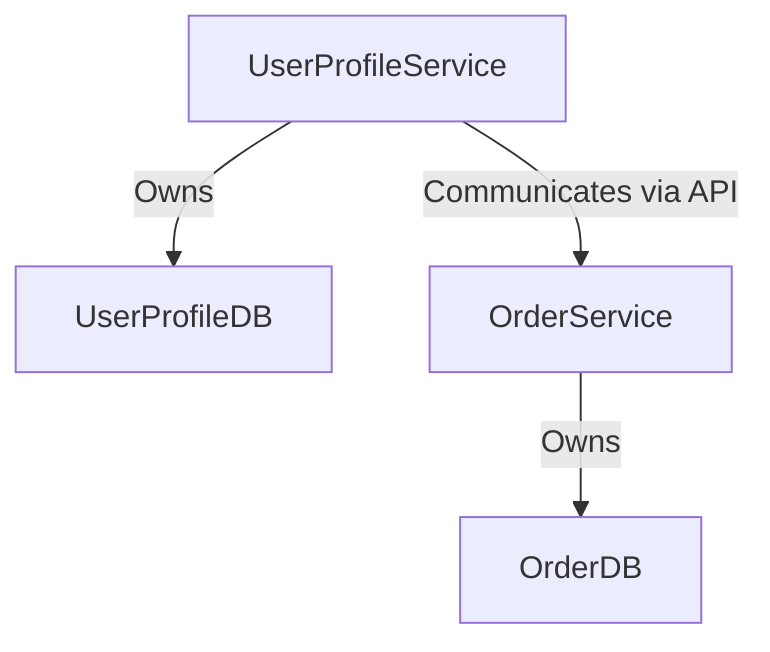

## 6.1. Database per Service Pattern

In the realm of microservices architecture, the Database per Service Pattern stands as a cornerstone for achieving data isolation and service autonomy. This pattern dictates that each microservice should own its database, ensuring that services are loosely coupled and can scale independently. Let's delve into the intricacies of this pattern, exploring its benefits, challenges, and implementation strategies.

### Intent

The primary intent of the Database per Service Pattern is to decouple data storage from the service logic, allowing each service to manage its data independently. This approach enhances service autonomy, facilitates independent scaling, and aligns with the microservices principle of decentralized data management.

### Key Participants

- **Microservices**: Independent units of functionality that own their data.
- **Databases**: Separate data stores for each microservice, which can be relational or non-relational.
- **Data Access Layer**: The interface through which a microservice interacts with its database.

### Applicability

This pattern is applicable when:
- You need to ensure that changes in one service do not affect others.
- Services require different data storage technologies.
- Independent scaling of services is a priority.
- Data consistency can be managed through eventual consistency or other mechanisms.

### Benefits

1. **Loose Coupling**: By isolating data storage, services become less dependent on each other, reducing the risk of cascading failures.
2. **Independent Scaling**: Each service can scale its database according to its specific needs, optimizing resource usage.
3. **Technology Diversity**: Services can choose the most suitable database technology for their requirements, whether it's SQL, NoSQL, or other types.
4. **Enhanced Security**: Data access is restricted to the owning service, reducing the attack surface.

### Challenges

1. **Data Consistency**: Ensuring consistency across services can be complex, especially in distributed systems.
2. **Complex Transactions**: Implementing transactions that span multiple services requires careful design, often involving patterns like Saga.
3. **Increased Operational Overhead**: Managing multiple databases can increase the complexity of operations and maintenance.
4. **Data Duplication**: Some data may need to be duplicated across services, leading to potential synchronization issues.

### Design Considerations

When implementing the Database per Service Pattern, consider the following:

- **Data Ownership**: Clearly define which service owns which data to avoid conflicts.
- **Data Access**: Ensure that only the owning service can access its database directly.
- **Inter-Service Communication**: Use APIs or messaging systems for services to communicate and share data.
- **Consistency Models**: Choose appropriate consistency models (e.g., eventual consistency) based on your application's needs.

### Sample Code Snippets

Let's explore a pseudocode example illustrating the Database per Service Pattern:

```pseudocode
// Define a microservice for managing user profiles
service UserProfileService {
    // Connect to the user profile database
    database userProfileDB = connectToDatabase("UserProfileDB")

    // Function to create a new user profile
    function createUserProfile(userData) {
        // Insert user data into the database
        userProfileDB.insert("UserProfiles", userData)
    }

    // Function to retrieve a user profile by ID
    function getUserProfile(userId) {
        // Query the database for the user profile
        return userProfileDB.query("SELECT * FROM UserProfiles WHERE id = ?", userId)
    }
}

// Define a microservice for managing orders
service OrderService {
    // Connect to the order database
    database orderDB = connectToDatabase("OrderDB")

    // Function to create a new order
    function createOrder(orderData) {
        // Insert order data into the database
        orderDB.insert("Orders", orderData)
    }

    // Function to retrieve an order by ID
    function getOrder(orderId) {
        // Query the database for the order
        return orderDB.query("SELECT * FROM Orders WHERE id = ?", orderId)
    }
}
```

In this example, the `UserProfileService` and `OrderService` each have their own databases (`UserProfileDB` and `OrderDB`, respectively). This separation ensures that changes in one service do not affect the other, allowing for independent scaling and maintenance.

### Visualizing the Database per Service Pattern

To better understand the architecture of the Database per Service Pattern, let's visualize it using a Mermaid.js diagram:



**Diagram Description**: This diagram illustrates two microservices, `UserProfileService` and `OrderService`, each owning its database (`UserProfileDB` and `OrderDB`). The services communicate with each other via APIs, ensuring data isolation and service autonomy.

### Programming Language Specifics

While the Database per Service Pattern is language-agnostic, certain programming languages and frameworks offer built-in support for microservices and database management. For instance, Spring Boot in Java provides tools for easily connecting to databases and managing transactions, while Node.js has libraries like Sequelize for ORM capabilities.

### Differences and Similarities

The Database per Service Pattern is often compared to the Shared Database Pattern. While both patterns deal with data management in microservices, they differ fundamentally:

- **Database per Service**: Each service has its own database, promoting isolation and autonomy.
- **Shared Database**: Multiple services share a single database, which can simplify data consistency but increase coupling.

### Try It Yourself

To deepen your understanding, try modifying the pseudocode example to add a new microservice, such as a `PaymentService`, with its own database. Consider how this new service would interact with existing services and what data it would manage.

### Knowledge Check

Before we conclude, let's pose a few questions to reinforce your understanding:

- What are the main benefits of the Database per Service Pattern?
- How does this pattern enhance service autonomy?
- What challenges might arise when implementing this pattern?

### Embrace the Journey

Remember, implementing the Database per Service Pattern is a journey. As you progress, you'll encounter challenges and opportunities to refine your architecture. Stay curious, experiment with different approaches, and enjoy the process of building robust microservices.

### References and Links

For further reading, consider exploring the following resources:

- [Martin Fowler's Microservices Resource Guide](https://martinfowler.com/microservices/)
- [AWS Microservices Best Practices](https://aws.amazon.com/microservices/)
- [Spring Boot and Microservices](https://spring.io/projects/spring-boot)

## Quiz Time!



### What is the primary intent of the Database per Service Pattern?

- [x] To decouple data storage from service logic
- [ ] To centralize data management
- [ ] To share databases among services
- [ ] To simplify data consistency

> **Explanation:** The Database per Service Pattern aims to decouple data storage from service logic, allowing each service to manage its data independently.

### Which of the following is a benefit of the Database per Service Pattern?

- [x] Loose coupling
- [ ] Increased data consistency
- [ ] Simplified transactions
- [ ] Centralized data access

> **Explanation:** Loose coupling is a benefit of this pattern, as it reduces dependencies between services.

### What challenge does the Database per Service Pattern introduce?

- [x] Data consistency
- [ ] Centralized data management
- [ ] Simplified scaling
- [ ] Reduced operational overhead

> **Explanation:** Ensuring data consistency across services can be challenging with this pattern.

### How does the Database per Service Pattern enhance security?

- [x] By restricting data access to the owning service
- [ ] By centralizing data access
- [ ] By using a single database for all services
- [ ] By simplifying data transactions

> **Explanation:** The pattern enhances security by ensuring that only the owning service can access its database directly.

### What is a key consideration when implementing the Database per Service Pattern?

- [x] Data ownership
- [ ] Centralized data access
- [ ] Shared databases
- [ ] Simplified transactions

> **Explanation:** Clearly defining data ownership is crucial to avoid conflicts and ensure service autonomy.

### Which pattern is often compared to the Database per Service Pattern?

- [x] Shared Database Pattern
- [ ] Event Sourcing Pattern
- [ ] CQRS Pattern
- [ ] Saga Pattern

> **Explanation:** The Shared Database Pattern is often compared to the Database per Service Pattern due to their differing approaches to data management.

### What is a potential drawback of the Database per Service Pattern?

- [x] Increased operational overhead
- [ ] Simplified data consistency
- [ ] Centralized data management
- [ ] Reduced service autonomy

> **Explanation:** Managing multiple databases can increase the complexity of operations and maintenance.

### What type of communication is recommended between services in this pattern?

- [x] API or messaging systems
- [ ] Direct database access
- [ ] Shared database queries
- [ ] Centralized data access

> **Explanation:** Services should communicate via APIs or messaging systems to maintain data isolation and service autonomy.

### How does the pattern support technology diversity?

- [x] By allowing services to choose their database technology
- [ ] By centralizing data management
- [ ] By using a single database type for all services
- [ ] By simplifying data transactions

> **Explanation:** Services can choose the most suitable database technology for their requirements, promoting technology diversity.

### True or False: The Database per Service Pattern simplifies data consistency across services.

- [ ] True
- [x] False

> **Explanation:** The pattern can complicate data consistency, as each service manages its own data independently.



By understanding and implementing the Database per Service Pattern, you can build microservices that are robust, scalable, and maintainable. Keep exploring, experimenting, and refining your approach to master the art of microservices architecture.
