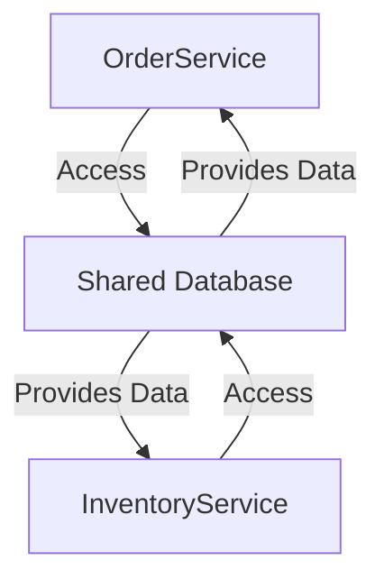

## 6.2. Shared Database Pattern

In the realm of microservices architecture, data management is a critical aspect that can significantly influence the overall system design and performance. One of the patterns that often comes into play is the **Shared Database Pattern**. This pattern involves multiple microservices accessing a common database, which can simplify certain aspects of data management but also introduces specific challenges and trade-offs.

### Design Pattern Name

**Shared Database Pattern**

### Category

**Data Management Patterns**

### Intent

The intent of the Shared Database Pattern is to allow multiple microservices to access a single, shared database. This can simplify data management and reduce the complexity of maintaining multiple databases. However, it also introduces tight coupling between services, which can lead to challenges in scalability, maintainability, and data consistency.

### When to Share Databases

#### Situations Where Isolation is Impractical

1. **Legacy Systems Integration**: When integrating with legacy systems that rely on a monolithic database, it may be impractical to refactor the entire database structure to fit a microservices architecture. In such cases, sharing the existing database can be a pragmatic approach.

2. **Cost Constraints**: Maintaining separate databases for each microservice can be costly in terms of infrastructure and operational overhead. Sharing a database can reduce these costs, especially for smaller organizations or projects with limited budgets.

3. **Data Consistency Requirements**: In scenarios where strong consistency is required across services, a shared database can simplify the implementation of transactions and data integrity checks.

4. **Development Simplicity**: For teams that are new to microservices or when the application is in its early stages, using a shared database can reduce the complexity of the initial setup and allow for faster development cycles.

### Trade-offs

#### Tight Coupling vs. Simplicity

- **Tight Coupling**: Sharing a database inherently couples the services that access it. Changes to the database schema can impact multiple services, making it difficult to evolve the system independently. This can lead to a monolithic-like structure, negating some of the benefits of microservices.

- **Simplicity**: On the flip side, a shared database can simplify data access and management. It eliminates the need for complex data synchronization mechanisms and can make it easier to implement certain features that require access to data from multiple services.

### Key Participants

1. **Microservices**: The individual services that access the shared database. Each service is responsible for a specific business capability but relies on the shared database for data storage.

2. **Shared Database**: The central database that stores data for multiple services. It acts as a common data source, providing a unified view of the data.

3. **Database Administrator**: The role responsible for managing the shared database, including schema design, performance tuning, and ensuring data integrity.

### Applicability

The Shared Database Pattern is applicable in scenarios where:

- The cost and complexity of maintaining separate databases for each service outweigh the benefits.
- There is a need for strong consistency across services that cannot be easily achieved with separate databases.
- The organization is transitioning from a monolithic architecture and needs a temporary solution to manage data during the migration process.

### Sample Code Snippets

Let's explore some pseudocode examples to illustrate how the Shared Database Pattern can be implemented in a microservices architecture.

#### Example 1: Accessing a Shared Database

In this example, we have two microservices, `OrderService` and `InventoryService`, both accessing a shared database to perform their operations.

```pseudocode
// OrderService accessing the shared database
class OrderService {
    function createOrder(orderDetails) {
        // Connect to the shared database
        dbConnection = Database.connect("shared_database")

        // Insert order details into the orders table
        dbConnection.execute("INSERT INTO orders (details) VALUES (?)", orderDetails)

        // Close the database connection
        dbConnection.close()
    }
}

// InventoryService accessing the shared database
class InventoryService {
    function updateInventory(productId, quantity) {
        // Connect to the shared database
        dbConnection = Database.connect("shared_database")

        // Update the inventory for the given product
        dbConnection.execute("UPDATE inventory SET quantity = ? WHERE product_id = ?", quantity, productId)

        // Close the database connection
        dbConnection.close()
    }
}
```

In this pseudocode, both services connect to the same database and perform their respective operations. This demonstrates the simplicity of using a shared database, as there is no need for complex data synchronization between services.

#### Example 2: Handling Schema Changes

One of the challenges of a shared database is managing schema changes. Let's see how we can handle this in a controlled manner.

```pseudocode
// Database Administrator role managing schema changes
class DatabaseAdministrator {
    function applySchemaChange(changeScript) {
        // Notify all affected services about the upcoming change
        notifyServices("Schema change scheduled", changeScript)

        // Apply the schema change to the shared database
        dbConnection = Database.connect("shared_database")
        dbConnection.execute(changeScript)
        dbConnection.close()

        // Notify all services that the change has been applied
        notifyServices("Schema change applied", changeScript)
    }
}

// Example change script to add a new column
changeScript = "ALTER TABLE orders ADD COLUMN delivery_date DATE"
DatabaseAdministrator.applySchemaChange(changeScript)
```

In this example, the `DatabaseAdministrator` role is responsible for applying schema changes. The process involves notifying all affected services before and after the change to ensure they can adapt their logic accordingly.

### Design Considerations

When using the Shared Database Pattern, consider the following:

- **Versioning**: Implement versioning for database schemas to manage changes effectively and minimize disruptions to services.
- **Access Control**: Use access control mechanisms to ensure that each service can only access the data it needs, reducing the risk of accidental data corruption.
- **Monitoring and Auditing**: Implement monitoring and auditing tools to track database access and changes, ensuring data integrity and compliance with regulations.

### Differences and Similarities

The Shared Database Pattern is often compared to the **Database per Service Pattern**, where each service has its own database. The key difference is that the Shared Database Pattern involves multiple services accessing a single database, leading to tighter coupling but simpler data management. In contrast, the Database per Service Pattern promotes loose coupling and independent scalability but requires more complex data synchronization mechanisms.

### Visualizing the Shared Database Pattern

To better understand the Shared Database Pattern, let's visualize the architecture using a Mermaid.js diagram.



This diagram illustrates how multiple services access a shared database, highlighting the central role of the database in the architecture.

### Programming Language Specifics

While the Shared Database Pattern can be implemented in any programming language, certain languages and frameworks offer built-in support for database access and management, which can simplify the implementation. For example, Java's Spring Framework provides robust support for database transactions and connection pooling, making it easier to manage shared database access.

### Try It Yourself

To gain a deeper understanding of the Shared Database Pattern, try modifying the pseudocode examples provided. For instance, add a new service that accesses the shared database, or implement a mechanism to handle concurrent access to the database.

### Knowledge Check

Before we move on, let's take a moment to reflect on what we've learned. Consider the following questions:

- What are the key benefits and drawbacks of using a shared database in a microservices architecture?
- How can schema changes be managed effectively in a shared database environment?
- What are some scenarios where the Shared Database Pattern is particularly useful?

### Embrace the Journey

Remember, the Shared Database Pattern is just one of many patterns available for managing data in a microservices architecture. As you continue your journey, you'll encounter other patterns that may be more suitable for your specific needs. Keep experimenting, stay curious, and enjoy the journey!

## Quiz Time!



### What is the primary intent of the Shared Database Pattern?

- [x] To allow multiple microservices to access a single, shared database.
- [ ] To ensure each microservice has its own independent database.
- [ ] To eliminate the need for a database in microservices architecture.
- [ ] To enforce strict data isolation between services.

> **Explanation:** The Shared Database Pattern allows multiple microservices to access a single, shared database, simplifying data management but introducing tight coupling.

### In which scenario is the Shared Database Pattern most applicable?

- [x] When integrating with legacy systems that rely on a monolithic database.
- [ ] When each microservice requires a unique database schema.
- [ ] When strong data isolation is a primary requirement.
- [ ] When the organization has unlimited resources for database management.

> **Explanation:** The Shared Database Pattern is most applicable when integrating with legacy systems that rely on a monolithic database, as it simplifies the transition to microservices.

### What is a key trade-off of using the Shared Database Pattern?

- [x] Tight coupling between services.
- [ ] Increased complexity in data synchronization.
- [ ] Independent scalability of services.
- [ ] Enhanced data isolation.

> **Explanation:** A key trade-off of using the Shared Database Pattern is the tight coupling between services, which can impact scalability and maintainability.

### How can schema changes be managed in a shared database environment?

- [x] By notifying all affected services before and after applying the change.
- [ ] By applying changes without notifying any services.
- [ ] By ensuring each service has its own database schema.
- [ ] By avoiding any schema changes altogether.

> **Explanation:** Schema changes in a shared database environment should be managed by notifying all affected services before and after applying the change to ensure they can adapt accordingly.

### What is a benefit of using a shared database?

- [x] Simplified data access and management.
- [ ] Enhanced data isolation between services.
- [ ] Independent scalability of services.
- [ ] Elimination of database management costs.

> **Explanation:** A shared database simplifies data access and management by providing a common data source for multiple services.

### Which role is responsible for managing schema changes in a shared database?

- [x] Database Administrator
- [ ] Microservices Developer
- [ ] System Architect
- [ ] DevOps Engineer

> **Explanation:** The Database Administrator is responsible for managing schema changes in a shared database, ensuring data integrity and notifying affected services.

### What is a potential drawback of using a shared database?

- [x] Difficulty in evolving the system independently.
- [ ] Increased complexity in data synchronization.
- [ ] Enhanced data isolation between services.
- [ ] Independent scalability of services.

> **Explanation:** A potential drawback of using a shared database is the difficulty in evolving the system independently due to tight coupling between services.

### How can access control be implemented in a shared database?

- [x] By using access control mechanisms to restrict data access for each service.
- [ ] By allowing all services unrestricted access to the database.
- [ ] By ensuring each service has its own database schema.
- [ ] By avoiding any access control mechanisms.

> **Explanation:** Access control can be implemented in a shared database by using mechanisms to restrict data access for each service, reducing the risk of accidental data corruption.

### What is a similarity between the Shared Database Pattern and the Database per Service Pattern?

- [x] Both patterns involve managing data in a microservices architecture.
- [ ] Both patterns promote loose coupling between services.
- [ ] Both patterns require each service to have its own database.
- [ ] Both patterns eliminate the need for data synchronization.

> **Explanation:** Both the Shared Database Pattern and the Database per Service Pattern involve managing data in a microservices architecture, but they differ in their approach to coupling and data isolation.

### True or False: The Shared Database Pattern is suitable for scenarios where strong data isolation is required.

- [ ] True
- [x] False

> **Explanation:** False. The Shared Database Pattern is not suitable for scenarios where strong data isolation is required, as it involves multiple services accessing a single database, leading to tight coupling.


