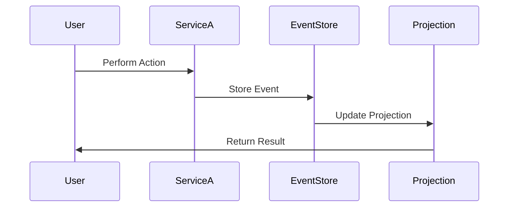

## 6.3. Event Sourcing Pattern

In the realm of microservices, managing data effectively is crucial for building scalable and resilient systems. One of the powerful patterns that address data management challenges is the Event Sourcing Pattern. This pattern focuses on capturing state changes as events, allowing us to build application state from a history of these events. Let's delve into the intricacies of this pattern, its advantages, and how we can implement it using pseudocode.

### Introduction to Event Sourcing

Event Sourcing is a design pattern that stores the state of a system as a sequence of events. Instead of persisting the current state of an entity, every change to the state is captured as an event. These events are immutable and are stored in an event store. The current state of an entity can be reconstructed by replaying these events.

#### Key Concepts

- **Event**: A record of a state change. Events are immutable and represent facts that have occurred.
- **Event Store**: A database or storage system where events are persisted. It acts as the source of truth for the system.
- **Rehydration**: The process of rebuilding the current state of an entity by replaying its events.
- **Projection**: A derived view of the event store, often used to optimize read operations.

### Advantages of Event Sourcing

Implementing Event Sourcing offers several benefits:

1. **Auditability**: Since every state change is recorded as an event, we have a complete audit trail of how the system reached its current state. This is invaluable for compliance and debugging.

2. **Temporal Queries**: We can query the state of the system at any point in time by replaying events up to that moment. This enables powerful time-based analytics.

3. **Scalability**: Event Sourcing naturally decouples the write and read models, allowing for independent scaling of these operations.

4. **Flexibility**: New features can be added by creating new projections without altering the existing event store.

5. **Resilience**: In the event of a failure, the system can be restored to a consistent state by replaying events.

### Event Sourcing in Microservices

In a microservices architecture, Event Sourcing can be particularly beneficial. Each microservice can maintain its own event store, capturing domain-specific events. This aligns with the principle of decentralized data management, where each service is responsible for its own data.

#### Diagram: Event Sourcing in Microservices



*Figure 1: Event Sourcing in a Microservices Architecture*

### Implementing Event Sourcing

Let's explore how we can implement Event Sourcing using pseudocode. We'll break down the implementation into several key components: event creation, event storage, and state rehydration.

#### Event Creation

Events are created whenever a state change occurs. Each event should include enough information to describe the change.

```pseudocode
class Event:
    def __init__(self, entity_id, event_type, data, timestamp):
        self.entity_id = entity_id
        self.event_type = event_type
        self.data = data
        self.timestamp = timestamp

def create_event(entity_id, event_type, data):
    timestamp = get_current_timestamp()
    return Event(entity_id, event_type, data, timestamp)
```

#### Event Storage

Events are stored in an event store. This can be a database specifically designed for storing events.

```pseudocode
class EventStore:
    def __init__(self):
        self.events = []

    def store_event(self, event):
        self.events.append(event)

    def get_events_for_entity(self, entity_id):
        return [event for event in self.events if event.entity_id == entity_id]
```

#### State Rehydration

To reconstruct the current state of an entity, we replay its events.

```pseudocode
class Entity:
    def __init__(self, entity_id):
        self.entity_id = entity_id
        self.state = {}

    def apply_event(self, event):
        # Update the state based on the event type and data
        if event.event_type == "update":
            self.state.update(event.data)

def rehydrate_entity(entity_id, event_store):
    entity = Entity(entity_id)
    events = event_store.get_events_for_entity(entity_id)
    for event in events:
        entity.apply_event(event)
    return entity
```

### Try It Yourself

Experiment with the pseudocode by modifying the event types and data. Try adding new event types and see how they affect the state rehydration process. This hands-on approach will deepen your understanding of Event Sourcing.

### Design Considerations

When implementing Event Sourcing, consider the following:

- **Event Schema Evolution**: As the system evolves, the structure of events may change. Plan for backward compatibility and versioning of events.
- **Event Store Scalability**: Ensure that the event store can handle the volume of events generated by the system.
- **Consistency**: While Event Sourcing provides eventual consistency, ensure that your system can tolerate this and that it aligns with your business requirements.

### Differences and Similarities

Event Sourcing is often confused with the Command Query Responsibility Segregation (CQRS) pattern. While both patterns can be used together, they serve different purposes. Event Sourcing focuses on how data is stored, while CQRS focuses on separating read and write operations.

### Conclusion

Event Sourcing is a powerful pattern that offers numerous advantages for microservices architectures. By capturing state changes as events, we gain auditability, scalability, and flexibility. As you continue your journey in microservices, consider how Event Sourcing can enhance your systems.

### Further Reading

For more information on Event Sourcing, consider exploring the following resources:

- [Martin Fowler's Article on Event Sourcing](https://martinfowler.com/eaaDev/EventSourcing.html)
- [Event Sourcing on Microsoft Docs](https://docs.microsoft.com/en-us/azure/architecture/patterns/event-sourcing)

## Quiz Time!



### What is the primary purpose of the Event Sourcing pattern?

- [x] To capture state changes as events
- [ ] To separate read and write operations
- [ ] To manage distributed transactions
- [ ] To provide a centralized data store

> **Explanation:** Event Sourcing focuses on capturing state changes as events, allowing the system to reconstruct its state from these events.

### Which of the following is NOT an advantage of Event Sourcing?

- [ ] Auditability
- [ ] Temporal Queries
- [x] Immediate Consistency
- [ ] Scalability

> **Explanation:** Event Sourcing provides eventual consistency, not immediate consistency.

### In Event Sourcing, what is the role of the event store?

- [x] To persist events as the source of truth
- [ ] To manage distributed transactions
- [ ] To separate read and write operations
- [ ] To provide immediate consistency

> **Explanation:** The event store is responsible for persisting events, acting as the source of truth for the system.

### What is rehydration in the context of Event Sourcing?

- [x] Rebuilding the current state by replaying events
- [ ] Separating read and write operations
- [ ] Managing distributed transactions
- [ ] Providing immediate consistency

> **Explanation:** Rehydration involves rebuilding the current state of an entity by replaying its events.

### How does Event Sourcing enhance auditability?

- [x] By recording every state change as an event
- [ ] By separating read and write operations
- [ ] By managing distributed transactions
- [ ] By providing immediate consistency

> **Explanation:** Event Sourcing enhances auditability by recording every state change as an immutable event.

### What is a projection in Event Sourcing?

- [x] A derived view of the event store
- [ ] A mechanism for managing distributed transactions
- [ ] A method for separating read and write operations
- [ ] A way to provide immediate consistency

> **Explanation:** A projection is a derived view of the event store, often used to optimize read operations.

### Which pattern is often confused with Event Sourcing?

- [ ] Circuit Breaker
- [x] CQRS
- [ ] Saga
- [ ] API Gateway

> **Explanation:** Event Sourcing is often confused with CQRS, but they serve different purposes.

### What is the main challenge of implementing Event Sourcing?

- [x] Event schema evolution
- [ ] Immediate consistency
- [ ] Centralized data management
- [ ] Managing distributed transactions

> **Explanation:** Event schema evolution is a challenge because the structure of events may change as the system evolves.

### What is the benefit of temporal queries in Event Sourcing?

- [x] Ability to query the state at any point in time
- [ ] Immediate consistency
- [ ] Centralized data management
- [ ] Managing distributed transactions

> **Explanation:** Temporal queries allow us to query the state of the system at any point in time by replaying events up to that moment.

### True or False: Event Sourcing provides immediate consistency.

- [ ] True
- [x] False

> **Explanation:** Event Sourcing provides eventual consistency, not immediate consistency.



Remember, this is just the beginning. As you progress, you'll build more complex and interactive systems using Event Sourcing. Keep experimenting, stay curious, and enjoy the journey!
