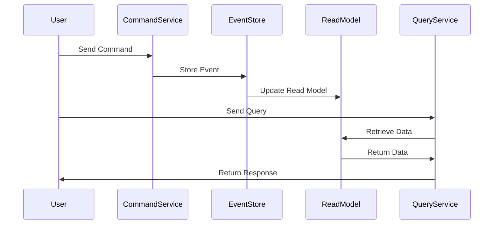

## 6.4. CQRS (Command Query Responsibility Segregation) Pattern

The CQRS (Command Query Responsibility Segregation) pattern is a powerful architectural pattern that separates the read and write operations of a system. This separation allows for optimization of different workloads, providing scalability and flexibility in handling complex data management scenarios. In this section, we will delve into the core concepts of CQRS, explore its implementation in microservices, and provide detailed pseudocode examples to illustrate its application.

### Understanding CQRS

#### Design Pattern Name
**CQRS (Command Query Responsibility Segregation)**

#### Category
**Data Management Patterns**

#### Intent
The primary intent of the CQRS pattern is to separate the responsibilities of reading and writing data to optimize for different workloads. By doing so, it allows systems to scale independently for read and write operations, improving performance and enabling more complex business logic.

#### Key Concepts

1. **Separation of Concerns**: CQRS divides the system into two distinct parts: the command side, which handles data modifications, and the query side, which handles data retrieval. This separation allows each side to be optimized independently.

2. **Read and Write Models**: In CQRS, the write model is responsible for processing commands and updating the state, while the read model is optimized for querying and retrieving data.

3. **Eventual Consistency**: CQRS often works in conjunction with Event Sourcing, where state changes are captured as events. This approach can lead to eventual consistency between the read and write models.

4. **Scalability**: By separating read and write operations, CQRS allows each side to scale independently, providing flexibility in handling varying loads.

5. **Complex Business Logic**: The pattern supports complex business logic on the command side, while the query side can be optimized for performance and responsiveness.

### Visualizing CQRS

To better understand the CQRS pattern, let's visualize the architecture using a sequence diagram:



**Diagram Description**: This sequence diagram illustrates the flow of commands and queries in a CQRS architecture. The user sends a command to the CommandService, which stores the event in the EventStore. The ReadModel is then updated asynchronously. For queries, the user interacts with the QueryService, which retrieves data from the ReadModel.

### Implementing CQRS

#### Designing Commands and Queries

In a CQRS architecture, commands and queries are designed to handle different aspects of the system:

- **Commands**: These are actions that change the state of the system. They are typically handled by the command side of the architecture, which processes the command and updates the state.

- **Queries**: These are requests for information and do not change the state of the system. They are handled by the query side, which retrieves data from the read model.

Let's explore how to design commands and queries in a CQRS system.

#### Pseudocode Examples

##### Command Handling

In the command side of CQRS, we focus on processing commands and updating the state. Here is a pseudocode example of handling a command:

```pseudocode
class CommandHandler:
    def handle(command):
        # Validate the command
        if not command.isValid():
            raise Exception("Invalid command")

        # Process the command
        event = processCommand(command)

        # Store the event
        EventStore.save(event)

        # Publish the event to update the read model
        EventBus.publish(event)

def processCommand(command):
    # Business logic to process the command
    return Event(command.data)
```

**Explanation**: In this pseudocode, the `CommandHandler` class is responsible for handling commands. It validates the command, processes it to generate an event, and stores the event in the `EventStore`. The event is then published to update the read model.

##### Query Handling

The query side of CQRS is optimized for retrieving data. Here is a pseudocode example of handling a query:

```pseudocode
class QueryHandler:
    def handle(query):
        # Retrieve data from the read model
        data = ReadModel.getData(query.criteria)

        # Return the data
        return data
```

**Explanation**: The `QueryHandler` class handles queries by retrieving data from the `ReadModel` based on the query criteria. It returns the data to the caller.

### Design Considerations

When implementing CQRS, there are several design considerations to keep in mind:

- **Consistency**: CQRS often involves eventual consistency between the read and write models. Ensure that your system can handle this and that users are aware of potential delays in data synchronization.

- **Complexity**: The separation of read and write models can introduce complexity. Carefully design your system to manage this complexity and ensure that both models are kept in sync.

- **Scalability**: One of the main benefits of CQRS is scalability. Design your system to take advantage of this by scaling the read and write sides independently.

- **Event Sourcing**: Consider using Event Sourcing in conjunction with CQRS to capture state changes as events. This can provide a robust audit trail and support complex business logic.

### Programming Language Specifics

While the CQRS pattern can be implemented in any programming language, there are some language-specific considerations to keep in mind:

- **Object-Oriented Languages**: In languages like Java or C#, you can use classes and interfaces to define commands and queries, providing a clear separation of concerns.

- **Functional Languages**: In functional languages like Haskell or Scala, you can use functions and immutable data structures to implement CQRS, taking advantage of the language's strengths in handling side effects.

### Differences and Similarities

CQRS is often compared to other patterns, such as Event Sourcing and Domain-Driven Design (DDD). Here are some key differences and similarities:

- **Event Sourcing**: While CQRS separates read and write models, Event Sourcing focuses on capturing state changes as events. These patterns are often used together to provide a comprehensive solution.

- **Domain-Driven Design**: DDD provides a framework for modeling complex domains, while CQRS focuses on separating concerns. Both patterns can complement each other in a microservices architecture.

### Try It Yourself

To better understand CQRS, try implementing a simple system using the pattern. Start by defining commands and queries for a basic application, such as a task management system. Experiment with different ways to handle commands and queries, and observe how the separation of concerns impacts the system's performance and scalability.

### Knowledge Check

Before we move on, let's review some key points:

- What is the primary intent of the CQRS pattern?
- How does CQRS improve scalability and performance?
- What are the main components of a CQRS architecture?
- How can Event Sourcing complement CQRS?

### Embrace the Journey

Remember, mastering CQRS is a journey. As you explore this pattern, you'll gain valuable insights into optimizing data management in microservices. Keep experimenting, stay curious, and enjoy the journey!

## Quiz Time!



### What is the primary intent of the CQRS pattern?

- [x] To separate read and write operations for optimization
- [ ] To combine read and write operations for simplicity
- [ ] To enhance security in microservices
- [ ] To reduce the number of services in a system

> **Explanation:** The primary intent of CQRS is to separate read and write operations to optimize for different workloads.

### How does CQRS improve scalability?

- [x] By allowing independent scaling of read and write models
- [ ] By reducing the number of services
- [ ] By combining read and write operations
- [ ] By simplifying the architecture

> **Explanation:** CQRS improves scalability by allowing the read and write models to scale independently, optimizing for different workloads.

### What is a key benefit of separating read and write models in CQRS?

- [x] Improved performance and responsiveness
- [ ] Simplified architecture
- [ ] Reduced complexity
- [ ] Enhanced security

> **Explanation:** Separating read and write models allows for improved performance and responsiveness by optimizing each side independently.

### What is a common pattern used in conjunction with CQRS?

- [x] Event Sourcing
- [ ] Singleton Pattern
- [ ] Factory Pattern
- [ ] Observer Pattern

> **Explanation:** Event Sourcing is commonly used with CQRS to capture state changes as events, providing a robust audit trail.

### In CQRS, what is the role of the command side?

- [x] To handle data modifications
- [ ] To retrieve data
- [ ] To manage user authentication
- [ ] To log system events

> **Explanation:** The command side of CQRS is responsible for handling data modifications and updating the state.

### What is the role of the query side in CQRS?

- [x] To retrieve data
- [ ] To handle data modifications
- [ ] To manage user authentication
- [ ] To log system events

> **Explanation:** The query side of CQRS is responsible for retrieving data and handling queries.

### How does CQRS handle consistency?

- [x] Through eventual consistency between read and write models
- [ ] By ensuring immediate consistency
- [ ] By using a single database for all operations
- [ ] By combining read and write operations

> **Explanation:** CQRS often involves eventual consistency between the read and write models, allowing for asynchronous updates.

### What is a potential challenge of implementing CQRS?

- [x] Increased complexity
- [ ] Reduced scalability
- [ ] Simplified architecture
- [ ] Enhanced security

> **Explanation:** Implementing CQRS can introduce complexity due to the separation of read and write models.

### What is a key consideration when using CQRS?

- [x] Managing eventual consistency
- [ ] Reducing the number of services
- [ ] Combining read and write operations
- [ ] Simplifying the architecture

> **Explanation:** Managing eventual consistency is a key consideration when using CQRS, as it can impact data synchronization.

### True or False: CQRS can be implemented in any programming language.

- [x] True
- [ ] False

> **Explanation:** CQRS is a pattern that can be implemented in any programming language, although there may be language-specific considerations.


