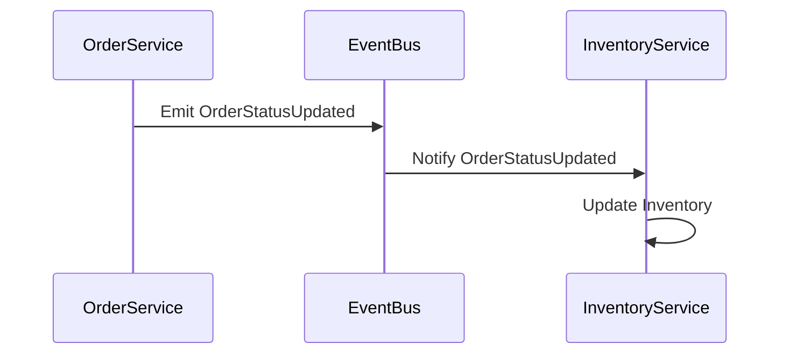
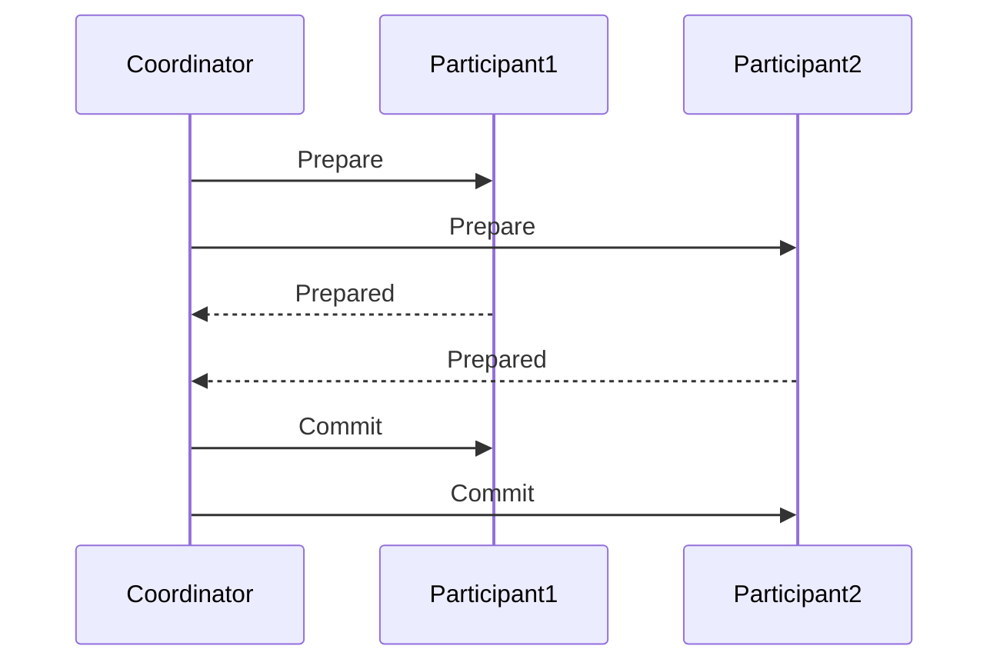

## 6.5. Data Replication and Synchronization

In the realm of microservices, data replication and synchronization are critical components that ensure data consistency across distributed systems. As microservices architecture inherently involves multiple services operating independently, maintaining a consistent state across these services becomes a complex task. This section delves into the techniques and strategies for data replication and synchronization, addressing the challenges of ensuring data consistency and resolving conflicts.

### Introduction to Data Replication and Synchronization

Data replication involves copying and maintaining data across multiple databases or services to ensure high availability and reliability. Synchronization, on the other hand, ensures that these replicated data copies remain consistent over time. In microservices, where services often have their own databases, these processes are crucial for maintaining data integrity and providing a seamless user experience.

#### Key Concepts

- **Data Consistency**: Ensuring that all copies of data reflect the same state.
- **Replication**: The process of copying data from one location to another.
- **Synchronization**: The process of ensuring that replicated data remains consistent across locations.
- **Conflict Resolution**: Strategies to handle discrepancies when data copies diverge.

### Techniques for Data Synchronization

Data synchronization in microservices can be achieved through various techniques, each with its own set of advantages and trade-offs. Let's explore some of the most common methods:

#### 1. Event-Driven Synchronization

In an event-driven architecture, services communicate through events. When a change occurs in one service, it emits an event that other services can listen to and update their data accordingly.

```pseudocode
// Pseudocode for Event-Driven Synchronization

service OrderService {
    function updateOrderStatus(orderId, status) {
        // Update order status in the database
        database.update(orderId, status)
        
        // Emit an event for other services
        eventBus.emit("OrderStatusUpdated", { orderId: orderId, status: status })
    }
}

service InventoryService {
    // Listen for order status updates
    eventBus.on("OrderStatusUpdated", function(event) {
        // Update inventory based on order status
        if (event.status == "completed") {
            updateInventory(event.orderId)
        }
    })
}
```

**Advantages**:
- Decouples services, allowing them to operate independently.
- Scales well with the number of services.

**Challenges**:
- Requires robust event handling and processing.
- Potential for eventual consistency issues.

#### 2. Two-Phase Commit (2PC)

The Two-Phase Commit protocol is a distributed algorithm that ensures all participating services agree on a transaction's outcome. It involves two phases: prepare and commit.

```pseudocode
// Pseudocode for Two-Phase Commit

coordinator {
    function beginTransaction(transactionId) {
        // Send prepare request to all participants
        for each participant in participants {
            participant.prepare(transactionId)
        }
        
        // If all participants are prepared, commit the transaction
        if allPrepared {
            for each participant in participants {
                participant.commit(transactionId)
            }
        } else {
            // Abort the transaction if any participant fails
            for each participant in participants {
                participant.abort(transactionId)
            }
        }
    }
}

participant {
    function prepare(transactionId) {
        // Prepare for the transaction
        // Return success or failure
    }
    
    function commit(transactionId) {
        // Commit the transaction
    }
    
    function abort(transactionId) {
        // Abort the transaction
    }
}
```

**Advantages**:
- Ensures strong consistency across services.
- Suitable for critical transactions.

**Challenges**:
- Can be slow and resource-intensive.
- Risk of blocking if a participant fails.

#### 3. Conflict-Free Replicated Data Types (CRDTs)

CRDTs are data structures designed to automatically resolve conflicts in distributed systems. They allow concurrent updates and ensure eventual consistency without requiring coordination.

```pseudocode
// Pseudocode for CRDT-based Synchronization

crdt GCounter {
    state: map<serviceId, int>
    
    function increment(serviceId) {
        state[serviceId] += 1
    }
    
    function merge(otherCounter) {
        for each serviceId in otherCounter.state {
            state[serviceId] = max(state[serviceId], otherCounter.state[serviceId])
        }
    }
    
    function value() {
        return sum(state.values())
    }
}
```

**Advantages**:
- Automatically resolves conflicts.
- Supports concurrent updates.

**Challenges**:
- Limited to specific data types and operations.
- Requires careful design to ensure correctness.

### Handling Conflicts

In distributed systems, conflicts are inevitable due to network latency, partitioning, and concurrent updates. Effective conflict resolution strategies are essential to maintain data integrity.

#### 1. Last Write Wins (LWW)

In the Last Write Wins strategy, the most recent update is considered the correct one. This approach is simple but may lead to data loss if not used carefully.

```pseudocode
// Pseudocode for Last Write Wins

function resolveConflict(data1, data2) {
    if data1.timestamp > data2.timestamp {
        return data1
    } else {
        return data2
    }
}
```

**Advantages**:
- Simple and easy to implement.
- Suitable for non-critical data.

**Challenges**:
- Potential for data loss.
- Not suitable for all use cases.

#### 2. Merge Strategies

Merge strategies involve combining conflicting updates into a single, consistent state. This approach is more complex but can preserve more information.

```pseudocode
// Pseudocode for Merge Strategy

function mergeData(data1, data2) {
    mergedData = {}
    for each key in data1.keys() {
        if data1[key] != data2[key] {
            mergedData[key] = customMergeFunction(data1[key], data2[key])
        } else {
            mergedData[key] = data1[key]
        }
    }
    return mergedData
}
```

**Advantages**:
- Preserves more information.
- Customizable for different data types.

**Challenges**:
- Complex to implement.
- Requires domain-specific knowledge.

#### 3. Operational Transformation (OT)

Operational Transformation is a technique used in collaborative systems to resolve conflicts by transforming operations. It ensures that all participants converge to the same state.

```pseudocode
// Pseudocode for Operational Transformation

function transformOperation(op1, op2) {
    // Transform op1 based on op2
    // Return the transformed operation
}

function applyOperation(state, operation) {
    // Apply the operation to the state
}
```

**Advantages**:
- Suitable for collaborative applications.
- Ensures convergence to a consistent state.

**Challenges**:
- Complex to implement and understand.
- Requires careful design and testing.

### Visualizing Data Replication and Synchronization

To better understand the flow of data replication and synchronization, let's visualize these processes using Mermaid.js diagrams.

#### Event-Driven Synchronization Flow



**Description**: This diagram illustrates the flow of events in an event-driven synchronization process. The `OrderService` emits an event to the `EventBus`, which then notifies the `InventoryService` to update its data.

#### Two-Phase Commit Process



**Description**: This diagram depicts the two-phase commit process, where the `Coordinator` sends prepare requests to `Participant1` and `Participant2`. Upon receiving prepared responses, the coordinator sends commit requests to finalize the transaction.

### Key Considerations for Data Replication and Synchronization

When implementing data replication and synchronization in microservices, consider the following:

- **Consistency vs. Availability**: Decide on the trade-off between consistency and availability based on your application's requirements. Eventual consistency may be acceptable for some use cases, while others may require strong consistency.
- **Latency and Performance**: Consider the impact of replication and synchronization on system performance. Techniques like CRDTs and event-driven synchronization can help reduce latency.
- **Scalability**: Ensure that your chosen approach scales with the number of services and data volume. Event-driven architectures and CRDTs are generally more scalable.
- **Conflict Resolution**: Choose a conflict resolution strategy that aligns with your data model and business requirements. Merge strategies and operational transformation offer more flexibility but require careful design.

### Try It Yourself

To deepen your understanding of data replication and synchronization, try modifying the provided pseudocode examples. Experiment with different conflict resolution strategies and observe how they affect data consistency. Consider implementing a simple event-driven synchronization system using a message broker like RabbitMQ or Kafka.

### References and Further Reading

- [Event-Driven Architecture](https://martinfowler.com/articles/201701-event-driven.html) by Martin Fowler
- [Two-Phase Commit Protocol](https://en.wikipedia.org/wiki/Two-phase_commit_protocol) on Wikipedia
- [Conflict-Free Replicated Data Types (CRDTs)](https://crdt.tech/) by CRDT.tech
- [Operational Transformation](https://en.wikipedia.org/wiki/Operational_transformation) on Wikipedia

### Knowledge Check

- Explain the difference between data replication and synchronization.
- Describe the advantages and challenges of event-driven synchronization.
- What are the key phases of the Two-Phase Commit protocol?
- How do CRDTs ensure eventual consistency?
- Discuss the trade-offs between Last Write Wins and merge strategies for conflict resolution.

### Embrace the Journey

Remember, mastering data replication and synchronization in microservices is a journey. As you progress, you'll encounter new challenges and opportunities to refine your skills. Keep experimenting, stay curious, and enjoy the journey!

## Quiz Time!



### What is the primary goal of data replication in microservices?

- [x] To ensure high availability and reliability
- [ ] To reduce the number of services
- [ ] To increase the complexity of the system
- [ ] To eliminate the need for databases

> **Explanation:** Data replication aims to ensure high availability and reliability by maintaining copies of data across multiple locations.

### Which technique involves services communicating through events?

- [x] Event-Driven Synchronization
- [ ] Two-Phase Commit
- [ ] CRDTs
- [ ] Operational Transformation

> **Explanation:** Event-Driven Synchronization involves services emitting and listening to events to synchronize data.

### What is a key advantage of the Two-Phase Commit protocol?

- [x] Ensures strong consistency across services
- [ ] Requires no coordination between services
- [ ] Automatically resolves conflicts
- [ ] Suitable for non-critical transactions

> **Explanation:** The Two-Phase Commit protocol ensures strong consistency by coordinating transactions across services.

### How do CRDTs handle conflicts?

- [x] By automatically resolving them
- [ ] By discarding conflicting updates
- [ ] By requiring manual intervention
- [ ] By using timestamps

> **Explanation:** CRDTs are designed to automatically resolve conflicts, ensuring eventual consistency.

### Which conflict resolution strategy may lead to data loss?

- [x] Last Write Wins
- [ ] Merge Strategies
- [ ] Operational Transformation
- [ ] Two-Phase Commit

> **Explanation:** Last Write Wins may lead to data loss as it discards older updates in favor of the most recent one.

### What is a challenge of using merge strategies for conflict resolution?

- [x] Complex to implement
- [ ] Requires no domain-specific knowledge
- [ ] Limited to specific data types
- [ ] Discards conflicting updates

> **Explanation:** Merge strategies are complex to implement and require domain-specific knowledge to combine conflicting updates.

### What does the Two-Phase Commit protocol involve?

- [x] Prepare and commit phases
- [ ] Emit and listen phases
- [ ] Increment and merge phases
- [ ] Transform and apply phases

> **Explanation:** The Two-Phase Commit protocol involves prepare and commit phases to ensure transaction consistency.

### Which technique is suitable for collaborative applications?

- [x] Operational Transformation
- [ ] Event-Driven Synchronization
- [ ] Two-Phase Commit
- [ ] Last Write Wins

> **Explanation:** Operational Transformation is suitable for collaborative applications as it resolves conflicts by transforming operations.

### What is a benefit of using CRDTs?

- [x] Supports concurrent updates
- [ ] Requires strong consistency
- [ ] Discards older updates
- [ ] Requires manual conflict resolution

> **Explanation:** CRDTs support concurrent updates and ensure eventual consistency without requiring coordination.

### True or False: Event-Driven Synchronization scales well with the number of services.

- [x] True
- [ ] False

> **Explanation:** Event-Driven Synchronization scales well as it decouples services, allowing them to operate independently.




