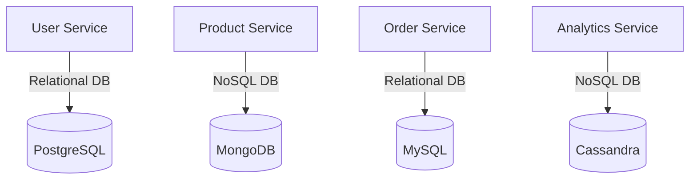

## 6.6. Polyglot Persistence

In the realm of microservices architecture, the concept of **Polyglot Persistence** emerges as a powerful strategy to address the diverse data storage needs of different services. This approach involves using multiple data storage technologies, each tailored to the specific requirements of individual services. As we delve into this topic, we will explore how to choose the right database for each service, provide pseudocode implementations for interfacing with different data stores, and discuss the benefits and challenges of adopting polyglot persistence.

### Understanding Polyglot Persistence

Polyglot Persistence is a term that refers to the use of different data storage technologies within a single application or system. In a microservices architecture, this means that each microservice can use the database technology that best suits its specific needs. This approach contrasts with the traditional monolithic architecture, where a single database technology is often used for the entire application.

#### Key Concepts

- **Diverse Data Needs**: Different microservices may have varying data requirements. For instance, one service might need a relational database for complex queries, while another might benefit from a NoSQL database for handling large volumes of unstructured data.
- **Optimized Performance**: By selecting the most appropriate database technology for each service, you can optimize performance, scalability, and maintainability.
- **Flexibility and Scalability**: Polyglot persistence allows for greater flexibility in choosing technologies and scaling services independently.

### Choosing the Right Database for Each Service

Selecting the appropriate database technology for each microservice is a critical decision that can impact the overall performance and scalability of your system. Here are some factors to consider:

#### 1. Data Structure

- **Relational Databases**: Ideal for structured data with complex relationships. Use SQL databases like PostgreSQL or MySQL for services that require ACID transactions and complex joins.
- **NoSQL Databases**: Suitable for unstructured or semi-structured data. Consider MongoDB or Couchbase for services dealing with large volumes of data without complex relationships.

#### 2. Query Requirements

- **Complex Queries**: If your service requires complex queries and transactions, a relational database might be the best choice.
- **Simple Queries**: For services with simple query requirements, a NoSQL database can offer better performance and scalability.

#### 3. Scalability Needs

- **Horizontal Scalability**: NoSQL databases are often designed for horizontal scalability, making them suitable for services that need to handle large amounts of data and high traffic.
- **Vertical Scalability**: Relational databases can be scaled vertically but may face limitations in terms of horizontal scaling.

#### 4. Consistency and Availability

- **Consistency**: If your service requires strong consistency, a relational database might be necessary.
- **Availability**: For services where availability is more critical than consistency, consider using a NoSQL database with eventual consistency.

### Pseudocode Implementation

Let's explore how to interface with different data stores using pseudocode. We'll demonstrate how to connect to a relational database and a NoSQL database, perform basic operations, and handle data retrieval.

#### Connecting to a Relational Database

```pseudocode
// Establish a connection to a relational database
function connectToRelationalDB(connectionString):
    connection = RelationalDB.connect(connectionString)
    return connection

// Perform a query to retrieve data
function queryRelationalDB(connection, query):
    resultSet = connection.executeQuery(query)
    return resultSet

// Example usage
connectionString = "Server=myServerAddress;Database=myDataBase;User Id=myUsername;Password=myPassword;"
connection = connectToRelationalDB(connectionString)
query = "SELECT * FROM Customers WHERE Country='USA'"
customers = queryRelationalDB(connection, query)
```

#### Connecting to a NoSQL Database

```pseudocode
// Establish a connection to a NoSQL database
function connectToNoSQLDB(connectionString):
    client = NoSQLDB.connect(connectionString)
    return client

// Insert a document into a collection
function insertDocument(client, collectionName, document):
    collection = client.getCollection(collectionName)
    collection.insert(document)

// Retrieve documents from a collection
function queryNoSQLDB(client, collectionName, query):
    collection = client.getCollection(collectionName)
    documents = collection.find(query)
    return documents

// Example usage
connectionString = "mongodb://localhost:27017"
client = connectToNoSQLDB(connectionString)
document = {"name": "John Doe", "age": 30, "country": "USA"}
insertDocument(client, "users", document)
query = {"country": "USA"}
users = queryNoSQLDB(client, "users", query)
```

### Visualizing Polyglot Persistence

To better understand how polyglot persistence works in a microservices architecture, let's visualize the interaction between different services and their respective databases.



**Diagram Description**: This diagram illustrates a microservices architecture where different services interact with various database technologies. The User Service uses a relational database (PostgreSQL), the Product Service uses a NoSQL database (MongoDB), the Order Service uses another relational database (MySQL), and the Analytics Service uses a NoSQL database (Cassandra).

### Benefits of Polyglot Persistence

Adopting polyglot persistence in your microservices architecture offers several advantages:

- **Tailored Solutions**: Each service can use the database technology that best fits its needs, leading to optimized performance and resource utilization.
- **Improved Scalability**: By leveraging the strengths of different database technologies, you can achieve better scalability across services.
- **Enhanced Flexibility**: Polyglot persistence allows you to adapt to changing requirements and incorporate new technologies as needed.

### Challenges of Polyglot Persistence

While polyglot persistence offers many benefits, it also introduces certain challenges:

- **Increased Complexity**: Managing multiple database technologies can increase the complexity of your system, requiring additional expertise and resources.
- **Data Consistency**: Ensuring data consistency across different databases can be challenging, especially when dealing with distributed transactions.
- **Operational Overhead**: Maintaining and monitoring multiple databases can lead to higher operational overhead.

### Design Considerations

When implementing polyglot persistence, consider the following design considerations:

- **Service Boundaries**: Clearly define the boundaries of each service and its associated data store to avoid tight coupling.
- **Data Integration**: Plan for data integration and synchronization between services, especially if they share related data.
- **Monitoring and Management**: Implement robust monitoring and management tools to handle the operational complexity of multiple databases.

### Programming Language Specifics

While the pseudocode examples provided are language-agnostic, it's important to consider the specifics of the programming language you are using. Different languages may have varying support for database connectivity, libraries, and frameworks. Ensure that you choose the right tools and libraries that align with your language and database technologies.

### Differences and Similarities

Polyglot persistence is often compared to other data management patterns, such as the **Database per Service** pattern. While both patterns emphasize the use of separate databases for different services, polyglot persistence specifically focuses on using different types of databases based on the needs of each service. This distinction allows for greater flexibility and optimization.

### Try It Yourself

To gain hands-on experience with polyglot persistence, try modifying the pseudocode examples provided. Experiment with different database technologies and query requirements to see how they impact performance and scalability. Consider setting up a small microservices project with multiple services, each using a different database technology, and observe how they interact.

### Knowledge Check

Before we conclude, let's pose a few questions to reinforce your understanding of polyglot persistence:

- What are the key benefits of using polyglot persistence in a microservices architecture?
- How do you determine which database technology is best suited for a particular service?
- What challenges might you face when implementing polyglot persistence?

### Embrace the Journey

Remember, adopting polyglot persistence is a journey that requires careful planning and consideration. As you explore this approach, keep in mind the unique needs of your services and the overall goals of your system. Stay curious, experiment with different technologies, and enjoy the process of building a robust and scalable microservices architecture.

## Quiz Time!



### What is Polyglot Persistence?

- [x] The use of multiple data storage technologies within a single application or system.
- [ ] The use of a single database technology for all services.
- [ ] A pattern that enforces strict consistency across all databases.
- [ ] A method for migrating data between different databases.

> **Explanation:** Polyglot Persistence refers to using different data storage technologies within a single application or system to meet diverse data needs.

### Which factor is NOT crucial when choosing a database for a microservice?

- [ ] Data Structure
- [ ] Query Requirements
- [x] User Interface Design
- [ ] Scalability Needs

> **Explanation:** User Interface Design is not directly related to choosing a database technology for a microservice.

### What type of database is ideal for structured data with complex relationships?

- [x] Relational Database
- [ ] NoSQL Database
- [ ] In-memory Database
- [ ] Graph Database

> **Explanation:** Relational databases are ideal for structured data with complex relationships due to their support for ACID transactions and complex joins.

### What is a key benefit of Polyglot Persistence?

- [x] Tailored Solutions for each service
- [ ] Simplified System Architecture
- [ ] Reduced Operational Overhead
- [ ] Uniform Data Management

> **Explanation:** Polyglot Persistence allows each service to use the database technology that best fits its needs, leading to tailored solutions.

### Which challenge is associated with Polyglot Persistence?

- [x] Increased Complexity
- [ ] Simplified Data Consistency
- [ ] Reduced Flexibility
- [ ] Uniform Database Management

> **Explanation:** Managing multiple database technologies can increase the complexity of your system.

### What is the primary focus of Polyglot Persistence?

- [x] Using different types of databases based on service needs
- [ ] Using a single database for all services
- [ ] Ensuring strong consistency across all databases
- [ ] Reducing the number of databases used

> **Explanation:** Polyglot Persistence focuses on using different types of databases based on the specific needs of each service.

### How does Polyglot Persistence enhance scalability?

- [x] By leveraging the strengths of different database technologies
- [ ] By using a single database technology for all services
- [ ] By enforcing strict consistency across all databases
- [ ] By reducing the number of services

> **Explanation:** Polyglot Persistence enhances scalability by allowing each service to use the most appropriate database technology.

### What is a common comparison to Polyglot Persistence?

- [x] Database per Service Pattern
- [ ] Monolithic Architecture
- [ ] Service Mesh Pattern
- [ ] Event Sourcing Pattern

> **Explanation:** Polyglot Persistence is often compared to the Database per Service pattern, as both emphasize separate databases for different services.

### What should be considered when implementing Polyglot Persistence?

- [x] Service Boundaries
- [ ] User Interface Design
- [ ] Single Database Technology
- [ ] Uniform Data Management

> **Explanation:** Clearly defining service boundaries is crucial when implementing Polyglot Persistence to avoid tight coupling.

### True or False: Polyglot Persistence can lead to increased operational overhead.

- [x] True
- [ ] False

> **Explanation:** Maintaining and monitoring multiple databases can lead to higher operational overhead in a polyglot persistence approach.


