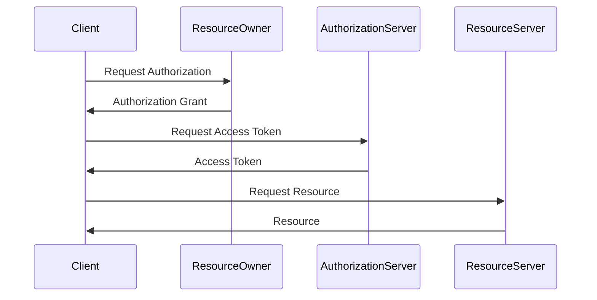
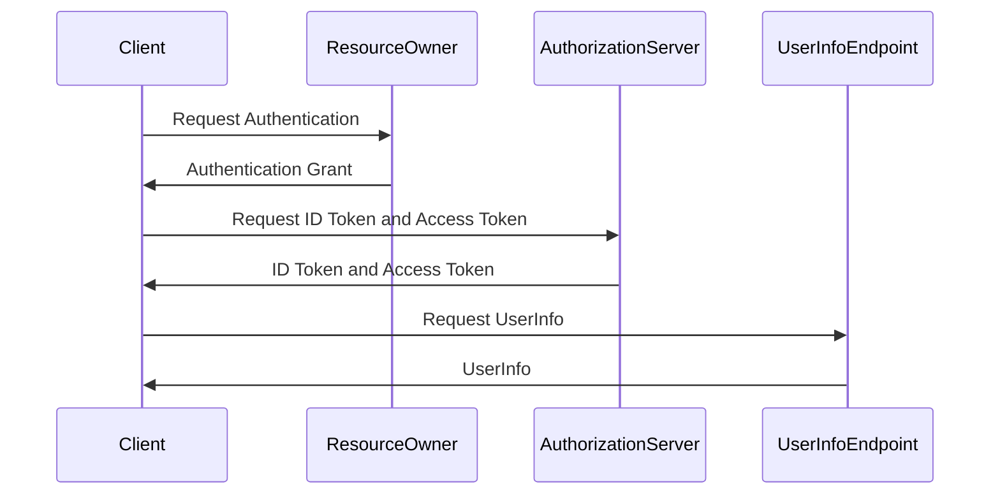
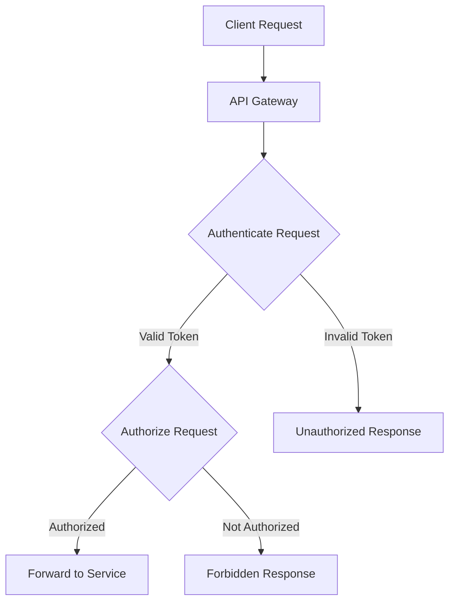

## 7.1. Authentication and Authorization

In the world of microservices, security is paramount. As applications are broken down into smaller, independent services, ensuring secure communication and access control becomes increasingly complex. This section delves into the critical aspects of authentication and authorization in microservices, focusing on implementing security at the gateway, leveraging OAuth2 and OpenID Connect, and providing practical pseudocode examples to illustrate these concepts.

### Implementing Security at the Gateway

In a microservices architecture, the API Gateway serves as the single entry point for client requests. It acts as a reverse proxy, routing requests to the appropriate services. Implementing security at the gateway centralizes access control, simplifying the management of authentication and authorization across multiple services.

#### Centralizing Access Control

Centralizing access control at the API Gateway offers several benefits:

- **Simplified Management**: By handling authentication and authorization at a single point, you reduce the complexity of managing security across multiple services.
- **Consistent Security Policies**: Ensures that all services adhere to the same security policies, reducing the risk of inconsistencies.
- **Reduced Overhead**: Services can focus on their core functionality without worrying about security concerns.

Let's explore how to implement centralized access control using pseudocode.

```pseudocode
// Define a function to authenticate requests at the API Gateway
function authenticateRequest(request):
    // Extract token from the request header
    token = request.headers["Authorization"]

    // Validate the token
    if isValidToken(token):
        // Token is valid, proceed with authorization
        return authorizeRequest(request, token)
    else:
        // Token is invalid, return an unauthorized response
        return response(status=401, message="Unauthorized")

// Define a function to authorize requests based on roles and permissions
function authorizeRequest(request, token):
    // Extract user roles from the token
    userRoles = extractRolesFromToken(token)

    // Check if the user has the required role for the requested resource
    if hasRequiredRole(request.resource, userRoles):
        // User is authorized, forward the request to the appropriate service
        return forwardRequestToService(request)
    else:
        // User is not authorized, return a forbidden response
        return response(status=403, message="Forbidden")
```

In this pseudocode, we define two functions: `authenticateRequest` and `authorizeRequest`. The `authenticateRequest` function extracts the token from the request header and validates it. If the token is valid, it proceeds to authorize the request based on user roles and permissions.

### OAuth2 and OpenID Connect

OAuth2 and OpenID Connect are standard protocols for identity management, widely used in microservices architectures to handle authentication and authorization.

#### OAuth2

OAuth2 is an authorization framework that enables third-party applications to obtain limited access to a web service. It provides a secure way to delegate access without sharing credentials.

##### Key Concepts of OAuth2

- **Resource Owner**: The user who authorizes an application to access their data.
- **Client**: The application requesting access to the resource owner's data.
- **Authorization Server**: The server that issues access tokens to the client after successfully authenticating the resource owner.
- **Resource Server**: The server hosting the protected resources, capable of accepting and responding to protected resource requests using access tokens.

##### OAuth2 Flow

The OAuth2 flow involves several steps:

1. **Authorization Request**: The client requests authorization from the resource owner.
2. **Authorization Grant**: The resource owner provides an authorization grant to the client.
3. **Access Token Request**: The client requests an access token from the authorization server using the authorization grant.
4. **Access Token Response**: The authorization server issues an access token to the client.
5. **Resource Request**: The client uses the access token to request resources from the resource server.

Let's illustrate the OAuth2 flow with a sequence diagram.



#### OpenID Connect

OpenID Connect is an identity layer built on top of OAuth2, providing a standardized way to authenticate users. It adds an ID token to the OAuth2 flow, which contains information about the authenticated user.

##### Key Concepts of OpenID Connect

- **ID Token**: A JSON Web Token (JWT) that contains claims about the authenticated user.
- **UserInfo Endpoint**: An endpoint that returns additional information about the authenticated user.

##### OpenID Connect Flow

The OpenID Connect flow is similar to the OAuth2 flow, with the addition of the ID token:

1. **Authentication Request**: The client requests authentication from the resource owner.
2. **Authentication Response**: The authorization server issues an ID token and access token to the client.
3. **UserInfo Request**: The client requests additional user information from the UserInfo endpoint.

Let's illustrate the OpenID Connect flow with a sequence diagram.



### Pseudocode Examples

Securing APIs with tokens is a common practice in microservices architectures. Let's explore how to implement token-based authentication and authorization using pseudocode.

#### Token-Based Authentication

Token-based authentication involves issuing a token to the client after successful authentication. The client includes this token in subsequent requests to access protected resources.

```pseudocode
// Define a function to issue a token after successful authentication
function issueToken(userCredentials):
    // Validate user credentials
    if isValidCredentials(userCredentials):
        // Generate a token with user information and expiration time
        token = generateToken(userCredentials.userId, expirationTime=3600)

        // Return the token to the client
        return response(status=200, token=token)
    else:
        // Invalid credentials, return an unauthorized response
        return response(status=401, message="Unauthorized")
```

In this pseudocode, the `issueToken` function validates the user's credentials and generates a token containing user information and an expiration time. The token is then returned to the client.

#### Token-Based Authorization

Token-based authorization involves verifying the token's validity and checking the user's roles and permissions to access a resource.

```pseudocode
// Define a function to verify the token and authorize the request
function verifyTokenAndAuthorizeRequest(request):
    // Extract token from the request header
    token = request.headers["Authorization"]

    // Verify the token's validity
    if isValidToken(token):
        // Extract user roles from the token
        userRoles = extractRolesFromToken(token)

        // Check if the user has the required role for the requested resource
        if hasRequiredRole(request.resource, userRoles):
            // User is authorized, forward the request to the appropriate service
            return forwardRequestToService(request)
        else:
            // User is not authorized, return a forbidden response
            return response(status=403, message="Forbidden")
    else:
        // Token is invalid, return an unauthorized response
        return response(status=401, message="Unauthorized")
```

In this pseudocode, the `verifyTokenAndAuthorizeRequest` function extracts the token from the request header, verifies its validity, and checks the user's roles and permissions to authorize the request.

### Try It Yourself

To deepen your understanding of authentication and authorization in microservices, try modifying the pseudocode examples to implement additional security features, such as:

- **Token Revocation**: Implement a mechanism to revoke tokens, preventing access if a token is compromised.
- **Role-Based Access Control (RBAC)**: Extend the authorization logic to support role-based access control, allowing more granular access control based on user roles.
- **Multi-Factor Authentication (MFA)**: Enhance the authentication process by requiring additional verification steps, such as a one-time password (OTP) sent to the user's phone.

### Visualizing Authentication and Authorization

To further illustrate the concepts of authentication and authorization in microservices, let's create a flowchart to visualize the process.



In this flowchart, the client request is first handled by the API Gateway, where the request is authenticated and authorized. If the token is valid and the user is authorized, the request is forwarded to the appropriate service. Otherwise, an unauthorized or forbidden response is returned.

### References and Links

For further reading on authentication and authorization in microservices, consider exploring the following resources:

- [OAuth2 Specification](https://tools.ietf.org/html/rfc6749)
- [OpenID Connect Specification](https://openid.net/specs/openid-connect-core-1_0.html)
- [JSON Web Tokens (JWT)](https://jwt.io/introduction/)

### Knowledge Check

To reinforce your understanding of authentication and authorization in microservices, consider the following questions:

- What are the benefits of centralizing access control at the API Gateway?
- How does OAuth2 differ from OpenID Connect?
- What are the key components of a token-based authentication system?

### Embrace the Journey

Remember, mastering authentication and authorization in microservices is a journey. As you progress, you'll encounter new challenges and opportunities to enhance your security practices. Keep experimenting, stay curious, and enjoy the journey!

### Formatting and Structure

This section has been organized with clear headings and subheadings, bullet points to break down complex information, and highlighted important terms or concepts using bold text sparingly.

### Writing Style

We've used first-person plural (we, let's) to create a collaborative feel, avoided gender-specific pronouns, and defined acronyms and abbreviations upon first use.

## Quiz Time!



### What is the primary role of an API Gateway in microservices?

- [x] Centralizing access control and routing requests
- [ ] Storing user credentials
- [ ] Hosting microservices
- [ ] Managing databases

> **Explanation:** The API Gateway centralizes access control and routes requests to the appropriate microservices.

### Which protocol is used for identity management in microservices?

- [ ] HTTP
- [x] OAuth2
- [ ] FTP
- [ ] SMTP

> **Explanation:** OAuth2 is a standard protocol used for identity management in microservices.

### What is the purpose of an ID token in OpenID Connect?

- [ ] To store user credentials
- [x] To provide information about the authenticated user
- [ ] To encrypt data
- [ ] To manage databases

> **Explanation:** An ID token in OpenID Connect contains claims about the authenticated user.

### What is a key benefit of centralizing access control at the API Gateway?

- [x] Simplified management of security policies
- [ ] Increased latency
- [ ] Reduced scalability
- [ ] Increased complexity

> **Explanation:** Centralizing access control at the API Gateway simplifies the management of security policies.

### In OAuth2, what is the role of the Authorization Server?

- [x] Issuing access tokens to clients
- [ ] Hosting protected resources
- [ ] Managing databases
- [ ] Storing user credentials

> **Explanation:** The Authorization Server issues access tokens to clients after successful authentication.

### What is a common method for securing APIs in microservices?

- [x] Token-based authentication
- [ ] Password-based authentication
- [ ] IP-based authentication
- [ ] Cookie-based authentication

> **Explanation:** Token-based authentication is a common method for securing APIs in microservices.

### What is the function of the UserInfo Endpoint in OpenID Connect?

- [x] Providing additional information about the authenticated user
- [ ] Issuing access tokens
- [ ] Storing user credentials
- [ ] Managing databases

> **Explanation:** The UserInfo Endpoint provides additional information about the authenticated user.

### What is a key concept of OAuth2?

- [x] Resource Owner
- [ ] Database Manager
- [ ] File Server
- [ ] Network Administrator

> **Explanation:** The Resource Owner is a key concept in OAuth2, representing the user who authorizes access.

### What is a benefit of using OAuth2 in microservices?

- [x] Secure delegation of access without sharing credentials
- [ ] Increased complexity
- [ ] Reduced security
- [ ] Increased latency

> **Explanation:** OAuth2 allows secure delegation of access without sharing user credentials.

### True or False: OpenID Connect is built on top of OAuth2.

- [x] True
- [ ] False

> **Explanation:** OpenID Connect is indeed built on top of OAuth2, adding an identity layer.


