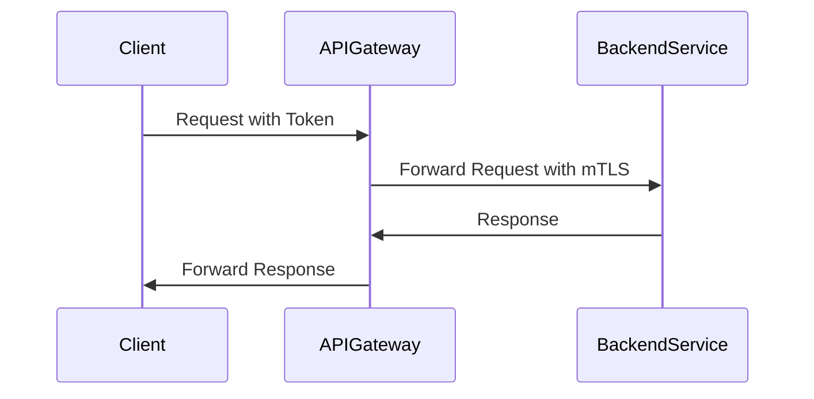

## 7.2. Service-to-Service Security

In the realm of microservices, ensuring secure communication between services is paramount. As microservices architectures inherently involve numerous services interacting over a network, each interaction presents a potential security risk. This section delves into the core principles and patterns for securing service-to-service communication, focusing on Mutual TLS, API Keys, and Tokens. We'll explore these concepts in detail, supported by pseudocode examples to illustrate their implementation.

### Introduction to Service-to-Service Security

Service-to-service security is a critical aspect of microservices architecture, ensuring that communications between services are both authenticated and encrypted. This prevents unauthorized access and protects sensitive data from being intercepted. Let's explore the key components of service-to-service security:

1. **Authentication**: Verifying the identity of a service attempting to communicate with another service.
2. **Authorization**: Determining whether a service has permission to perform a specific action.
3. **Encryption**: Protecting data in transit to prevent eavesdropping and tampering.

### Mutual TLS (mTLS)

Mutual TLS (Transport Layer Security) is a protocol that provides encrypted communication and mutual authentication between services. Unlike standard TLS, which only authenticates the server to the client, mTLS requires both parties to authenticate each other, ensuring a higher level of trust and security.

#### How Mutual TLS Works

1. **Certificate Exchange**: Both client and server present their digital certificates to each other.
2. **Verification**: Each party verifies the other's certificate against a trusted Certificate Authority (CA).
3. **Encrypted Communication**: Once verified, a secure, encrypted channel is established for communication.

#### Benefits of Mutual TLS

- **Strong Authentication**: Both parties are authenticated, reducing the risk of impersonation.
- **Data Integrity**: Ensures that data is not tampered with during transmission.
- **Confidentiality**: Encrypts data to prevent unauthorized access.

#### Implementing Mutual TLS

To implement mTLS, each service must have a valid certificate issued by a trusted CA. Here's a simplified pseudocode example demonstrating the setup of mTLS in a microservices environment:

```pseudocode
// Pseudocode for setting up Mutual TLS

function setupMTLS(server, client):
    // Load server and client certificates
    serverCert = loadCertificate("server-cert.pem")
    clientCert = loadCertificate("client-cert.pem")

    // Load server and client private keys
    serverKey = loadPrivateKey("server-key.pem")
    clientKey = loadPrivateKey("client-key.pem")

    // Configure server with mTLS
    server.configureTLS(serverCert, serverKey, requireClientAuth=True)

    // Configure client with mTLS
    client.configureTLS(clientCert, clientKey, verifyServerCert=True)

    // Establish secure connection
    connection = client.connectTo(server)

    if connection.isSecure():
        print("Secure mTLS connection established")
    else:
        print("Failed to establish secure connection")

// Example usage
server = createServer()
client = createClient()
setupMTLS(server, client)
```

### API Keys and Tokens

API Keys and Tokens are widely used for authenticating service requests in microservices architectures. They provide a simple yet effective way to control access to services.

#### API Keys

An API Key is a unique identifier used to authenticate a service making a request to another service. It is typically included in the request header or as a query parameter.

##### Advantages of API Keys

- **Simplicity**: Easy to implement and use.
- **Access Control**: Can be used to grant or restrict access to specific services or endpoints.

##### Limitations of API Keys

- **Security**: If an API Key is compromised, it can be used by unauthorized parties.
- **Lack of Granularity**: API Keys often provide broad access, lacking fine-grained permissions.

#### Implementing API Key Authentication

Here's a pseudocode example demonstrating how to implement API Key authentication between services:

```pseudocode
// Pseudocode for API Key Authentication

function authenticateRequest(request):
    // Extract API Key from request header
    apiKey = request.getHeader("X-API-Key")

    // Validate API Key
    if isValidApiKey(apiKey):
        return True
    else:
        return False

function isValidApiKey(apiKey):
    // Check if API Key exists in the database
    return database.contains(apiKey)

// Example usage
request = createRequest()
if authenticateRequest(request):
    print("Request authenticated successfully")
else:
    print("Authentication failed")
```

#### Tokens

Tokens, such as JSON Web Tokens (JWT), are another method for authenticating service requests. They provide a more secure and flexible approach compared to API Keys.

##### How Tokens Work

1. **Token Issuance**: A service requests a token from an authentication server.
2. **Token Validation**: The token is included in service requests and validated by the receiving service.
3. **Token Expiry**: Tokens have a limited lifespan, reducing the risk of misuse.

##### Advantages of Tokens

- **Security**: Tokens can be signed and encrypted, providing strong security.
- **Granularity**: Tokens can include claims that specify permissions and roles.

#### Implementing Token-Based Authentication

Here's a pseudocode example demonstrating how to implement token-based authentication using JWT:

```pseudocode
// Pseudocode for Token-Based Authentication using JWT

function generateToken(user):
    // Create token payload with user information and expiration
    payload = {
        "userId": user.id,
        "roles": user.roles,
        "exp": currentTime() + TOKEN_EXPIRATION_TIME
    }

    // Sign the token with a secret key
    token = signJWT(payload, "secret-key")

    return token

function validateToken(token):
    // Decode and verify the token
    payload = decodeJWT(token, "secret-key")

    // Check if token is expired
    if payload.exp < currentTime():
        return False

    return True

// Example usage
user = getUserFromDatabase("user123")
token = generateToken(user)
if validateToken(token):
    print("Token is valid")
else:
    print("Token is invalid or expired")
```

### Pseudocode Implementation: Validating Credentials Between Services

Validating credentials between services is crucial for maintaining secure communication. This involves verifying API Keys or Tokens and ensuring that only authorized services can access specific resources.

#### Example: Validating API Keys

```pseudocode
// Pseudocode for validating API Keys between services

function validateServiceRequest(request):
    // Extract API Key from request
    apiKey = request.getHeader("X-API-Key")

    // Validate API Key against known keys
    if isValidApiKey(apiKey):
        return True
    else:
        return False

// Example usage
incomingRequest = receiveRequest()
if validateServiceRequest(incomingRequest):
    print("Service request validated")
else:
    print("Invalid service request")
```

#### Example: Validating Tokens

```pseudocode
// Pseudocode for validating Tokens between services

function validateServiceToken(request):
    // Extract token from request header
    token = request.getHeader("Authorization").split(" ")[1]

    // Validate token
    if validateToken(token):
        return True
    else:
        return False

// Example usage
incomingRequest = receiveRequest()
if validateServiceToken(incomingRequest):
    print("Service token validated")
else:
    print("Invalid service token")
```

### Visualizing Service-to-Service Security

To better understand the flow of service-to-service security, let's visualize the process using a sequence diagram. This diagram illustrates the interaction between a client service, an API Gateway, and a backend service using mTLS and token-based authentication.



### Design Considerations

When implementing service-to-service security, consider the following:

- **Certificate Management**: Ensure proper management and rotation of certificates for mTLS.
- **Token Expiry**: Implement mechanisms to handle token expiration and renewal.
- **Performance**: Consider the impact of encryption and authentication on service performance.
- **Scalability**: Ensure that the security mechanisms can scale with the number of services.

### Programming Language Specifics

While the pseudocode examples provide a general overview, implementation details may vary based on the programming language and frameworks used. For instance, languages like Java and Python have libraries that simplify mTLS and JWT handling.

### Differences and Similarities

Mutual TLS and token-based authentication are often used together to provide layered security. While mTLS ensures secure communication channels, tokens provide fine-grained access control. Understanding the distinctions and how they complement each other is crucial for designing robust security architectures.

### Try It Yourself

To deepen your understanding, try modifying the pseudocode examples:

- **Experiment with Different Token Claims**: Add custom claims to the JWT payload and validate them.
- **Implement Token Refresh**: Create a mechanism to refresh tokens before they expire.
- **Simulate Certificate Expiry**: Implement logic to handle expired certificates in mTLS.

### Knowledge Check

Before moving on, consider these questions:

- How does Mutual TLS differ from standard TLS?
- What are the advantages and limitations of using API Keys for authentication?
- How do tokens enhance security compared to API Keys?

### Embrace the Journey

Remember, mastering service-to-service security is a journey. As you continue to explore and implement these patterns, you'll build more secure and resilient microservices architectures. Keep experimenting, stay curious, and enjoy the journey!

## Quiz Time!



### What is the primary purpose of Mutual TLS in microservices?

- [x] To provide encrypted communication and mutual authentication between services
- [ ] To simplify the deployment of services
- [ ] To enhance the performance of microservices
- [ ] To reduce the number of services in an architecture

> **Explanation:** Mutual TLS ensures that both parties in a communication are authenticated and that the communication is encrypted, providing a high level of security.

### Which of the following is a limitation of API Keys?

- [x] They often provide broad access, lacking fine-grained permissions
- [ ] They are difficult to implement
- [ ] They cannot be used for authentication
- [ ] They are not compatible with microservices

> **Explanation:** API Keys typically offer broad access and do not support fine-grained permissions, which can be a security concern.

### What is a key advantage of using tokens over API Keys?

- [x] Tokens can include claims that specify permissions and roles
- [ ] Tokens are easier to implement than API Keys
- [ ] Tokens do not require any form of encryption
- [ ] Tokens are only used for internal communication

> **Explanation:** Tokens, such as JWTs, can include claims that define permissions and roles, providing more granular access control compared to API Keys.

### In the context of service-to-service security, what does mTLS stand for?

- [x] Mutual Transport Layer Security
- [ ] Managed Transport Layer Security
- [ ] Modular Transport Layer Security
- [ ] Multi Transport Layer Security

> **Explanation:** mTLS stands for Mutual Transport Layer Security, which involves mutual authentication between communicating parties.

### How does token expiry enhance security?

- [x] By reducing the risk of token misuse over time
- [ ] By making tokens easier to generate
- [x] By ensuring tokens are always valid
- [ ] By allowing tokens to be reused indefinitely

> **Explanation:** Token expiry limits the lifespan of a token, reducing the risk of it being misused if compromised.

### What is a common method for including an API Key in a service request?

- [x] Including it in the request header
- [ ] Embedding it in the URL path
- [ ] Storing it in a cookie
- [ ] Sending it as a separate file

> **Explanation:** API Keys are commonly included in the request header for authentication purposes.

### What is a potential drawback of using mTLS?

- [x] It requires managing and rotating certificates
- [ ] It does not provide encryption
- [x] It is incompatible with microservices
- [ ] It simplifies service deployment

> **Explanation:** mTLS requires proper management and rotation of certificates, which can add complexity to the system.

### Which of the following is a benefit of using JWTs for authentication?

- [x] They can be signed and encrypted for security
- [ ] They are only valid for a single request
- [ ] They do not require any server-side validation
- [ ] They are not compatible with microservices

> **Explanation:** JWTs can be signed and encrypted, providing a secure method for transmitting authentication information.

### What is the role of a Certificate Authority (CA) in mTLS?

- [x] To verify the authenticity of certificates
- [ ] To generate API Keys
- [ ] To encrypt data in transit
- [ ] To manage service deployments

> **Explanation:** A Certificate Authority verifies the authenticity of certificates, ensuring that both parties in mTLS are who they claim to be.

### True or False: Tokens can be used to provide fine-grained access control in microservices.

- [x] True
- [ ] False

> **Explanation:** Tokens, especially JWTs, can include claims that specify permissions and roles, allowing for fine-grained access control.


