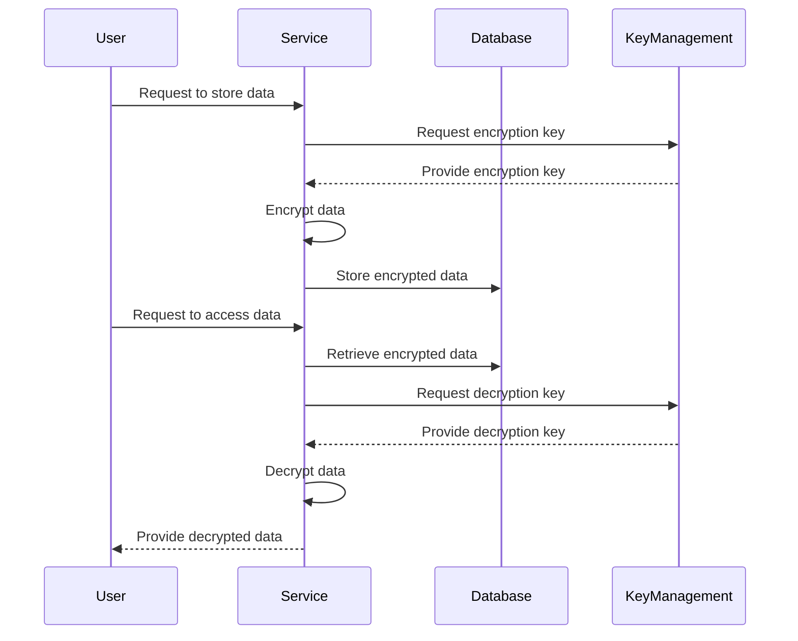

## 7.3. Security in Data Storage

In the realm of microservices, securing data storage is paramount. As microservices architectures become more prevalent, the need to protect sensitive data from unauthorized access and ensure compliance with regulations like the General Data Protection Regulation (GDPR) becomes increasingly critical. This section delves into the strategies and best practices for securing data storage in microservices, with a focus on encryption at rest and compliance with regulatory standards.

### Introduction to Data Storage Security

Data storage security involves protecting stored data from unauthorized access, corruption, or theft. In microservices, where data is often distributed across multiple services and databases, ensuring data security is a complex but essential task. Let's explore the key concepts and strategies for securing data storage in microservices.

### Encryption at Rest

Encryption at rest refers to the process of encrypting data that is stored on a disk or other storage medium. This ensures that even if the storage medium is compromised, the data remains unreadable without the appropriate decryption keys.

#### Why Encrypt Data at Rest?

- **Data Breach Protection**: Encrypting data at rest protects against data breaches by ensuring that stolen data is unusable without decryption keys.
- **Compliance Requirements**: Many regulations, such as GDPR, require encryption of sensitive data to protect user privacy.
- **Risk Mitigation**: Encryption reduces the risk of data exposure in the event of hardware theft or unauthorized access.

#### Implementing Encryption at Rest

To implement encryption at rest in a microservices architecture, follow these steps:

1. **Identify Sensitive Data**: Determine which data needs to be encrypted based on its sensitivity and regulatory requirements.
2. **Choose an Encryption Algorithm**: Select a strong encryption algorithm, such as AES-256, to ensure data security.
3. **Manage Encryption Keys**: Use a secure key management system to generate, store, and rotate encryption keys.
4. **Encrypt Data**: Apply encryption to data before storing it on disk or in a database.
5. **Test and Validate**: Regularly test the encryption implementation to ensure it meets security standards.

#### Pseudocode Example: Encrypting Data at Rest

Below is a pseudocode example demonstrating how to encrypt data before storing it in a database:

```pseudocode
function encryptData(data, encryptionKey):
    # Use AES-256 encryption algorithm
    encryptedData = AES256.encrypt(data, encryptionKey)
    return encryptedData

function storeData(data, database, encryptionKey):
    # Encrypt data before storing
    encryptedData = encryptData(data, encryptionKey)
    # Store encrypted data in the database
    database.store(encryptedData)

data = "Sensitive information"
encryptionKey = "SecureKey123"
database = DatabaseConnection()

storeData(data, database, encryptionKey)
```

### Compliance and Regulations

Compliance with data protection regulations is a critical aspect of data storage security. Regulations like GDPR set strict requirements for how organizations handle personal data, including storage, processing, and transfer.

#### Understanding GDPR

The General Data Protection Regulation (GDPR) is a comprehensive data protection law that applies to organizations operating within the European Union (EU) or handling the personal data of EU citizens. Key requirements include:

- **Data Minimization**: Collect only the data necessary for a specific purpose.
- **Consent**: Obtain explicit consent from individuals before processing their data.
- **Right to Access**: Allow individuals to access their data and obtain information about its processing.
- **Right to Erasure**: Enable individuals to request the deletion of their data.
- **Data Breach Notification**: Notify authorities and affected individuals of data breaches within 72 hours.

#### Ensuring Compliance in Microservices

To ensure compliance with regulations like GDPR in a microservices architecture, consider the following strategies:

1. **Data Inventory**: Maintain an inventory of all data collected, processed, and stored by each microservice.
2. **Data Protection by Design**: Incorporate data protection measures into the design of each microservice.
3. **Access Controls**: Implement strict access controls to limit who can access sensitive data.
4. **Data Anonymization**: Use techniques like pseudonymization and anonymization to protect personal data.
5. **Regular Audits**: Conduct regular audits to ensure compliance with data protection regulations.

#### Pseudocode Example: Implementing Access Controls

Below is a pseudocode example demonstrating how to implement access controls for data storage in a microservices architecture:

```pseudocode
function checkAccess(user, data):
    # Check if the user has permission to access the data
    if user.hasPermission(data):
        return True
    else:
        return False

function accessData(user, data, database):
    # Check access permissions
    if checkAccess(user, data):
        # Retrieve data from the database
        return database.retrieve(data)
    else:
        raise AccessDeniedException("User does not have permission to access this data")

user = User("Alice")
data = "Sensitive information"
database = DatabaseConnection()

try:
    retrievedData = accessData(user, data, database)
    print("Data retrieved:", retrievedData)
except AccessDeniedException as e:
    print(e.message)
```

### Visualizing Data Storage Security

To better understand the flow of data storage security in a microservices architecture, let's visualize the process using a sequence diagram.



### Key Considerations for Data Storage Security

When implementing data storage security in a microservices architecture, consider the following:

- **Performance Impact**: Encryption and decryption can impact performance. Optimize the process to minimize latency.
- **Key Management**: Securely manage encryption keys to prevent unauthorized access.
- **Data Backup**: Ensure encrypted backups to protect against data loss.
- **Regular Updates**: Keep encryption algorithms and libraries up to date to protect against vulnerabilities.

### Programming Language Specifics

While the principles of data storage security apply across programming languages, the implementation details may vary. Consider the following language-specific notes:

- **Java**: Use libraries like JCE (Java Cryptography Extension) for encryption and decryption.
- **Python**: Utilize libraries like PyCrypto or cryptography for secure data handling.
- **JavaScript**: Implement encryption using libraries like CryptoJS for client-side security.

### Differences and Similarities with Other Patterns

Data storage security shares similarities with other security patterns, such as:

- **Authentication and Authorization**: Both involve controlling access to resources.
- **Service-to-Service Security**: Focuses on securing communication between microservices.

However, data storage security specifically addresses the protection of data at rest, whereas other patterns may focus on data in transit or access control.

### Try It Yourself

To deepen your understanding of data storage security, try modifying the pseudocode examples provided. Experiment with different encryption algorithms, key management strategies, and access control mechanisms. Consider the impact of these changes on performance and security.

### Knowledge Check

- What are the key benefits of encrypting data at rest?
- How does GDPR impact data storage security in microservices?
- What are some strategies for ensuring compliance with data protection regulations?

### Embrace the Journey

Remember, securing data storage in microservices is an ongoing journey. As you implement these strategies, continue to explore new technologies and best practices. Stay informed about emerging threats and regulations to ensure your architecture remains secure and compliant.

## Quiz Time!



### What is the primary purpose of encrypting data at rest?

- [x] To protect stored data from unauthorized access
- [ ] To improve data retrieval speed
- [ ] To enhance data compression
- [ ] To simplify data backup processes

> **Explanation:** Encrypting data at rest ensures that even if the storage medium is compromised, the data remains unreadable without the appropriate decryption keys.

### Which encryption algorithm is commonly used for encrypting data at rest?

- [ ] RSA
- [x] AES-256
- [ ] SHA-256
- [ ] MD5

> **Explanation:** AES-256 is a strong encryption algorithm commonly used for encrypting data at rest due to its security and efficiency.

### What is a key requirement of GDPR related to data storage?

- [ ] Data must be stored in plain text
- [x] Data must be encrypted
- [ ] Data must be stored indefinitely
- [ ] Data must be accessible to everyone

> **Explanation:** GDPR requires that sensitive data be protected, often through encryption, to ensure user privacy and data security.

### What is the role of a key management system in data storage security?

- [x] To generate, store, and rotate encryption keys
- [ ] To compress data for storage
- [ ] To backup data regularly
- [ ] To provide user authentication

> **Explanation:** A key management system is responsible for securely handling encryption keys, which are essential for encrypting and decrypting data.

### How can data anonymization help in ensuring compliance with data protection regulations?

- [x] By protecting personal data through pseudonymization
- [ ] By storing data in a central location
- [ ] By increasing data access speed
- [ ] By reducing data storage costs

> **Explanation:** Data anonymization techniques, such as pseudonymization, help protect personal data and ensure compliance with regulations like GDPR.

### What is the impact of encryption on data storage performance?

- [ ] It improves data retrieval speed
- [x] It can introduce latency
- [ ] It reduces data storage requirements
- [ ] It simplifies data management

> **Explanation:** Encryption and decryption processes can introduce latency, impacting data storage performance.

### Why is regular auditing important for data storage security?

- [x] To ensure compliance with data protection regulations
- [ ] To increase data storage capacity
- [ ] To improve data retrieval speed
- [ ] To reduce data redundancy

> **Explanation:** Regular audits help ensure that data storage practices comply with regulations and identify potential security vulnerabilities.

### What is the benefit of using a strong encryption algorithm like AES-256?

- [x] It provides robust security for stored data
- [ ] It simplifies data retrieval
- [ ] It reduces data storage costs
- [ ] It increases data access speed

> **Explanation:** AES-256 is a strong encryption algorithm that provides robust security for stored data, protecting it from unauthorized access.

### How does data minimization contribute to data storage security?

- [x] By reducing the amount of data collected and stored
- [ ] By increasing data redundancy
- [ ] By simplifying data retrieval
- [ ] By enhancing data compression

> **Explanation:** Data minimization reduces the amount of data collected and stored, minimizing the risk of data breaches and ensuring compliance with regulations.

### True or False: Data encryption at rest is only necessary for sensitive data.

- [x] True
- [ ] False

> **Explanation:** While encryption is particularly important for sensitive data, it can be beneficial for all data to ensure comprehensive security.


