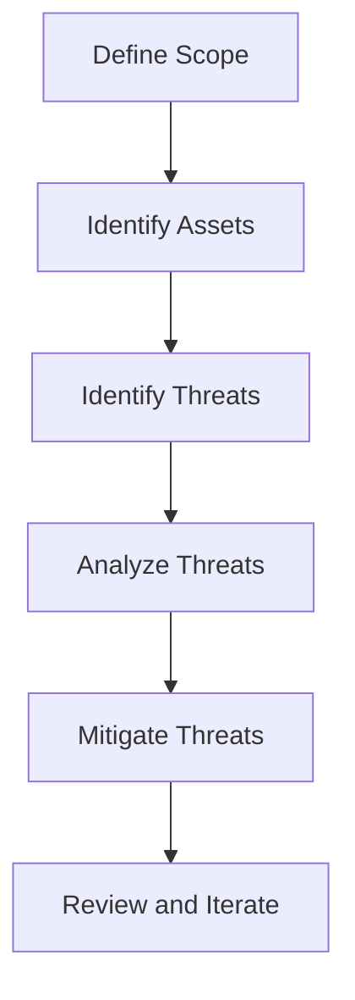
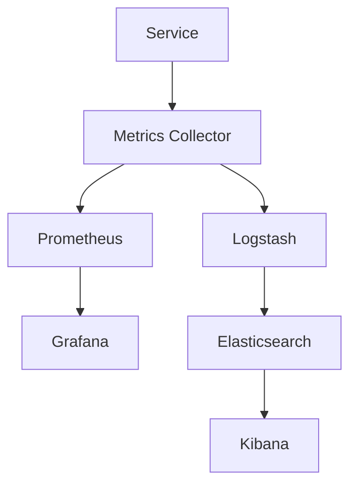

## 7.4. Threat Modeling and Monitoring

In the world of microservices, where applications are composed of numerous independent services, ensuring security becomes a complex task. Threat modeling and monitoring are critical components in safeguarding these distributed systems. In this section, we will delve into the intricacies of identifying vulnerabilities and implementing effective security measures in microservices environments.

### Identifying Vulnerabilities

#### Understanding the Microservices Attack Surface

Microservices architecture introduces a broad attack surface due to its distributed nature. Each service, API endpoint, and communication channel represents a potential entry point for attackers. To effectively identify vulnerabilities, we must first understand the components that constitute this attack surface:

1. **Service Interfaces**: Each microservice exposes APIs that can be targeted by attackers. Ensuring these interfaces are secure is paramount.
2. **Inter-Service Communication**: Microservices often communicate over networks, which can be intercepted or disrupted.
3. **Data Storage**: Each service may have its own database, which needs protection against unauthorized access.
4. **Configuration and Secrets Management**: Misconfigured services or exposed secrets can lead to security breaches.
5. **Deployment and Infrastructure**: The underlying infrastructure, including containers and orchestration tools, must be secured.

#### Conducting a Threat Model

Threat modeling is a structured approach to identifying and prioritizing potential threats. It involves understanding the system architecture, identifying potential threats, and determining the impact of these threats. Here’s a step-by-step guide to conducting a threat model for microservices:

1. **Define the Scope**: Identify which parts of the system will be analyzed. This could be a single service or the entire application.
2. **Identify Assets**: Determine what needs protection, such as sensitive data, service availability, or user privacy.
3. **Identify Threats**: Use frameworks like STRIDE (Spoofing, Tampering, Repudiation, Information Disclosure, Denial of Service, Elevation of Privilege) to categorize potential threats.
4. **Analyze Threats**: Assess the likelihood and impact of each threat. This helps prioritize which threats to address first.
5. **Mitigate Threats**: Develop strategies to mitigate identified threats. This could involve implementing security controls or redesigning parts of the system.
6. **Review and Iterate**: Threat modeling is an ongoing process. Regularly review and update the threat model as the system evolves.

#### Example Threat Model

Let's consider a simple microservices application with three services: User Service, Order Service, and Payment Service. Here's how we might approach threat modeling:

- **User Service**: 
  - **Asset**: User credentials.
  - **Threat**: Credential stuffing attacks.
  - **Mitigation**: Implement rate limiting and multi-factor authentication.

- **Order Service**: 
  - **Asset**: Order data.
  - **Threat**: Unauthorized data access.
  - **Mitigation**: Use access control lists and encrypt sensitive data.

- **Payment Service**: 
  - **Asset**: Payment information.
  - **Threat**: Man-in-the-middle attacks.
  - **Mitigation**: Use TLS for all communications and validate certificates.

### Implementing Security Measures

Once vulnerabilities are identified, the next step is to implement security measures to protect the system. This involves a combination of preventive, detective, and responsive controls.

#### Firewalls

Firewalls are a fundamental security measure that control incoming and outgoing network traffic based on predetermined security rules. In a microservices environment, firewalls can be used to:

- **Restrict Access**: Limit access to services based on IP addresses or network segments.
- **Segment Networks**: Isolate different parts of the application to contain potential breaches.
- **Monitor Traffic**: Log and analyze traffic patterns to detect anomalies.

#### Intrusion Detection Systems (IDS)

Intrusion Detection Systems are designed to detect unauthorized access or anomalies in network traffic. There are two main types of IDS:

- **Network-based IDS (NIDS)**: Monitors network traffic for suspicious activity. It can be deployed at strategic points within the network to analyze traffic to and from all devices.
- **Host-based IDS (HIDS)**: Monitors the characteristics of a single host and the events occurring within that host.

#### Implementing IDS in Microservices

To effectively implement IDS in a microservices architecture, consider the following:

- **Deploy NIDS at the Network Perimeter**: Place NIDS at the boundary of your network to monitor incoming and outgoing traffic.
- **Use HIDS for Critical Services**: Deploy HIDS on servers running critical services to monitor for unauthorized changes or access attempts.
- **Integrate with SIEM**: Use Security Information and Event Management (SIEM) systems to aggregate and analyze data from IDS, providing a comprehensive view of security events.

#### Pseudocode Example: Implementing a Simple IDS

Below is a pseudocode example of a simple IDS that monitors network traffic for suspicious patterns:

```pseudocode
function monitorNetworkTraffic():
    while true:
        packet = captureNetworkPacket()
        if isSuspicious(packet):
            logSuspiciousActivity(packet)
            alertSecurityTeam(packet)

function isSuspicious(packet):
    # Define suspicious patterns
    suspiciousPatterns = ["SQL Injection", "XSS", "Brute Force"]
    for pattern in suspiciousPatterns:
        if pattern in packet.data:
            return true
    return false

function logSuspiciousActivity(packet):
    log("Suspicious activity detected: " + packet.data)

function alertSecurityTeam(packet):
    sendAlert("Security Alert: Suspicious activity detected", packet)
```

### Monitoring Microservices

Monitoring is crucial for maintaining the security and performance of microservices. It involves collecting and analyzing data to detect anomalies, track performance, and ensure compliance.

#### Key Monitoring Metrics

1. **Latency and Response Time**: Measure the time taken for requests to be processed. High latency can indicate performance issues or attacks.
2. **Error Rates**: Track the rate of errors returned by services. A sudden spike in errors could indicate a security breach.
3. **Resource Utilization**: Monitor CPU, memory, and network usage to detect unusual patterns.
4. **Audit Logs**: Maintain logs of user activities and system events for forensic analysis.

#### Tools for Monitoring Microservices

Several tools can be used to monitor microservices effectively:

- **Prometheus**: An open-source monitoring system that collects metrics from configured targets at given intervals.
- **Grafana**: A visualization tool that works with Prometheus to display metrics in dashboards.
- **ELK Stack (Elasticsearch, Logstash, Kibana)**: A powerful toolset for log aggregation, analysis, and visualization.

#### Pseudocode Example: Monitoring Service Latency

Here's a pseudocode example for monitoring service latency:

```pseudocode
function monitorServiceLatency(service):
    while true:
        startTime = getCurrentTime()
        response = sendRequest(service)
        endTime = getCurrentTime()
        latency = endTime - startTime
        logLatency(service, latency)
        if latency > threshold:
            alertOpsTeam(service, latency)

function logLatency(service, latency):
    log("Service: " + service + ", Latency: " + latency + "ms")

function alertOpsTeam(service, latency):
    sendAlert("High latency detected for service: " + service, "Latency: " + latency + "ms")
```

### Visualizing Threat Modeling and Monitoring

To better understand the processes involved in threat modeling and monitoring, let's visualize these concepts using Mermaid.js diagrams.

#### Visualizing Threat Modeling Process



**Diagram Description**: This flowchart illustrates the iterative process of threat modeling, starting from defining the scope to reviewing and iterating on the threat model.

#### Visualizing Monitoring Architecture



**Diagram Description**: This diagram shows a typical monitoring architecture using Prometheus and the ELK stack to collect, store, and visualize metrics and logs.

### Knowledge Check

To reinforce your understanding of threat modeling and monitoring in microservices, consider the following questions:

- What are the key components of a microservices attack surface?
- How does threat modeling help in identifying vulnerabilities?
- What are the differences between NIDS and HIDS?
- Why is monitoring important in a microservices architecture?

### Try It Yourself

Experiment with the pseudocode examples provided in this section. Try modifying the IDS example to detect additional patterns or integrate the monitoring example with a real service to track its latency. Remember, hands-on practice is crucial for mastering these concepts.

### Conclusion

Threat modeling and monitoring are essential practices in securing microservices architectures. By systematically identifying vulnerabilities and implementing robust security measures, we can protect our systems from potential threats. As you continue to explore microservices, remember to regularly review and update your security practices to adapt to evolving threats.

## Quiz Time!



### What is the primary purpose of threat modeling in microservices?

- [x] To identify and prioritize potential threats
- [ ] To design new microservices
- [ ] To monitor service performance
- [ ] To manage service deployments

> **Explanation:** Threat modeling is primarily used to identify and prioritize potential threats to a system.

### Which of the following is NOT a component of the microservices attack surface?

- [ ] Service Interfaces
- [ ] Inter-Service Communication
- [ ] Data Storage
- [x] User Interface Design

> **Explanation:** User Interface Design is not typically considered part of the microservices attack surface.

### What does STRIDE stand for in threat modeling?

- [x] Spoofing, Tampering, Repudiation, Information Disclosure, Denial of Service, Elevation of Privilege
- [ ] Security, Testing, Risk, Identification, Detection, Evaluation
- [ ] System, Threat, Risk, Identification, Defense, Evaluation
- [ ] Spoofing, Testing, Risk, Information, Defense, Evaluation

> **Explanation:** STRIDE is a framework used in threat modeling to categorize potential threats.

### What is the role of a firewall in a microservices architecture?

- [x] To control network traffic based on security rules
- [ ] To store service logs
- [ ] To manage service deployments
- [ ] To monitor service performance

> **Explanation:** Firewalls control network traffic based on predetermined security rules.

### Which type of IDS monitors network traffic for suspicious activity?

- [x] Network-based IDS (NIDS)
- [ ] Host-based IDS (HIDS)
- [ ] Application-based IDS (AIDS)
- [ ] Service-based IDS (SIDS)

> **Explanation:** Network-based IDS (NIDS) monitors network traffic for suspicious activity.

### What is the primary function of Prometheus in a monitoring architecture?

- [x] To collect metrics from configured targets
- [ ] To visualize metrics in dashboards
- [ ] To aggregate logs
- [ ] To store service configurations

> **Explanation:** Prometheus is used to collect metrics from configured targets at given intervals.

### What is the benefit of using TLS in microservices communication?

- [x] To encrypt data and ensure secure communication
- [ ] To speed up data transmission
- [ ] To reduce service latency
- [ ] To simplify service deployment

> **Explanation:** TLS encrypts data to ensure secure communication between services.

### Why is it important to monitor service latency?

- [x] To detect performance issues or attacks
- [ ] To increase service response time
- [ ] To simplify service architecture
- [ ] To reduce service complexity

> **Explanation:** Monitoring service latency helps detect performance issues or potential attacks.

### Which tool is used for log aggregation and analysis in the ELK stack?

- [x] Logstash
- [ ] Prometheus
- [ ] Grafana
- [ ] Kibana

> **Explanation:** Logstash is used for log aggregation and analysis in the ELK stack.

### True or False: Threat modeling is a one-time process that does not need to be revisited.

- [ ] True
- [x] False

> **Explanation:** Threat modeling is an ongoing process that should be regularly reviewed and updated as the system evolves.



Remember, this is just the beginning. As you progress, you'll build more complex and secure microservices systems. Keep experimenting, stay curious, and enjoy the journey!
