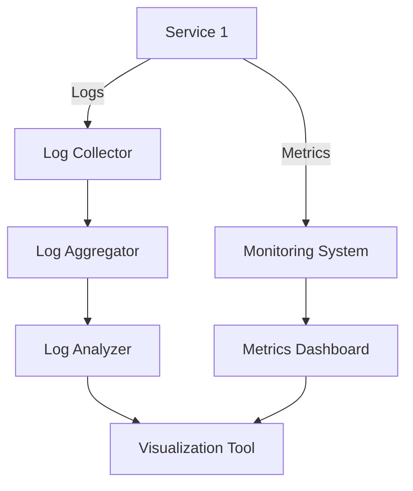

## 8.1. Monitoring and Logging

In the world of microservices, monitoring and logging are crucial components that ensure the health, performance, and reliability of distributed systems. As we dive into this topic, we'll explore how centralized logging and metrics collection play pivotal roles in observability, providing insights into system behavior and facilitating troubleshooting.

### Introduction to Monitoring and Logging

Monitoring and logging are foundational practices in software development, especially in microservices architecture. They provide visibility into the system's operations, enabling developers and operators to detect issues, understand system performance, and make informed decisions.

#### Why Monitoring and Logging Matter

- **Visibility**: Gain insights into system behavior and performance.
- **Troubleshooting**: Quickly identify and resolve issues.
- **Performance Optimization**: Track and improve system efficiency.
- **Security**: Detect and respond to security incidents.

### Centralized Logging

Centralized logging aggregates logs from multiple services into a single location, making it easier to search, analyze, and visualize log data. This approach is essential in microservices, where services are distributed across different environments.

#### Benefits of Centralized Logging

- **Unified View**: Access logs from all services in one place.
- **Simplified Analysis**: Use powerful tools to search and analyze logs.
- **Improved Troubleshooting**: Quickly identify issues across services.

#### Implementing Centralized Logging

To implement centralized logging, you need to set up a logging infrastructure that collects, stores, and processes logs from various services.

##### Key Components

1. **Log Collectors**: Agents that gather logs from services.
2. **Log Aggregators**: Systems that centralize and store logs.
3. **Log Analyzers**: Tools that provide search and visualization capabilities.

##### Pseudocode Example

Here's a simple pseudocode example demonstrating how to set up a centralized logging system:

```pseudocode
// Define a log collector function
function collectLogs(serviceName, logData) {
    // Send log data to the log aggregator
    sendToAggregator(serviceName, logData)
}

// Define a log aggregator function
function sendToAggregator(serviceName, logData) {
    // Store log data in a centralized database
    centralizedDatabase.store(serviceName, logData)
}

// Define a log analyzer function
function analyzeLogs(query) {
    // Retrieve logs from the centralized database
    logs = centralizedDatabase.retrieve(query)
    // Display logs for analysis
    display(logs)
}

// Example usage
collectLogs("AuthService", "User login successful")
collectLogs("PaymentService", "Payment processed")
analyzeLogs("SELECT * FROM logs WHERE serviceName = 'AuthService'")
```

#### Tools for Centralized Logging

- **ELK Stack (Elasticsearch, Logstash, Kibana)**: A popular open-source solution for centralized logging.
- **Fluentd**: A versatile log collector that supports various data sources and outputs.
- **Graylog**: A powerful log management tool with advanced search and analysis capabilities.

### Metrics Collection

Metrics collection involves gathering quantitative data about system performance, such as response times, error rates, and resource usage. This data helps monitor the health of microservices and identify performance bottlenecks.

#### Types of Metrics

- **System Metrics**: CPU usage, memory consumption, disk I/O.
- **Application Metrics**: Request counts, response times, error rates.
- **Business Metrics**: User sign-ups, transactions, revenue.

#### Implementing Metrics Collection

To collect metrics, you need to instrument your code to capture relevant data and send it to a monitoring system.

##### Pseudocode Example

Here's a pseudocode example demonstrating how to collect and report metrics:

```pseudocode
// Define a function to record a metric
function recordMetric(metricName, value) {
    // Send metric data to the monitoring system
    monitoringSystem.send(metricName, value)
}

// Define a function to monitor a service
function monitorService(serviceName) {
    // Record system metrics
    cpuUsage = getCPUUsage(serviceName)
    memoryUsage = getMemoryUsage(serviceName)
    recordMetric(serviceName + ".cpu", cpuUsage)
    recordMetric(serviceName + ".memory", memoryUsage)

    // Record application metrics
    requestCount = getRequestCount(serviceName)
    errorRate = getErrorRate(serviceName)
    recordMetric(serviceName + ".requests", requestCount)
    recordMetric(serviceName + ".errors", errorRate)
}

// Example usage
monitorService("AuthService")
monitorService("PaymentService")
```

#### Tools for Metrics Collection

- **Prometheus**: An open-source monitoring system with a powerful query language.
- **Grafana**: A visualization tool that integrates with various data sources, including Prometheus.
- **Datadog**: A cloud-based monitoring and analytics platform.

### Instrumenting Code for Monitoring

Instrumenting code involves adding monitoring hooks to your application to collect logs and metrics. This process is crucial for gaining insights into system behavior and performance.

#### Best Practices for Instrumentation

- **Granularity**: Choose the right level of detail for logs and metrics.
- **Consistency**: Use consistent formats and naming conventions.
- **Performance**: Minimize the impact of instrumentation on system performance.

##### Pseudocode Example

Here's a pseudocode example demonstrating how to instrument code for monitoring:

```pseudocode
// Define a function to log an event
function logEvent(eventType, message) {
    // Format the log message
    logMessage = formatLogMessage(eventType, message)
    // Send the log message to the log collector
    collectLogs("MyService", logMessage)
}

// Define a function to record a metric
function recordServiceMetric(metricName, value) {
    // Format the metric data
    metricData = formatMetricData(metricName, value)
    // Send the metric data to the monitoring system
    recordMetric(metricName, metricData)
}

// Example usage
logEvent("INFO", "Service started")
recordServiceMetric("responseTime", 200)
```

### Visualizing Monitoring and Logging

Visualizing monitoring and logging data helps identify trends, detect anomalies, and make informed decisions. Tools like Grafana and Kibana provide powerful visualization capabilities.

#### Example Diagram

Below is a Mermaid.js diagram illustrating the flow of logs and metrics in a centralized logging and monitoring system:



**Diagram Description**: This diagram shows how logs and metrics flow from services to a centralized logging and monitoring system, where they are aggregated, analyzed, and visualized.

### Try It Yourself

To deepen your understanding, try modifying the pseudocode examples to:

- Add additional services and metrics.
- Implement error handling for log collection and metric recording.
- Integrate with a real logging or monitoring tool.

### Knowledge Check

- What are the benefits of centralized logging in microservices?
- How can metrics collection help improve system performance?
- What are some best practices for instrumenting code for monitoring?

### Summary

In this section, we've explored the importance of monitoring and logging in microservices architecture. We've discussed centralized logging, metrics collection, and code instrumentation, providing pseudocode examples to illustrate these concepts. By implementing these practices, you can gain valuable insights into your system's behavior, improve performance, and ensure reliability.

### Further Reading

- [ELK Stack Documentation](https://www.elastic.co/guide/en/elastic-stack/current/index.html)
- [Prometheus Documentation](https://prometheus.io/docs/introduction/overview/)
- [Grafana Documentation](https://grafana.com/docs/grafana/latest/)

## Quiz Time!



### What is the primary benefit of centralized logging in microservices?

- [x] Aggregating logs from multiple services into a single location
- [ ] Reducing the number of logs generated by services
- [ ] Automatically fixing errors in the logs
- [ ] Eliminating the need for log analysis

> **Explanation:** Centralized logging aggregates logs from multiple services into a single location, making it easier to search, analyze, and visualize log data.

### Which tool is commonly used for metrics collection in microservices?

- [x] Prometheus
- [ ] Elasticsearch
- [ ] Logstash
- [ ] Fluentd

> **Explanation:** Prometheus is a popular open-source monitoring system used for metrics collection in microservices.

### What is a key component of a centralized logging system?

- [x] Log Collector
- [ ] Code Compiler
- [ ] Database Indexer
- [ ] Network Router

> **Explanation:** A log collector is an agent that gathers logs from services and sends them to a centralized logging system.

### What type of metrics are used to track user sign-ups and transactions?

- [x] Business Metrics
- [ ] System Metrics
- [ ] Application Metrics
- [ ] Security Metrics

> **Explanation:** Business metrics track user sign-ups, transactions, and other business-related activities.

### Which tool is used for visualizing metrics collected from microservices?

- [x] Grafana
- [ ] Fluentd
- [ ] Logstash
- [ ] Graylog

> **Explanation:** Grafana is a visualization tool that integrates with various data sources, including Prometheus, to display metrics.

### What is the purpose of instrumenting code in microservices?

- [x] To collect logs and metrics for monitoring
- [ ] To compile code into machine language
- [ ] To encrypt data for security
- [ ] To optimize code for performance

> **Explanation:** Instrumenting code involves adding monitoring hooks to collect logs and metrics, providing insights into system behavior and performance.

### Which of the following is a best practice for code instrumentation?

- [x] Use consistent formats and naming conventions
- [ ] Minimize the amount of code written
- [ ] Avoid using any third-party libraries
- [ ] Focus only on error logs

> **Explanation:** Using consistent formats and naming conventions is a best practice for code instrumentation, ensuring clarity and uniformity.

### What is the role of a log analyzer in a centralized logging system?

- [x] To provide search and visualization capabilities for logs
- [ ] To compile logs into executable files
- [ ] To encrypt logs for security
- [ ] To delete old logs automatically

> **Explanation:** A log analyzer provides search and visualization capabilities, allowing users to analyze logs effectively.

### What is a common tool used for centralized logging in microservices?

- [x] ELK Stack
- [ ] Kubernetes
- [ ] Docker
- [ ] Terraform

> **Explanation:** The ELK Stack (Elasticsearch, Logstash, Kibana) is a popular open-source solution for centralized logging in microservices.

### True or False: Metrics collection can help identify performance bottlenecks in microservices.

- [x] True
- [ ] False

> **Explanation:** Metrics collection provides quantitative data about system performance, helping identify performance bottlenecks and optimize efficiency.


