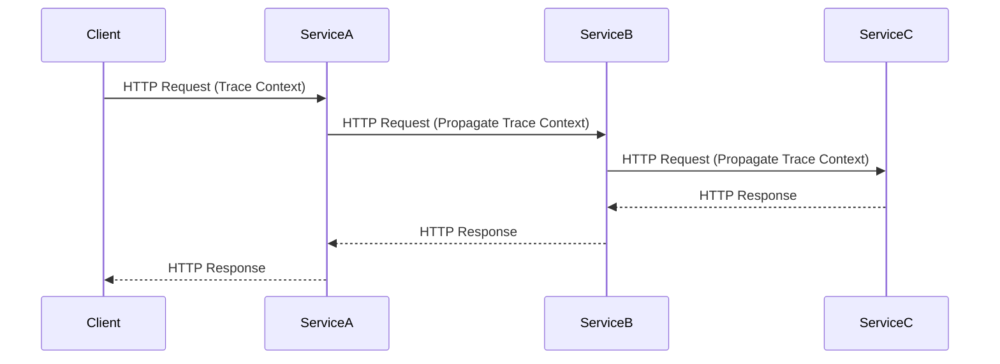

## 8.2. Distributed Tracing

In the world of microservices, where applications are composed of numerous independent services, understanding the flow of requests across these services is crucial. Distributed tracing is a powerful technique that provides visibility into the interactions between microservices, helping developers diagnose performance issues, understand system behavior, and improve the overall reliability of their applications.

### Tracing Requests Across Services

Distributed tracing involves tracking the flow of requests as they traverse through various services in a microservices architecture. This is achieved by capturing trace data at each service boundary and correlating it to form a complete picture of the request's journey.

#### Why Distributed Tracing?

- **Visibility**: Gain insights into how requests are processed across multiple services.
- **Performance Monitoring**: Identify bottlenecks and optimize service performance.
- **Error Diagnosis**: Quickly pinpoint the source of errors or failures in the system.
- **Dependency Analysis**: Understand service dependencies and interactions.

#### Tools for Distributed Tracing

Several tools facilitate distributed tracing in microservices, with Jaeger and Zipkin being among the most popular.

- **Jaeger**: An open-source, end-to-end distributed tracing system originally developed by Uber. It is designed for monitoring and troubleshooting microservices-based distributed systems.
- **Zipkin**: Another open-source distributed tracing system that helps gather timing data needed to troubleshoot latency problems in service architectures.

Both tools provide capabilities to visualize traces, analyze performance metrics, and integrate with various data sources and visualization platforms.

### Implementing Trace Contexts

To effectively trace requests across services, it's essential to propagate trace contexts. A trace context is a set of identifiers that uniquely identify a trace and its spans (individual operations within the trace).

#### Key Components of a Trace Context

- **Trace ID**: A unique identifier for the entire trace, representing a single request or transaction.
- **Span ID**: A unique identifier for a single span within the trace.
- **Parent Span ID**: The Span ID of the parent operation, used to establish relationships between spans.
- **Flags**: Additional metadata, such as sampling decisions or debug flags.

#### Propagating Trace Contexts

To ensure trace contexts are propagated correctly, services must include trace context information in their requests. This typically involves adding trace context headers to HTTP requests or messages.

```pseudocode
// Pseudocode for propagating trace context in an HTTP request

function propagateTraceContext(request, traceContext) {
    // Add trace context headers to the request
    request.headers["Trace-ID"] = traceContext.traceId
    request.headers["Span-ID"] = traceContext.spanId
    request.headers["Parent-Span-ID"] = traceContext.parentSpanId
    request.headers["Flags"] = traceContext.flags
    return request
}
```

### Pseudocode Implementation

Let's explore how to add tracing to service interactions using pseudocode. We'll demonstrate how to instrument a microservice to capture and propagate trace data.

#### Instrumenting a Microservice

To instrument a microservice for distributed tracing, follow these steps:

1. **Initialize Tracing**: Set up a tracing library or SDK to manage trace data.
2. **Start a New Span**: Create a new span for each incoming request.
3. **Propagate Trace Context**: Pass trace context to downstream services.
4. **End the Span**: Complete the span when the operation is finished.

```pseudocode
// Pseudocode for instrumenting a microservice with tracing

function handleRequest(request) {
    // Initialize tracing
    tracer = initializeTracer()

    // Start a new span for the incoming request
    span = tracer.startSpan("handleRequest", {
        traceId: request.headers["Trace-ID"],
        parentSpanId: request.headers["Span-ID"]
    })

    try {
        // Process the request
        response = processRequest(request)

        // Propagate trace context to downstream services
        downstreamRequest = propagateTraceContext(request, {
            traceId: span.traceId,
            spanId: span.spanId,
            parentSpanId: span.parentSpanId,
            flags: span.flags
        })

        // Call downstream service
        downstreamResponse = callDownstreamService(downstreamRequest)

        // Return the response
        return response
    } finally {
        // End the span
        span.end()
    }
}
```

### Visualizing Distributed Tracing

To better understand distributed tracing, let's visualize the flow of a request through a microservices architecture using a sequence diagram.



**Diagram Description**: This sequence diagram illustrates a request originating from a client and traversing through three services (ServiceA, ServiceB, and ServiceC). Each service propagates the trace context to the next, allowing the entire request path to be traced.

### Try It Yourself

To deepen your understanding of distributed tracing, try modifying the pseudocode examples:

- **Experiment with Different Trace Contexts**: Change the trace context identifiers and observe how they affect the trace.
- **Add Additional Spans**: Create additional spans for specific operations within a service.
- **Integrate with a Tracing Tool**: Implement the pseudocode in a real microservices application and integrate with Jaeger or Zipkin to visualize traces.

### Knowledge Check

- **What is the purpose of distributed tracing in microservices?**
- **How do trace contexts help in tracing requests across services?**
- **What are the key components of a trace context?**
- **How can you propagate trace context in an HTTP request?**

### Embrace the Journey

Remember, distributed tracing is a powerful tool that can significantly enhance your ability to monitor and troubleshoot microservices applications. As you experiment with tracing, you'll gain valuable insights into your system's behavior and performance. Keep exploring, stay curious, and enjoy the journey!

## Quiz Time!



### What is the primary purpose of distributed tracing in microservices?

- [x] To gain visibility into request flows across services
- [ ] To encrypt data in transit
- [ ] To manage service configurations
- [ ] To automate deployment processes

> **Explanation:** Distributed tracing provides visibility into how requests are processed across multiple services, helping diagnose performance issues and understand system behavior.

### Which of the following is a key component of a trace context?

- [x] Trace ID
- [ ] Encryption Key
- [ ] Service Name
- [ ] Deployment ID

> **Explanation:** A trace context includes identifiers like Trace ID, Span ID, and Parent Span ID to uniquely identify and correlate spans within a trace.

### How is trace context typically propagated in microservices?

- [x] By adding trace context headers to HTTP requests
- [ ] By storing trace data in a database
- [ ] By using environment variables
- [ ] By encrypting trace data

> **Explanation:** Trace context is propagated by including trace context headers in HTTP requests or messages, allowing services to correlate spans.

### What tool is commonly used for distributed tracing in microservices?

- [x] Jaeger
- [ ] Docker
- [ ] Kubernetes
- [ ] Jenkins

> **Explanation:** Jaeger is a popular open-source tool for distributed tracing, providing capabilities to visualize and analyze traces.

### Which of the following is NOT a benefit of distributed tracing?

- [ ] Performance Monitoring
- [ ] Error Diagnosis
- [ ] Dependency Analysis
- [x] Data Encryption

> **Explanation:** Distributed tracing focuses on monitoring, diagnosing errors, and analyzing dependencies, but it does not handle data encryption.

### What does a Span ID represent in a trace context?

- [x] A unique identifier for a single operation within a trace
- [ ] The total duration of a trace
- [ ] The name of the service handling the request
- [ ] The IP address of the client

> **Explanation:** A Span ID uniquely identifies a single operation or span within a trace, allowing correlation of related operations.

### How can you visualize distributed traces in a microservices architecture?

- [x] By using tools like Jaeger or Zipkin
- [ ] By writing custom scripts
- [ ] By using a spreadsheet
- [ ] By manually inspecting logs

> **Explanation:** Tools like Jaeger and Zipkin provide visualization capabilities for distributed traces, helping analyze request flows.

### What is the role of a Parent Span ID in a trace context?

- [x] To establish relationships between spans
- [ ] To encrypt trace data
- [ ] To identify the client making the request
- [ ] To store trace data in a database

> **Explanation:** The Parent Span ID is used to establish relationships between spans, indicating the hierarchy of operations within a trace.

### What is a common challenge when implementing distributed tracing?

- [x] Propagating trace context across services
- [ ] Encrypting trace data
- [ ] Managing service configurations
- [ ] Automating deployments

> **Explanation:** A common challenge is ensuring trace context is correctly propagated across services to maintain trace continuity.

### True or False: Distributed tracing can help identify bottlenecks in a microservices architecture.

- [x] True
- [ ] False

> **Explanation:** Distributed tracing provides insights into request flows and performance, helping identify bottlenecks and optimize services.


