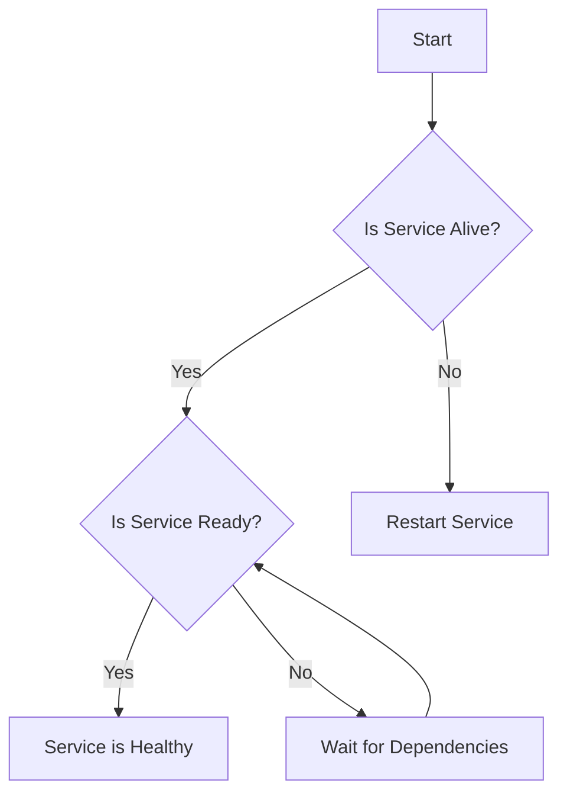
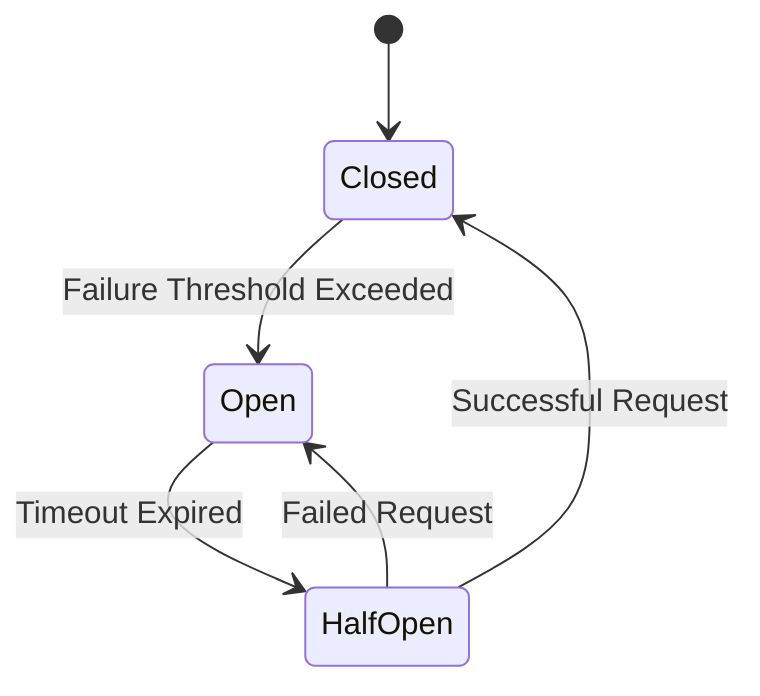

## 8.3. Health Checks and Circuit Breakers

In the dynamic world of microservices architecture, ensuring the reliability and resilience of services is paramount. Health checks and circuit breakers are two essential patterns that help achieve this goal by providing proactive service monitoring and automated recovery mechanisms. In this section, we'll delve into these patterns, exploring their importance, implementation strategies, and how they contribute to a robust microservices ecosystem.

### Introduction to Health Checks

Health checks are mechanisms used to determine the operational status of a service. They provide insights into whether a service is functioning correctly and can handle requests. By regularly performing health checks, we can detect issues early and take corrective actions before they escalate into significant problems.

#### Types of Health Checks

1. **Liveness Checks**: These checks determine if a service is running. They answer the question, "Is the service alive?" If a liveness check fails, it often indicates that the service needs to be restarted.

2. **Readiness Checks**: These checks assess whether a service is ready to handle requests. A service might be alive but not ready to process requests due to initialization tasks or dependencies not being available.

3. **Startup Checks**: These are similar to readiness checks but are performed during the startup phase of a service. They ensure that all necessary conditions are met before the service starts accepting traffic.

#### Implementing Health Checks

Health checks can be implemented in various ways, depending on the technology stack and requirements. Here is a pseudocode example illustrating a basic health check implementation:

```pseudocode
function healthCheck() {
    status = {
        "liveness": checkLiveness(),
        "readiness": checkReadiness(),
        "startup": checkStartup()
    }
    return status
}

function checkLiveness() {
    // Check if the service process is running
    return process.isRunning()
}

function checkReadiness() {
    // Check if the service can handle requests
    return database.isConnected() && cache.isAvailable()
}

function checkStartup() {
    // Check if the service has completed initialization
    return initialization.isComplete()
}
```

In this example, the `healthCheck` function aggregates the results of liveness, readiness, and startup checks, providing a comprehensive view of the service's health.

### Introduction to Circuit Breakers

Circuit breakers are a design pattern used to prevent cascading failures in distributed systems. They act as a safety mechanism that stops the flow of requests to a failing service, allowing it time to recover. This pattern is inspired by electrical circuit breakers, which interrupt the flow of electricity to prevent damage.

#### Circuit Breaker States

A circuit breaker can be in one of three states:

1. **Closed**: Requests are allowed to flow through. If failures occur, the circuit breaker keeps track of them.

2. **Open**: Requests are blocked from reaching the service. This state is triggered when the failure threshold is exceeded.

3. **Half-Open**: A limited number of requests are allowed to pass through to test if the service has recovered. If successful, the circuit breaker transitions back to the closed state.

#### Implementing Circuit Breakers

Implementing a circuit breaker involves defining the logic for state transitions and handling requests based on the current state. Here's a pseudocode example:

```pseudocode
class CircuitBreaker {
    state = "CLOSED"
    failureCount = 0
    failureThreshold = 5
    resetTimeout = 30000 // 30 seconds

    function callService(request) {
        if (state == "OPEN") {
            return "Service Unavailable"
        }

        try {
            response = service.call(request)
            reset()
            return response
        } catch (Exception e) {
            recordFailure()
            if (failureCount >= failureThreshold) {
                openCircuit()
            }
            return "Service Unavailable"
        }
    }

    function recordFailure() {
        failureCount += 1
    }

    function reset() {
        state = "CLOSED"
        failureCount = 0
    }

    function openCircuit() {
        state = "OPEN"
        setTimeout(halfOpenCircuit, resetTimeout)
    }

    function halfOpenCircuit() {
        state = "HALF-OPEN"
    }
}
```

In this example, the `CircuitBreaker` class manages the state transitions and handles requests based on the current state. The `callService` function attempts to call the service and records failures. If the failure threshold is exceeded, the circuit opens, preventing further requests.

### Visualizing Health Checks and Circuit Breakers

To better understand the flow of health checks and circuit breakers, let's visualize these concepts using Mermaid.js diagrams.

#### Health Check Flow



**Diagram Description**: This flowchart illustrates the process of performing health checks. It starts by checking if the service is alive, followed by readiness checks. If the service is not alive, it is restarted. If it is not ready, the system waits for dependencies to become available.

#### Circuit Breaker State Transitions



**Diagram Description**: This state diagram shows the transitions between the different states of a circuit breaker. It starts in the closed state, transitions to open when the failure threshold is exceeded, and moves to half-open after a timeout. Successful requests in the half-open state transition the breaker back to closed.

### Proactive Service Monitoring

Proactive service monitoring involves continuously assessing the health of services and taking corrective actions when issues are detected. Health checks and circuit breakers play a crucial role in this process by providing real-time insights and preventing failures from propagating through the system.

#### Benefits of Proactive Monitoring

- **Early Detection of Issues**: Health checks help identify problems before they impact users, allowing for timely interventions.
- **Improved Resilience**: Circuit breakers prevent cascading failures, enhancing the overall resilience of the system.
- **Automated Recovery**: By integrating health checks and circuit breakers with automated recovery mechanisms, services can recover from failures without manual intervention.

### Automated Recovery Mechanisms

Automated recovery mechanisms are processes that automatically restore services to a healthy state when issues are detected. These mechanisms can be integrated with health checks and circuit breakers to provide a seamless recovery experience.

#### Implementing Automated Recovery

Automated recovery can be implemented using various strategies, such as:

1. **Service Restarts**: Automatically restarting services that fail liveness checks.

2. **Traffic Rerouting**: Redirecting traffic to healthy instances when a service is unavailable.

3. **Scaling**: Automatically scaling up resources to handle increased load or recover from failures.

Here's a pseudocode example illustrating automated recovery using service restarts:

```pseudocode
function monitorService(service) {
    while (true) {
        status = service.healthCheck()
        if (status.liveness == false) {
            restartService(service)
        }
        sleep(5000) // Check every 5 seconds
    }
}

function restartService(service) {
    // Logic to restart the service
    service.stop()
    service.start()
}
```

In this example, the `monitorService` function continuously checks the health of a service and restarts it if the liveness check fails.

### Try It Yourself

To deepen your understanding of health checks and circuit breakers, try modifying the pseudocode examples provided. Experiment with different failure thresholds, reset timeouts, and health check intervals to see how they affect the behavior of the system. Consider implementing additional features, such as logging and alerting, to enhance the monitoring capabilities.

### Knowledge Check

Before we wrap up, let's reinforce what we've learned with a few questions:

- What are the key differences between liveness and readiness checks?
- How do circuit breakers prevent cascading failures in distributed systems?
- What are some benefits of proactive service monitoring?

### Conclusion

Health checks and circuit breakers are vital components of a resilient microservices architecture. By providing proactive monitoring and automated recovery mechanisms, they help ensure that services remain reliable and available, even in the face of failures. As you continue your journey in microservices, remember to leverage these patterns to build robust and resilient systems.

### Quiz Time!



### What is the primary purpose of a liveness check?

- [x] To determine if a service is running
- [ ] To check if a service is ready to handle requests
- [ ] To assess the performance of a service
- [ ] To monitor the network latency

> **Explanation:** A liveness check determines if a service is running, ensuring that the process is alive.

### How does a circuit breaker prevent cascading failures?

- [x] By stopping requests to a failing service
- [ ] By increasing the number of service instances
- [ ] By reducing the load on the network
- [ ] By optimizing database queries

> **Explanation:** A circuit breaker stops requests to a failing service, preventing failures from propagating through the system.

### What state does a circuit breaker enter after the failure threshold is exceeded?

- [ ] Closed
- [x] Open
- [ ] Half-Open
- [ ] Reset

> **Explanation:** After the failure threshold is exceeded, a circuit breaker enters the open state, blocking further requests.

### What is the role of readiness checks in microservices?

- [ ] To restart services that are not running
- [x] To determine if a service is ready to handle requests
- [ ] To monitor network latency
- [ ] To assess the security of a service

> **Explanation:** Readiness checks determine if a service is ready to handle requests, ensuring that it can process incoming traffic.

### Which of the following is a benefit of proactive service monitoring?

- [x] Early detection of issues
- [ ] Increased network latency
- [ ] Reduced service availability
- [ ] Higher operational costs

> **Explanation:** Proactive service monitoring allows for early detection of issues, enabling timely interventions and improving system resilience.

### What is the purpose of the half-open state in a circuit breaker?

- [x] To test if a service has recovered
- [ ] To block all incoming requests
- [ ] To increase the failure threshold
- [ ] To reduce the number of service instances

> **Explanation:** The half-open state allows a limited number of requests to test if a service has recovered, determining whether to transition back to the closed state.

### How can automated recovery mechanisms improve service reliability?

- [x] By restoring services to a healthy state automatically
- [ ] By increasing the number of service failures
- [ ] By reducing the number of service instances
- [ ] By increasing network latency

> **Explanation:** Automated recovery mechanisms restore services to a healthy state automatically, improving reliability and reducing downtime.

### What is a common strategy for implementing automated recovery?

- [x] Service restarts
- [ ] Increasing network latency
- [ ] Reducing service instances
- [ ] Disabling health checks

> **Explanation:** Service restarts are a common strategy for implementing automated recovery, ensuring that services are restored to a healthy state.

### Which of the following is NOT a type of health check?

- [ ] Liveness check
- [ ] Readiness check
- [ ] Startup check
- [x] Performance check

> **Explanation:** Performance checks are not a type of health check. Health checks focus on liveness, readiness, and startup status.

### True or False: Circuit breakers can help improve system resilience by preventing failures from spreading.

- [x] True
- [ ] False

> **Explanation:** Circuit breakers improve system resilience by preventing failures from spreading, ensuring that issues are contained and managed effectively.



Remember, this is just the beginning. As you progress, you'll build more complex and resilient microservices systems. Keep experimenting, stay curious, and enjoy the journey!

---
