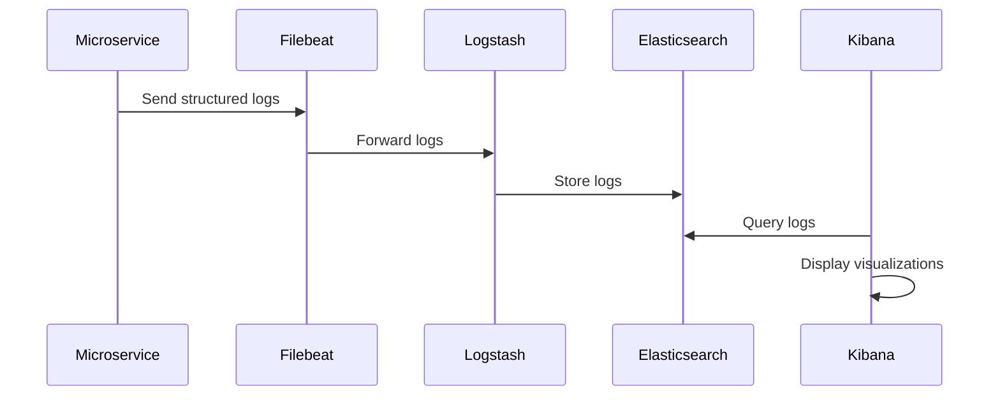

## 8.4. Logging Patterns

In the realm of microservices architecture, logging is a critical component for maintaining observability, diagnosing issues, and ensuring the smooth operation of distributed systems. As microservices are inherently complex due to their distributed nature, effective logging patterns are essential for developers and operations teams to gain insights into system behavior, troubleshoot problems, and optimize performance. In this section, we will delve into two key logging patterns: **Structured Logging** and **Log Aggregation and Analysis**. We will explore their importance, implementation strategies, and how they contribute to the overall observability of microservices.

### Structured Logging

**Structured Logging** is a logging practice that involves capturing log data in a consistent, structured format, typically as key-value pairs or JSON objects. This approach contrasts with traditional unstructured logging, where log messages are free-form text strings. Structured logging offers several advantages, including improved searchability, easier parsing, and better integration with log analysis tools.

#### Benefits of Structured Logging

1. **Enhanced Searchability**: Structured logs can be easily queried and filtered based on specific fields, making it simpler to locate relevant information.
2. **Improved Parsing**: Log entries in a structured format can be automatically parsed by log management systems, reducing the need for complex regex patterns.
3. **Better Integration**: Structured logs integrate seamlessly with log aggregation and analysis tools, enabling advanced analytics and visualization.
4. **Consistency**: A uniform logging format across services ensures consistency, making it easier to correlate logs from different services.

#### Implementing Structured Logging

To implement structured logging in a microservices architecture, follow these steps:

1. **Define a Logging Schema**: Establish a consistent schema for log entries, including fields such as timestamp, log level, service name, request ID, and message.

2. **Use a Logging Library**: Leverage a logging library that supports structured logging. Many modern logging libraries, such as Logback, Log4j2, and Serilog, offer built-in support for structured logging.

3. **Instrument Your Code**: Modify your code to produce structured log entries. Ensure that all log messages adhere to the defined schema.

4. **Centralize Log Management**: Use a centralized log management system to collect, store, and analyze structured logs from all services.

#### Pseudocode Example

Below is a pseudocode example demonstrating structured logging in a microservice:

```pseudocode
// Define a structured log entry
logEntry = {
    "timestamp": getCurrentTimestamp(),
    "level": "INFO",
    "service": "OrderService",
    "requestId": getRequestId(),
    "message": "Order processed successfully",
    "orderId": order.id,
    "customerId": order.customerId
}

// Log the structured entry
logStructured(logEntry)
```

In this example, the `logEntry` object contains fields such as `timestamp`, `level`, `service`, `requestId`, `message`, `orderId`, and `customerId`. This structured format ensures that the log entry is consistent and easily searchable.

#### Try It Yourself

Experiment with structured logging by modifying the pseudocode example. Try adding additional fields, such as `responseTime` or `errorDetails`, to capture more information about each log entry. Observe how these changes affect the searchability and analysis of logs.

### Log Aggregation and Analysis

**Log Aggregation and Analysis** involves collecting logs from multiple services, storing them in a centralized location, and using tools to analyze and visualize the data. This pattern is crucial for gaining insights into the behavior of a distributed system and identifying issues that may not be apparent from individual service logs.

#### Benefits of Log Aggregation

1. **Centralized View**: Aggregating logs from all services provides a holistic view of the system, making it easier to identify patterns and correlations.
2. **Simplified Troubleshooting**: With all logs in one place, troubleshooting becomes more efficient, as developers can trace requests across services.
3. **Advanced Analytics**: Log aggregation tools offer powerful analytics capabilities, enabling teams to perform complex queries and generate visualizations.
4. **Scalability**: Centralized log management systems are designed to handle large volumes of log data, ensuring scalability as the system grows.

#### Implementing Log Aggregation

To implement log aggregation in a microservices architecture, follow these steps:

1. **Choose a Log Aggregation Tool**: Select a tool or platform that supports log aggregation and analysis. Popular options include the ELK Stack (Elasticsearch, Logstash, Kibana), Splunk, and Graylog.

2. **Configure Log Forwarders**: Set up log forwarders on each service to send logs to the centralized log management system. Tools like Filebeat or Fluentd can be used for this purpose.

3. **Define Log Retention Policies**: Establish policies for log retention and archiving to manage storage costs and comply with regulatory requirements.

4. **Set Up Dashboards and Alerts**: Use the log aggregation tool to create dashboards and set up alerts for specific log patterns or anomalies.

#### Pseudocode Example

Below is a pseudocode example demonstrating log aggregation using the ELK Stack:

```pseudocode
// Configure Filebeat to forward logs to Logstash
filebeatConfig = {
    "inputs": [
        {
            "type": "log",
            "paths": ["/var/log/orderservice/*.log"]
        }
    ],
    "output": {
        "logstash": {
            "hosts": ["logstash.example.com:5044"]
        }
    }
}

// Logstash configuration to process logs
logstashConfig = {
    "input": {
        "beats": {
            "port": 5044
        }
    },
    "filter": {
        "json": {
            "source": "message"
        }
    },
    "output": {
        "elasticsearch": {
            "hosts": ["elasticsearch.example.com:9200"]
        }
    }
}

// Kibana dashboard setup
kibanaDashboard = {
    "visualizations": [
        {
            "type": "line_chart",
            "title": "Order Processing Time",
            "data_source": "elasticsearch",
            "query": "service:OrderService AND level:INFO"
        }
    ]
}
```

In this example, Filebeat is configured to forward logs from the `OrderService` to Logstash, which processes the logs and sends them to Elasticsearch. Kibana is then used to create a dashboard for visualizing order processing times.

#### Try It Yourself

Experiment with log aggregation by modifying the pseudocode example. Try adding additional log sources, such as logs from other services, and create new visualizations in Kibana to gain insights into different aspects of the system.

### Visualizing Logging Patterns

To better understand the flow of logs in a microservices architecture, let's visualize the process using a sequence diagram:



This diagram illustrates the flow of logs from a microservice to Filebeat, which forwards them to Logstash for processing. The processed logs are then stored in Elasticsearch, where they can be queried and visualized using Kibana.

### Design Considerations

When implementing logging patterns in a microservices architecture, consider the following:

- **Performance Impact**: Ensure that logging does not significantly impact the performance of your services. Use asynchronous logging where possible to minimize latency.
- **Security and Privacy**: Be mindful of sensitive information in logs. Implement log redaction or encryption to protect sensitive data.
- **Log Volume**: Manage log volume by setting appropriate log levels and using log rotation to prevent excessive storage usage.
- **Compliance**: Ensure that your logging practices comply with relevant regulations, such as GDPR or HIPAA, especially when handling personal data.

### Programming Language Specifics

While the concepts of structured logging and log aggregation are language-agnostic, the implementation details may vary depending on the programming language and logging libraries used. For example, in Java, you might use Logback with SLF4J for structured logging, while in Python, you could use the `logging` module with JSONFormatter.

### Differences and Similarities

Structured logging and log aggregation are complementary patterns that work together to enhance observability in microservices. While structured logging focuses on the format and consistency of log entries, log aggregation deals with the collection, storage, and analysis of logs. Both patterns are essential for effective monitoring and troubleshooting in a distributed system.

## Quiz Time!



### What is the primary advantage of structured logging over traditional logging?

- [x] Enhanced searchability and parsing
- [ ] Reduced log volume
- [ ] Increased log retention
- [ ] Simplified log rotation

> **Explanation:** Structured logging provides enhanced searchability and parsing capabilities due to its consistent format, making it easier to query and analyze logs.

### Which tool is commonly used for log aggregation in microservices?

- [x] ELK Stack
- [ ] GitHub
- [ ] Jenkins
- [ ] Docker

> **Explanation:** The ELK Stack (Elasticsearch, Logstash, Kibana) is a popular choice for log aggregation and analysis in microservices architectures.

### What is a key benefit of centralized log management?

- [x] Simplified troubleshooting
- [ ] Increased log volume
- [ ] Reduced compliance requirements
- [ ] Enhanced code readability

> **Explanation:** Centralized log management simplifies troubleshooting by providing a holistic view of logs from all services, making it easier to identify patterns and issues.

### What is the role of Filebeat in the ELK Stack?

- [x] Forwarding logs to Logstash
- [ ] Storing logs in Elasticsearch
- [ ] Visualizing logs in Kibana
- [ ] Encrypting log data

> **Explanation:** Filebeat is responsible for forwarding logs from services to Logstash for processing in the ELK Stack.

### Which of the following is a common field included in structured logs?

- [x] Timestamp
- [ ] Source code line number
- [ ] User password
- [ ] Database schema

> **Explanation:** A timestamp is a common field included in structured logs to indicate when the log entry was created.

### What is a potential risk of logging sensitive information?

- [x] Security and privacy breaches
- [ ] Increased log volume
- [ ] Reduced log retention
- [ ] Simplified troubleshooting

> **Explanation:** Logging sensitive information can lead to security and privacy breaches if the logs are accessed by unauthorized parties.

### How can log volume be managed effectively?

- [x] Setting appropriate log levels
- [ ] Increasing log retention
- [ ] Reducing log rotation frequency
- [ ] Disabling logging

> **Explanation:** Setting appropriate log levels helps manage log volume by ensuring that only relevant information is logged.

### What is a common visualization tool used with the ELK Stack?

- [x] Kibana
- [ ] Grafana
- [ ] Prometheus
- [ ] Splunk

> **Explanation:** Kibana is a common visualization tool used with the ELK Stack to create dashboards and visualizations of log data.

### What is the purpose of log rotation?

- [x] Preventing excessive storage usage
- [ ] Increasing log retention
- [ ] Simplifying log parsing
- [ ] Enhancing log security

> **Explanation:** Log rotation helps prevent excessive storage usage by periodically archiving or deleting old log files.

### True or False: Structured logging is only beneficial for large-scale systems.

- [ ] True
- [x] False

> **Explanation:** Structured logging is beneficial for systems of all sizes, as it improves log searchability, parsing, and integration with analysis tools.



Remember, effective logging is a cornerstone of observability in microservices. By adopting structured logging and log aggregation patterns, we can gain valuable insights into our systems, streamline troubleshooting, and enhance overall system reliability. Keep experimenting, stay curious, and enjoy the journey of mastering microservices observability!
