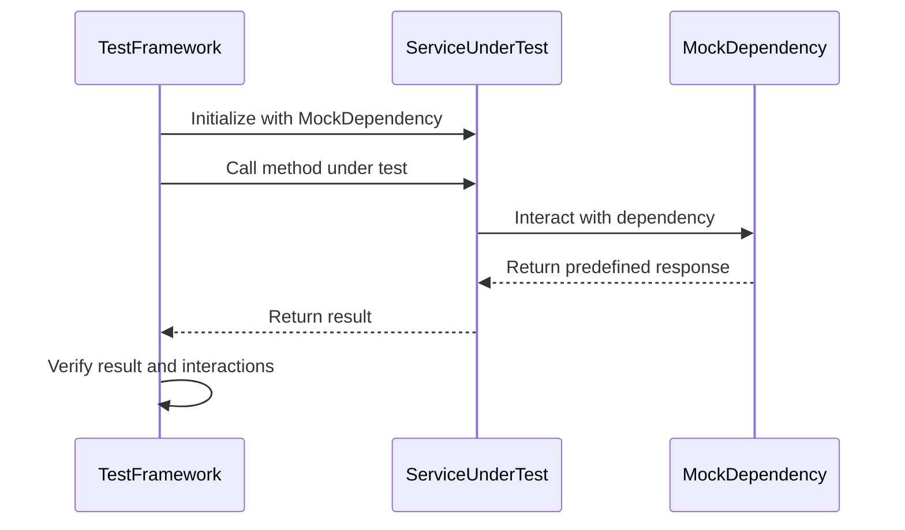

## 9.1. Unit Testing

Unit testing is a fundamental practice in software development, ensuring that individual components of a system function as intended. In the context of microservices, unit testing becomes even more critical due to the distributed nature of the architecture. This section delves into the principles and practices of unit testing within microservices, focusing on isolating service logic and simulating dependencies through mocking and stubbing.

### Understanding Unit Testing in Microservices

Unit testing involves testing the smallest parts of an application, such as functions or methods, in isolation from the rest of the system. The goal is to verify that each unit of the code performs as expected. In microservices, unit testing helps ensure that each service behaves correctly, even when isolated from other services.

#### Key Characteristics of Unit Testing

- **Isolation**: Each test should focus on a single unit of code, independent of external systems or services.
- **Repeatability**: Tests should yield the same results every time they are run, regardless of the environment.
- **Fast Execution**: Unit tests should execute quickly to provide immediate feedback to developers.
- **Automated**: Tests should be automated to facilitate continuous integration and deployment.

### Isolating Service Logic

Isolating service logic is crucial for effective unit testing in microservices. This involves testing the internal logic of a service without interference from external dependencies. By isolating the logic, we can ensure that tests are reliable and focused solely on the functionality of the service.

#### Strategies for Isolating Service Logic

1. **Dependency Injection**: Use dependency injection to pass dependencies into a service. This allows you to replace real dependencies with mocks or stubs during testing.

2. **Interface Segregation**: Define clear interfaces for each service to ensure that tests can focus on specific functionalities without being affected by unrelated code.

3. **Modular Design**: Break down services into smaller, independent modules that can be tested individually.

4. **Encapsulation**: Keep the internal state and logic of a service encapsulated to prevent external interference during testing.

#### Pseudocode Example: Isolating Service Logic

```pseudocode
class OrderService {
    constructor(paymentGateway) {
        this.paymentGateway = paymentGateway;
    }

    processOrder(order) {
        if (order.isValid()) {
            this.paymentGateway.charge(order.amount);
            return "Order processed";
        } else {
            return "Invalid order";
        }
    }
}

// Test case for OrderService
function testProcessOrder() {
    // Mock payment gateway
    let mockPaymentGateway = {
        charge: function(amount) {
            // Simulate successful charge
            return true;
        }
    };

    // Create instance of OrderService with mock dependency
    let orderService = new OrderService(mockPaymentGateway);

    // Create a valid order
    let order = new Order(100, true);

    // Assert that the order is processed correctly
    assert(orderService.processOrder(order) == "Order processed");
}
```

### Mocking and Stubbing

Mocking and stubbing are techniques used to simulate dependencies in unit tests. They allow you to replace real dependencies with controlled, predictable substitutes, ensuring that tests remain isolated and focused on the service logic.

#### Mocking

Mocking involves creating a mock object that mimics the behavior of a real object. Mocks are used to verify interactions between the service under test and its dependencies.

- **Behavior Verification**: Mocks can be used to verify that certain methods are called with specific arguments.
- **State Verification**: Mocks can also be used to check the state of the service after interactions with dependencies.

#### Stubbing

Stubbing involves creating a stub object that provides predefined responses to method calls. Stubs are used to simulate the behavior of dependencies without verifying interactions.

- **Predefined Responses**: Stubs return predefined responses to method calls, allowing tests to focus on the service logic.
- **Simplified Dependencies**: Stubs simplify dependencies by removing complex logic and focusing on specific scenarios.

#### Pseudocode Example: Mocking and Stubbing

```pseudocode
class EmailService {
    sendEmail(recipient, message) {
        // Simulate sending an email
        return "Email sent to " + recipient;
    }
}

class NotificationService {
    constructor(emailService) {
        this.emailService = emailService;
    }

    notifyUser(user, message) {
        return this.emailService.sendEmail(user.email, message);
    }
}

// Test case for NotificationService using stubbing
function testNotifyUser() {
    // Stub email service
    let stubEmailService = {
        sendEmail: function(recipient, message) {
            // Return a predefined response
            return "Stubbed email sent to " + recipient;
        }
    };

    // Create instance of NotificationService with stub dependency
    let notificationService = new NotificationService(stubEmailService);

    // Create a user
    let user = new User("user@example.com");

    // Assert that the notification is sent correctly
    assert(notificationService.notifyUser(user, "Hello") == "Stubbed email sent to user@example.com");
}
```

### Visualizing Unit Testing in Microservices

To better understand the flow of unit testing in microservices, let's visualize the process using a sequence diagram. This diagram illustrates the interactions between a service under test, its dependencies, and the test framework.



### Best Practices for Unit Testing in Microservices

1. **Keep Tests Small and Focused**: Each test should cover a single aspect of the service logic to ensure clarity and maintainability.

2. **Use Descriptive Test Names**: Test names should clearly describe the behavior being tested, making it easier to understand test results.

3. **Avoid Testing Implementation Details**: Focus on testing the behavior of the service rather than its internal implementation details.

4. **Leverage Test Coverage Tools**: Use tools to measure test coverage and identify untested areas of the codebase.

5. **Integrate Tests into CI/CD Pipelines**: Automate the execution of unit tests as part of the continuous integration and deployment process to catch issues early.

### Try It Yourself

To deepen your understanding of unit testing in microservices, try modifying the provided pseudocode examples:

- **Experiment with Different Mocking Frameworks**: Replace the manual mock objects with a mocking framework to simplify test setup.
- **Add More Test Cases**: Create additional test cases to cover edge cases and error scenarios.
- **Refactor the Service Logic**: Refactor the service logic to improve testability and observe how it affects the tests.

### Knowledge Check

Before we conclude, let's reinforce your understanding with a few questions:

- What is the primary goal of unit testing in microservices?
- How does dependency injection facilitate unit testing?
- What is the difference between mocking and stubbing?
- Why is it important to isolate service logic during unit testing?

### Conclusion

Unit testing is a crucial practice in microservices architecture, ensuring that each service functions correctly in isolation. By isolating service logic and simulating dependencies through mocking and stubbing, we can create reliable and maintainable tests. Remember, unit testing is just one part of a comprehensive testing strategy that includes integration testing, end-to-end testing, and more. Keep experimenting, stay curious, and enjoy the journey of mastering microservices testing!

## Quiz Time!



### What is the primary goal of unit testing in microservices?

- [x] To verify that individual components function as intended in isolation.
- [ ] To test the entire system's performance.
- [ ] To ensure that all services are integrated correctly.
- [ ] To validate the user interface design.

> **Explanation:** Unit testing focuses on verifying the functionality of individual components in isolation, ensuring they perform as expected without interference from other parts of the system.

### How does dependency injection facilitate unit testing?

- [x] By allowing dependencies to be easily replaced with mocks or stubs.
- [ ] By integrating services into a monolithic architecture.
- [ ] By increasing the complexity of the service logic.
- [ ] By making the codebase more difficult to maintain.

> **Explanation:** Dependency injection allows dependencies to be passed into a service, making it easy to replace them with mocks or stubs during testing, thus facilitating isolation.

### What is the difference between mocking and stubbing?

- [x] Mocking verifies interactions, while stubbing provides predefined responses.
- [ ] Mocking provides predefined responses, while stubbing verifies interactions.
- [ ] Both mocking and stubbing verify interactions.
- [ ] Both mocking and stubbing provide predefined responses.

> **Explanation:** Mocking involves verifying interactions between the service and its dependencies, while stubbing focuses on providing predefined responses to method calls.

### Why is it important to isolate service logic during unit testing?

- [x] To ensure tests are reliable and focused solely on the service's functionality.
- [ ] To increase the complexity of the test cases.
- [ ] To integrate the service with other systems.
- [ ] To test the user interface design.

> **Explanation:** Isolating service logic ensures that tests are reliable and focused solely on the functionality of the service, without interference from external dependencies.

### What is a key characteristic of unit tests?

- [x] They should execute quickly to provide immediate feedback.
- [ ] They should cover the entire system's functionality.
- [ ] They should be run manually by developers.
- [ ] They should focus on testing the user interface.

> **Explanation:** Unit tests should execute quickly to provide immediate feedback to developers, allowing for rapid identification and resolution of issues.

### Which technique involves creating a mock object that mimics the behavior of a real object?

- [x] Mocking
- [ ] Stubbing
- [ ] Integration Testing
- [ ] End-to-End Testing

> **Explanation:** Mocking involves creating a mock object that mimics the behavior of a real object, allowing for verification of interactions between the service and its dependencies.

### What is the purpose of using stubs in unit testing?

- [x] To simulate the behavior of dependencies without verifying interactions.
- [ ] To verify interactions between the service and its dependencies.
- [ ] To test the entire system's performance.
- [ ] To validate the user interface design.

> **Explanation:** Stubs are used to simulate the behavior of dependencies by providing predefined responses to method calls, allowing tests to focus on the service logic.

### What is a benefit of using modular design in microservices?

- [x] It allows for independent testing of smaller components.
- [ ] It increases the complexity of the codebase.
- [ ] It makes it difficult to isolate service logic.
- [ ] It requires more resources for testing.

> **Explanation:** Modular design allows for independent testing of smaller components, making it easier to isolate service logic and create focused unit tests.

### How can test coverage tools be leveraged in unit testing?

- [x] To measure test coverage and identify untested areas of the codebase.
- [ ] To increase the complexity of test cases.
- [ ] To automate the execution of tests.
- [ ] To verify interactions between services.

> **Explanation:** Test coverage tools can be used to measure test coverage and identify untested areas of the codebase, helping to ensure comprehensive testing.

### Unit tests should focus on testing the behavior of the service rather than its internal implementation details.

- [x] True
- [ ] False

> **Explanation:** Unit tests should focus on testing the behavior of the service to ensure it performs as expected, rather than being concerned with the internal implementation details.


