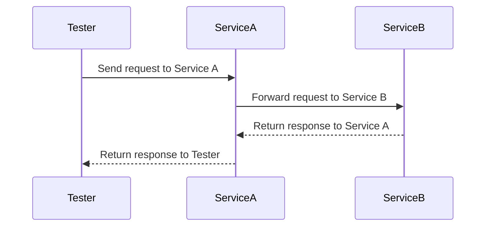

## 9.2. Integration Testing in Microservices

In the realm of microservices architecture, integration testing plays a pivotal role in ensuring that the myriad of services communicate seamlessly and function as a cohesive unit. Unlike monolithic applications, where components are tightly coupled and often tested together, microservices are inherently distributed and independent. This independence, while beneficial for scalability and flexibility, introduces complexities in testing the interactions between services. In this section, we will delve into the intricacies of integration testing in microservices, focusing on verifying inter-service communication and ensuring API contracts are honored.

### Understanding Integration Testing

Integration testing in microservices involves testing the interactions between different services to ensure they work together as expected. It is a crucial step in the testing pyramid, sitting between unit tests, which test individual components, and end-to-end tests, which test the entire application flow.

#### Key Objectives of Integration Testing

1. **Verify Inter-Service Communication**: Ensure that services can communicate with each other correctly, using the expected protocols and data formats.
2. **Validate Data Flow**: Confirm that data is correctly passed between services, maintaining integrity and consistency.
3. **Ensure API Contract Compliance**: Check that services adhere to agreed-upon API contracts, preventing breaking changes that could disrupt communication.
4. **Detect Integration Issues Early**: Identify and resolve issues related to service interactions before they reach production, reducing the risk of failures in live environments.

### Testing Inter-Service Communication

In a microservices architecture, services communicate with each other through well-defined interfaces, often using RESTful APIs, gRPC, or messaging systems. Testing these interactions is critical to ensure that services can collaborate effectively.

#### Strategies for Testing Inter-Service Communication

1. **Mocking and Stubbing**: Use mocks and stubs to simulate service interactions, allowing you to test a service in isolation without relying on other services being available.
2. **Service Virtualization**: Create virtual services that mimic the behavior of real services, enabling testing of interactions without the need for all services to be deployed.
3. **Integration Test Suites**: Develop comprehensive test suites that cover all possible interactions between services, including edge cases and failure scenarios.

#### Pseudocode Example: Mocking a Service

```pseudocode
// Define a mock service for testing
MockService OrderService {
    // Mock method to simulate placing an order
    function placeOrder(orderDetails) {
        // Simulate a successful order placement
        return { status: "success", orderId: "12345" }
    }
}

// Test function to verify interaction with OrderService
function testPlaceOrder() {
    // Arrange: Create a mock instance of OrderService
    mockOrderService = new MockService(OrderService)

    // Act: Call the placeOrder method
    response = mockOrderService.placeOrder({ item: "Book", quantity: 1 })

    // Assert: Verify the response
    assert(response.status == "success")
    assert(response.orderId == "12345")
}
```

### Contract Testing

Contract testing is a crucial aspect of integration testing in microservices. It ensures that services adhere to the agreed-upon API contracts, preventing breaking changes that could disrupt communication between services.

#### What is Contract Testing?

Contract testing involves verifying that a service's API meets the expectations of its consumers. It focuses on the interactions between services, ensuring that the provider service delivers the expected responses for given requests.

#### Benefits of Contract Testing

1. **Prevents Breaking Changes**: By verifying API contracts, contract testing helps prevent changes that could break consumer services.
2. **Facilitates Independent Development**: Services can be developed and tested independently, as long as they adhere to the agreed-upon contracts.
3. **Improves Collaboration**: Contract testing fosters better collaboration between teams by clearly defining the expectations for service interactions.

#### Pseudocode Example: Contract Testing

```pseudocode
// Define a contract for the OrderService API
Contract OrderServiceContract {
    // Expected request and response for placing an order
    request: {
        method: "POST",
        path: "/orders",
        body: { item: "string", quantity: "integer" }
    }
    response: {
        status: 200,
        body: { status: "string", orderId: "string" }
    }
}

// Test function to verify OrderService contract
function testOrderServiceContract() {
    // Arrange: Define the expected request and response
    expectedRequest = {
        method: "POST",
        path: "/orders",
        body: { item: "Book", quantity: 1 }
    }
    expectedResponse = {
        status: 200,
        body: { status: "success", orderId: "12345" }
    }

    // Act: Simulate a request to the OrderService
    actualResponse = simulateRequest(OrderService, expectedRequest)

    // Assert: Verify the response matches the contract
    assert(actualResponse.status == expectedResponse.status)
    assert(actualResponse.body.status == expectedResponse.body.status)
    assert(actualResponse.body.orderId == expectedResponse.body.orderId)
}
```

### Visualizing Integration Testing

To better understand the flow of integration testing in microservices, let's visualize the process using a sequence diagram. This diagram illustrates the interactions between two services, Service A and Service B, during an integration test.



In this diagram, the tester sends a request to Service A, which in turn communicates with Service B. The response from Service B is returned to Service A, which then sends the final response back to the tester. This sequence of interactions is typical in integration testing, where the focus is on verifying the communication between services.

### Challenges in Integration Testing

While integration testing is essential for ensuring seamless inter-service communication, it also presents several challenges:

1. **Complexity**: Testing interactions between multiple services can be complex, especially in large systems with numerous dependencies.
2. **Environment Setup**: Setting up a test environment that accurately mirrors the production environment can be challenging, particularly when dealing with distributed systems.
3. **Data Management**: Managing test data across services can be difficult, as data consistency and integrity must be maintained.
4. **Test Flakiness**: Integration tests can be prone to flakiness, where tests intermittently fail due to timing issues or environmental factors.

### Best Practices for Integration Testing

To overcome these challenges and ensure effective integration testing, consider the following best practices:

1. **Automate Tests**: Automate integration tests to ensure they are run consistently and efficiently. Use continuous integration (CI) pipelines to automatically execute tests on code changes.
2. **Use Test Containers**: Leverage containerization technologies like Docker to create isolated test environments that mimic production.
3. **Focus on Critical Paths**: Prioritize testing critical paths and high-risk interactions between services to maximize test coverage and effectiveness.
4. **Monitor Test Results**: Continuously monitor test results to identify patterns and trends, allowing you to address issues proactively.
5. **Collaborate Across Teams**: Foster collaboration between development and testing teams to ensure that integration tests are comprehensive and aligned with business requirements.

### Try It Yourself

To deepen your understanding of integration testing in microservices, try modifying the pseudocode examples provided. Experiment with different scenarios, such as simulating failures in service interactions or testing additional API contracts. By actively engaging with the code, you'll gain valuable insights into the intricacies of integration testing and how it can be applied to real-world microservices architectures.

### Knowledge Check

Before we conclude, let's summarize the key takeaways from this section:

- Integration testing is essential for verifying inter-service communication and ensuring API contracts are honored in microservices architectures.
- Mocking, stubbing, and service virtualization are effective strategies for testing service interactions.
- Contract testing prevents breaking changes and facilitates independent development by verifying that services adhere to agreed-upon API contracts.
- Visualizing service interactions through diagrams can enhance understanding and aid in identifying potential issues.
- Overcoming challenges in integration testing requires automation, collaboration, and a focus on critical paths.

### Embrace the Journey

Remember, integration testing is a journey, not a destination. As you continue to explore and implement integration testing in your microservices projects, stay curious and open to learning. The landscape of microservices is constantly evolving, and by embracing best practices and continuously refining your testing strategies, you'll be well-equipped to build robust, reliable systems.

## Quiz Time!



### What is the primary goal of integration testing in microservices?

- [x] To verify inter-service communication and ensure API contracts are honored.
- [ ] To test individual components in isolation.
- [ ] To validate the entire application flow.
- [ ] To check the user interface for usability.

> **Explanation:** Integration testing focuses on verifying the interactions between services and ensuring they adhere to API contracts.

### Which strategy involves simulating service interactions without relying on other services being available?

- [x] Mocking and Stubbing
- [ ] End-to-End Testing
- [ ] Contract Testing
- [ ] Unit Testing

> **Explanation:** Mocking and stubbing allow you to simulate service interactions, enabling testing in isolation.

### What is the purpose of contract testing in microservices?

- [x] To ensure that services adhere to agreed-upon API contracts.
- [ ] To test the user interface for usability.
- [ ] To validate the entire application flow.
- [ ] To check individual components in isolation.

> **Explanation:** Contract testing verifies that services meet the expectations of their consumers by adhering to API contracts.

### Which of the following is a challenge in integration testing?

- [x] Complexity in testing interactions between multiple services.
- [ ] Testing individual components in isolation.
- [ ] Validating the user interface for usability.
- [ ] Ensuring API contracts are honored.

> **Explanation:** Integration testing can be complex due to the need to test interactions between multiple services.

### What is a benefit of using service virtualization in integration testing?

- [x] It allows testing of interactions without deploying all services.
- [ ] It focuses on testing individual components.
- [ ] It ensures API contracts are honored.
- [ ] It validates the entire application flow.

> **Explanation:** Service virtualization enables testing of interactions by mimicking the behavior of real services.

### Which best practice involves using containerization technologies to create isolated test environments?

- [x] Use Test Containers
- [ ] Automate Tests
- [ ] Focus on Critical Paths
- [ ] Monitor Test Results

> **Explanation:** Using test containers helps create isolated environments that mimic production, facilitating effective integration testing.

### What should be prioritized in integration testing to maximize test coverage and effectiveness?

- [x] Critical paths and high-risk interactions between services.
- [ ] Testing individual components in isolation.
- [ ] Validating the user interface for usability.
- [ ] Ensuring API contracts are honored.

> **Explanation:** Focusing on critical paths and high-risk interactions ensures that the most important aspects of service communication are tested.

### Which of the following is a benefit of contract testing?

- [x] It prevents breaking changes and facilitates independent development.
- [ ] It focuses on testing individual components.
- [ ] It validates the entire application flow.
- [ ] It checks the user interface for usability.

> **Explanation:** Contract testing helps prevent breaking changes by ensuring services adhere to API contracts, allowing for independent development.

### What is a common challenge in managing test data across services during integration testing?

- [x] Maintaining data consistency and integrity.
- [ ] Testing individual components in isolation.
- [ ] Validating the user interface for usability.
- [ ] Ensuring API contracts are honored.

> **Explanation:** Managing test data across services can be challenging due to the need to maintain consistency and integrity.

### True or False: Integration testing is only necessary for large microservices architectures.

- [ ] True
- [x] False

> **Explanation:** Integration testing is essential for any microservices architecture, regardless of size, to ensure seamless inter-service communication.


