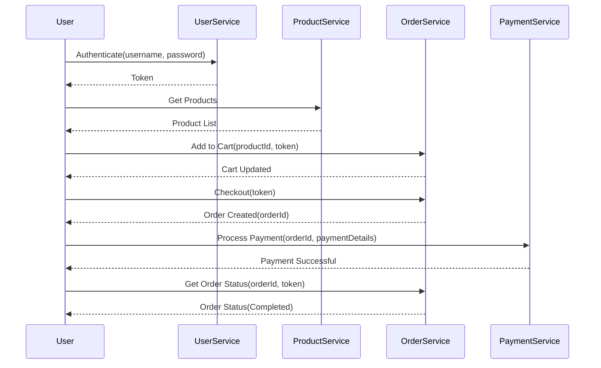

## 9.3. End-to-End Testing

End-to-end (E2E) testing is a critical component in the microservices architecture, ensuring that all parts of the system work together as expected. In this section, we'll explore the principles, strategies, and challenges of E2E testing in microservices, providing detailed examples and pseudocode to illustrate key concepts.

### Understanding End-to-End Testing

End-to-end testing is a testing methodology used to validate the entire software application flow from start to finish. It simulates real user scenarios to ensure that the system behaves as expected in a production-like environment. In microservices, E2E testing is crucial due to the distributed nature of the architecture, where multiple services interact to fulfill a single business process.

#### Key Objectives of End-to-End Testing

1. **Validate System Integrity**: Ensure that all components of the system interact correctly.
2. **Simulate Real User Scenarios**: Test the application as a user would use it.
3. **Identify Integration Issues**: Detect problems that arise from interactions between services.
4. **Ensure Data Consistency**: Verify that data flows correctly across services.
5. **Test Business Processes**: Validate that end-to-end business processes are executed correctly.

### Challenges in End-to-End Testing

End-to-end testing in microservices presents unique challenges due to the complexity and distributed nature of the architecture. Here are some common challenges and strategies to address them:

#### 1. Managing Test Environments

**Challenge**: Setting up and maintaining a test environment that accurately reflects the production environment can be difficult and resource-intensive.

**Strategy**: Use containerization and orchestration tools like Docker and Kubernetes to create isolated and consistent test environments. These tools allow you to spin up and tear down environments quickly, ensuring that tests run in a controlled and repeatable manner.

#### 2. Test Data Management

**Challenge**: Ensuring that test data is consistent and representative of real-world scenarios can be complex, especially when dealing with multiple services.

**Strategy**: Implement data seeding and cleanup strategies to ensure that each test starts with a known state. Use tools like Faker to generate realistic test data and ensure that data is reset between tests to avoid contamination.

#### 3. Service Dependencies

**Challenge**: Microservices often depend on other services, which can lead to cascading failures or false positives if a dependent service is down.

**Strategy**: Use service virtualization or mock services to simulate dependencies. This allows you to isolate the service under test and control the responses of dependent services.

#### 4. Test Execution Time

**Challenge**: End-to-end tests can be slow to execute, especially as the number of services and test cases grows.

**Strategy**: Prioritize critical paths and business processes for end-to-end testing. Use parallel test execution and distributed testing frameworks to reduce overall test execution time.

#### 5. Flaky Tests

**Challenge**: Tests that fail intermittently can undermine confidence in the test suite and make it difficult to identify real issues.

**Strategy**: Implement retry logic and investigate the root causes of flaky tests. Use tools like Selenium Grid to distribute tests across multiple browsers and environments to identify inconsistencies.

### Strategies for Effective End-to-End Testing

To effectively implement end-to-end testing in microservices, consider the following strategies:

#### 1. Define Clear Test Scenarios

Identify the critical business processes and user journeys that need to be validated. Create detailed test scenarios that cover these workflows, ensuring that all interactions between services are tested.

#### 2. Use Behavior-Driven Development (BDD)

Adopt BDD frameworks like Cucumber or SpecFlow to write tests in a natural language that stakeholders can understand. This approach helps bridge the gap between technical and non-technical team members and ensures that tests align with business requirements.

#### 3. Automate Test Execution

Automate the execution of end-to-end tests as part of your continuous integration/continuous deployment (CI/CD) pipeline. This ensures that tests are run consistently and that feedback is provided quickly.

#### 4. Monitor and Analyze Test Results

Implement monitoring and logging to capture detailed information about test execution. Use tools like Grafana and Prometheus to visualize test results and identify trends or patterns in test failures.

#### 5. Incorporate Feedback Loops

Establish feedback loops between development and testing teams to ensure that issues are addressed promptly. Use tools like JIRA or Trello to track test results and manage defects.

### Pseudocode Example: End-to-End Test for a Microservices Workflow

Let's consider a simple e-commerce application with the following microservices:

- **User Service**: Manages user accounts and authentication.
- **Product Service**: Manages product catalog and inventory.
- **Order Service**: Handles order creation and processing.
- **Payment Service**: Processes payments.

We'll write a pseudocode example for an end-to-end test that simulates a user purchasing a product.

```pseudocode
// End-to-End Test: User Purchases a Product

// Step 1: User Authentication
function authenticateUser(username, password) {
    response = UserService.authenticate(username, password)
    assert response.status == 200
    return response.token
}

// Step 2: Browse Products
function browseProducts() {
    response = ProductService.getProducts()
    assert response.status == 200
    return response.products
}

// Step 3: Add Product to Cart
function addProductToCart(productId, token) {
    response = OrderService.addToCart(productId, token)
    assert response.status == 200
}

// Step 4: Checkout and Create Order
function checkout(token) {
    response = OrderService.checkout(token)
    assert response.status == 200
    return response.orderId
}

// Step 5: Process Payment
function processPayment(orderId, paymentDetails) {
    response = PaymentService.processPayment(orderId, paymentDetails)
    assert response.status == 200
}

// Main Test Execution
function testUserPurchaseWorkflow() {
    // Authenticate user
    token = authenticateUser("testuser", "password123")

    // Browse products and select one
    products = browseProducts()
    selectedProduct = products[0] // Select the first product

    // Add product to cart
    addProductToCart(selectedProduct.id, token)

    // Checkout and create order
    orderId = checkout(token)

    // Process payment
    paymentDetails = { cardNumber: "4111111111111111", expiry: "12/25", cvv: "123" }
    processPayment(orderId, paymentDetails)

    // Verify order status
    response = OrderService.getOrderStatus(orderId, token)
    assert response.status == 200
    assert response.orderStatus == "Completed"
}

// Execute the test
testUserPurchaseWorkflow()
```

### Visualizing End-to-End Testing Workflow

To better understand the flow of an end-to-end test in a microservices architecture, let's visualize the process using a sequence diagram.



### Try It Yourself

To deepen your understanding of end-to-end testing in microservices, try modifying the pseudocode example to include additional scenarios, such as:

- Handling payment failures and retry logic.
- Simulating multiple users purchasing products simultaneously.
- Testing different product categories and inventory levels.

### Knowledge Check

Before we conclude, let's reinforce what we've learned with a few questions:

- What are the main objectives of end-to-end testing in microservices?
- How can you manage test environments effectively in a microservices architecture?
- What strategies can you use to reduce the execution time of end-to-end tests?

### Conclusion

End-to-end testing is an essential practice in microservices architecture, ensuring that all components work together seamlessly to deliver a cohesive user experience. By understanding the challenges and implementing effective strategies, you can build a robust testing framework that validates entire workflows and simulates real user scenarios.

Remember, the journey to mastering end-to-end testing in microservices is ongoing. Keep experimenting, stay curious, and embrace the challenges as opportunities for growth.

## Quiz Time!



### What is the primary goal of end-to-end testing in microservices?

- [x] Validate the entire system workflow
- [ ] Test individual service logic
- [ ] Ensure code quality
- [ ] Optimize performance

> **Explanation:** End-to-end testing aims to validate the entire system workflow, ensuring that all components interact correctly.

### Which tool can be used to create isolated and consistent test environments?

- [x] Docker
- [ ] JIRA
- [ ] Selenium
- [ ] Grafana

> **Explanation:** Docker is used to create isolated and consistent test environments through containerization.

### What is a common challenge in end-to-end testing?

- [x] Managing test environments
- [ ] Writing unit tests
- [ ] Implementing CI/CD pipelines
- [ ] Code refactoring

> **Explanation:** Managing test environments is a common challenge due to the complexity of replicating production-like conditions.

### How can you reduce the execution time of end-to-end tests?

- [x] Use parallel test execution
- [ ] Increase test coverage
- [ ] Add more test cases
- [ ] Use manual testing

> **Explanation:** Parallel test execution helps reduce the overall execution time by running tests simultaneously.

### What strategy can be used to simulate service dependencies?

- [x] Service virtualization
- [ ] Code review
- [ ] Manual testing
- [ ] Load balancing

> **Explanation:** Service virtualization allows you to simulate dependencies, isolating the service under test.

### Which framework is suitable for writing tests in a natural language?

- [x] Cucumber
- [ ] JUnit
- [ ] Mocha
- [ ] TestNG

> **Explanation:** Cucumber is a BDD framework that allows writing tests in a natural language.

### What is the benefit of using BDD in end-to-end testing?

- [x] Aligns tests with business requirements
- [ ] Reduces test execution time
- [ ] Increases test coverage
- [ ] Simplifies code refactoring

> **Explanation:** BDD aligns tests with business requirements, making them understandable to stakeholders.

### How can you ensure data consistency in end-to-end tests?

- [x] Implement data seeding and cleanup
- [ ] Use manual data entry
- [ ] Increase test coverage
- [ ] Reduce test cases

> **Explanation:** Data seeding and cleanup ensure that tests start with a known state, maintaining data consistency.

### What tool can be used for monitoring and visualizing test results?

- [x] Grafana
- [ ] Docker
- [ ] JIRA
- [ ] Selenium

> **Explanation:** Grafana is used for monitoring and visualizing test results, providing insights into test execution.

### True or False: End-to-end testing is only necessary for large-scale applications.

- [ ] True
- [x] False

> **Explanation:** End-to-end testing is important for applications of all sizes to ensure that workflows function correctly.


