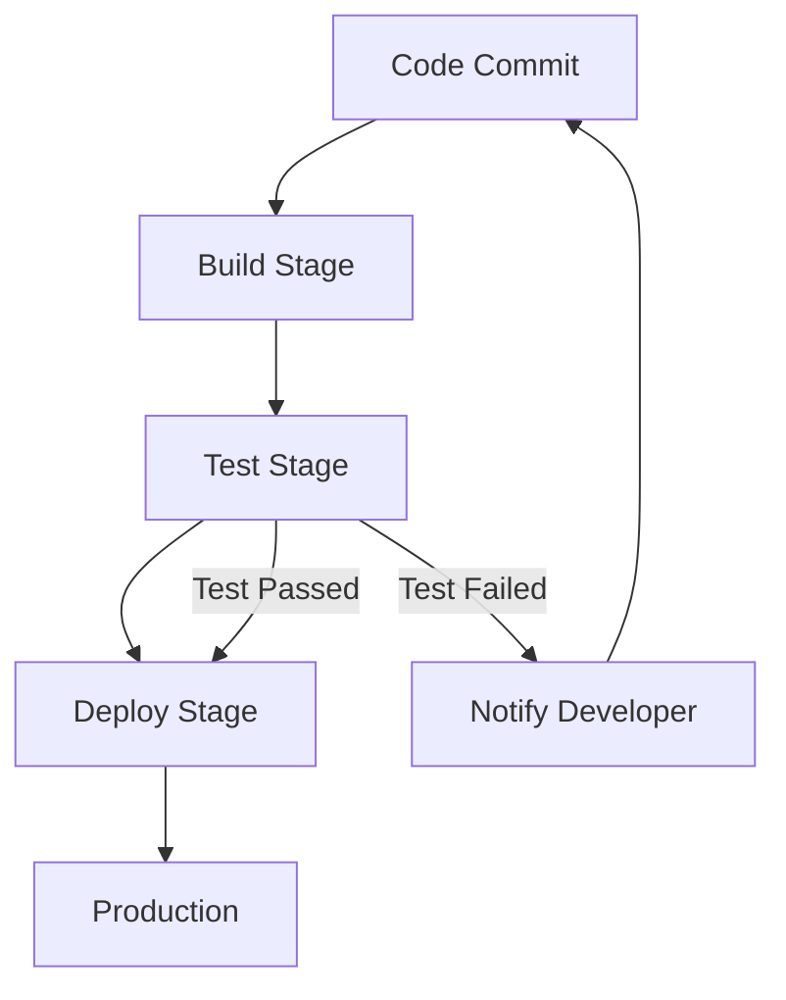

## 9.4. Continuous Testing in CI/CD

Continuous testing is a critical component of the Continuous Integration and Continuous Deployment (CI/CD) pipeline, especially in the context of microservices architecture. It ensures that every change to the codebase is automatically tested, providing immediate feedback to developers and maintaining the integrity of the application. In this section, we will explore the principles and practices of continuous testing, demonstrate how to integrate tests into CI/CD pipelines, and provide pseudocode examples to illustrate these concepts.

### Understanding Continuous Testing

Continuous testing is the process of executing automated tests as part of the software delivery pipeline to obtain immediate feedback on the business risks associated with a software release candidate. It involves running a suite of tests that cover various aspects of the application, including unit tests, integration tests, and end-to-end tests.

#### Key Benefits of Continuous Testing

- **Early Detection of Defects**: By testing continuously, defects are identified and addressed early in the development cycle, reducing the cost and effort required to fix them.
- **Faster Feedback Loop**: Developers receive immediate feedback on the impact of their changes, enabling them to make informed decisions quickly.
- **Improved Quality and Reliability**: Continuous testing ensures that the application remains stable and reliable, even as new features are added.
- **Reduced Time to Market**: By automating testing, organizations can accelerate their release cycles and deliver value to customers more quickly.

### Integrating Tests into CI/CD Pipelines

Integrating tests into CI/CD pipelines involves configuring the pipeline to automatically execute tests whenever code changes are made. This requires setting up a testing framework, writing test cases, and configuring the CI/CD tool to run these tests.

#### Steps to Integrate Tests into CI/CD

1. **Set Up a Testing Framework**: Choose a testing framework that supports the types of tests you need to run (e.g., JUnit for Java, PyTest for Python).
2. **Write Test Cases**: Develop test cases that cover the functionality of your microservices. Ensure that tests are comprehensive and cover edge cases.
3. **Configure the CI/CD Tool**: Set up your CI/CD tool (e.g., Jenkins, GitLab CI, Travis CI) to trigger tests automatically on code changes.
4. **Monitor Test Results**: Review test results to identify and address any issues. Use dashboards and alerts to stay informed about the status of your tests.

#### Example CI/CD Pipeline Configuration

Below is a pseudocode example of a CI/CD pipeline configuration that includes continuous testing:

```pseudocode
pipeline {
    agent any

    stages {
        stage('Build') {
            steps {
                echo 'Building the application...'
                sh 'mvn clean install'
            }
        }

        stage('Test') {
            steps {
                echo 'Running tests...'
                sh 'mvn test'
            }
        }

        stage('Deploy') {
            steps {
                echo 'Deploying the application...'
                sh 'kubectl apply -f deployment.yaml'
            }
        }
    }

    post {
        always {
            echo 'Cleaning up...'
            sh 'mvn clean'
        }
        success {
            echo 'Pipeline completed successfully!'
        }
        failure {
            echo 'Pipeline failed. Check logs for details.'
        }
    }
}
```

### Writing Test Cases for Microservices

Writing effective test cases for microservices involves understanding the architecture and interactions between services. Test cases should be designed to validate the functionality, performance, and reliability of each service.

#### Types of Tests in Microservices

- **Unit Tests**: Test individual components or functions within a service. These tests should be fast and isolated from external dependencies.
- **Integration Tests**: Test interactions between services and external systems. These tests validate that services work together as expected.
- **End-to-End Tests**: Test the entire application workflow from start to finish. These tests simulate real user scenarios and validate the application's behavior.

#### Example Unit Test Pseudocode

Below is a pseudocode example of a unit test for a microservice function:

```pseudocode
function testCalculateTotalPrice() {
    // Arrange
    let cartItems = [
        { price: 10, quantity: 2 },
        { price: 5, quantity: 3 }
    ];
    let expectedTotal = 35;

    // Act
    let actualTotal = calculateTotalPrice(cartItems);

    // Assert
    assertEqual(actualTotal, expectedTotal, "Total price should be 35");
}
```

### Best Practices for Continuous Testing

To maximize the effectiveness of continuous testing, follow these best practices:

- **Automate as Much as Possible**: Automate the execution of tests to ensure they are run consistently and reliably.
- **Prioritize Test Coverage**: Focus on achieving high test coverage to ensure that all critical paths in the application are tested.
- **Optimize Test Execution Time**: Minimize the time it takes to run tests by parallelizing test execution and optimizing test cases.
- **Maintain Test Suites**: Regularly review and update test suites to ensure they remain relevant and effective.
- **Use Test Data Management**: Manage test data effectively to ensure tests are repeatable and produce consistent results.

### Visualizing Continuous Testing in CI/CD

To better understand the flow of continuous testing in a CI/CD pipeline, let's visualize the process using a Mermaid.js diagram:



**Diagram Description**: This diagram illustrates the flow of a CI/CD pipeline with continuous testing. The process begins with a code commit, followed by the build stage, test stage, and deploy stage. If tests pass, the application is deployed to production. If tests fail, the developer is notified, and the process loops back to the code commit stage.

### Try It Yourself

To deepen your understanding of continuous testing in CI/CD, try modifying the pseudocode examples provided. Experiment with adding new test cases, changing the CI/CD pipeline configuration, or integrating additional testing tools. By doing so, you'll gain hands-on experience and a better grasp of the concepts discussed.

### Knowledge Check

Before moving on, take a moment to reflect on what you've learned. Consider the following questions:

- How does continuous testing improve the software development process?
- What are the key components of a CI/CD pipeline with continuous testing?
- How can you optimize test execution time in a CI/CD pipeline?

### Embrace the Journey

Remember, continuous testing is an ongoing process that requires dedication and continuous improvement. As you implement these practices, you'll encounter challenges and opportunities for growth. Stay curious, keep experimenting, and enjoy the journey of mastering continuous testing in CI/CD.

## Quiz Time!



### What is the primary goal of continuous testing in CI/CD?

- [x] To provide immediate feedback on the business risks associated with a software release candidate
- [ ] To replace manual testing entirely
- [ ] To increase the complexity of the testing process
- [ ] To slow down the development cycle

> **Explanation:** Continuous testing aims to provide immediate feedback on the business risks associated with a software release candidate, enabling developers to make informed decisions quickly.

### Which of the following is NOT a benefit of continuous testing?

- [ ] Early detection of defects
- [ ] Faster feedback loop
- [x] Increased manual testing effort
- [ ] Improved quality and reliability

> **Explanation:** Continuous testing reduces manual testing effort by automating test execution, leading to early detection of defects, faster feedback loops, and improved quality and reliability.

### What is the first step in integrating tests into a CI/CD pipeline?

- [x] Set up a testing framework
- [ ] Write test cases
- [ ] Configure the CI/CD tool
- [ ] Monitor test results

> **Explanation:** The first step in integrating tests into a CI/CD pipeline is to set up a testing framework that supports the types of tests you need to run.

### In the provided CI/CD pipeline pseudocode, what happens if the tests fail?

- [ ] The application is deployed to production
- [x] The developer is notified
- [ ] The pipeline skips the deploy stage
- [ ] The pipeline restarts from the build stage

> **Explanation:** If the tests fail, the developer is notified, and the process loops back to the code commit stage.

### Which type of test is designed to validate the functionality of individual components within a service?

- [x] Unit Tests
- [ ] Integration Tests
- [ ] End-to-End Tests
- [ ] Performance Tests

> **Explanation:** Unit tests are designed to validate the functionality of individual components or functions within a service.

### What is a best practice for maximizing the effectiveness of continuous testing?

- [x] Automate as much as possible
- [ ] Increase manual testing
- [ ] Reduce test coverage
- [ ] Run tests only on weekends

> **Explanation:** Automating as much as possible ensures that tests are run consistently and reliably, maximizing the effectiveness of continuous testing.

### Which tool is commonly used for container orchestration in CI/CD pipelines?

- [ ] Jenkins
- [ ] GitLab CI
- [x] Kubernetes
- [ ] Travis CI

> **Explanation:** Kubernetes is commonly used for container orchestration in CI/CD pipelines, managing the deployment and scaling of containerized applications.

### What is the purpose of the 'Test Stage' in a CI/CD pipeline?

- [ ] To build the application
- [x] To run automated tests
- [ ] To deploy the application
- [ ] To notify developers

> **Explanation:** The 'Test Stage' in a CI/CD pipeline is responsible for running automated tests to validate the application's functionality and performance.

### Which of the following is a challenge of continuous testing?

- [ ] Early detection of defects
- [ ] Faster feedback loop
- [ ] Improved quality and reliability
- [x] Maintaining test suites

> **Explanation:** Maintaining test suites is a challenge of continuous testing, as it requires regular updates to ensure tests remain relevant and effective.

### Continuous testing in CI/CD pipelines is only beneficial for large organizations.

- [ ] True
- [x] False

> **Explanation:** Continuous testing in CI/CD pipelines is beneficial for organizations of all sizes, as it improves software quality, reduces time to market, and provides faster feedback.




