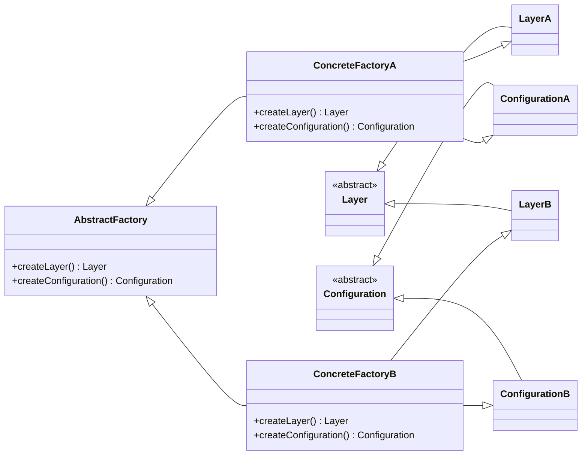
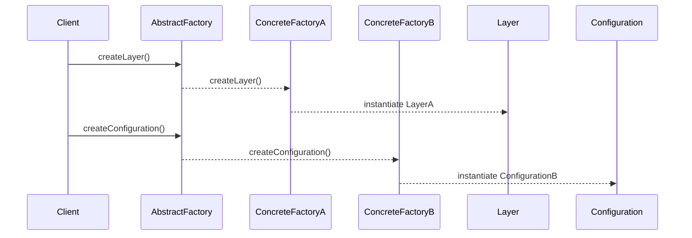

## Introduction
The Abstract Factory Pattern provides an interface for creating families of related or interdependent objects without specifying their concrete classes. This pattern is particularly useful in neural networks for modeling layers and their configurations.

## Benefits
- **Encapsulation of object creation:** Decouples the creation of objects from their usage.
- **Interchangeable families:** Facilitates the interchangeability of families of related objects.
- **Enhanced scalability:** Simplifies the addition of new object families without altering existing code.

## Trade-offs
- **Complexity:** Introduces additional complexity due to the involvement of multiple interfaces and classes.
- **Higher Initial Setup:** Requires a more substantial initial setup to define and implement the abstract factory and related concrete factories.

## UML Diagrams

### Class Diagram


### Sequence Diagram


## Implementation in Various Languages

### Python
```python
from abc import ABC, abstractmethod

class AbstractFactory(ABC):
    @abstractmethod
    def create_layer(self):
        pass
    
    @abstractmethod
    def create_configuration(self):
        pass

class LayerA:
    def __init__(self):
        print("LayerA created")

class ConfigurationA:
    def __init__(self):
        print("ConfigurationA created")

class ConcreteFactoryA(AbstractFactory):
    def create_layer(self):
        return LayerA()
    
    def create_configuration(self):
        return ConfigurationA()

class LayerB:
    def __init__(self):
        print("LayerB created")

class ConfigurationB:
    def __init__(self):
        print("ConfigurationB created")

class ConcreteFactoryB(AbstractFactory):
    def create_layer(self):
        return LayerB()
    
    def create_configuration(self):
        return ConfigurationB()

factory = ConcreteFactoryA()
layer = factory.create_layer()
config = factory.create_configuration()
```

### Java
```java
interface AbstractFactory {
    Layer createLayer();
    Configuration createConfiguration();
}

class LayerA implements Layer {
    public LayerA() {
        System.out.println("LayerA created");
    }
}

class ConfigurationA implements Configuration {
    public ConfigurationA() {
        System.out.println("ConfigurationA created");
    }
}

class ConcreteFactoryA implements AbstractFactory {
    public Layer createLayer() {
        return new LayerA();
    }

    public Configuration createConfiguration() {
        return new ConfigurationA();
    }
}

class LayerB implements Layer {
    public LayerB() {
        System.out.println("LayerB created");
    }
}

class ConfigurationB implements Configuration {
    public ConfigurationB() {
        System.out.println("ConfigurationB created");
    }
}

class ConcreteFactoryB implements AbstractFactory {
    public Layer createLayer() {
        return new LayerB();
    }

    public Configuration createConfiguration() {
        return new ConfigurationB();
    }
}

// Client code
public class Client {
    public static void main(String[] args) {
        AbstractFactory factory = new ConcreteFactoryA();
        Layer layer = factory.createLayer();
        Configuration config = factory.createConfiguration();
    }
}
```

### Scala
```scala
trait AbstractFactory {
    def createLayer(): Layer
    def createConfiguration(): Configuration
}

trait Layer
trait Configuration

class LayerA extends Layer {
    println("LayerA created")
}

class ConfigurationA extends Configuration {
    println("ConfigurationA created")
}

class ConcreteFactoryA extends AbstractFactory {
    def createLayer(): Layer = new LayerA
    def createConfiguration(): Configuration = new ConfigurationA
}

class LayerB extends Layer {
    println("LayerB created")
}

class ConfigurationB extends Configuration {
    println("ConfigurationB created")
}

class ConcreteFactoryB extends AbstractFactory {
    def createLayer(): Layer = new LayerB
    def createConfiguration(): Configuration = new ConfigurationB
}

// Client code
object Client extends App {
    val factory: AbstractFactory = new ConcreteFactoryA
    val layer: Layer = factory.createLayer()
    val config: Configuration = factory.createConfiguration()
}
```

### Clojure
```clojure
(defprotocol AbstractFactory
  (create-layer [this])
  (create-configuration [this]))

(defrecord LayerA []
  Object
  (toString [this] "LayerA created"))

(defrecord ConfigurationA []
  Object
  (toString [this] "ConfigurationA created"))

(defrecord ConcreteFactoryA []
  AbstractFactory
  (create-layer [this] (->LayerA))
  (create-configuration [this] (->ConfigurationA)))

(defrecord LayerB []
  Object
  (toString [this] "LayerB created"))

(defrecord ConfigurationB []
  Object
  (toString [this] "ConfigurationB created"))

(defrecord ConcreteFactoryB []
  AbstractFactory
  (create-layer [this] (->LayerB))
  (create-configuration [this] (->ConfigurationB)))

;; Client code
(def factory (->ConcreteFactoryA))
(def layer (create-layer factory))
(def config (create-configuration factory))

(println layer)
(println config)
```

## Use Cases
- **Layer Creation in Neural Networks:** Simplifies the instantiation and configuration of different neural network layers.
- **Graphical User Interfaces:** Provides a consistent interface for creating UI elements, like buttons and text fields, across different platforms.
- **Database Connectivity:** Abstracts the creation of connection objects for various database engines.

## Related Design Patterns
- **Factory Method:** Defines an interface for creating an object but allows subclasses to alter the type of created object.
- **Builder Pattern:** Focuses on constructing complex objects step by step.
- **Prototype Pattern:** Creates new objects by copying existing ones, promoting cloning over instantiation.

## Resources and References
- [Design Patterns: Elements of Reusable Object-Oriented Software](https://www.amazon.com/Design-Patterns-Elements-Reusable-Object-Oriented/dp/0201633612) by Erich Gamma, Richard Helm, Ralph Johnson, and John Vlissides.
- [Neural Networks from Scratch in Python](https://nnfs.io) by Harrison Kinsley and Daniel Kukieła.
- [Effective Java](https://www.pearson.com/en-us/subject-catalog/p/effective-java/P200000000091/9780134685991) by Joshua Bloch.

## Open Source Frameworks
- **TensorFlow:** Utilizes various design patterns, including Abstract Factory, for model and layer creation.
- **PyTorch:** Allows dynamic construction and manipulation of neural network layers.

## Summary
The Abstract Factory Pattern is a powerful design pattern for creating families of related objects, such as layers and configurations in neural networks. By abstracting the object creation process, it provides flexibility and scalability, enhancing the overall design and maintainability of the software system. Through its clear separation of concerns, it facilitates interchangeability and extensibility, making it a crucial pattern in object-oriented design.

By understanding and effectively implementing the Abstract Factory Pattern, software engineers can develop robust, scalable, and maintainable systems, particularly in the context of neural networks and other complex domains.
