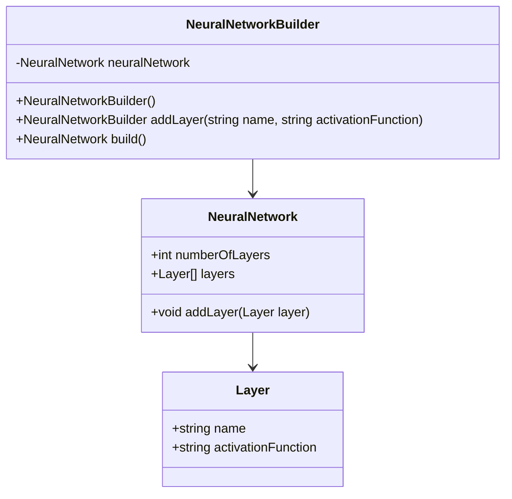
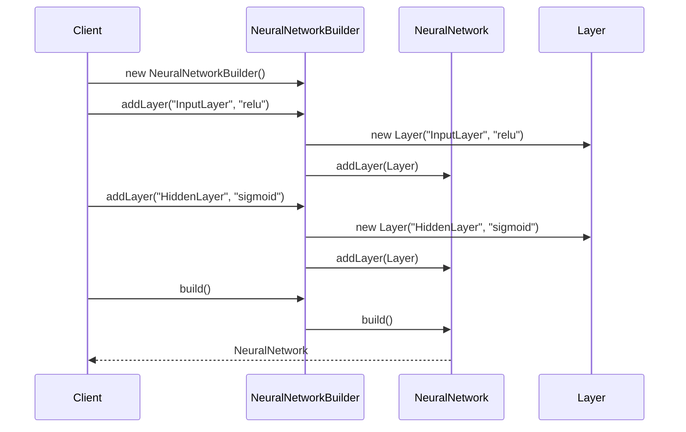

## Builder Design Pattern: Step-by-Step Construction of Complex Objects

### Introduction

The Builder Design Pattern is a creational design pattern that enables the step-by-step construction of complex objects. By separating the construction process from the final representation, the pattern allows for greater flexibility and control over the construction of objects. This makes the Builder pattern particularly useful for constructing multi-layer neural networks where the configuration and initialization of each layer can vary significantly.

### Benefits

- **Flexibility:** Allows for step-by-step construction with various options for configuration.
- **Readability:** Improved readability through method chaining or separate construction processes.
- **Encapsulation:** Encapsulates the construction details and complex initialization.
- **Immutability:** Allows for the creation of immutable objects.

### Trade-Offs

- **Complexity:** Adds additional classes and layers of abstraction.
- **Performance:** Might introduce a slight overhead due to method chaining and construction steps.

### UML Class Diagram



### UML Sequence Diagram



### Example Implementations

#### Python

```python
class Layer:
    def __init__(self, name, activation_function):
        self.name = name
        self.activation_function = activation_function

class NeuralNetwork:
    def __init__(self):
        self.layers = []

    def add_layer(self, layer):
        self.layers.append(layer)

class NeuralNetworkBuilder:
    def __init__(self):
        self.neural_network = NeuralNetwork()

    def add_layer(self, name, activation_function):
        layer = Layer(name, activation_function)
        self.neural_network.add_layer(layer)
        return self

    def build(self):
        return self.neural_network

builder = NeuralNetworkBuilder()
neural_network = (builder.add_layer("InputLayer", "relu")
                         .add_layer("HiddenLayer", "sigmoid")
                         .build())
```

#### Java

```java
class Layer {
    private String name;
    private String activationFunction;

    public Layer(String name, String activationFunction) {
        this.name = name;
        this.activationFunction = activationFunction;
    }
}

class NeuralNetwork {
    private List<Layer> layers = new ArrayList<>();

    public void addLayer(Layer layer) {
        layers.add(layer);
    }
}

class NeuralNetworkBuilder {
    private NeuralNetwork neuralNetwork = new NeuralNetwork();

    public NeuralNetworkBuilder addLayer(String name, String activationFunction) {
        Layer layer = new Layer(name, activationFunction);
        neuralNetwork.addLayer(layer);
        return this;
    }

    public NeuralNetwork build() {
        return neuralNetwork;
    }
}

// Usage
NeuralNetwork neuralNetwork = new NeuralNetworkBuilder()
                                  .addLayer("InputLayer", "relu")
                                  .addLayer("HiddenLayer", "sigmoid")
                                  .build();
```

#### Scala

```scala
case class Layer(name: String, activationFunction: String)

class NeuralNetwork {
    private var layers: List[Layer] = List()

    def addLayer(layer: Layer): Unit = {
        layers = layers :+ layer
    }

    def getLayers: List[Layer] = layers
}

class NeuralNetworkBuilder {
    private val neuralNetwork = new NeuralNetwork()

    def addLayer(name: String, activationFunction: String): NeuralNetworkBuilder = {
        val layer = Layer(name, activationFunction)
        neuralNetwork.addLayer(layer)
        this
    }

    def build(): NeuralNetwork = neuralNetwork
}

// Usage
val neuralNetwork = new NeuralNetworkBuilder()
                        .addLayer("InputLayer", "relu")
                        .addLayer("HiddenLayer", "sigmoid")
                        .build()
```

#### Clojure

```clojure
(defrecord Layer [name activation-function])

(defrecord NeuralNetwork [layers])

(defn- add-layer [nn layer]
  (update nn :layers conj layer))

(defn create-builder []
  (atom (->NeuralNetwork [])))

(defn add-layer-to-builder [builder name activation-function]
  (swap! builder add-layer (->Layer name activation-function)))

(defn build [builder]
  @builder)

;; Usage
(def builder (create-builder))
(add-layer-to-builder builder "InputLayer" "relu")
(add-layer-to-builder builder "HiddenLayer" "sigmoid")
(def neural-network (build builder))
```

### Use Cases

- **Multi-layer Neural Networks:** Customizing the number of layers, types of neurons, and activation functions.
- **Game Development:** Constructing complex game objects with multiple components.
- **Report Generation:** Assembling complex reports with various sections and data points.

### Related Design Patterns

- **Factory Pattern:** Similar but focuses on the creation of objects without specifying the exact class.
- **Prototype Pattern:** Deals with cloning existing objects instead of constructing new ones.

### Resources and References

- **Books:**
  - "Design Patterns: Elements of Reusable Object-Oriented Software" by Erich Gamma, Richard Helm, Ralph Johnson, John Vlissides
  - "Hands-On Design Patterns with Java" by Dr. Edward Lavieri
- **Online Resources:**
  - [Refactoring.Guru: Builder](https://refactoring.guru/design-patterns/builder)
  - [TutorialsPoint: Builder Pattern](https://www.tutorialspoint.com/design_pattern/builder_pattern.htm)
- **Open Source Frameworks:**
  - [TensorFlow](https://www.tensorflow.org/) for neural network implementation
  - [PyTorch](https://pytorch.org/) for neural network implementation

### Summary

The Builder Design Pattern is a powerful and flexible tool for constructing complex objects step-by-step. By encapsulating the construction process, it allows for greater control and readability, making it an excellent choice for scenarios such as building multi-layer neural networks. While it introduces some complexity, the trade-offs are often worthwhile for the benefits it provides in readability, flexibility, and encapsulation.
