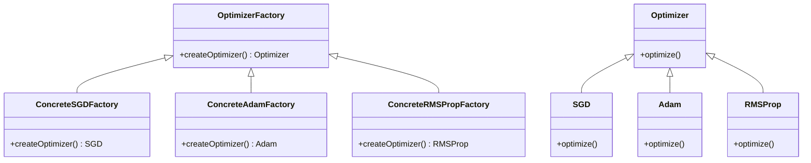
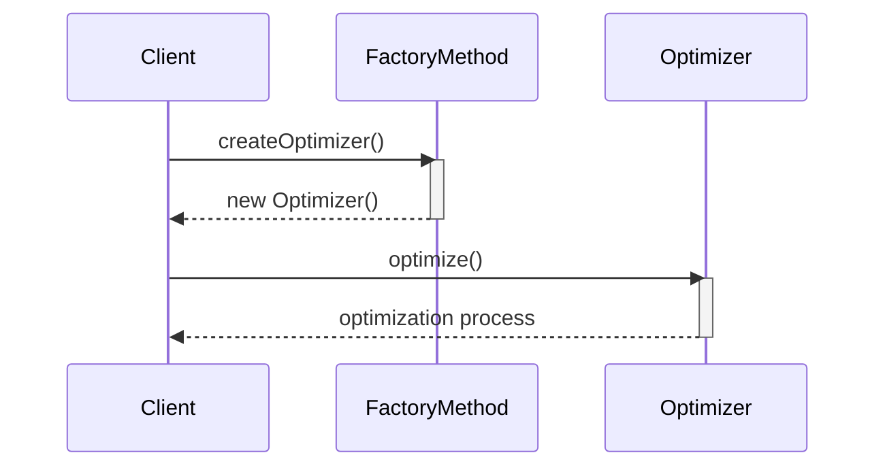

The Factory Method design pattern defines an interface for creating an object, but lets subclasses alter the type of objects that will be created. This pattern is particularly useful in scenarios where a class cannot anticipate the class of objects it must create, or a class wants its subclasses to specify the objects it creates.

## Use Case: Creating Various Optimizer Types Dynamically

In neural networks, optimizers play a critical role in the training process. Different optimizers can be used depending on the type of network and the nature of the data. The Factory Method pattern can dynamically create various types of optimizers, such as SGD, Adam, RMSProp, etc.

## UML Class Diagram



## UML Sequence Diagram



## Example Implementations

### Python

```python
from abc import ABC, abstractmethod

class Optimizer(ABC):
    @abstractmethod
    def optimize(self):
        pass

class SGD(Optimizer):
    def optimize(self):
        print("Optimization using Stochastic Gradient Descent")

class Adam(Optimizer):
    def optimize(self):
        print("Optimization using Adam")

class RMSProp(Optimizer):
    def optimize(self):
        print("Optimization using RMSProp")

class OptimizerFactory(ABC):
    @abstractmethod
    def create_optimizer(self) -> Optimizer:
        pass

class SGDFactory(OptimizerFactory):
    def create_optimizer(self) -> Optimizer:
        return SGD()

class AdamFactory(OptimizerFactory):
    def create_optimizer(self) -> Optimizer:
        return Adam()

class RMSPropFactory(OptimizerFactory):
    def create_optimizer(self) -> Optimizer:
        return RMSProp()

factory = SGDFactory()
optimizer = factory.create_optimizer()
optimizer.optimize()
```

### Java

```java
abstract class Optimizer {
    public abstract void optimize();
}

class SGD extends Optimizer {
    @Override
    public void optimize() {
        System.out.println("Optimization using Stochastic Gradient Descent");
    }
}

class Adam extends Optimizer {
    @Override
    public void optimize() {
        System.out.println("Optimization using Adam");
    }
}

class RMSProp extends Optimizer {
    @Override
    public void optimize() {
        System.out.println("Optimization using RMSProp");
    }
}

abstract class OptimizerFactory {
    public abstract Optimizer createOptimizer();
}

class SGDFactory extends OptimizerFactory {
    @Override
    public Optimizer createOptimizer() {
        return new SGD();
    }
}

class AdamFactory extends OptimizerFactory {
    @Override
    public Optimizer createOptimizer() {
        return new Adam();
    }
}

class RMSPropFactory extends OptimizerFactory {
    @Override
    public Optimizer createOptimizer() {
        return new RMSProp();
    }
}

// Usage
OptimizerFactory factory = new SGDFactory();
Optimizer optimizer = factory.createOptimizer();
optimizer.optimize();
```

### Scala

```scala
trait Optimizer {
    def optimize(): Unit
}

class SGD extends Optimizer {
    override def optimize(): Unit = println("Optimization using Stochastic Gradient Descent")
}

class Adam extends Optimizer {
    override def optimize(): Unit = println("Optimization using Adam")
}

class RMSProp extends Optimizer {
    override def optimize(): Unit = println("Optimization using RMSProp")
}

trait OptimizerFactory {
    def createOptimizer(): Optimizer
}

class SGDFactory extends OptimizerFactory {
    override def createOptimizer(): Optimizer = new SGD
}

class AdamFactory extends OptimizerFactory {
    override def createOptimizer(): Optimizer = new Adam
}

class RMSPropFactory extends OptimizerFactory {
    override def createOptimizer(): Optimizer = new RMSProp
}

// Usage
val factory: OptimizerFactory = new SGDFactory
val optimizer: Optimizer = factory.createOptimizer()
optimizer.optimize()
```

### Clojure

```clojure
(defprotocol Optimizer
  (optimize [this]))

(deftype SGD []
  Optimizer
  (optimize [_] (println "Optimization using Stochastic Gradient Descent")))

(deftype Adam []
  Optimizer
  (optimize [_] (println "Optimization using Adam")))

(deftype RMSProp []
  Optimizer
  (optimize [_] (println "Optimization using RMSProp")))

(defprotocol OptimizerFactory
  (create-optimizer [this]))

(deftype SGDFactory []
  OptimizerFactory
  (create-optimizer [_] (SGD.)))

(deftype AdamFactory []
  OptimizerFactory
  (create-optimizer [_] (Adam.)))

(deftype RMSPropFactory []
  OptimizerFactory
  (create-optimizer [_] (RMSProp.)))

;; Usage
(let [factory (SGDFactory.)
      optimizer (create-optimizer factory)]
  (optimize optimizer))
```

## Benefits

- **Flexibility:** Allows subclasses to alter the type of objects that will be created.
- **Scalability:** Adding new types of products (e.g., new optimizers) is easy.
- **Decoupling:** Client code is decoupled from the concrete classes it needs to instantiate.

## Trade-offs

- **Complexity:** More classes are involved, which might add to the complexity of the codebase.
- **Suboptimal for Small Programs:** Overhead of extra classes and interfaces might not be justified.

## Examples of Use Cases

- **Neural Network Optimization:** As explained in the above examples, dynamically selecting optimizers during runtime.
- **Document Creation:** Different document types in a text editor.
- **UI Components:** Widgets creation in a GUI framework based on the platform (Windows, macOS, Linux).

## Related Design Patterns

- **Abstract Factory:** Works on a higher level of abstraction; can create families of related objects.
- **Builder:** Focuses on constructing complex objects step by step.
- **Prototype:** Creates new objects by copying an existing object, which can be a type of factory.

## Resources and References

- [Design Patterns: Elements of Reusable Object-Oriented Software](https://www.amazon.com/Design-Patterns-Elements-Reusable-Object-Oriented/dp/0201633612) by Erich Gamma, Richard Helm, Ralph Johnson, John Vlissides
- [Refactoring.Guru on Factory Method](https://refactoring.guru/design-patterns/factory-method)
- [Design Patterns in Python](https://github.com/faif/python-patterns)
- [Effective Java](https://www.amazon.com/Effective-Java-Joshua-Bloch/dp/0134685997) by Joshua Bloch

## Open Source Frameworks

- **Keras**: A high-level neural networks API, written in Python, that runs on top of TensorFlow.
- **PyTorch**: An open source machine learning library based on the Torch library, used for applications such as computer vision and natural language processing.

## Summary

The Factory Method design pattern provides a powerful and flexible mechanism for dynamic object creation, which is essential for applications like neural network optimizers where different strategies might be required depending on various factors. By using this pattern, you can keep your codebase modular, maintainable, and scalable, with the ability to easily extend functionality.

By understanding the Factory Method pattern and its use in scenarios like neural network optimization, developers can build robust systems that can adapt to changing requirements with minimal changes to the core codebase.
