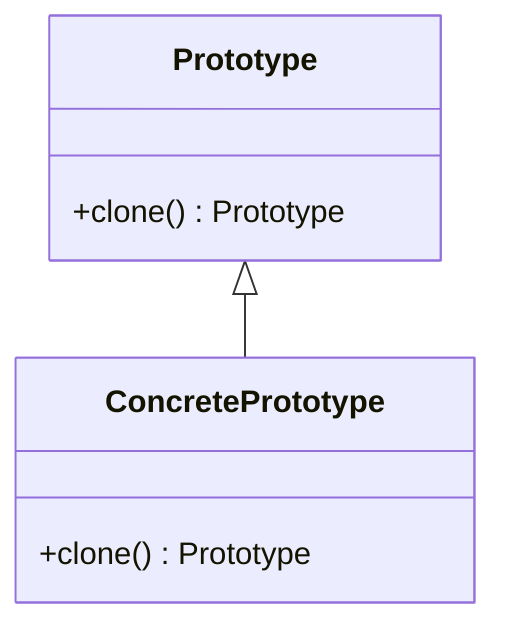
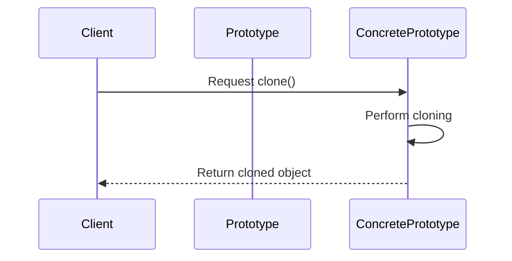

## Prototype Pattern: Enables Cloning of Existing Objects

The Prototype Pattern is a creational design pattern that allows new objects to be created by copying existing ones. This approach can simplify the instantiation process for complex models and allow for easier experimentation and iteration, particularly useful in scenarios such as reinforcement learning.

### Benefits

- **Simplifies Object Creation:** Avoids the overhead of creating new instances from scratch.
- **Reduces Complexity:** Efficiently handles the creation of complex objects.
- **Supports Customization:** Cloned objects can be altered without affecting the original object.
- **Facilitates Prototyping and Testing:** Quick generation of test instances and prototypes.

### Trade-Offs

- **Memory Overhead:** Can lead to increased memory usage if numerous copies of large objects are created.
- **Complexity in Implementation:** Handling deep copying and nested objects can be complex.

### Use Cases

- **Reinforcement Learning:** Duplicating complex neural network models to test different configurations and parameters.
- **Game Development:** Creating variations of game objects (e.g., NPCs, levels) based on a prototype.
- **Software Testing:** Generating test cases by cloning existing test objects with slight modifications.

### UML Class Diagram



### UML Sequence Diagram



### Python Example

```python
import copy

class Prototype:
    def clone(self):
        return copy.deepcopy(self)

class ConcretePrototype(Prototype):
    def __init__(self, value):
        self.value = value

    def __str__(self):
        return f"ConcretePrototype(value={self.value})"

original = ConcretePrototype(42)
clone = original.clone()
print(original)  # ConcretePrototype(value=42)
print(clone)     # ConcretePrototype(value=42)
```

### Java Example

```java
public class Prototype implements Cloneable {
    public Prototype clone() throws CloneNotSupportedException {
        return (Prototype) super.clone();
    }
}

public class ConcretePrototype extends Prototype {
    private int value;

    public ConcretePrototype(int value) {
        this.value = value;
    }

    @Override
    public String toString() {
        return "ConcretePrototype(value=" + value + ")";
    }

    // Usage
    public static void main(String[] args) throws CloneNotSupportedException {
        ConcretePrototype original = new ConcretePrototype(42);
        ConcretePrototype clone = (ConcretePrototype) original.clone();
        System.out.println(original);  // ConcretePrototype(value=42)
        System.out.println(clone);     // ConcretePrototype(value=42)
    }
}
```

### Scala Example

```scala
class Prototype {
  def clone(): Prototype = {
    new Prototype
  }
}

class ConcretePrototype(val value: Int) extends Prototype {
  override def clone(): ConcretePrototype = {
    new ConcretePrototype(value)
  }

  override def toString: String = s"ConcretePrototype(value=$value)"
}

// Usage
object PrototypeExample extends App {
  val original = new ConcretePrototype(42)
  val clone = original.clone()
  println(original)  // ConcretePrototype(value=42)
  println(clone)     // ConcretePrototype(value=42)
}
```

### Clojure Example

```clojure
(defprotocol Prototype
  (clone [this]))

(defrecord ConcretePrototype [value]
  Prototype
  (clone [this] (-> this (assoc :value (value this)))))

; Usage
(def original (->ConcretePrototype 42))
(def clone (clone original))
(println original)  ; #user.ConcretePrototype{:value 42}
(println clone)     ; #user.ConcretePrototype{:value 42}
```

### Related Design Patterns

- **Factory Method:** Allows the creation of objects without specifying the exact class. Can be used in conjunction with Prototype to create objects from existing templates.
- **Singleton:** Restricts object instantiation, can be used to manage prototype instances.
- **Builder:** Separates the construction of complex objects from their representation, complementing the Prototype pattern.

### Resources and References

- *Design Patterns: Elements of Reusable Object-Oriented Software* by Erich Gamma, Richard Helm, Ralph Johnson, John Vlissides
- [Refactoring.Guru: Prototype](https://refactoring.guru/design-patterns/prototype)
- [GeeksforGeeks: Prototype Pattern](https://www.geeksforgeeks.org/prototype-design-pattern/)
- Open-source frameworks implementing Prototype Pattern:
  - [ProtoBuf](https://developers.google.com/protocol-buffers)
  - [Apache Avro](https://avro.apache.org/)

### Summary

The Prototype Pattern is a powerful design pattern that facilitates the cloning of objects, offering significant benefits in the creation of complex models, such as those used in reinforcement learning. While it can introduce memory overhead and complexity, its advantages in terms of simplification and customization make it a valuable tool in a software engineer's toolkit. Understanding and correctly implementing this pattern can lead to more efficient and maintainable code.

By utilizing examples in multiple programming languages and integrating related design patterns, this article aims to provide a comprehensive understanding of the Prototype Pattern and its applications.

---

Feel free to experiment with the provided examples and explore the resources for a deeper dive into the Prototype Pattern!
