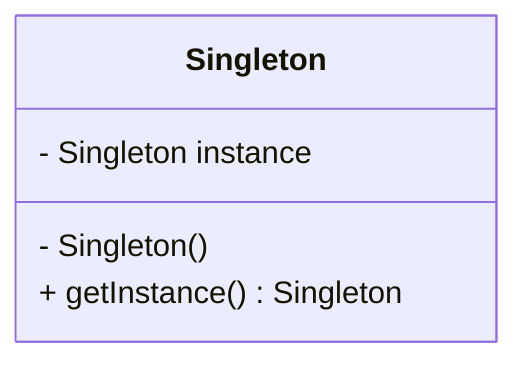
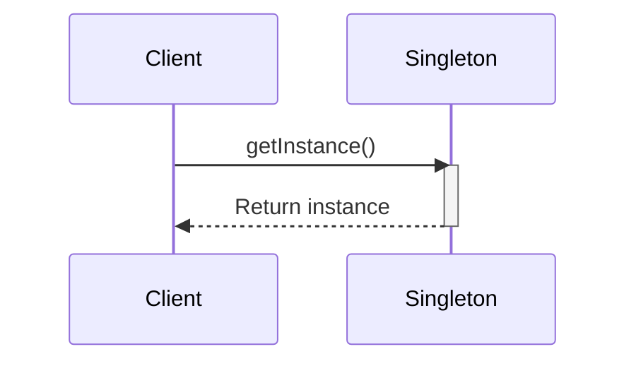

The Singleton pattern is a widely used design pattern that restricts the instantiation of a class to a single object. This is particularly useful in the context of neural networks where you might need to ensure that there's only one instance of a configuration manager or a logging utility.

## Key Concepts

- **Single Instance**: Ensures a class has only one instance.
- **Global Access**: Provides a global point of access to this instance.
- **Thread Safety**: Ensures the Singleton instance is safely accessible across multiple threads, which is crucial for neural network training and inference.

## UML Class Diagram



## UML Sequence Diagram



## Implementation Examples

### Python

```python
class Singleton:
    _instance = None

    @staticmethod
    def getInstance():
        if Singleton._instance is None:
            Singleton()
        return Singleton._instance

    def __init__(self):
        if Singleton._instance is not None:
            raise Exception("This class is a singleton!")
        else:
            Singleton._instance = self

singleton = Singleton.getInstance()
```

### Java

```java
public class Singleton {
    private static Singleton instance;

    private Singleton() { }

    public static Singleton getInstance() {
        if (instance == null) {
            instance = new Singleton();
        }
        return instance;
    }
}
```

### Scala

```scala
object Singleton {
    def getInstance: Singleton = Singleton
}

// Usage
val singleton = Singleton.getInstance
```

### Clojure

```clojure
(defonce singleton (atom nil))

(defn get-instance []
  (when-not @singleton
    (reset! singleton (Object.)))
  @singleton)

;; Usage
(def singleton-instance (get-instance))
```

## Benefits

1. **Controlled Access to a Single Instance**: Ensures that only one instance of the class exists, preventing inadvertent creation of additional instances.
2. **Reduced Memory Footprint**: Conserves resources by avoiding multiple instances of the same object.
3. **Global Access Point**: Provides a single point of access to the instance, simplifying the code and reducing dependencies.

## Trade-offs

1. **Global State**: Can lead to hidden dependencies which can make the system harder to understand and maintain.
2. **Testing Challenges**: Singleton can make unit testing difficult as it introduces global state.
3. **Concurrency Issues**: Special care must be taken to ensure the Singleton instance is thread-safe.

## Use Cases

- **Configuration Management**: Single instance to manage configuration settings across the entire neural network application.
- **Logging**: Single logging utility to handle all the logs generated by the system.
- **Hardware Interface**: Manage hardware resources like GPUs, ensuring only one instance interacts with the resource.

## Related Design Patterns

- **Factory Pattern**: Often used in conjunction with Singleton to create a single instance of an object.
- **Dependency Injection**: Can be used to inject a Singleton instance where needed, making dependencies clearer and easier to manage.

## Resources and References

- [Gang of Four Design Patterns](https://en.wikipedia.org/wiki/Design_Patterns)
- [Singleton Pattern on SourceMaking](https://sourcemaking.com/design_patterns/singleton)
- [Python Singleton Pattern Examples](https://refactoring.guru/design-patterns/singleton/python/example)
- [Java Singleton Pattern Examples](https://www.geeksforgeeks.org/singleton-design-pattern/)
- [Scala Singleton Object](https://docs.scala-lang.org/tour/singleton-objects.html)
- [Clojure Singleton Example](https://www.braveclojure.com/organization/#singleton-in-clojure)

## Summary

The Singleton pattern is a fundamental design pattern that ensures a class has only one instance, providing a global point of access to it. This pattern is invaluable in neural network applications for managing single instances of configurations, logging, or hardware interfaces. While it offers substantial benefits such as controlled access, reduced memory footprint, and global access, it also introduces challenges like potential global state, testing difficulties, and concurrency issues. By understanding these trade-offs and applying related patterns wisely, developers can leverage Singleton to build more efficient and maintainable systems.
