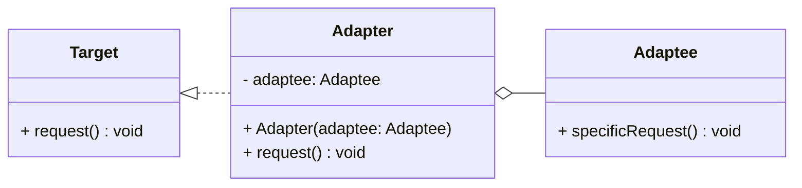
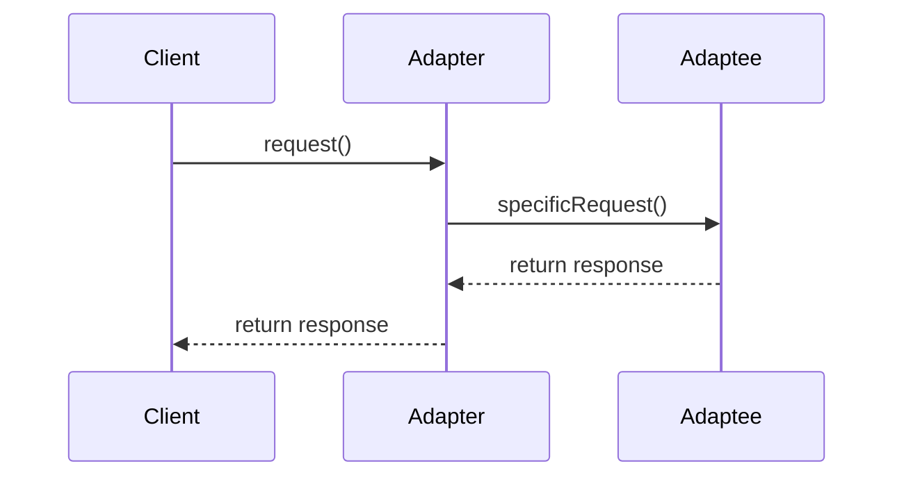

## Adapter Design Pattern: Converts Incompatible Interfaces in Neural Networks

### Overview

The Adapter pattern is a structural design pattern that allows incompatible interfaces to work together. This is achieved by creating an adapter that translates the interface of a class into an interface the client expects. In the context of neural networks, the Adapter pattern can be particularly useful for integrating different types of datasets.

### UML Diagrams

#### Class Diagram



**Explanation:**

- `Target`: Defines the interface that clients use.
- `Adaptee`: Defines an existing interface that needs adapting.
- `Adapter`: Implements the `Target` interface and translates the calls to the `Adaptee` methods.

#### Sequence Diagram



**Explanation:**

1. The `Client` makes a request to the `Adapter`.
2. The `Adapter` translates this request into a call to the `Adaptee`'s `specificRequest` method.
3. The `Adaptee` processes the request and returns the response.
4. The `Adapter` translates the response and returns it to the `Client`.

### Implementation Examples

#### Python

```python
class Target:
    def request(self):
        raise NotImplementedError

class Adaptee:
    def specific_request(self):
        return "Data in an incompatible format"

class Adapter(Target):
    def __init__(self, adaptee):
        self.adaptee = adaptee

    def request(self):
        return f"Adapted data: {self.adaptee.specific_request()}"

adaptee = Adaptee()
adapter = Adapter(adaptee)
print(adapter.request())  # Output: Adapted data: Data in an incompatible format
```

#### Java

```java
// Target interface
interface Target {
    void request();
}

// Adaptee class
class Adaptee {
    public String specificRequest() {
        return "Data in an incompatible format";
    }
}

// Adapter class
class Adapter implements Target {
    private Adaptee adaptee;

    public Adapter(Adaptee adaptee) {
        this.adaptee = adaptee;
    }

    @Override
    public void request() {
        System.out.println("Adapted data: " + adaptee.specificRequest());
    }
}

// Client code
public class AdapterPatternDemo {
    public static void main(String[] args) {
        Adaptee adaptee = new Adaptee();
        Target adapter = new Adapter(adaptee);
        adapter.request();  // Output: Adapted data: Data in an incompatible format
    }
}
```

#### Scala

```scala
// Target trait
trait Target {
  def request(): Unit
}

// Adaptee class
class Adaptee {
  def specificRequest(): String = "Data in an incompatible format"
}

// Adapter class
class Adapter(adaptee: Adaptee) extends Target {
  override def request(): Unit = {
    println(s"Adapted data: ${adaptee.specificRequest()}")
  }
}

// Client code
object AdapterPatternDemo {
  def main(args: Array[String]): Unit = {
    val adaptee = new Adaptee
    val adapter = new Adapter(adaptee)
    adapter.request()  // Output: Adapted data: Data in an incompatible format
  }
}
```

#### Clojure

```clojure
(defprotocol Target
  (request [this]))

(defrecord Adaptee []
  Object
  (specific-request [this]
    "Data in an incompatible format"))

(defrecord Adapter [adaptee]
  Target
  (request [this]
    (str "Adapted data: " (.specific-request adaptee))))

;; Client code
(def adaptee (->Adaptee))
(def adapter (->Adapter adaptee))
(println (request adapter))  ;; Output: Adapted data: Data in an incompatible format
```

### Benefits

1. **Flexibility:** Allows reuse of existing code with incompatible interfaces.
2. **Scalability:** New adapters can be easily created for new data sources.
3. **Separation of Concerns:** Keeps the client code decoupled from the specific implementations of different data sources.

### Trade-offs

1. **Additional Complexity:** Introduces another layer of abstraction.
2. **Performance Overhead:** May introduce a slight performance penalty due to additional method calls and conversions.

### Use Cases

- Integrating different datasets with neural networks.
- Using third-party libraries or services with incompatible interfaces.
- Enabling communication between legacy and modern systems.

### Related Design Patterns

- **Facade:** Provides a simplified interface to a complex subsystem but differs as it does not alter interfaces.
- **Decorator:** Adds additional behavior to objects but maintains the same interface.

### Resources and References

- [Gamma, E., Helm, R., Johnson, R., & Vlissides, J. (1994). Design Patterns: Elements of Reusable Object-Oriented Software. Addison-Wesley.](https://www.amazon.com/Design-Patterns-Elements-Reusable-Object-Oriented/dp/0201633612)
- [Adapter Pattern on Wikipedia](https://en.wikipedia.org/wiki/Adapter_pattern)
- [Adapter Design Pattern in Python](https://refactoring.guru/design-patterns/adapter/python/example)

### Open Source Frameworks

- **Apache Commons IO**: Adapters for different IO implementations.
- **TensorFlow**: Various APIs and tools to adapt data for machine learning tasks.

### Summary

The Adapter pattern is a versatile tool for integrating disparate datasets in neural networks by converting incompatible interfaces into compatible ones. While adding a layer of abstraction can introduce complexity, the benefits of flexibility, scalability, and separation of concerns often outweigh the downsides. This pattern is particularly useful in scenarios where you need to make old code, third-party services, or incompatible data sources work within a modern system.
