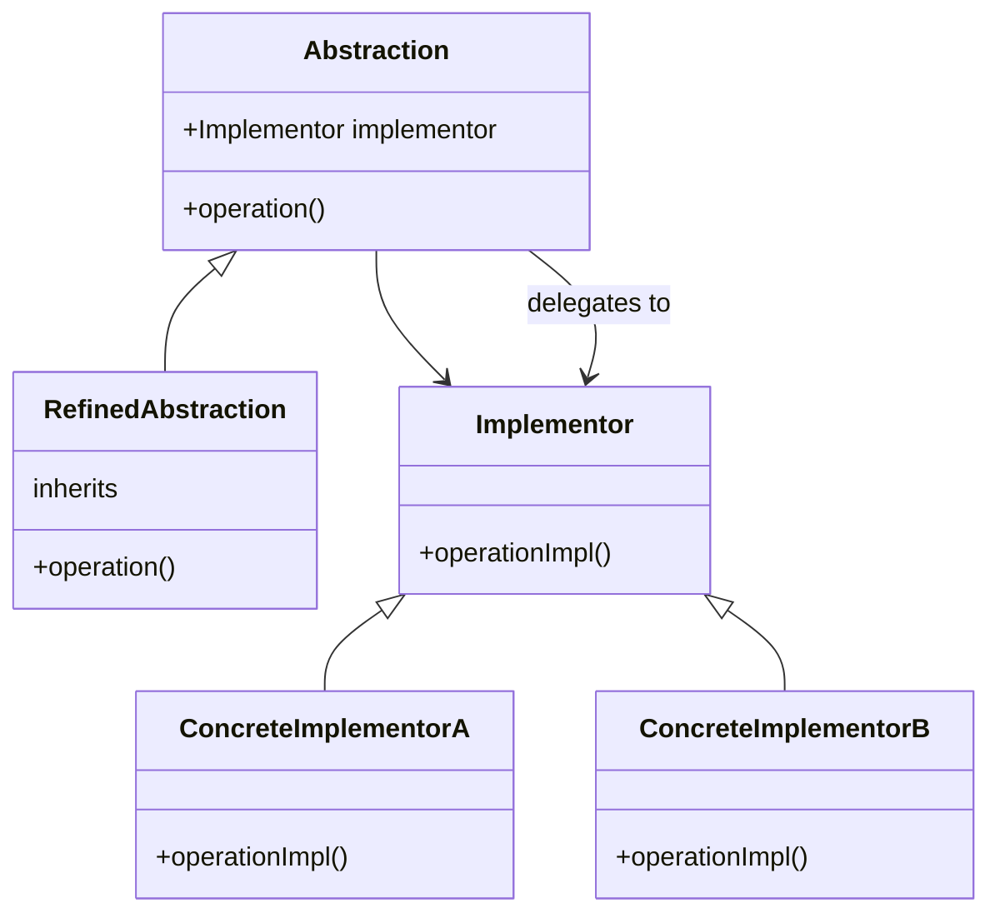
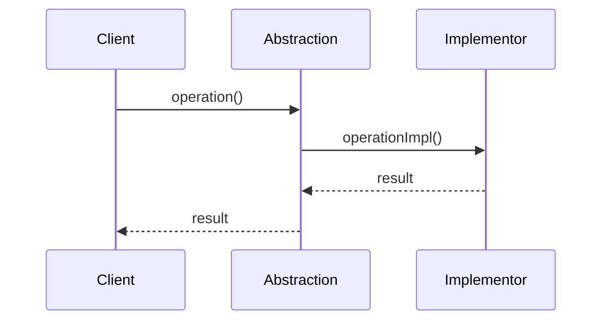

## Introduction

The Bridge design pattern is a structural pattern that decouples an object’s abstraction from its implementation. This separation allows both to evolve independently without affecting each other. In the context of Neural Networks, the Bridge pattern can be particularly useful in separating the model architecture from its execution, allowing for greater flexibility and reusability.

## Detailed Description

The Bridge pattern involves an abstraction that defines a high-level control interface, and an implementation that contains the details. The abstraction holds a reference to the implementation, and delegates the work to the implementation object. This delegation makes it possible to change the implementation without altering the abstraction.

### UML Class Diagram



### UML Sequence Diagram



## Example Implementation

### Python

```python
class Implementor:
    def operation_impl(self):
        pass

class ConcreteImplementorA(Implementor):
    def operation_impl(self):
        print("ConcreteImplementorA operation")

class ConcreteImplementorB(Implementor):
    def operation_impl(self):
        print("ConcreteImplementorB operation")

class Abstraction:
    def __init__(self, implementor: Implementor):
        self._implementor = implementor

    def operation(self):
        self._implementor.operation_impl()

class RefinedAbstraction(Abstraction):
    def operation(self):
        self._implementor.operation_impl()

if __name__ == "__main__":
    implA = ConcreteImplementorA()
    implB = ConcreteImplementorB()

    abstraction = RefinedAbstraction(implA)
    abstraction.operation()  # ConcreteImplementorA operation

    abstraction = RefinedAbstraction(implB)
    abstraction.operation()  # ConcreteImplementorB operation
```

### Java

```java
interface Implementor {
    void operationImpl();
}

class ConcreteImplementorA implements Implementor {
    @Override
    public void operationImpl() {
        System.out.println("ConcreteImplementorA operation");
    }
}

class ConcreteImplementorB implements Implementor {
    @Override
    public void operationImpl() {
        System.out.println("ConcreteImplementorB operation");
    }
}

abstract class Abstraction {
    protected Implementor implementor;

    protected Abstraction(Implementor implementor) {
        this.implementor = implementor;
    }

    public abstract void operation();
}

class RefinedAbstraction extends Abstraction {

    protected RefinedAbstraction(Implementor implementor) {
        super(implementor);
    }

    @Override
    public void operation() {
        implementor.operationImpl();
    }
}

public class BridgePatternDemo {
    public static void main(String[] args) {
        Implementor implA = new ConcreteImplementorA();
        Implementor implB = new ConcreteImplementorB();

        Abstraction abstraction = new RefinedAbstraction(implA);
        abstraction.operation(); // ConcreteImplementorA operation

        abstraction = new RefinedAbstraction(implB);
        abstraction.operation(); // ConcreteImplementorB operation
    }
}
```

### Scala

```scala
trait Implementor {
  def operationImpl(): Unit
}

class ConcreteImplementorA extends Implementor {
  override def operationImpl(): Unit = println("ConcreteImplementorA operation")
}

class ConcreteImplementorB extends Implementor {
  override def operationImpl(): Unit = println("ConcreteImplementorB operation")
}

abstract class Abstraction(val implementor: Implementor) {
  def operation(): Unit
}

class RefinedAbstraction(implementor: Implementor) extends Abstraction(implementor) {
  override def operation(): Unit = implementor.operationImpl()
}

object BridgePatternDemo {
  def main(args: Array[String]): Unit = {
    val implA = new ConcreteImplementorA
    val implB = new ConcreteImplementorB

    var abstraction: Abstraction = new RefinedAbstraction(implA)
    abstraction.operation() // ConcreteImplementorA operation

    abstraction = new RefinedAbstraction(implB)
    abstraction.operation() // ConcreteImplementorB operation
  }
}
```

### Clojure

```clojure
(defprotocol Implementor
  (operation-impl [this]))

(deftype ConcreteImplementorA []
  Implementor
  (operation-impl [this]
    (println "ConcreteImplementorA operation")))

(deftype ConcreteImplementorB []
  Implementor
  (operation-impl [this]
    (println "ConcreteImplementorB operation")))

(defprotocol Abstraction
  (operation [this]))

(deftype RefinedAbstraction [implementor]
  Abstraction
  (operation [this]
    (operation-impl implementor)))

(let [implA (ConcreteImplementorA.)
      implB (ConcreteImplementorB.)
      abstractionA (RefinedAbstraction. implA)
      abstractionB (RefinedAbstraction. implB)]
  (operation abstractionA) ;; ConcreteImplementorA operation
  (operation abstractionB)) ;; ConcreteImplementorB operation
```

## Benefits

- **Decoupling Interface and Implementation**: Allows the development of the interface and implementation to progress independently.
- **Improved Flexibility**: Different implementations can be interchanged easily without altering the clients.
- **Enhanced Scalability**: New abstractions and implementations can be added without significant changes.

## Trade-offs

- **Increased Complexity**: The introduction of additional classes and interfaces increases the complexity of the system.
- **Performance Overhead**: Indirection might introduce a slight performance overhead.

## Use Cases

- **Neural Networks**: Separation of the neural network architecture from its execution. This allows different execution strategies, such as CPU and GPU executions.
- **GUI Development**: Separation of window abstraction from the window system implementation.

## Related Design Patterns

- **Adapter**: Provides a way to work with different interfaces.
- **Strategy**: Focuses on defining a family of algorithms, encapsulating each one and making them interchangeable.

## Resources and References

- **Design Patterns: Elements of Reusable Object-Oriented Software** by Erich Gamma, Richard Helm, Ralph Johnson, and John Vlissides
- **Refactoring: Improving the Design of Existing Code** by Martin Fowler

## Open Source Frameworks

- **TensorFlow**: Allows the separation of models from their execution.
- **PyTorch**: Facilitates decoupling model definitions from their training procedures.

## Summary

The Bridge design pattern is instrumental in decoupling an object’s abstraction from its implementation, enabling both to vary independently. This flexibility is particularly beneficial in fields such as neural networks, where separating model architecture from execution is crucial. While the pattern introduces some complexity, the benefits of improved flexibility, scalability, and maintainability are significant.

By understanding and applying the Bridge pattern, developers can create more modular and adaptable systems that can easily integrate various implementations and evolve over time.
