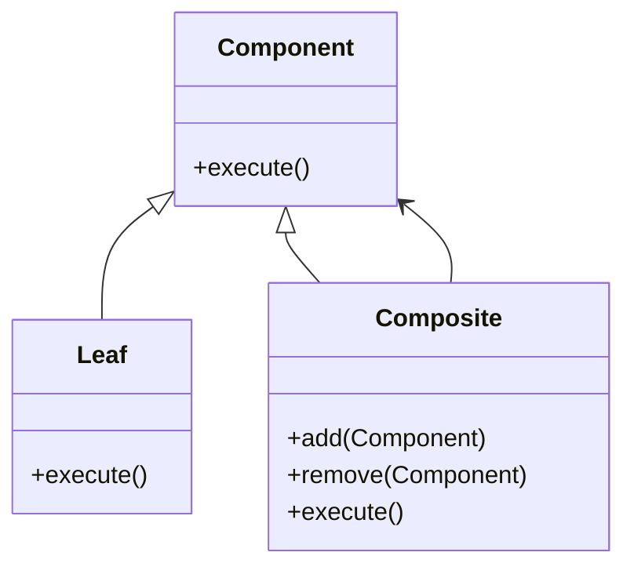
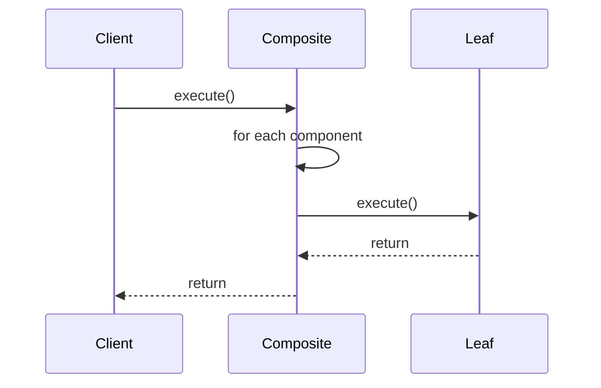

## Overview

The **Composite Design Pattern** is used to compose objects into tree structures to represent part-whole hierarchies. This pattern allows clients to treat individual objects and compositions of objects uniformly. In the context of neural networks, it is particularly useful for creating hierarchical modular network architectures.

## Benefits

- **Simplicity:** Simplifies client code as it can treat individual components and composites uniformly.
- **Scalability:** Easily scalable to accommodate more complex structures by adding new component types.
- **Flexibility:** Provides flexibility in structure to model a wide variety of network topologies.

## Trade-offs

- **Overhead:** Adds complexity due to tree management.
- **Performance:** May introduce additional overhead in terms of memory and computational resources.

## UML Class Diagram



## UML Sequence Diagram



## Example Implementations

### Python

```python
class Component:
    def execute(self):
        raise NotImplementedError

class Leaf(Component):
    def execute(self):
        print("Leaf execute")

class Composite(Component):
    def __init__(self):
        self.children = []

    def add(self, component):
        self.children.append(component)

    def remove(self, component):
        self.children.remove(component)

    def execute(self):
        for child in self.children:
            child.execute()
            
composite = Composite()
composite.add(Leaf())
composite.add(Leaf())
composite.execute()
```

### Java

```java
import java.util.ArrayList;
import java.util.List;

abstract class Component {
    abstract void execute();
}

class Leaf extends Component {
    void execute() {
        System.out.println("Leaf execute");
    }
}

class Composite extends Component {
    private List<Component> children = new ArrayList<>();

    void add(Component component) {
        children.add(component);
    }

    void remove(Component component) {
        children.remove(component);
    }

    void execute() {
        for (Component child : children) {
            child.execute();
        }
    }
}

// Client Code
public class Main {
    public static void main(String[] args) {
        Composite composite = new Composite();
        composite.add(new Leaf());
        composite.add(new Leaf());
        composite.execute();
    }
}
```

### Scala

```scala
abstract class Component {
  def execute(): Unit
}

class Leaf extends Component {
  def execute(): Unit = {
    println("Leaf execute")
  }
}

class Composite extends Component {
  private val children = scala.collection.mutable.ListBuffer[Component]()

  def add(component: Component): Unit = {
    children += component
  }

  def remove(component: Component): Unit = {
    children -= component
  }

  def execute(): Unit = {
    children.foreach(_.execute())
  }
}

// Client Code
object Main extends App {
  val composite = new Composite()
  composite.add(new Leaf())
  composite.add(new Leaf())
  composite.execute()
}
```

### Clojure

```clojure
(defprotocol Component
  (execute [this]))

(defrecord Leaf []
  Component
  (execute [this]
    (println "Leaf execute")))

(defrecord Composite [children]
  Component
  (execute [this]
    (doseq [child @(:children this)]
      (execute child))))

(defn create-composite []
  (atom {:children []}))

(defn add-child [composite child]
  (swap! composite update :children conj child))

(defn remove-child [composite child]
  (swap! composite update :children #(remove #{child} %)))

;; Client Code
(def composite (create-composite))
(add-child composite (->Leaf))
(add-child composite (->Leaf))
(execute (->Composite @composite))
```

## Use Cases

- **Hierarchical Neural Networks:** Implementing layers of neural networks in a hierarchical manner.
- **Complex Model Composition:** Composing multiple machine learning models or neural network components into a single system.

## Related Design Patterns

- **Decorator:** Allows additional functionality to be dynamically added to an object.
- **Facade:** Simplifies interactions with complex subsystems by providing a unified interface.

## Resources

- **Books:** "Design Patterns: Elements of Reusable Object-Oriented Software" by Erich Gamma et al.
- **Websites:** [Refactoring Guru](https://refactoring.guru/design-patterns/composite)
- **Frameworks:** TensorFlow, Keras, PyTorch, which utilize modular design principles in neural networks.

## Summary

The Composite design pattern is instrumental for creating tree structures in object composition, simplifying client code and increasing flexibility and scalability. While there may be overhead and performance considerations, its benefits in managing complex structures make it invaluable in neural network design and other hierarchical systems.

---

Leverage the Composite design pattern to enhance the modularity and scalability of your neural network architectures, creating cohesive and manageable systems that can grow and adapt over time.
