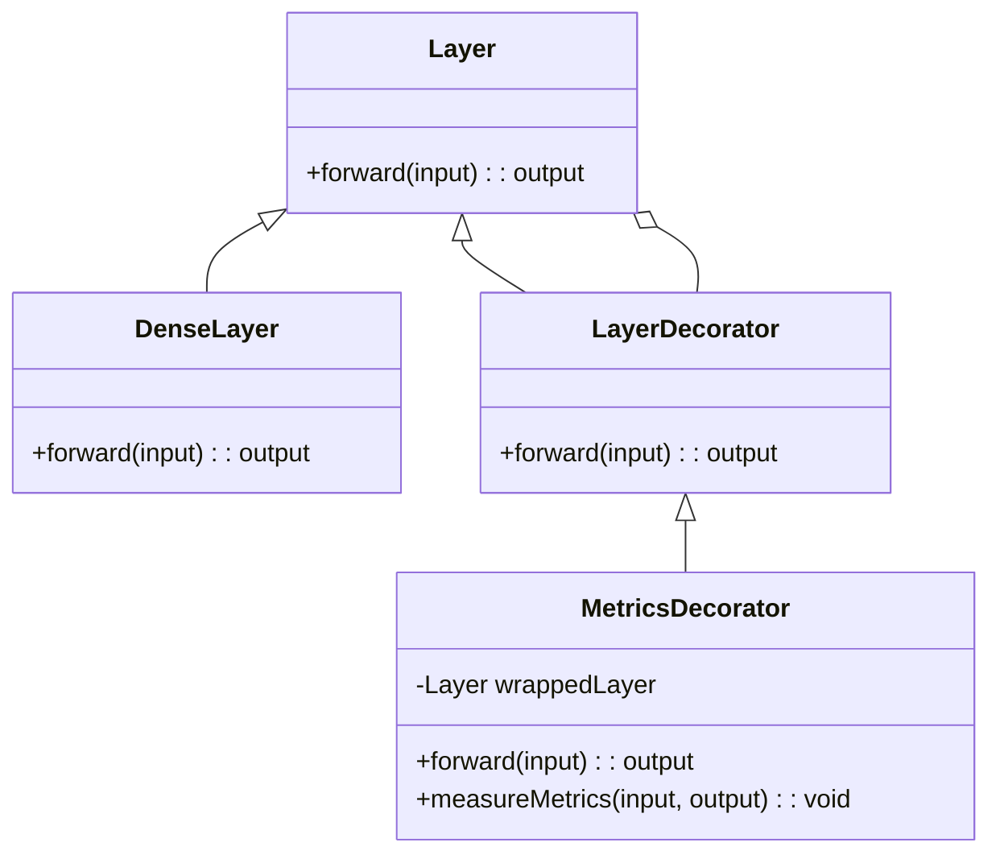
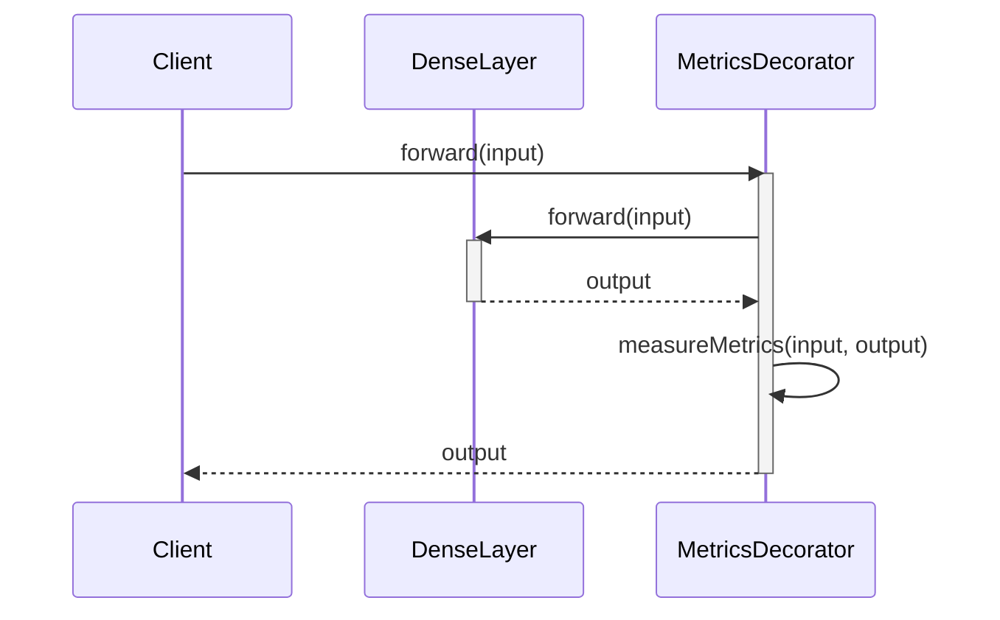

## Overview

The **Decorator** design pattern provides a flexible alternative to subclassing for extending functionality. This pattern is particularly useful in the context of neural networks, where it can be used to add performance metrics to network layers without modifying their code.

## Benefits

- **Flexibility**: New functionalities can be added dynamically at runtime.
- **Single Responsibility Principle**: Enhancements can be added without modifying existing code.
- **Reusability**: Common behaviors can be reused across different classes.

## Trade-offs

- **Complexity**: Can introduce additional layers of abstraction, making the system harder to understand.
- **Performance**: May add overhead due to increased number of objects.

## Use Cases in Neural Networks

### Adding Performance Metrics to Neural Network Layers

Neural network layers often need to be monitored for various performance metrics such as execution time, memory consumption, or accuracy. The Decorator pattern allows these metrics to be added dynamically without changing the layer implementation.

## UML Class Diagram



### Explanation

- **Layer**: Abstract class defining the common interface.
- **DenseLayer**: Concrete implementation of a neural network layer.
- **LayerDecorator**: Abstract decorator class implementing the Layer interface.
- **MetricsDecorator**: Concrete decorator that adds performance metrics to the layer.

## UML Sequence Diagram



### Explanation

1. The client calls the `forward(input)` method on the `MetricsDecorator`.
2. The `MetricsDecorator` forwards this call to the wrapped `DenseLayer`.
3. The `DenseLayer` processes the input and returns the output to the `MetricsDecorator`.
4. The `MetricsDecorator` measures performance metrics using the `measureMetrics` method.
5. The `MetricsDecorator` returns the output to the client.

## Examples

### Python

```python
class Layer:
    def forward(self, input):
        pass

class DenseLayer(Layer):
    def forward(self, input):
        # Perform dense layer computation
        return input * 2

class LayerDecorator(Layer):
    def __init__(self, layer):
        self.layer = layer

    def forward(self, input):
        return self.layer.forward(input)

class MetricsDecorator(LayerDecorator):
    def forward(self, input):
        import time
        start_time = time.time()
        output = self.layer.forward(input)
        end_time = time.time()
        self.measure_metrics(input, output, end_time - start_time)
        return output

    def measure_metrics(self, input, output, duration):
        print(f"Input: {input}, Output: {output}, Duration: {duration}")

layer = DenseLayer()
decorated_layer = MetricsDecorator(layer)
output = decorated_layer.forward(10)
```

### Java

```java
abstract class Layer {
    abstract int forward(int input);
}

class DenseLayer extends Layer {
    @Override
    int forward(int input) {
        // Perform dense layer computation
        return input * 2;
    }
}

abstract class LayerDecorator extends Layer {
    protected Layer layer;
    LayerDecorator(Layer layer) {
        this.layer = layer;
    }
}

class MetricsDecorator extends LayerDecorator {
    MetricsDecorator(Layer layer) {
        super(layer);
    }

    @Override
    int forward(int input) {
        long startTime = System.nanoTime();
        int output = layer.forward(input);
        long endTime = System.nanoTime();
        measureMetrics(input, output, endTime - startTime);
        return output;
    }

    private void measureMetrics(int input, int output, long duration) {
        System.out.println("Input: " + input + ", Output: " + output + ", Duration: " + duration + "ns");
    }
}

public class Main {
    public static void main(String[] args) {
        Layer layer = new DenseLayer();
        Layer decoratedLayer = new MetricsDecorator(layer);
        int output = decoratedLayer.forward(10);
    }
}
```

### Scala

```scala
abstract class Layer {
    def forward(input: Int): Int
}

class DenseLayer extends Layer {
    override def forward(input: Int): Int = {
        // Perform dense layer computation
        input * 2
    }
}

abstract class LayerDecorator(val layer: Layer) extends Layer {
    override def forward(input: Int): Int = layer.forward(input)
}

class MetricsDecorator(layer: Layer) extends LayerDecorator(layer) {
    override def forward(input: Int): Int = {
        val startTime = System.nanoTime()
        val output = layer.forward(input)
        val endTime = System.nanoTime()
        measureMetrics(input, output, endTime - startTime)
        output
    }

    private def measureMetrics(input: Int, output: Int, duration: Long): Unit = {
        println(s"Input: $input, Output: $output, Duration: ${duration}ns")
    }
}

object Main extends App {
    val layer = new DenseLayer()
    val decoratedLayer = new MetricsDecorator(layer)
    val output = decoratedLayer.forward(10)
}
```

### Clojure

```clojure
(defprotocol Layer
  (forward [this input]))

(deftype DenseLayer []
  Layer
  (forward [this input]
    ;; Perform dense layer computation
    (* input 2)))

(deftype MetricsDecorator [layer]
  Layer
  (forward [this input]
    (let [start-time (System/nanoTime)
          output (.forward layer input)
          end-time (System/nanoTime)]
      (measure-metrics input output (- end-time start-time))
      output))
  (measure-metrics [this input output duration]
    (println (str "Input: " input ", Output: " output ", Duration: " duration "ns"))))

(let [layer (DenseLayer.)
      decorated-layer (MetricsDecorator. layer)]
  (forward decorated-layer 10))
```

## Related Design Patterns

- **Proxy Pattern**: Similar to the Decorator pattern but focuses on controlling access to the object.
- **Adapter Pattern**: Allows incompatible interfaces to work together, often used in conjunction with the Decorator pattern.
- **Composite Pattern**: Composes objects into tree structures to represent part-whole hierarchies, useful for layering decorators.

## Resources and References

- [Design Patterns: Elements of Reusable Object-Oriented Software](https://www.amazon.com/Design-Patterns-Elements-Reusable-Object-Oriented/dp/0201633612) - The seminal book by the Gang of Four.
- [Neural Network Design Patterns](https://arxiv.org/pdf/2107.04082.pdf) - Research paper discussing various design patterns in the context of neural networks.
- [TensorFlow Addons](https://www.tensorflow.org/addons) - An open-source library for TensorFlow containing additional custom operations and metrics.

## Open Source Frameworks

- **TensorFlow**: Provides extensive support for various neural network layers, metrics, and optimizers.
- **PyTorch**: Offers flexible layer composition and metric tracking, making it easy to implement decorator patterns.

## Summary

The Decorator design pattern is a powerful tool for dynamically extending the functionality of neural network layers, particularly for adding performance metrics. It provides a clean, flexible way to enhance existing layers without modifying their code. This pattern is particularly useful in neural networks for monitoring and optimizing performance, offering significant advantages in terms of flexibility and reusability, though it can introduce some complexity and performance overhead.

By understanding and applying the Decorator pattern, developers can create more adaptable and maintainable neural network architectures.
