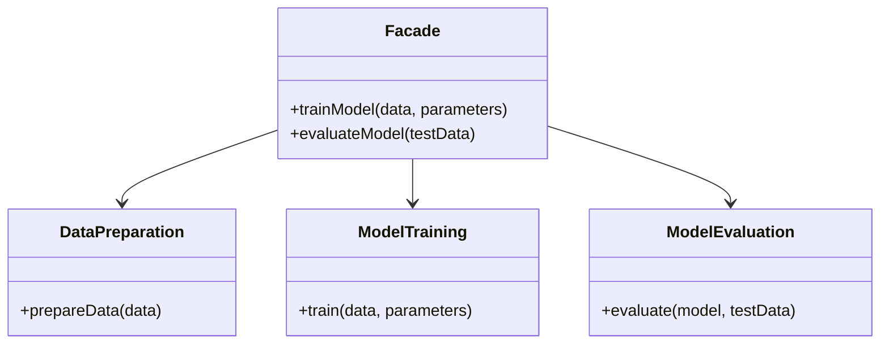
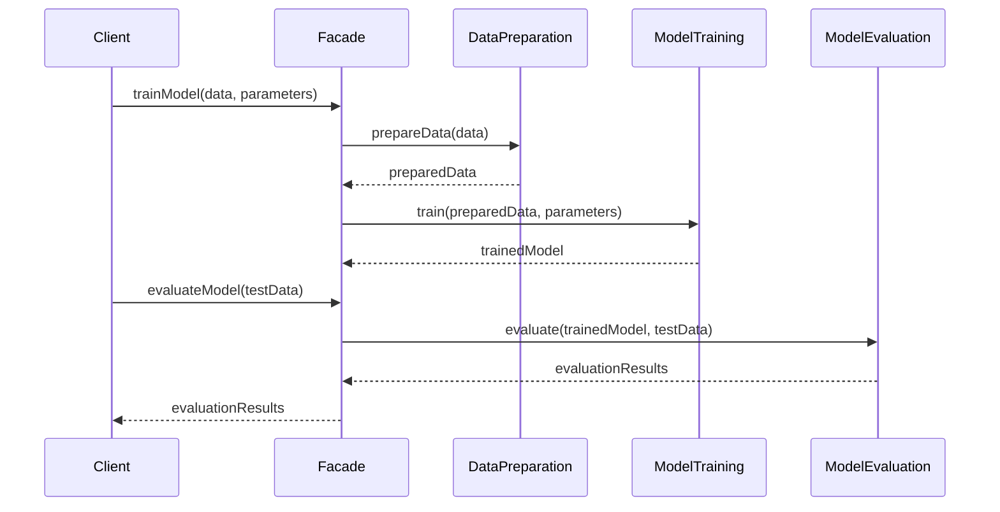

## Introduction
The **Facade Design Pattern** is a structural design pattern that aims to provide a unified and simplified interface to a set of interfaces in a subsystem. This is particularly beneficial in Neural Network training, where it can wrap the complex components of the training pipeline into a more manageable interface.

## Key Components

- **Facade:** The unified interface that clients interact with.
- **Subsystem Classes:** The internal classes performing the work, typically complex and numerous.

## UML Class Diagram



### Explanation
- **Facade:** Offers `trainModel` and `evaluateModel` methods.
- **Subsystem Classes:** `DataPreparation`, `ModelTraining`, and `ModelEvaluation` perform specific tasks.

## UML Sequence Diagram



### Explanation
1. The client calls `trainModel` on the `Facade`.
2. The `Facade` delegates data preparation to `DataPreparation`.
3. The prepared data is then passed to `ModelTraining`.
4. Finally, the `Facade` calls `evaluateModel` which in turn calls `ModelEvaluation`.

## Implementation

### Python Example

```python
class DataPreparation:
    @staticmethod
    def prepare_data(data):
        # Data preprocessing logic
        return prepared_data

class ModelTraining:
    @staticmethod
    def train(data, parameters):
        # Model training logic
        return model

class ModelEvaluation:
    @staticmethod
    def evaluate(model, test_data):
        # Model evaluation logic
        return evaluation_results

class Facade:
    def train_model(self, data, parameters):
        prepared_data = DataPreparation.prepare_data(data)
        model = ModelTraining.train(prepared_data, parameters)
        return model

    def evaluate_model(self, model, test_data):
        evaluation_results = ModelEvaluation.evaluate(model, test_data)
        return evaluation_results
```

### Java Example

```java
public class DataPreparation {
    public static Object prepareData(Object data) {
        // Data preprocessing logic
        return preparedData;
    }
}

public class ModelTraining {
    public static Object train(Object data, Object parameters) {
        // Model training logic
        return model;
    }
}

public class ModelEvaluation {
    public static Object evaluate(Object model, Object testData) {
        // Model evaluation logic
        return evaluationResults;
    }
}

public class Facade {
    public Object trainModel(Object data, Object parameters) {
        Object preparedData = DataPreparation.prepareData(data);
        Object model = ModelTraining.train(preparedData, parameters);
        return model;
    }

    public Object evaluateModel(Object model, Object testData) {
        Object evaluationResults = ModelEvaluation.evaluate(model, testData);
        return evaluationResults;
    }
}
```

### Scala Example

```scala
object DataPreparation {
  def prepareData(data: Any): Any = {
    // Data preprocessing logic
    preparedData
  }
}

object ModelTraining {
  def train(data: Any, parameters: Any): Any = {
    // Model training logic
    model
  }
}

object ModelEvaluation {
  def evaluate(model: Any, testData: Any): Any = {
    // Model evaluation logic
    evaluationResults
  }
}

class Facade {
  def trainModel(data: Any, parameters: Any): Any = {
    val preparedData = DataPreparation.prepareData(data)
    val model = ModelTraining.train(preparedData, parameters)
    model
  }

  def evaluateModel(model: Any, testData: Any): Any = {
    val evaluationResults = ModelEvaluation.evaluate(model, testData)
    evaluationResults
  }
}
```

### Clojure Example

```clojure
(ns facade-pattern)

(defn prepare-data [data]
  ;; Data preprocessing logic
  prepared-data)

(defn train-model [data parameters]
  ;; Model training logic
  model)

(defn evaluate-model [model test-data]
  ;; Model evaluation logic
  evaluation-results)

(defn facade-train [data parameters]
  (let [prepared-data (prepare-data data)
        model (train-model prepared-data parameters)]
    model))

(defn facade-evaluate [model test-data]
  (evaluate-model model test-data))
```

## Benefits

- **Simplification:** Provides a more straightforward interface to complex subsystems.
- **Decoupling:** Reduces dependencies between client code and the subsystem.
- **Manageability:** Easier to manage code and reduce complexity.

## Trade-offs

- **Over-Simplification:** The Facade might hide too much of the subsystem's functionality, limiting flexibility.
- **Performance:** Extra layer could add slight overhead.

## Use Cases

- **API Wrappers:** Simplified interfaces for complex libraries.
- **Software Libraries:** Facade for managing underlying complexity.
- **Neural Networks:** Simplified APIs for model training pipelines.

## Related Patterns

- **Adapter:** Similar but converts interface to match what the client expects.
- **Decorator:** Adds functionality to objects dynamically.
- **Proxy:** Provides a surrogate or placeholder for another object.

## Resources and References

- **[Design Patterns: Elements of Reusable Object-Oriented Software](https://amzn.to/3w6Qi0C)** by Erich Gamma, Richard Helm, Ralph Johnson, John Vlissides
- **[Facade Pattern - GeeksforGeeks](https://www.geeksforgeeks.org/facade-design-pattern/)**

## Open Source Frameworks

- **[TensorFlow](https://www.tensorflow.org/):** Offers simplified APIs for complex machine learning tasks.
- **[Keras](https://keras.io/):** Provides a high-level API for building and training deep learning models.

## Summary
The Facade Design Pattern is a powerful tool for simplifying interactions with complex systems. It is particularly useful in scenarios involving intricate workflows, such as Neural Network model training. By understanding and implementing this pattern, developers can make their systems more user-friendly and maintainable.

---

Implementing the Facade Design Pattern can greatly ease the complexity of large and intricate systems, providing a more straightforward and manageable interface for end users. This design pattern is especially beneficial in simplifying the complex processes involved in Neural Network training, making it an essential pattern for software architects and engineers.
