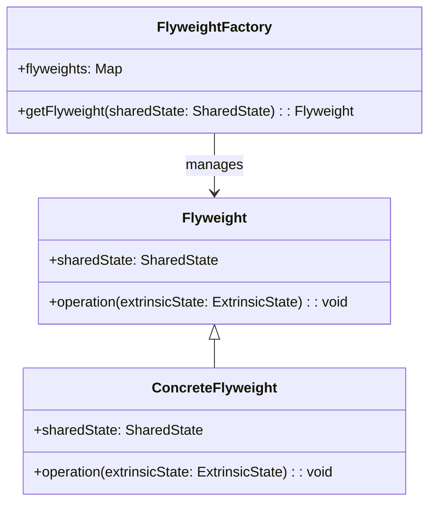
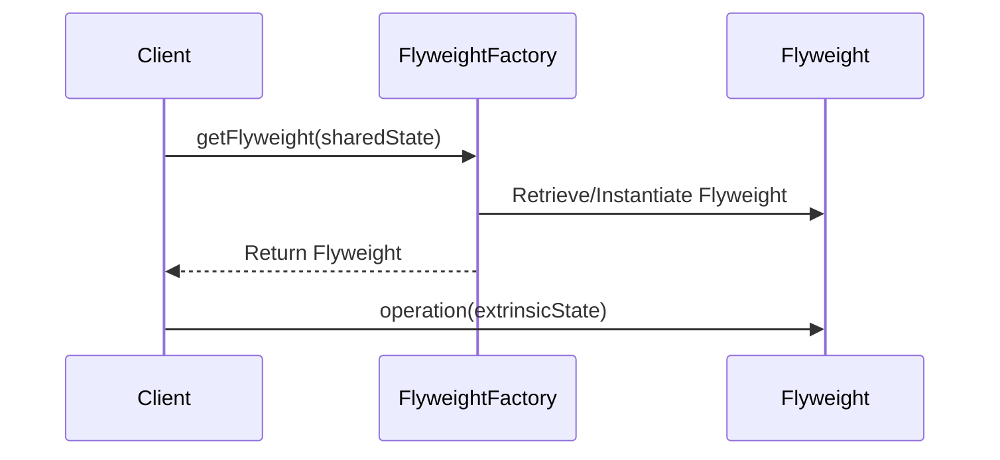

The **Flyweight** design pattern is a structural pattern that focuses on efficiently sharing objects to reduce memory use and computational overhead. In the context of neural networks, this pattern can be used to share weights in embeddings, significantly reducing the resource requirements.

## Introduction

The Flyweight pattern is designed to minimize memory usage and computational overhead by sharing as much data as possible with similar objects. This is particularly useful in scenarios where an application needs to generate a large number of objects that share common data.

## Detailed Description

In a typical scenario where many objects share the same data, creating separate instances can be wasteful in terms of memory and processing power. The Flyweight pattern solves this problem by ensuring that shared data is stored once and reused across multiple objects.

### How It Works

1. **Intrinsic State:** This is the shared data that is common across multiple objects. It is stored in the Flyweight object.
2. **Extrinsic State:** This is the data unique to each object instance and is passed to the Flyweight when needed.
3. **Flyweight Factory:** This factory manages and provides access to the shared Flyweights.

### Key Concepts

- **Shared Weight in Neural Network Embeddings:** In the context of neural networks, Flyweight can be used to share weights across different embeddings. This reduces the memory footprint and ensures consistency.

## Benefits and Trade-offs

### Benefits

- **Reduced Memory Usage:** By sharing common data, memory usage is significantly reduced.
- **Increased Performance:** Less time is spent on object creation and garbage collection.
- **Consistency:** Shared data ensures uniformity and reduces the chances of errors.

### Trade-offs

- **Complexity:** Managing shared and unique data requires additional logic.
- **Thread Safety:** Shared objects may need synchronization in a multi-threaded environment.

## Use Cases

- **Text Processing:** Storing shared character data in a text processing system.
- **Neural Network Embeddings:** Sharing weight matrices across different embeddings to reduce memory usage.
- **Graphics Systems:** Reusing graphical objects like fonts and colors.

## UML Class Diagram



## UML Sequence Diagram



## Examples in Various Programming Languages

### Python

```python
class Flyweight:
    def __init__(self, shared_state):
        self.shared_state = shared_state

    def operation(self, extrinsic_state):
        print(f"Flyweight: {self.shared_state} - {extrinsic_state}")

class FlyweightFactory:
    _flyweights = {}

    @classmethod
    def get_flyweight(cls, shared_state):
        if shared_state not in cls._flyweights:
            cls._flyweights[shared_state] = Flyweight(shared_state)
        return cls._flyweights[shared_state]

shared_state = 'shared'
extrinsic_state = 'unique1'
flyweight = FlyweightFactory.get_flyweight(shared_state)
flyweight.operation(extrinsic_state)
```

### Java

```java
import java.util.HashMap;
import java.util.Map;

class Flyweight {
    private final String sharedState;

    public Flyweight(String sharedState) {
        this.sharedState = sharedState;
    }

    public void operation(String extrinsicState) {
        System.out.println("Flyweight: " + sharedState + " - " + extrinsicState);
    }
}

class FlyweightFactory {
    private static final Map<String, Flyweight> flyweights = new HashMap<>();

    public static Flyweight getFlyweight(String sharedState) {
        if (!flyweights.containsKey(sharedState)) {
            flyweights.put(sharedState, new Flyweight(sharedState));
        }
        return flyweights.get(sharedState);
    }
}

// Usage
class Main {
    public static void main(String[] args) {
        String sharedState = "shared";
        String extrinsicState = "unique1";

        Flyweight flyweight = FlyweightFactory.getFlyweight(sharedState);
        flyweight.operation(extrinsicState);
    }
}
```

### Scala

```scala
class Flyweight(private val sharedState: String) {
  def operation(extrinsicState: String): Unit = {
    println(s"Flyweight: $sharedState - $extrinsicState")
  }
}

object FlyweightFactory {
  private val flyweights = scala.collection.mutable.Map.empty[String, Flyweight]

  def getFlyweight(sharedState: String): Flyweight = {
    flyweights.getOrElseUpdate(sharedState, new Flyweight(sharedState))
  }
}

// Usage
val sharedState = "shared"
val extrinsicState = "unique1"

val flyweight = FlyweightFactory.getFlyweight(sharedState)
flyweight.operation(extrinsicState)
```

### Clojure

```clojure
(defn flyweight [shared-state]
  (fn [extrinsic-state]
    (println (str "Flyweight: " shared-state " - " extrinsic-state))))

(def flyweight-factory (atom {}))

(defn get-flyweight [shared-state]
  (if-not (contains? @flyweight-factory shared-state)
    (swap! flyweight-factory assoc shared-state (flyweight shared-state)))
  (@flyweight-factory shared-state))

;; Usage
(def shared-state "shared")
(def extrinsic-state "unique1")

(let [fw (get-flyweight shared-state)]
  (fw extrinsic-state))
```

## Related Design Patterns

- **Singleton:** Ensures a class has only one instance. Useful for managing the FlyweightFactory as a single point of reference.
- **Factory:** Provides a way to create objects. Often used to instantiate Flyweights.
- **Prototype:** Used for object duplication. Can be combined with Flyweight to share parts of objects.

## Resources and References

1. **[Gang of Four Design Patterns](https://en.wikipedia.org/wiki/Design_Patterns):** The book that introduced the Flyweight pattern.
2. **[Design Patterns for Embedded Systems in C](https://www.amazon.com/Design-Patterns-Embedded-Systems-C/dp/1856177076):** Offers practical insights into design patterns in resource-constrained environments.
3. **[Neural Network Embedding Techniques](https://arxiv.org/abs/1605.01407):** Research paper on embedding techniques in neural networks.

## Summary

The Flyweight design pattern is a powerful tool for reducing memory and computational costs by sharing data across similar objects. This pattern is particularly effective in scenarios involving large numbers of similar objects, such as text processing or neural network embeddings. While it brings significant benefits, it also introduces complexity and potential thread-safety issues. By understanding and implementing the Flyweight pattern, developers can create more efficient and scalable applications.
