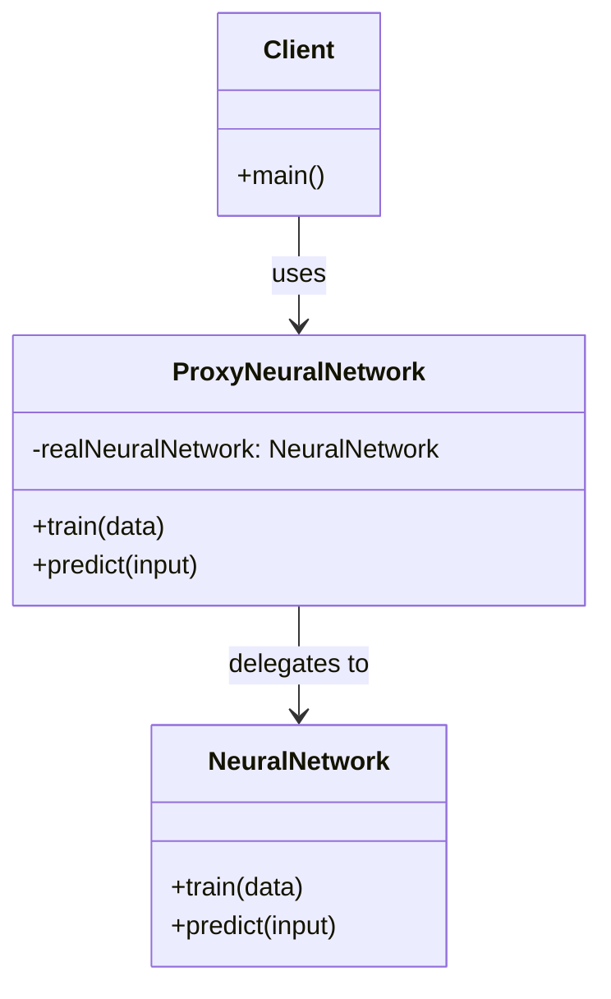
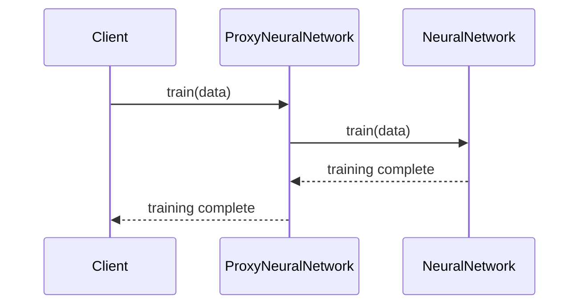

## Introduction
The Proxy Design Pattern is widely utilized in software design to provide a surrogate or placeholder for another object. This pattern is particularly useful in neural network applications that require remote training over distributed systems. By implementing a proxy, you can control and manage access to the neural network, providing a layer of abstraction that can handle network communication, latency, and security.

## Benefits
- **Encapsulation:** Wraps the neural network, abstracting the complexity of distributed communication.
- **Security:** Manages access control, ensuring only authorized operations are performed.
- **Lazy Initialization:** Defers costly or complex initializations until they're absolutely necessary.
- **Performance:** Can implement caching and other optimizations to improve overall system performance.

## Trade-offs
- **Complexity:** Adds an additional layer of abstraction, which can complicate debugging and maintenance.
- **Latency:** Network communication introduced by the proxy can cause latency issues.
- **Single Point of Failure:** The proxy itself can become a bottleneck or a single point of failure if not designed robustly.

## UML Class Diagram



In this UML diagram:
- `NeuralNetwork`: The real subject that needs to be accessed remotely.
- `ProxyNeuralNetwork`: The proxy that manages access to the `NeuralNetwork`.
- `Client`: The client that uses `ProxyNeuralNetwork` to interact with `NeuralNetwork`.

## UML Sequence Diagram



In this sequence diagram:
- The client requests the proxy to perform a training operation.
- The proxy forwards the training request to the real neural network.
- The neural network completes the training and responds to the proxy.
- The proxy then relays the completion status back to the client.

## Code Examples

### Python

```python
class NeuralNetwork:
    def train(self, data):
        # Perform training with the data
        print("Training the neural network with data.")

    def predict(self, input):
        # Perform prediction with the input
        print("Predicting based on input.")

class ProxyNeuralNetwork:
    def __init__(self):
        self.real_neural_network = NeuralNetwork()

    def train(self, data):
        # Additional operations like logging, authentication can be done here
        print("Proxy: Forwarding training request.")
        self.real_neural_network.train(data)

    def predict(self, input):
        print("Proxy: Forwarding prediction request.")
        self.real_neural_network.predict(input)

if __name__ == "__main__":
    proxy_nn = ProxyNeuralNetwork()
    proxy_nn.train("sample_data")
    proxy_nn.predict("sample_input")
```

### Java

```java
public class NeuralNetwork {
    public void train(String data) {
        // Perform training with the data
        System.out.println("Training the neural network with data.");
    }

    public void predict(String input) {
        // Perform prediction with the input
        System.out.println("Predicting based on input.");
    }
}

public class ProxyNeuralNetwork {
    private NeuralNetwork realNeuralNetwork = new NeuralNetwork();

    public void train(String data) {
        // Additional operations like logging, authentication can be done here
        System.out.println("Proxy: Forwarding training request.");
        realNeuralNetwork.train(data);
    }

    public void predict(String input) {
        System.out.println("Proxy: Forwarding prediction request.");
        realNeuralNetwork.predict(input);
    }
}

// Client
public class Client {
    public static void main(String[] args) {
        ProxyNeuralNetwork proxyNN = new ProxyNeuralNetwork();
        proxyNN.train("sample_data");
        proxyNN.predict("sample_input");
    }
}
```

### Scala

```scala
class NeuralNetwork {
    def train(data: String): Unit = {
        // Perform training with the data
        println("Training the neural network with data.")
    }

    def predict(input: String): Unit = {
        // Perform prediction with the input
        println("Predicting based on input.")
    }
}

class ProxyNeuralNetwork {
    private val realNeuralNetwork = new NeuralNetwork()

    def train(data: String): Unit = {
        // Additional operations like logging, authentication can be done here
        println("Proxy: Forwarding training request.")
        realNeuralNetwork.train(data)
    }

    def predict(input: String): Unit = {
        println("Proxy: Forwarding prediction request.")
        realNeuralNetwork.predict(input)
    }
}

// Client
object Client extends App {
    val proxyNN = new ProxyNeuralNetwork()
    proxyNN.train("sample_data")
    proxyNN.predict("sample_input")
}
```

### Clojure

```clojure
(defprotocol NeuralNetwork
  (train [this data])
  (predict [this input]))

(deftype RealNeuralNetwork []
  NeuralNetwork
  (train [this data]
    (println "Training the neural network with data."))
  (predict [this input]
    (println "Predicting based on input.")))

(deftype ProxyNeuralNetwork []
  NeuralNetwork
  (let [real-neural-network (RealNeuralNetwork.)]
    (train [this data]
      (println "Proxy: Forwarding training request.")
      (train real-neural-network data))
    (predict [this input]
      (println "Proxy: Forwarding prediction request.")
      (predict real-neural-network input))))

(defn -main []
  (let [proxy-nn (ProxyNeuralNetwork.)]
    (train proxy-nn "sample_data")
    (predict proxy-nn "sample_input")))
```

## Use Cases
- **Distributed Training Systems:** When training neural networks across multiple machines or data centers.
- **Access Control:** Limiting and controlling access to neural network training and prediction methods.
- **Lazy Initialization:** Delaying the creation of a neural network instance until it's needed, thereby conserving resources.

## Related Design Patterns
- **Decorator:** Adds responsibilities to objects dynamically, similar to proxies but more focused on enhancing object functionality.
- **Adapter:** Converts an interface of a class into another interface clients expect. It's akin to a proxy but used for interface compatibility.
- **Facade:** Provides a unified interface to a set of interfaces in a subsystem. Whereas a proxy typically controls access, a facade simplifies interaction.

## Resources and References
- **Books:** "Design Patterns: Elements of Reusable Object-Oriented Software" by Erich Gamma, et al.
- **Websites:** GeeksforGeeks, Refactoring.Guru, TutorialsPoint for software design patterns.
- **Open Source Frameworks:** TensorFlow Serving, ONNX Runtime for neural network deployments.

## Summary
The Proxy Design Pattern is an essential tool for managing access to neural networks, especially in distributed systems where remote training is required. It offers encapsulation, security, and performance benefits but adds complexity and potential latency. Understanding its application in neural networks helps in designing robust, scalable, and maintainable systems.
