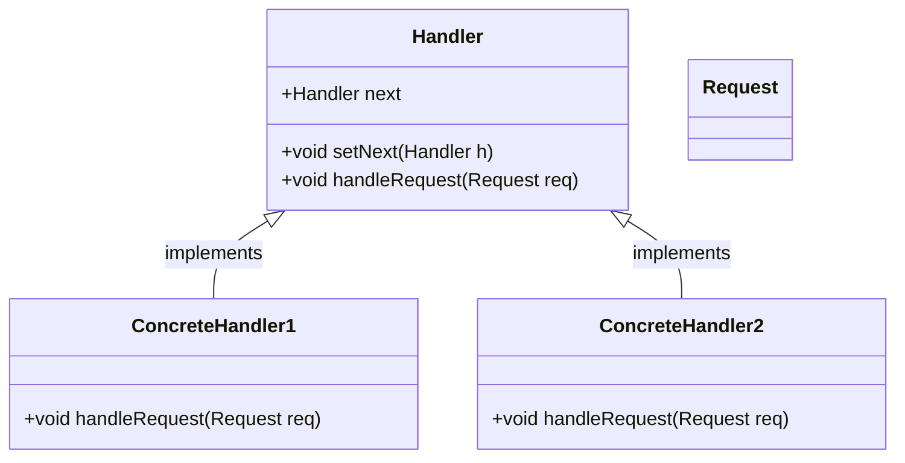
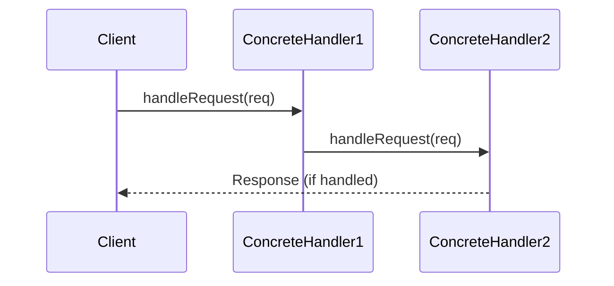

## Chain of Responsibility: Passing Requests Among Handlers

### Overview

The **Chain of Responsibility** is a behavioral design pattern designed to allow a request to be processed by multiple handler objects. This pattern is particularly useful in creating preprocessing pipelines, where a sequence of processing steps need to be applied to some data.

### Structure

#### UML Class Diagram



In the UML class diagram above:

- `Handler` is an abstract class with a reference to the next handler in the chain.
- `ConcreteHandler1` and `ConcreteHandler2` are concrete implementations that handle requests.
- Each `ConcreteHandler` implements the `handleRequest` method.
- The `Request` class represents the request data structure.

#### UML Sequence Diagram



In the UML sequence diagram:

- The `Client` sends a request to `ConcreteHandler1`.
- If `ConcreteHandler1` cannot handle the request, it forwards it to `ConcreteHandler2`.
- `ConcreteHandler2` processes the request and sends a response back to the `Client`.

### Benefits

1. **Decoupling:** Each handler processes the request independently and forwards it, promoting loose coupling.
2. **Flexibility:** Easily modify or extend the chain of handlers without affecting the client.
3. **Single Responsibility Principle:** Each handler has a specific responsibility, making the code easier to manage and understand.

### Trade-offs

1. **Complexity:** The chain can become complex with many handlers.
2. **Performance:** Handling requests may involve passing through many objects before processing, which can be less efficient.

### Example in Different Languages

#### Python

```python
class Handler:
    def __init__(self):
        self.next_handler = None
    
    def set_next(self, handler):
        self.next_handler = handler
    
    def handle(self, request):
        if self.next_handler:
            return self.next_handler.handle(request)
        return None

class ConcreteHandler1(Handler):
    def handle(self, request):
        if request == "request1":
            return "Handled by ConcreteHandler1"
        return super().handle(request)

class ConcreteHandler2(Handler):
    def handle(self, request):
        if request == "request2":
            return "Handled by ConcreteHandler2"
        return super().handle(request)

handler1 = ConcreteHandler1()
handler2 = ConcreteHandler2()
handler1.set_next(handler2)

request = "request1"
response = handler1.handle(request)
print(response)
```

#### Java

```java
abstract class Handler {
    protected Handler nextHandler;

    public void setNextHandler(Handler nextHandler) {
        this.nextHandler = nextHandler;
    }

    public abstract String handleRequest(String request);
}

class ConcreteHandler1 extends Handler {
    public String handleRequest(String request) {
        if (request.equals("request1")) {
            return "Handled by ConcreteHandler1";
        } else if (nextHandler != null) {
            return nextHandler.handleRequest(request);
        }
        return null;
    }
}

class ConcreteHandler2 extends Handler {
    public String handleRequest(String request) {
        if (request.equals("request2")) {
            return "Handled by ConcreteHandler2";
        } else if (nextHandler != null) {
            return nextHandler.handleRequest(request);
        }
        return null;
    }
}

// Usage
public class Main {
    public static void main(String[] args) {
        Handler handler1 = new ConcreteHandler1();
        Handler handler2 = new ConcreteHandler2();
        handler1.setNextHandler(handler2);

        String request = "request1";
        String response = handler1.handleRequest(request);
        System.out.println(response);
    }
}
```

#### Scala

```scala
abstract class Handler {
  var nextHandler: Option[Handler] = None
  
  def setNextHandler(handler: Handler): Unit = {
    nextHandler = Some(handler)
  }
  
  def handleRequest(request: String): Option[String]
}

class ConcreteHandler1 extends Handler {
  override def handleRequest(request: String): Option[String] = {
    if (request == "request1") {
      Some("Handled by ConcreteHandler1")
    } else {
      nextHandler.flatMap(_.handleRequest(request))
    }
  }
}

class ConcreteHandler2 extends Handler {
  override def handleRequest(request: String): Option[String] = {
    if (request == "request2") {
      Some("Handled by ConcreteHandler2")
    } else {
      nextHandler.flatMap(_.handleRequest(request))
    }
  }
}

// Usage
object Main extends App {
  val handler1 = new ConcreteHandler1()
  val handler2 = new ConcreteHandler2()
  handler1.setNextHandler(handler2)

  val request = "request1"
  val response = handler1.handleRequest(request)
  println(response.getOrElse("No handler could process the request"))
}
```

#### Clojure

```clojure
(defprotocol Handler
  (set-next [this handler])
  (handle-request [this request]))

(deftype ConcreteHandler1 [next-handler]
  Handler
  (set-next [this handler]
    (ConcreteHandler1. handler))
  (handle-request [this request]
    (if (= request "request1")
      "Handled by ConcreteHandler1"
      (if next-handler
        (handle-request next-handler request)
        nil))))

(deftype ConcreteHandler2 [next-handler]
  Handler
  (set-next [this handler]
    (ConcreteHandler2. handler))
  (handle-request [this request]
    (if (= request "request2")
      "Handled by ConcreteHandler2"
      (if next-handler
        (handle-request next-handler request)
        nil))))

;; Usage
(def handler1 (ConcreteHandler1. nil))
(def handler2 (ConcreteHandler2. nil))
(def handler1 (set-next handler1 handler2))

(let [request "request1"]
  (println (handle-request handler1 request)))
```

### Use Cases

- **Preprocessing Pipelines:** Each handler can represent a step in a data preprocessing pipeline.
- **Logging Systems:** Different handlers can manage different log levels.
- **Event Handling:** Event listeners can be chained to handle events sequentially.

### Related Design Patterns

- **Decorator:** Similar in the chaining aspect but focuses on adding responsibilities.
- **Composite:** Composes objects into tree structures and works hierarchically.
- **Command:** Encapsulates a request as an object, separating the sender from the receiver.

### Resources and References

- [Refactoring Guru on Chain of Responsibility](https://refactoring.guru/design-patterns/chain-of-responsibility)
- [Wikipedia on Chain of Responsibility](https://en.wikipedia.org/wiki/Chain-of-responsibility_pattern)
- **Open Source Frameworks:** Java's Servlet Filter Chain, Apache Commons Chain

### Summary

The **Chain of Responsibility** pattern allows requests to be processed by multiple handlers in a sequence. It decouples the sender and receiver, promoting flexibility and adherence to the Single Responsibility Principle. Despite its complexity, this pattern proves invaluable in preprocessing pipelines, logging systems, and event handling scenarios. Understanding its implementation across various programming languages can greatly enhance a software architect’s ability to design flexible and maintainable systems.
