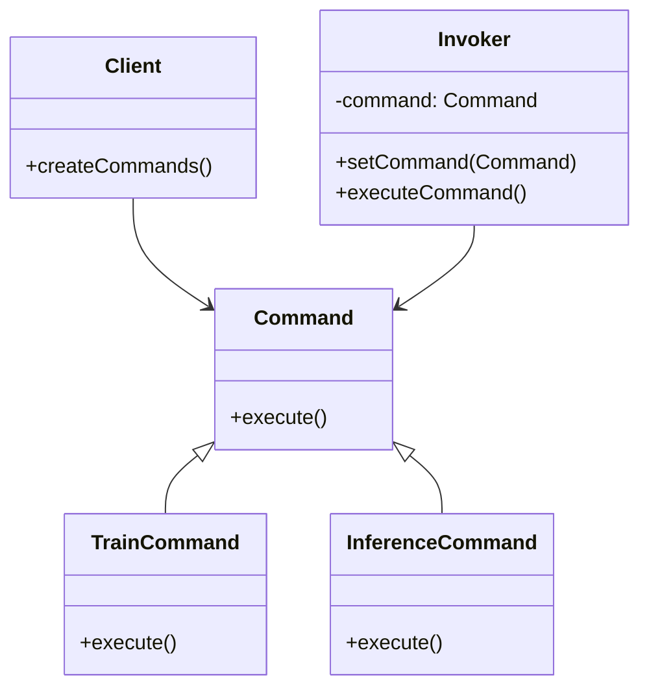
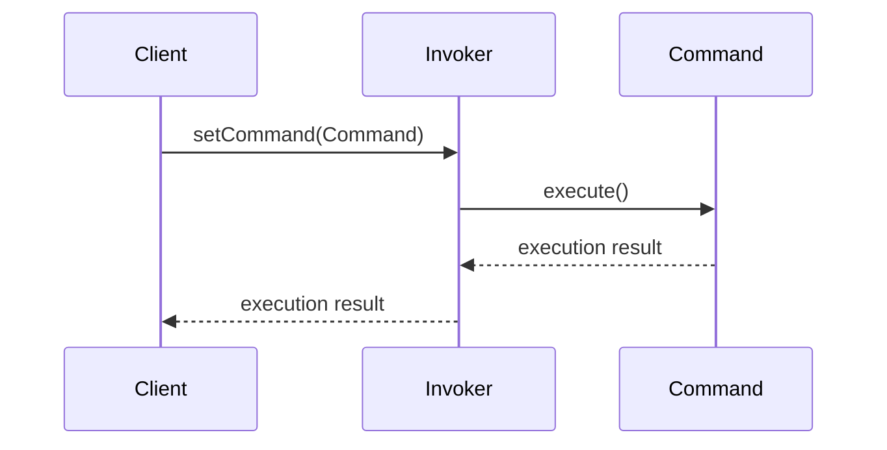

The Command Pattern is a behavioral design pattern that turns a request into a stand-alone object, making it possible to parameterize, queue, log, and undo operations. This is particularly useful in the realm of neural networks for managing training and inference commands.

## Benefits of the Command Pattern
- **Encapsulation:** Encapsulates a request as an object.
- **Flexibility:** Enables parameterization and queuing of requests.
- **Logging:** Supports logging of requests for auditing.
- **Undo Operations:** Facilitates undoable operations.

## Trade-Offs
- **Complexity:** Introduces additional classes and objects.
- **Performance:** Can impact performance due to increased object creation and management overhead.

## UML Diagrams

### Class Diagram


### Sequence Diagram


## Example Implementations

### Python
```python
from abc import ABC, abstractmethod

class Command(ABC):
    @abstractmethod
    def execute(self):
        pass

class TrainCommand(Command):
    def execute(self):
        print("Training model...")

class InferenceCommand(Command):
    def execute(self):
        print("Running inference...")

class Invoker:
    def __init__(self):
        self._command = None
    
    def set_command(self, command: Command):
        self._command = command
    
    def execute_command(self):
        if self._command:
            self._command.execute()

invoker = Invoker()
train_command = TrainCommand()
inference_command = InferenceCommand()

invoker.set_command(train_command)
invoker.execute_command()

invoker.set_command(inference_command)
invoker.execute_command()
```

### Java
```java
interface Command {
    void execute();
}

class TrainCommand implements Command {
    public void execute() {
        System.out.println("Training model...");
    }
}

class InferenceCommand implements Command {
    public void execute() {
        System.out.println("Running inference...");
    }
}

class Invoker {
    private Command command;

    public void setCommand(Command command) {
        this.command = command;
    }

    public void executeCommand() {
        if (command != null) {
            command.execute();
        }
    }
}

// Client Code
public class Main {
    public static void main(String[] args) {
        Invoker invoker = new Invoker();
        Command trainCommand = new TrainCommand();
        Command inferenceCommand = new InferenceCommand();

        invoker.setCommand(trainCommand);
        invoker.executeCommand();

        invoker.setCommand(inferenceCommand);
        invoker.executeCommand();
    }
}
```

### Scala
```scala
trait Command {
  def execute(): Unit
}

class TrainCommand extends Command {
  override def execute(): Unit = println("Training model...")
}

class InferenceCommand extends Command {
  override def execute(): Unit = println("Running inference...")
}

class Invoker {
  private var command: Command = _

  def setCommand(command: Command): Unit = {
    this.command = command
  }

  def executeCommand(): Unit = {
    if (command != null) {
      command.execute()
    }
  }
}

// Client Code
object Main extends App {
  val invoker = new Invoker
  val trainCommand = new TrainCommand
  val inferenceCommand = new InferenceCommand

  invoker.setCommand(trainCommand)
  invoker.executeCommand()

  invoker.setCommand(inferenceCommand)
  invoker.executeCommand()
}
```

### Clojure
```clojure
(defprotocol Command
  (execute [this]))

(defrecord TrainCommand []
  Command
  (execute [this]
    (println "Training model...")))

(defrecord InferenceCommand []
  Command
  (execute [this]
    (println "Running inference...")))

(defrecord Invoker [command]
  Command
  (set-command [this command]
    (assoc this :command command))
  (execute-command [this]
    (when-let [cmd (:command this)]
      (execute cmd))))

; Client Code
(def invoker (->Invoker nil))
(def train-command (->TrainCommand))
(def inference-command (->InferenceCommand))

(def invoker-with-train-command (set-command invoker train-command))
(execute-command invoker-with-train-command)

(def invoker-with-inference-command (set-command invoker inference-command))
(execute-command invoker-with-inference-command)
```

## Use Cases
- **Training Models:** Different training routines or hyperparameter configurations.
- **Inference Operations:** Executing various inference tasks, such as batch processing or real-time predictions.
- **Experiment Logging:** Logging different experiment commands for reproducibility.
- **Parameter Tuning:** Sequentially or concurrently running multiple tuning operations.

## Related Design Patterns
- **Strategy Pattern:** Similar to the Command Pattern but focuses on defining a family of algorithms.
- **Chain of Responsibility:** Can be used to pass a request along a chain of handlers.
- **Memento Pattern:** Works well with the Command Pattern for undo functionality.

## Resources and References
- [Gang of Four Design Patterns](https://www.amazon.com/Design-Patterns-Elements-Reusable-Object-Oriented/dp/0201633612)
- [Command Pattern on Wikipedia](https://en.wikipedia.org/wiki/Command_pattern)
- [Design Patterns: Elements of Reusable Object-Oriented Software](https://www.amazon.com/Design-Patterns-Elements-Reusable-Object-Oriented/dp/0201633612)

## Open Source Frameworks
- **TensorFlow:** Supports command-based APIs for various operations.
- **PyTorch:** Provides a modular approach for training and inference commands.
- **Keras:** High-level API built on TensorFlow, can be extended with custom commands.

## Summary
The Command Pattern is an invaluable tool in neural networks, providing a structured approach to handling training and inference requests. By encapsulating these operations as objects, developers gain flexibility, better manageability, and improved logging capabilities. While the complexity and performance overhead are potential drawbacks, the benefits often outweigh these concerns, especially in large, scalable AI systems. This pattern complements other behavioral patterns and integrates well with popular neural network frameworks.
