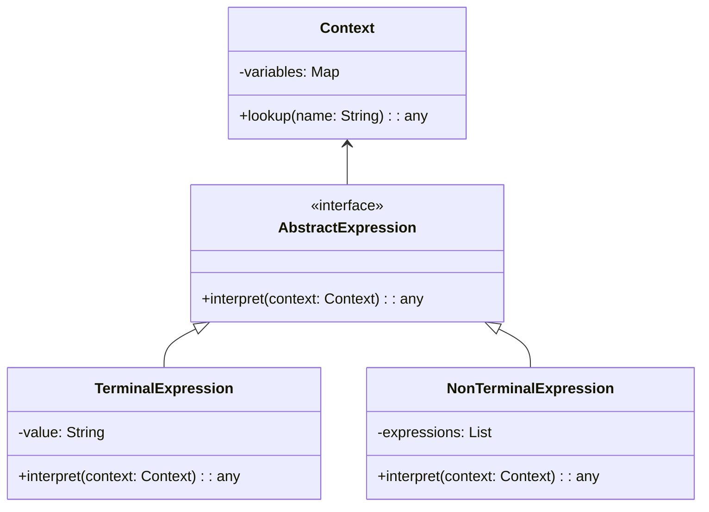
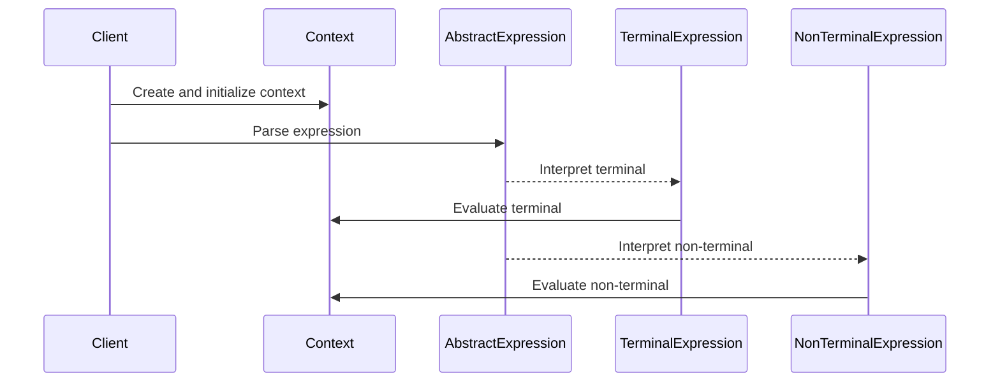

The **Interpreter** design pattern is essential for parsing and executing instructions written in a specific language. This pattern is highly useful in neural network configurations, allowing for flexible and dynamic model definitions. In this article, we explore the details of the Interpreter pattern, including its implementation in various programming languages, benefits, trade-offs, use cases, and related design patterns.


## Overview

The Interpreter design pattern is a behavioral pattern that provides a way to evaluate sentences in a language. Its main goal is to define a grammatical representation for a language and an interpreter to interpret the sentences of that language. This pattern is particularly useful in scenarios where you need to define and execute complex structured model configurations for neural networks.

## Class Diagram



### Explanation:

1. **AbstractExpression:** An interface that declares an interpret method.
2. **TerminalExpression:** Implements interpret operation for terminal symbols in the grammar.
3. **NonTerminalExpression:** Implements interpret operation for non-terminal symbols in the grammar.
4. **Context:** Contains information that's global to the interpreter.

## Sequence Diagram



### Explanation:

1. The client creates and initializes the context.
2. The client parses the expression which consists of terminal and non-terminal symbols.
3. The expression is evaluated, interpreting terminal and non-terminal expressions accordingly.

## Implementation Examples

### Python

```python
class Context:
    def __init__(self):
        self.variables = {}

    def lookup(self, name):
        return self.variables.get(name, None)

class AbstractExpression:
    def interpret(self, context):
        pass

class TerminalExpression(AbstractExpression):
    def __init__(self, value):
        self.value = value

    def interpret(self, context):
        return context.lookup(self.value)

class NonTerminalExpression(AbstractExpression):
    def __init__(self, expressions):
        self.expressions = expressions

    def interpret(self, context):
        results = [expression.interpret(context) for expression in self.expressions]
        return results

context = Context()
context.variables = {"x": 5, "y": 10}

expression = NonTerminalExpression([TerminalExpression("x"), TerminalExpression("y")])
print(expression.interpret(context))  # Output: [5, 10]
```

### Java

```java
import java.util.HashMap;
import java.util.Map;

class Context {
    private Map<String, Integer> variables = new HashMap<>();

    public void setVariable(String name, Integer value) {
        variables.put(name, value);
    }

    public Integer lookup(String name) {
        return variables.get(name);
    }
}

interface AbstractExpression {
    Integer interpret(Context context);
}

class TerminalExpression implements AbstractExpression {
    private String value;

    public TerminalExpression(String value) {
        this.value = value;
    }

    @Override
    public Integer interpret(Context context) {
        return context.lookup(value);
    }
}

class NonTerminalExpression implements AbstractExpression {
    private AbstractExpression[] expressions;

    public NonTerminalExpression(AbstractExpression... expressions) {
        this.expressions = expressions;
    }

    @Override
    public Integer[] interpret(Context context) {
        return Arrays.stream(expressions)
                     .map(expression -> expression.interpret(context))
                     .toArray(Integer[]::new);
    }
}

// Example usage
Context context = new Context();
context.setVariable("x", 5);
context.setVariable("y", 10);

NonTerminalExpression expression = new NonTerminalExpression(
    new TerminalExpression("x"), 
    new TerminalExpression("y")
);
System.out.println(Arrays.toString(expression.interpret(context)));  // Output: [5, 10]
```

### Scala

```scala
class Context {
    var variables = Map[String, Int]()

    def lookup(name: String): Option[Int] = variables.get(name)
}

trait AbstractExpression {
    def interpret(context: Context): Option[Int]
}

case class TerminalExpression(value: String) extends AbstractExpression {
    def interpret(context: Context): Option[Int] = context.lookup(value)
}

case class NonTerminalExpression(expressions: List[AbstractExpression]) extends AbstractExpression {
    def interpret(context: Context): List[Option[Int]] = expressions.map(_.interpret(context))
}

// Example usage
val context = new Context
context.variables = Map("x" -> 5, "y" -> 10)

val expression = NonTerminalExpression(List(TerminalExpression("x"), TerminalExpression("y")))
println(expression.interpret(context))  // Output: List(Some(5), Some(10))
```

### Clojure

```clojure
(defrecord Context [variables])

(defprotocol AbstractExpression
  (interpret [this context]))

(defrecord TerminalExpression [value]
  AbstractExpression
  (interpret [this context]
    (get (:variables context) value)))

(defrecord NonTerminalExpression [expressions]
  AbstractExpression
  (interpret [this context]
    (map #(.interpret % context) expressions)))

;; Example usage
(def context (->Context {:x 5 :y 10}))

(def expression (->NonTerminalExpression [(->TerminalExpression "x")
                                          (->TerminalExpression "y")]))

(println (.interpret expression context)) ;; Output: (5 10)
```

## Benefits

- **Flexibility:** Easily extend the grammar without modifying existing classes.
- **Modular Design:** Different parts of the grammar are encapsulated in distinct classes.
- **Reusability:** Existing parsing and execution logic can be reused in new contexts.

## Trade-offs

- **Complexity:** Can lead to a complex class hierarchy, which may be challenging to maintain.
- **Performance:** Might not be efficient for highly complex or large grammars, as the pattern interprets the grammar directly.

## Use Cases

- **Parsing and executing neural network configurations:** Define and interpret structured model configurations dynamically.
- **Domain-Specific Languages (DSLs):** Create DSLs for specific application domains, allowing for flexible and expressive configurations.
- **Expression Evaluation:** Used in evaluating mathematical or logical expressions where the grammar needs to be interpreted at runtime.

## Related Design Patterns

- **Composite:** Often used together with the Interpreter pattern for implementing the grammar.
- **Iterator:** Can be used to traverse the components in the non-terminal expressions.
- **Visitor:** Can be used to perform operations on nodes of the abstract syntax tree without changing their classes.

## Resources and References

- **"Design Patterns: Elements of Reusable Object-Oriented Software"** by Erich Gamma, Richard Helm, Ralph Johnson, and John Vlissides (Gang of Four)
- **Open Source Frameworks:** 
  - **ANTLR**: A powerful parser generator for reading, processing, executing, or translating structured text or binary files.
  - **JFlex**: A lexical analyzer generator for Java.

## Summary

The Interpreter design pattern is instrumental in enabling the parsing and execution of structured model configurations in neural networks. By providing a flexible and modular approach to defining and interpreting grammatical representations, it allows for dynamic and scalable solutions in various application domains. Understanding the benefits and trade-offs of this pattern ensures its effective application in appropriate contexts.
