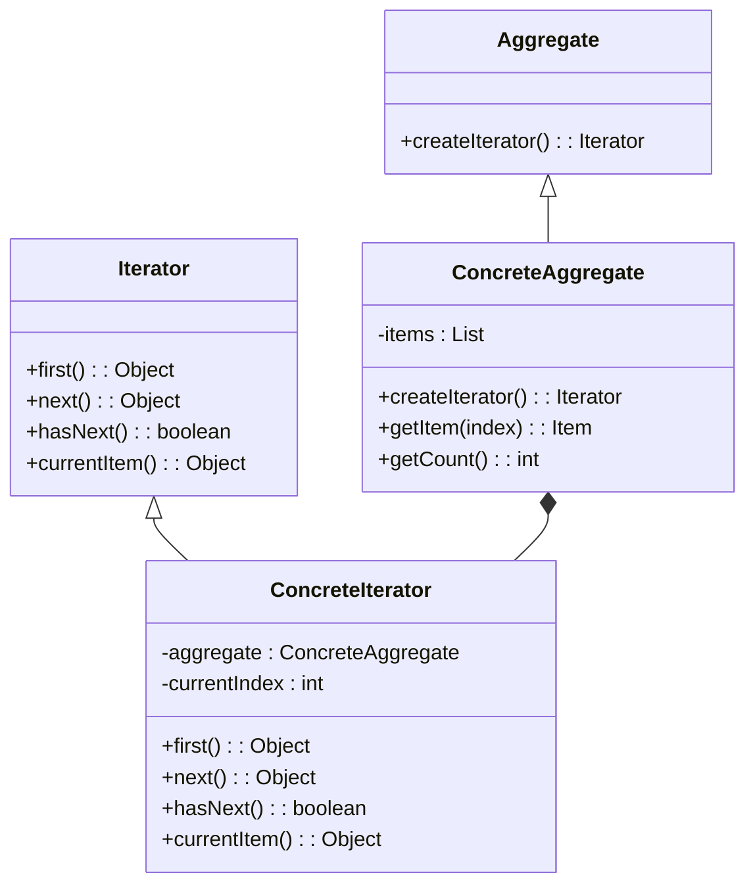
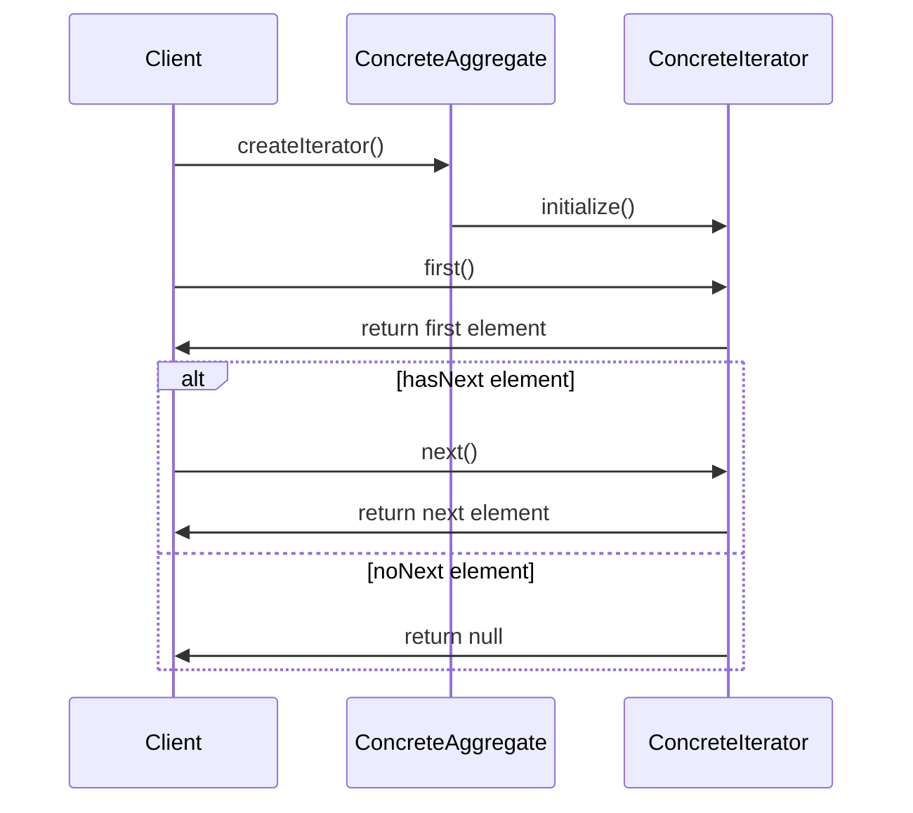

The **Iterator** design pattern provides a way to access the elements of an aggregate object sequentially without exposing its underlying representation. This is particularly useful in neural networks when dealing with large datasets, enabling efficient and organized data traversal.

## Detailed Description

The Iterator pattern abstracts the process of iterating over a collection of items, providing a common interface for traversing different types of collections. This can be particularly advantageous in neural networks, where iterating through datasets for training or evaluation is a fundamental task.

## UML Class Diagram

Below is UML class diagram to illustrate the structure of the Iterator pattern:



## UML Sequence Diagram

Here is UML sequence diagram to illustrate the interaction between the iterator and aggregate objects:



## Benefits

- **Encapsulation:** Does not expose underlying representation.
- **Single Responsibility:** Separates traversal logic from aggregate.
- **Flexibility:** Polymorphic iteration over different types of collections.

## Trade-offs

- **Performance Overhead:** May introduce overhead when iterating.
- **Additional Complexity:** Requires implementation of iterator interfaces.

## Examples of Use Cases

1. **Neural Network Training:** Iterating through batches of data for training.
2. **Evaluation:** Sequentially accessing data points for model evaluation.
3. **Data Preprocessing:** Traversing and modifying data entries before feeding into the network.

## Example Implementations

### Python

```python
class ConcreteIterator:
    def __init__(self, aggregate):
        self._aggregate = aggregate
        self._current_index = 0

    def first(self):
        return self._aggregate[0] if self._aggregate else None

    def next(self):
        self._current_index += 1
        if self._current_index < len(self._aggregate):
            return self._aggregate[self._current_index]
        else:
            return None

    def hasNext(self):
        return self._current_index < len(self._aggregate) - 1

class ConcreteAggregate:
    def __init__(self, items):
        self._items = items

    def createIterator(self):
        return ConcreteIterator(self._items)

aggregate = ConcreteAggregate([1, 2, 3, 4])
iterator = aggregate.createIterator()
while iterator.hasNext():
    print(iterator.next())
```

### Java

```java
interface Iterator {
    boolean hasNext();
    Object next();
}

class ConcreteIterator implements Iterator {
    private ConcreteAggregate aggregate;
    private int currentIndex = 0;

    public ConcreteIterator(ConcreteAggregate aggregate) {
        this.aggregate = aggregate;
    }

    public boolean hasNext() {
        return currentIndex < aggregate.getCount();
    }

    public Object next() {
        return aggregate.getItem(currentIndex++);
    }
}

class ConcreteAggregate {
    private List items;

    public ConcreteAggregate(List items) {
        this.items = items;
    }

    public int getCount() {
        return items.size();
    }

    public Object getItem(int index) {
        return items.get(index);
    }

    public Iterator createIterator() {
        return new ConcreteIterator(this);
    }
}

// Example Usage
ConcreteAggregate aggregate = new ConcreteAggregate(Arrays.asList(1, 2, 3, 4));
Iterator iterator = aggregate.createIterator();
while (iterator.hasNext()) {
    System.out.println(iterator.next());
}
```

### Scala

```scala
class ConcreteIterator[T](aggregate: ConcreteAggregate[T]) extends Iterator[T] {
    private var currentIndex = 0

    override def hasNext: Boolean = currentIndex < aggregate.count

    override def next(): T = {
        val item = aggregate.getItem(currentIndex)
        currentIndex += 1
        item
    }
}

class ConcreteAggregate[T](val items: List[T]) {
    def count: Int = items.size

    def getItem(index: Int): T = items(index)

    def createIterator: ConcreteIterator[T] = new ConcreteIterator(this)
}

// Example Usage
val aggregate = new ConcreteAggregate(List(1, 2, 3, 4))
val iterator = aggregate.createIterator
while (iterator.hasNext) {
    println(iterator.next())
}
```

### Clojure

```clojure
(defprotocol Iterator
  (has-next? [this])
  (next [this]))

(defrecord ConcreteIterator [aggregate current-index]
  Iterator
  (has-next? [this]
    (< (:current-index this) (count (:aggregate this))))
  (next [this]
    (let [item (nth (:aggregate this) (:current-index this))]
      (swap! this update :current-index inc)
      item)))

(defrecord ConcreteAggregate [items]
  (create-iterator [this]
    (->ConcreteIterator this 0)))

;; Example Usage
(def aggregate (->ConcreteAggregate [1 2 3 4]))
(def iterator (create-iterator aggregate))
(while (has-next? iterator)
  (println (next iterator)))
```

## Related Design Patterns

- **Composite Pattern:** Often used in tandem to traverse composite structures.
- **Factory Pattern:** Useful for creating iterator objects.

## Resources & References

- **Gamma, Erich, et al. "Design Patterns: Elements of Reusable Object-Oriented Software."** Addison-Wesley, 1994.
- **Hugo Documentation:** https://gohugo.io/documentation/
- **Documentation:** https://mermaid-js.github.io/mermaid/
- **Open Source Frameworks:**
  - **TensorFlow:** For neural network implementation and dataset manipulation.
  - **PyTorch:** Provides data loading utilities compatible with Iterator pattern.

## Summary

The Iterator design pattern is a crucial component in software architecture, particularly in the context of neural networks where data traversal is frequent. It enhances encapsulation, separates responsibilities, and offers flexibility. While it may introduce performance overhead and complexity, its benefits often outweigh these drawbacks, especially when working with large datasets.

By employing the Iterator pattern, developers can create more maintainable, scalable, and efficient applications, ensuring seamless data processing in neural network workflows.
