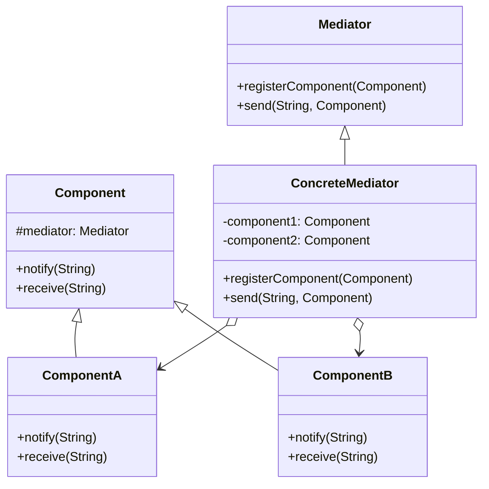
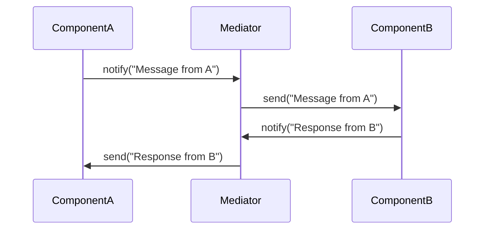

The Mediator design pattern is a behavioral design pattern that defines an object to encapsulate how a set of objects interact. By centralizing complex communication and control logic, the Mediator promotes loose coupling between interacting objects, allowing individual modules to vary independently.

## Detailed Description

In the context of neural networks, the Mediator pattern can be effectively employed to handle communication between various modules like data preprocessing, model training, and evaluation. This abstraction allows the system to grow and evolve without being bogged down by tight coupling between components.

### Benefits

- **Decoupling:** Reduces the dependencies between communicating objects, enhancing modularity.
- **Simplified Maintenance:** Centralizes control logic, making the system easier to maintain and extend.
- **Enhanced Flexibility:** Enables individual components to change without affecting others.

### Trade-offs

- **Single Point of Failure:** The Mediator can become a performance bottleneck or single point of failure.
- **Complexity:** Introducing a Mediator may increase the overall complexity if not managed correctly.

## UML Diagrams

### UML Class Diagram



### UML Sequence Diagram



## Example Implementations

### Python

```python
class Mediator:
    def notify(self, sender, event):
        pass

class ConcreteMediator(Mediator):
    def __init__(self):
        self.components = {}

    def register(self, component, name):
        self.components[name] = component
        component.mediator = self

    def notify(self, sender, event):
        if event == "A":
            self.components["B"].receive("Event A")
        elif event == "B":
            self.components["A"].receive("Event B")

class Component:
    def __init__(self, mediator=None):
        self.mediator = mediator

    def send(self, event):
        self.mediator.notify(self, event)

    def receive(self, event):
        print(f"{self.__class__.__name__} received: {event}")

class ComponentA(Component):
    pass

class ComponentB(Component):
    pass

mediator = ConcreteMediator()
componentA = ComponentA()
componentB = ComponentB()
mediator.register(componentA, "A")
mediator.register(componentB, "B")

componentA.send("A")
componentB.send("B")
```

### Java

```java
interface Mediator {
    void notify(Component sender, String event);
}

class ConcreteMediator implements Mediator {
    private ComponentA componentA;
    private ComponentB componentB;

    public void register(ComponentA a, ComponentB b) {
        this.componentA = a;
        this.componentB = b;
        a.setMediator(this);
        b.setMediator(this);
    }

    @Override
    public void notify(Component sender, String event) {
        if (event.equals("A")) {
            componentB.receive("Event A");
        } else if (event.equals("B")) {
            componentA.receive("Event B");
        }
    }
}

abstract class Component {
    protected Mediator mediator;

    public void setMediator(Mediator mediator) {
        this.mediator = mediator;
    }

    public abstract void receive(String event);
}

class ComponentA extends Component {
    public void send(String event) {
        mediator.notify(this, event);
    }

    @Override
    public void receive(String event) {
        System.out.println("ComponentA received: " + event);
    }
}

class ComponentB extends Component {
    public void send(String event) {
        mediator.notify(this, event);
    }

    @Override
    public void receive(String event) {
        System.out.println("ComponentB received: " + event);
    }
}

public class MediatorPatternDemo {
    public static void main(String[] args) {
        ConcreteMediator mediator = new ConcreteMediator();
        ComponentA componentA = new ComponentA();
        ComponentB componentB = new ComponentB();

        mediator.register(componentA, componentB);
        componentA.send("A");
        componentB.send("B");
    }
}
```

### Scala

```scala
trait Mediator {
    def notify(sender: Component, event: String): Unit
}

class ConcreteMediator extends Mediator {
    private var componentA: ComponentA = _
    private var componentB: ComponentB = _

    def register(a: ComponentA, b: ComponentB): Unit = {
        componentA = a
        componentB = b
        a.mediator = this
        b.mediator = this
    }

    override def notify(sender: Component, event: String): Unit = {
        event match {
            case "A" => componentB.receive("Event A")
            case "B" => componentA.receive("Event B")
        }
    }
}

abstract class Component(var mediator: Mediator = null) {
    def send(event: String): Unit = mediator.notify(this, event)
    def receive(event: String): Unit
}

class ComponentA extends Component {
    override def receive(event: String): Unit = println(s"ComponentA received: $event")
}

class ComponentB extends Component {
    override def receive(event: String): Unit = println(s"ComponentB received: $event")
}

object MediatorPatternDemo extends App {
    val mediator = new ConcreteMediator
    val componentA = new ComponentA
    val componentB = new ComponentB

    mediator.register(componentA, componentB)
    componentA.send("A")
    componentB.send("B")
}
```

### Clojure

```clojure
(defprotocol Mediator
  (notify [this sender event]))

(defrecord ConcreteMediator [component-a component-b]
  Mediator
  (notify [this sender event]
    (cond
      (= event "A") (receive component-b "Event A")
      (= event "B") (receive component-a "Event B"))))

(defrecord Component [mediator]
  (send [this event]
    (notify mediator this event))
  (receive [this event]
    (println (str (.-class this) " received: " event))))

(defn create-mediator []
  (let [a (->Component nil)
        b (->Component nil)
        mediator (->ConcreteMediator a b)]
    (assoc a :mediator mediator)
    (assoc b :mediator mediator)
    mediator))

(def mediator (create-mediator))

(send (:component-a mediator) "A")
(send (:component-b mediator) "B")
```

## Use Cases

- **Data Preprocessing Pipelines:** Managing complex preprocessing steps without direct dependency between them.
- **Model Training Workflows:** Coordinating between different training phases and processes.
- **Evaluation and Metrics:** Collecting and disseminating evaluation metrics to various parts of the system.

## Related Design Patterns

- **Observer:** Both patterns enable communication between objects. The Mediator pattern centralizes this communication, while the Observer pattern relies on a publisher-subscriber model.
- **Facade:** Simplifies interactions with subsystems but differs from the Mediator as it provides a unified interface rather than handling internal communications.

## Resources and References

- **Design Patterns: Elements of Reusable Object-Oriented Software** by Erich Gamma, Richard Helm, Ralph Johnson, and John Vlissides
- [Refactoring Guru on Mediator](https://refactoring.guru/design-patterns/mediator)
- [Python Design Patterns - Mediator](https://python-patterns.guide/gang-of-four/mediator)
- [Java Design Patterns - Mediator](https://java-design-patterns.com/patterns/mediator/)

## Open Source Frameworks

- **TensorFlow** - Utilizes mediator-like architecture to manage different components and operations.
- **Apache Flink** - Often uses mediator-like patterns to streamline data stream processing.

## Final Summary

The Mediator design pattern plays a crucial role in managing interactions between different components of a neural network framework. By encapsulating complex communication logic, it enhances modularity, simplifies maintenance, and boosts flexibility. However, careful consideration is needed to manage its potential drawbacks, such as introducing a single point of failure and increased complexity.

By leveraging this design pattern, software engineers can build more robust, maintainable, and scalable neural network systems, facilitating easier extension and modification of individual components without impacting the entire system.

---

